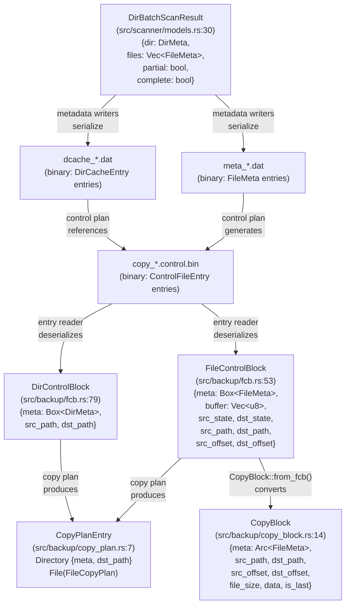
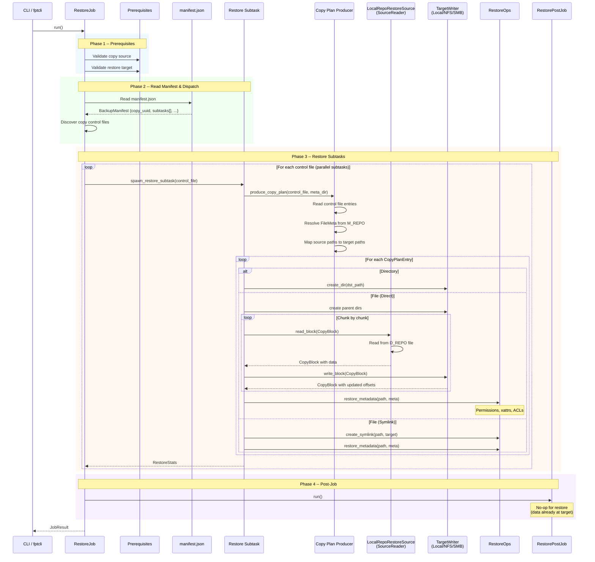
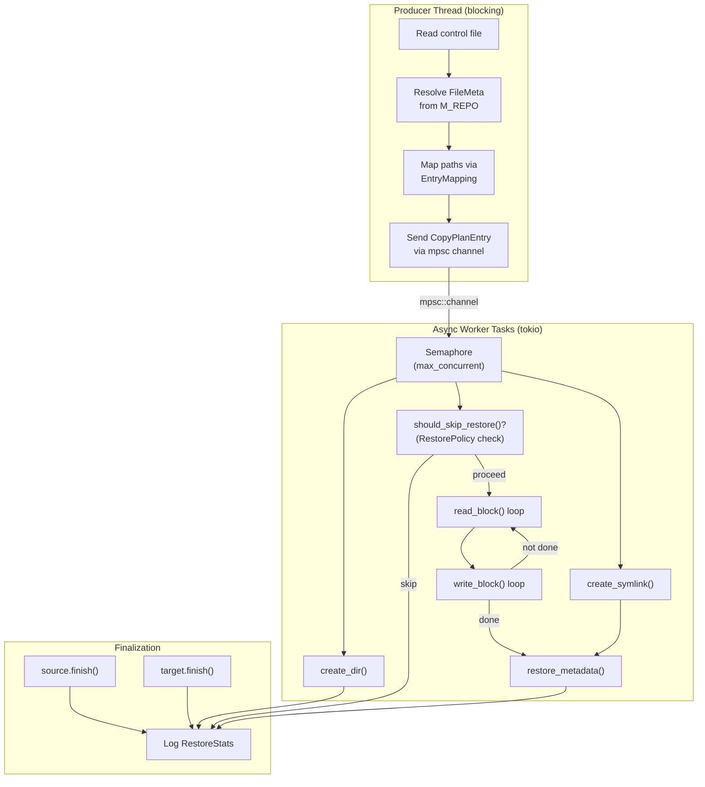
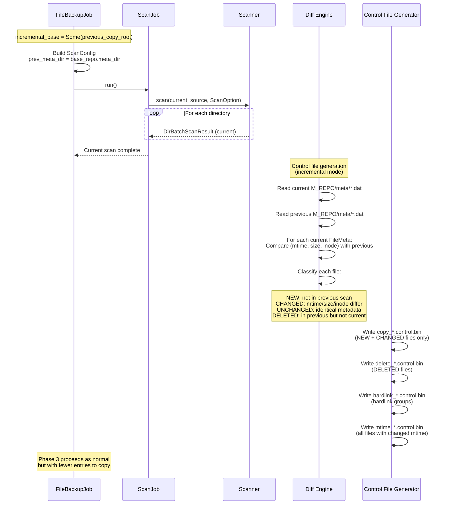
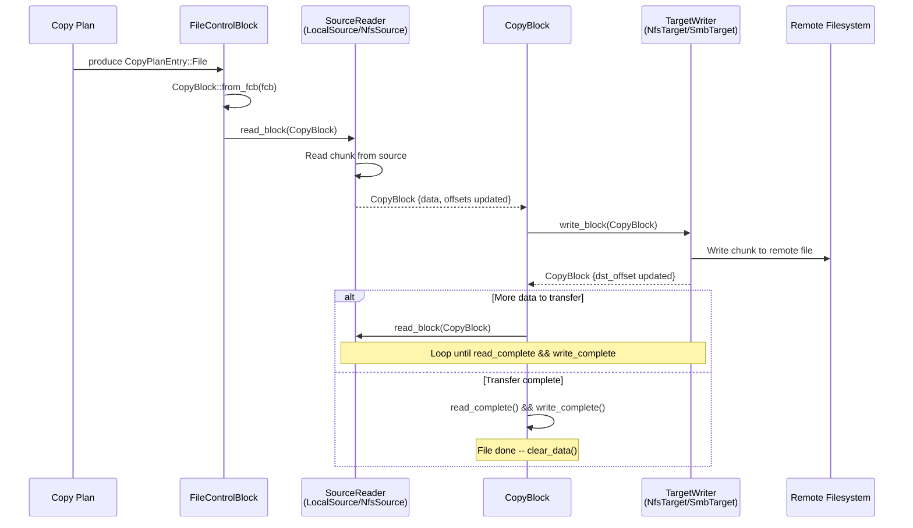
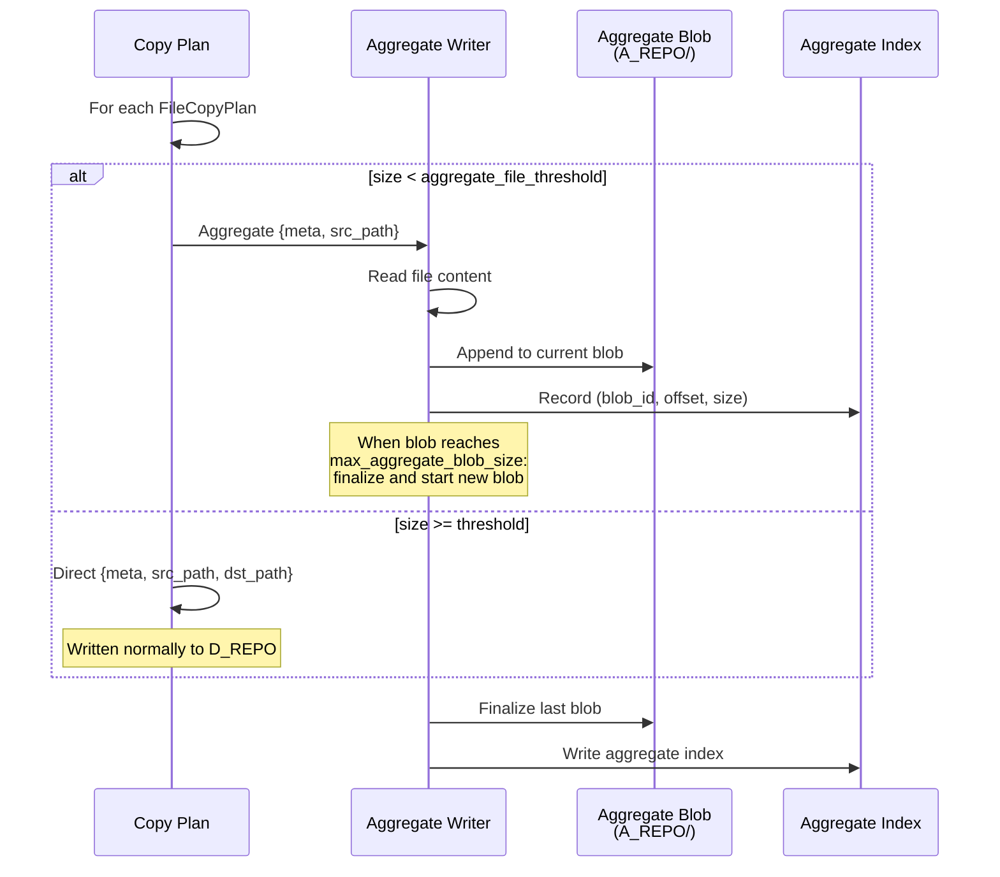

# Data Flow

This document traces the end-to-end data flow through fpt-rs for the three primary operations: **backup**, **restore**, and **incremental backup**. Sequence diagrams show how `DirBatchScanResult`, `FileControlBlock`, and `CopyBlock` move through the pipeline, with actual code references.

## Core Data Structures

Before examining the flows, here is how the key data structures relate. All definitions are from the actual source code.



### DirBatchScanResult

Defined at `src/scanner/models.rs:30`, this is the fundamental scan output unit:

```rust
#[derive(Deserialize, Serialize, Debug, Clone, Default)]
pub struct DirBatchScanResult {
    pub dir: DirMeta,
    pub files: Vec<FileMeta>,
    pub partial: bool,
    pub complete: bool,
}
```

### FileControlBlock

Defined at `src/backup/fcb.rs:53`, the FCB is the central state machine for each file operation. It carries all state needed for a single file's backup or restore:

```rust
pub struct FileControlBlock {
    pub meta: Box<FileMeta>,
    pub buffer: Vec<u8>,
    pub buffer_len: usize,
    pub src_state: SourceHandleState,
    pub dst_state: TargetHandleState,
    pub src_path: PathBuf,
    pub dst_path: PathBuf,
    pub src_offset: u64,
    pub dst_offset: u64,
}
```

The two state machines (`src/backup/fcb.rs:28-44`):

```rust
pub enum SourceHandleState { Inited, Read, PartialRead }
pub enum TargetHandleState { Inited, PartialWritten, Written }
```

### CopyBlock

Defined at `src/backup/copy_block.rs:14`, this is the transfer unit that flows between `SourceReader` and `TargetWriter`:

```rust
#[derive(Debug, Clone)]
pub struct CopyBlock {
    pub meta: Arc<FileMeta>,
    pub src_path: PathBuf,
    pub dst_path: PathBuf,
    pub src_offset: u64,
    pub dst_offset: u64,
    pub file_size: u64,
    pub data: Vec<u8>,
    pub is_last: bool,
}
```

Conversion between FCB and CopyBlock (`src/backup/copy_block.rs:26`):

```rust
impl CopyBlock {
    pub fn from_fcb(fcb: FileControlBlock) -> Self {
        let meta = Arc::new((*fcb.meta).clone());
        let file_size = meta.size;
        Self {
            meta, src_path: fcb.src_path, dst_path: fcb.dst_path,
            src_offset: fcb.src_offset, dst_offset: fcb.dst_offset,
            file_size, data: fcb.buffer, is_last: fcb.src_offset >= file_size,
        }
    }

    pub fn read_complete(&self) -> bool { self.src_offset >= self.file_size }
    pub fn write_complete(&self) -> bool { self.dst_offset >= self.file_size }
    pub fn clear_data(&mut self) { self.data.clear(); }
}
```

### CopyPlanEntry

Defined at `src/backup/copy_plan.rs:7`:

```rust
pub(crate) enum CopyPlanEntry {
    Directory { meta: DirMeta, dst_path: PathBuf },
    File(FileCopyPlan),
}

pub(crate) enum FileCopyPlan {
    Direct { meta: FileMeta, src_path: PathBuf, dst_path: PathBuf },
    Aggregate { meta: FileMeta, src_path: PathBuf },
}
```

## Backup Flow

The backup flow has four phases, orchestrated by `FileBackupJob::run()`.

### Sequence Diagram

```mermaid
sequenceDiagram
    participant CLI as CLI / fptcli
    participant JOB as FileBackupJob
    participant PREREQ as BackupPrereqJob
    participant SCAN as ScanJob
    participant SCANNER as Transport Scanner<br/>(Local/NFS/SMB)
    participant META_W as Metadata Writers
    participant CTRL as Control File Generator
    participant SUBTASK as Subtask Dispatcher
    participant EXECUTOR as Transport Executor<br/>(Local/NFS/SMB)
    participant POST as BackupPostJob

    CLI->>JOB: run()

    rect rgb(240, 248, 255)
        Note over JOB,PREREQ: Phase 1 -- Prerequisites
        JOB->>PREREQ: run_sync()
        PREREQ->>PREREQ: Validate source accessibility
        PREREQ->>PREREQ: Validate target accessibility
        PREREQ-->>JOB: OK
    end

    rect rgb(240, 255, 240)
        Note over JOB,CTRL: Phase 2 -- Scan
        JOB->>JOB: Build ScanConfig<br/>(incremental: prev_meta_dir?)
        JOB->>SCAN: run()
        SCAN->>SCANNER: scan(root_path, ScanOption)
        loop For each directory batch
            SCANNER->>SCANNER: List directory entries
            SCANNER->>SCANNER: stat() each entry
            SCANNER-->>META_W: DirBatchScanResult<br/>{dir: DirMeta, files: Vec&lt;FileMeta&gt;}
            META_W->>META_W: Serialize FileMeta to meta_*.dat
            META_W->>META_W: Serialize DirCacheEntry to dcache_*.dat
        end
        SCANNER-->>SCAN: Scan complete
        SCAN->>CTRL: generate_control_files()
        CTRL->>CTRL: Read meta_*.dat (current + previous)
        CTRL->>CTRL: Diff: new/changed/deleted files
        CTRL->>CTRL: Write copy_*.control.bin
        CTRL->>CTRL: Write hardlink_*.control.bin
        CTRL->>CTRL: Write delete_*.control.bin
        CTRL->>CTRL: Write mtime_*.control.bin
        CTRL-->>SCAN: Control files generated
        SCAN-->>JOB: ScanStats
    end

    rect rgb(255, 248, 240)
        Note over JOB,EXECUTOR: Phase 3 -- Subtasks
        JOB->>JOB: Discover control files in C_REPO/ctrl/
        JOB->>SUBTASK: spawn_and_join_subtasks()
        loop For each control file (parallel subtasks)
            SUBTASK->>EXECUTOR: execute_backup(control_file)
            EXECUTOR->>EXECUTOR: Read control file entries
            EXECUTOR->>EXECUTOR: produce_copy_plan()
            loop For each CopyPlanEntry
                alt Directory entry
                    EXECUTOR->>EXECUTOR: create_dir(dst_path)
                    EXECUTOR->>EXECUTOR: restore_metadata()
                else File entry
                    EXECUTOR->>EXECUTOR: Open source file
                    loop Chunk by chunk
                        EXECUTOR->>EXECUTOR: Read CopyBlock from source
                        EXECUTOR->>EXECUTOR: Write CopyBlock to target
                    end
                    EXECUTOR->>EXECUTOR: Close handles, restore metadata
                end
            end
            EXECUTOR->>EXECUTOR: PostCopyPhases::run_all_phases()
            Note over EXECUTOR: hardlink, delete, mtime
            EXECUTOR-->>SUBTASK: SubtaskResult
        end
        SUBTASK-->>JOB: All subtasks complete
    end

    rect rgb(248, 240, 255)
        Note over JOB,POST: Phase 4 -- Post-Job
        JOB->>JOB: Build BackupManifest
        JOB->>POST: run()
        POST->>POST: Write manifest.json locally
        alt Remote target (NFS/SMB)
            POST->>POST: Upload M_REPO/ to target
            POST->>POST: Upload C_REPO/ to target
            POST->>POST: Upload manifest.json to target
        end
        POST-->>JOB: OK
    end

    JOB-->>CLI: JobResult {copy_uuid, stats}
```

### Entry Point: BackupTask::start()

The backup entry point is `BackupTask::start()` at `src/backup.rs:301`. It inspects the source and target to select the pipeline:

```rust
pub fn start(self) -> Result<RunningBackup, BackupError> {
    let source_dir_base = self.option.source.base_path();
    let target_dir_base = self.option.target.base_path();
    // ...
    if !self.option.source.is_local() || !self.option.target.is_local() {
        // AIO path: generic orchestrator for any remote-involved direction
        let params = BackupPipelineParams { control_file, meta_dir, ctrl_dir, /* ... */ };
        let terminate_handle = spawn_backup(
            self.option.source.clone(), self.option.target.clone(),
            params, Arc::clone(&terminate_indicator),
        );
        return Ok(Self::running_backup(self.option, stats, terminate_handle, terminate_indicator));
    }
    // BIO path: local-to-local uses blocking threads
    let terminate_handle = spawn_local_backup_pipeline(/* ... */);
    Ok(Self::running_backup(self.option, stats, terminate_handle, terminate_indicator))
}
```

### The AIO Orchestrator

`spawn_backup()` at `src/backup/aio/orchestrator.rs:50` is the generic entry point for all remote-involved backups:

```rust
pub fn spawn_backup(
    source_location: DataLocation,
    target_location: DataLocation,
    params: BackupPipelineParams,
    terminate_indicator: Arc<AtomicBool>,
) -> thread::JoinHandle<()>
```

The internal `run_backup()` function (`src/backup/aio/orchestrator.rs:81`) follows four steps:

```rust
async fn run_backup(source_location, target_location, params) -> Result<(), String> {
    // 1. Connect source
    let source = BackupSource::connect(&source_location, /* ... */).await?;
    // 2. Connect target
    let target = BackupTarget::connect(&target_location, /* ... */).await?;
    // 3. Run copy pipeline (dispatches to the correct source+target combo)
    run_copy_for_source_target(&source, &target, &params).await;
    // 4. Run post-copy phases
    target.run_post_copy_phases(&params.ctrl_dir, &params.source_dir_base,
        &params.target_prefix, params.phase_flags, params.retry_policy,
        params.failure_recorder.as_ref()).await;
    Ok(())
}
```

### DirBatchScanResult Flow

The `DirBatchScanResult` flows through a multi-stage pipeline. The AIO scan scaffolding is at `src/scanner/engine/aio.rs:60`:

```rust
pub async fn run_aio_scan<S>(scanner: S, scan_option: ScanOption) -> Result<AioScanResult, String>
where
    S: AsyncDirScanner,
{
    let output_queue = Arc::new(BlockingQueue::<DirBatchScanResult>::new(DEFAULT_SCAN_QUEUE_CAPACITY));
    let stats = Arc::new(ScanStatistics::default());
    // ...
    // Start metadata writers (they drain output_queue synchronously)
    let writer_handles = start_meta_writers(&context, writer_count, None);
    // Spawn the async scanner
    let (tx, mut rx) = tokio::sync::mpsc::channel::<DirBatchScanResult>(256);
    let scan_handle = tokio::spawn(async move { scanner.scan(scan_opt_for_task, tx).await });
    // Bridge: tokio mpsc -> BlockingQueue
    while let Some(batch) = rx.recv().await {
        let _ = oq.push(batch);
        // update stats...
    }
    // Wait for scanner, close queue, join writers
    // Generate control files
    engine::generate_control_files(&scan_opt_arc)?;
    Ok(AioScanResult { total_files, total_dirs, total_size, failed_files, failed_dirs })
}
```

```mermaid
sequenceDiagram
    participant WORKER as Scan Worker Thread
    participant QUEUE as BlockingQueue<br/>&lt;DirBatchScanResult&gt;
    participant WRITER as Metadata Writer Thread
    participant DISK_META as M_REPO/meta/<br/>(.dat files)
    participant DISK_CTRL as C_REPO/ctrl/<br/>(.control.bin files)
    participant GEN as Control File<br/>Generator

    WORKER->>WORKER: readdir() + stat()
    WORKER->>WORKER: Build DirBatchScanResult<br/>{dir: DirMeta, files: [FileMeta...]}
    WORKER->>QUEUE: push(batch)
    QUEUE->>WRITER: pop(batch)
    WRITER->>DISK_META: write FileMeta entries<br/>to meta_*.dat (fixed-size binary)
    WRITER->>DISK_META: write DirCacheEntry<br/>to dcache_*.dat

    Note over GEN: After all batches processed
    GEN->>DISK_META: Read current meta_*.dat
    GEN->>DISK_META: Read previous meta_*.dat<br/>(if incremental)
    GEN->>GEN: Diff: compare FileMeta records<br/>(mtime, size, inode)
    GEN->>DISK_CTRL: Write changed/new files<br/>to copy_*.control.bin
    GEN->>DISK_CTRL: Write deleted files<br/>to delete_*.control.bin
    GEN->>DISK_CTRL: Write hardlink groups<br/>to hardlink_*.control.bin
    GEN->>DISK_CTRL: Write mtime entries<br/>to mtime_*.control.bin
```

## Restore Flow

The restore flow reads from a backup copy and writes to a restore target. The generic restore pipeline signature (`src/backup/restore_pipeline.rs:155`):

```rust
pub async fn run_restore_copy_pipeline<T, R>(
    control_file: PathBuf,
    meta_dir: PathBuf,
    original_source_base: PathBuf,
    source: LocalRepoRestoreSource,
    target: T,
    restore_ops: R,
    target_local_base: Option<PathBuf>,
    policy: RestorePolicy,
    stats: Arc<Mutex<RestoreStats>>,
    log_prefix: &'static str,
    max_concurrent_tasks: usize,
) where
    T: TargetWriter,
    R: RestoreOps + Clone + Send + Sync + 'static,
```



### Restore Pipeline Detail

The `run_restore_copy_pipeline()` function uses a producer-consumer pattern with tokio channels. The key loop from `src/backup/restore_pipeline.rs:282`:

```rust
loop {
    block = match source2.read_block(block).await {
        Ok(block) => block,
        Err((failed_block, msg)) => {
            error!("{log_prefix}: read {:?}: {msg}", failed_block.src_path);
            stats2.lock().unwrap().files_failed += 1;
            return;
        }
    };
    block = match target2.write_block(block).await {
        Ok(block) => block,
        Err((failed_block, msg)) => {
            error!("{log_prefix}: write {:?}: {msg}", failed_block.dst_path);
            stats2.lock().unwrap().files_failed += 1;
            return;
        }
    };
    if block.read_complete() && block.write_complete() {
        restore_ops2.restore_metadata(&restore_full_path, &block.meta.common);
        stats2.lock().unwrap().files_restored += 1;
        break;
    }
    block.clear_data();
}
```

The `RestorePolicy` enum (`src/backup.rs:446`) controls how existing files are handled:

```rust
pub enum RestorePolicy {
    Replace,    // Always overwrite
    Skip,       // Skip if target exists
    KeepNewer,  // Only restore if source is newer
}
```



## Incremental Backup Flow

Incremental backup reuses the same pipeline as full backup, with one key difference in Phase 2:



## AIO Pipeline Data Flow (Remote Targets)

When the target is remote (NFS or SMB), the backup uses the AIO async pipeline. The orchestrator dispatches to the correct pipeline based on source+target combination (`src/backup/aio/orchestrator.rs:134`):

```rust
async fn run_copy_for_source_target(source: &BackupSource, target: &BackupTarget, params: &BackupPipelineParams) {
    match (source, target) {
        (BackupSource::Local { .. }, BackupTarget::Local { .. }) => {
            unreachable!("local->local backup uses the BIO pipeline, not AIO");
        }
        #[cfg(feature = "nfs")]
        (BackupSource::Local { source_dir_base }, BackupTarget::Nfs { pool }) => {
            crate::nfs::backup::pipeline::run_local_to_nfs(/* ... */).await;
        }
        #[cfg(feature = "smb")]
        (BackupSource::Local { source_dir_base }, BackupTarget::Smb { location, pool }) => {
            crate::smb::backup::pipeline::run_local_to_smb_copy_pipeline(/* ... */).await;
        }
        // ... NFS->Local, NFS->NFS, NFS->SMB, SMB->Local, SMB->SMB, SMB->NFS
    }
}
```



## Aggregation Flow

When aggregation is enabled, small files are packed into aggregate blobs instead of being written individually:


