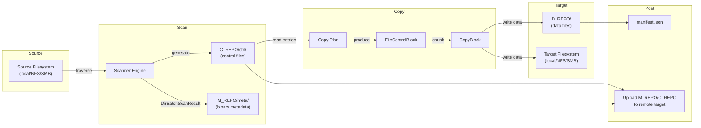

# Architecture Overview

fpt-rs is a high-performance, pluggable backup engine written in Rust. It is organized into **four distinct layers**, each with a clear responsibility. The layers communicate through well-defined data structures and trait boundaries, allowing each transport (local, NFS, SMB) to be plugged in without modifying the core logic.

## Layer Diagram

```mermaid
graph TD
    subgraph CLI["CLI Binaries (src/bin/)"]
        FPTCLI["fptcli (844 lines)<br/>Main unified CLI"]
        FSBACKUP["fsbackup (427 lines)<br/>Standalone backup"]
        FSSCAN["fsscan (501 lines)<br/>Standalone scan"]
        FSDIFF["fsdiff (550 lines)<br/>Diff tool"]
        METAINSPECT["metainspect (712 lines)<br/>Metadata inspector"]
        FPTSERVER["fptserver (1359 lines)<br/>Server daemon"]
    end

    subgraph Frame["Layer 4 -- Frame (src/frame/)"]
        BACKUPJOB["FileBackupJob<br/>4-phase orchestrator"]
        RESTOREJOB["FileRestoreJob<br/>Restore orchestrator"]
        SCANJOB["ScanJob<br/>Transport dispatch"]
        SUBTASK["run_backup_subtask()<br/>Subtask dispatcher"]
        POSTJOB["BackupPostJob<br/>manifest + upload"]
        PREREQ["BackupPrereqJob<br/>Validation"]
        DATALOC["DataLocation enum<br/>Dispatch key"]
        REPO["RepoLayout<br/>Copy directory paths"]
        TRAITS["BackupRestoreJob trait<br/>Uniform lifecycle"]
    end

    subgraph Backup["Layer 3 -- Backup Engine (src/backup/)"]
        ORCHESTRATOR["spawn_backup()<br/>Generic orchestrator"]
        PIPELINE["run_restore_copy_pipeline()<br/>Generic restore"]
        COPYPLAN["produce_copy_plan()<br/>Entry iterator"]
        FCB["FileControlBlock<br/>File state machine"]
        COPYBLOCK["CopyBlock<br/>Transfer unit"]
        SRCTGT["BackupSource / BackupTarget<br/>Transport enums"]
        TRANS_TRAITS["SourceReader + TargetWriter<br/>Transport traits"]
        PHASES_TRAIT["PostCopyPhases trait<br/>RestoreOps trait"]
        STATS["BackupStats / RestoreStats<br/>Metrics"]
    end

    subgraph Scanner["Layer 2 -- Scanner Engine (src/scanner/)"]
        SC_ENGINE["scanner::engine<br/>Shared scaffolding"]
        SC_AIO["AsyncDirScanner trait<br/>AIO for NFS/SMB"]
        SC_BIO["engine::bio<br/>Local blocking scan"]
        SC_META_W["MetaRepoWriter<br/>Binary metadata"]
        SC_CTRL["ControlPlanGenerator<br/>Control file gen"]
        SC_DIFF["diff.rs<br/>Incremental diff"]
        SC_MODELS["DirBatchScanResult<br/>Batch unit"]
        SC_FILTER["ScanPathFilterSet<br/>Path filters"]
    end

    subgraph Transport["Layer 1 -- Transport"]
        NATIVE["native/ (511 lines scanner)<br/>Local FS: std::fs"]
        NFS["nfs/ (670 lines scanner)<br/>NFSv3 direct RPC"]
        SMB["smb/ (538 lines scanner)<br/>SMB2/3 async client"]
    end

    CLI --> Frame
    Frame --> Scanner
    Frame --> Backup
    Scanner --> Transport
    Backup --> Transport
```



## The Four Layers

### Layer 1 -- Transport

The transport layer is the bottom of the stack. It provides **raw filesystem operations** for each supported protocol:

| Module | Protocol | Scanner Lines | Description |
|--------|----------|---------------|-------------|
| `native/` | Local FS | 511 | Direct POSIX/Win32 syscalls via `std::fs` |
| `nfs/` | NFSv3 | 670 | Direct RPC to NFS server, no kernel mount required |
| `smb/` | SMB2/3 | 538 | Async SMB client for Windows shares and Samba |

Each transport module is self-contained and symmetric in structure, providing a `scanner/` submodule and a `backup/` submodule. The transport layer implements the core traits (`SourceReader`, `TargetWriter`, `AsyncDirScanner`, `PostCopyPhases`, `RestoreOps`) that the upper layers depend on.

### Layer 2 -- Scanner Engine

The scanner engine (`src/scanner/`) traverses a source filesystem and produces:

- **Metadata files** (`M_REPO/meta/`): Binary-encoded `FileMeta` and `DirMeta` records describing every file and directory.
- **Control files** (`C_REPO/ctrl/`): Binary-encoded instruction files listing what needs to be copied, hardlinked, deleted, or time-corrected.

The scanner has two execution modes:

- **BIO (Blocking I/O)**: Used for local filesystem scanning. Worker threads read directories directly via `std::fs`.
- **AIO (Async I/O)**: Used for remote transports (NFS, SMB). The `AsyncDirScanner` trait abstracts over protocol-specific async traversal.

Both modes produce the same `DirBatchScanResult` data structure, which flows through a `BlockingQueue` to metadata writer threads.

The core scan output unit is defined in `src/scanner/models.rs:30`:

```rust
#[derive(Deserialize, Serialize, Debug, Clone, Default)]
pub struct DirBatchScanResult {
    pub dir: DirMeta,
    pub files: Vec<FileMeta>,
    pub partial: bool,
    pub complete: bool,
}
```

The `ScanStatistics` struct (defined at `src/scanner/models.rs:66`) tracks real-time metrics with atomic counters for safe concurrent updates from multiple worker threads:

```rust
pub struct ScanStatistics {
    tot_size: AtomicU64,
    tot_files: AtomicU64,
    tot_dirs: AtomicU64,
    failed_files: AtomicU64,
    failed_dirs: AtomicU64,
}
```

### Layer 3 -- Backup Engine

The backup engine (`src/backup/`) reads control files and metadata, then orchestrates the actual data copy:

- **Copy Plan**: Reads a control file and produces `CopyPlanEntry` items (directories or files).
- **AIO Pipeline**: For remote targets, uses `SourceReader` + `TargetWriter` traits to transfer data as `CopyBlock` units.
- **Aggregation**: Small files can be packed into aggregate blobs for efficiency.
- **Post-Copy Phases**: After copying file data, runs hardlink, delete, and mtime phases.
- **Restore Pipeline**: Reads data from a backup copy and writes it to a restore target.

The `FileControlBlock` (FCB) is the central state machine for each file operation, defined at `src/backup/fcb.rs:53`:

```rust
pub struct FileControlBlock {
    pub meta: Box<FileMeta>,
    pub buffer: Vec<u8>,
    pub buffer_len: usize,
    pub src_state: SourceHandleState,
    pub dst_state: TargetHandleState,
    pub src_path: PathBuf,
    pub dst_path: PathBuf,
    pub src_offset: u64,
    pub dst_offset: u64,
}
```

The FCB tracks two state machines (`src/backup/fcb.rs:28-44`):

```rust
pub enum SourceHandleState { Inited, Read, PartialRead }
pub enum TargetHandleState { Inited, PartialWritten, Written }
```

Data flows through the pipeline as `CopyBlock` units (`src/backup/copy_block.rs:14`):

```rust
pub struct CopyBlock {
    pub meta: Arc<FileMeta>,
    pub src_path: PathBuf,
    pub dst_path: PathBuf,
    pub src_offset: u64,
    pub dst_offset: u64,
    pub file_size: u64,
    pub data: Vec<u8>,
    pub is_last: bool,
}
```

### Layer 4 -- Frame (Orchestration)

The frame layer (`src/frame/`) is the top-level orchestrator. It manages the **full lifecycle** of backup and restore jobs through the `BackupRestoreJob` trait (`src/frame/traits.rs:196`):

```rust
pub trait BackupRestoreJob {
    type Error: std::error::Error + Send + 'static;
    fn run(self) -> Result<JobResult, Self::Error>;
}
```

The `JobResult` returned by any completed job (`src/frame/traits.rs:105`):

```rust
pub struct JobResult {
    pub copy_uuid: String,
    pub copy_root: PathBuf,
    pub subtasks_ok: usize,
    pub subtasks_failed: usize,
    pub total_files: u64,
    pub total_dirs: u64,
    pub total_bytes: u64,
}
```

The four phases are:

1. **Prerequisites** (`src/frame/prereq.rs`): Validates source/target accessibility.
2. **Scan** (`src/frame/scan.rs`): Delegates to the appropriate scanner for the source `DataLocation`.
3. **Subtasks** (`src/frame/subtask.rs`): Splits control files into parallel subtasks, each handled by a transport-specific backup executor.
4. **Post-Job** (`src/frame/postjob.rs`): Writes `manifest.json`, uploads metadata and control repos to remote targets.

The frame layer uses `DataLocation` (`src/frame/location.rs:17`) to dispatch to the correct transport without hardcoding protocol logic:

```rust
#[derive(Debug, Clone)]
pub enum DataLocation {
    Local(PathBuf),
    #[cfg(feature = "nfs")]
    Nfs(crate::nfs::NfsLocation),
    #[cfg(feature = "smb")]
    Smb(crate::smb::SmbLocation),
}
```

## End-to-End Data Flow



## The Backup Pipeline in Code

The entry point for all backup operations is `BackupTask::start()` (`src/backup.rs:301`). It inspects the source and target `DataLocation` to decide which pipeline to use:

```rust
pub fn start(self) -> Result<RunningBackup, BackupError> {
    // ...
    if !self.option.source.is_local() || !self.option.target.is_local() {
        // AIO path: uses the generic orchestrator for any remote-involved direction
        let params = crate::backup::aio::orchestrator::BackupPipelineParams { /* ... */ };
        let terminate_handle = crate::backup::aio::orchestrator::spawn_backup(
            self.option.source.clone(),
            self.option.target.clone(),
            params,
            Arc::clone(&terminate_indicator),
        );
        return Ok(Self::running_backup(self.option, stats, terminate_handle, terminate_indicator));
    }
    // BIO path: local-to-local uses blocking threads
    let terminate_handle = crate::native::backup::spawn_local_backup_pipeline(/* ... */);
    Ok(Self::running_backup(self.option, stats, terminate_handle, terminate_indicator))
}
```

The AIO orchestrator (`src/backup/aio/orchestrator.rs:50`) is a generic entry point that composes source and target transports:

```rust
pub fn spawn_backup(
    source_location: DataLocation,
    target_location: DataLocation,
    params: BackupPipelineParams,
    terminate_indicator: Arc<AtomicBool>,
) -> thread::JoinHandle<()>
```

Internally it follows four steps:
1. `BackupSource::connect()` -- establish a connection to the source
2. `BackupTarget::connect()` -- establish a connection to the target
3. `run_copy_for_source_target()` -- dispatch the correct copy pipeline based on source+target combination
4. `target.run_post_copy_phases()` -- run hardlink, delete, and mtime phases

The `BackupSource` and `BackupTarget` enums (`src/backup/aio/source.rs:13`, `src/backup/aio/target.rs:17`) encapsulate the connected transport state:

```rust
pub enum BackupSource {
    Local { source_dir_base: PathBuf },
    #[cfg(feature = "nfs")]
    Nfs { pool: Arc<NfsConnectionPool> },
    #[cfg(feature = "smb")]
    Smb { location: SmbLocation, pool: Arc<SmbClientPool> },
}

pub enum BackupTarget {
    Local { target_dir_base: PathBuf },
    #[cfg(feature = "nfs")]
    Nfs { pool: Arc<NfsConnectionPool> },
    #[cfg(feature = "smb")]
    Smb { location: SmbLocation, pool: Arc<SmbClientPool> },
}
```

## Key Design Principles

### Symmetric Pluggable Transports

Every transport (native, NFS, SMB) implements the same set of traits. The frame layer dispatches based on `DataLocation`, and the backup/scanner layers are generic over these traits. Adding a new transport means implementing the traits and adding a new `DataLocation` variant -- no changes to the core pipeline.

### Metadata Always Local

M_REPO and C_REPO are always written to the local filesystem during a job, even when the source or target is remote. This ensures the scanner and control-file generation logic is transport-agnostic. For remote targets, the `PostJob` uploads these repos after all subtasks complete.

### Data Written Directly to Target

When the target is remote (NFS or SMB), D_REPO data files are written directly to the target by the AIO pipeline -- they are not staged locally first. Only metadata and control files use the local-staging-then-upload path.

### Message-Passing Architecture

The system avoids shared mutable state wherever possible. `FileControlBlock` and `CopyBlock` are designed to be **moved by value** between threads. Communication between scanner workers, metadata writers, and backup executors uses channels (`BlockingQueue`, `mpsc::channel`).

The `SharedState` struct (`src/backup.rs:276`) tracks pipeline coordination through atomics:

```rust
pub(crate) struct SharedState {
    pub entry_produce_done: AtomicBool,
    pub reader_done: AtomicBool,
    pub writer_done: AtomicBool,
    pub active_reader_io_workers: AtomicU32,
    pub active_writer_io_workers: AtomicU32,
}
```

### Incremental Backup

The scanner supports incremental mode by comparing current file metadata against a previous scan's `M_REPO/meta/` directory. Only changed files produce control-file entries, dramatically reducing backup time for large filesystems with few changes.
