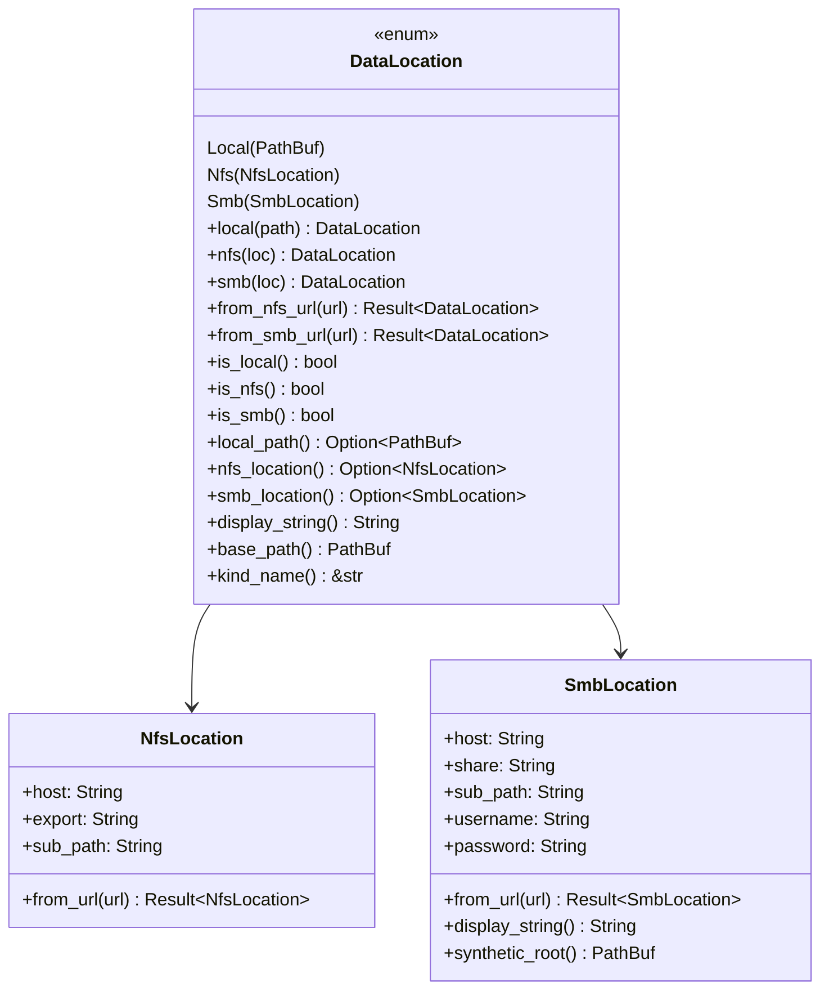
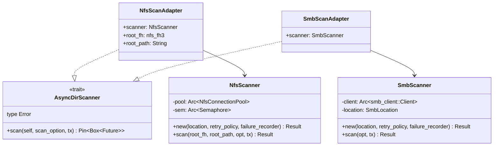
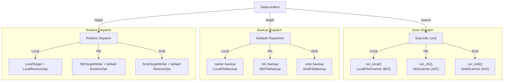

# Transport Layer

The transport layer is the foundation of fpt-rs's pluggable architecture. It defines a set of traits that abstract over filesystem operations, allowing the scanner and backup engines to work identically across local, NFS, and SMB transports.

## DataLocation

`DataLocation` is the enum that describes **where user data lives**. Defined at `src/frame/location.rs:17`:

```rust
/// Where the user's data lives -- local path, NFS export, or SMB share.
#[derive(Debug, Clone)]
pub enum DataLocation {
    /// Standard local filesystem path.
    Local(PathBuf),
    /// NFSv3 export accessed via direct RPC (no kernel mount required).
    #[cfg(feature = "nfs")]
    Nfs(crate::nfs::NfsLocation),
    /// SMB share accessed via an async SMB client.
    #[cfg(feature = "smb")]
    Smb(crate::smb::SmbLocation),
}
```



`DataLocation` serves as the **dispatch key** throughout the frame layer. The `ScanJob::run()` method at `src/frame/scan.rs` matches on it to select the correct transport:

```rust
pub fn run(&self) -> Result<ScanStats, ScanError> {
    match self.source {
        DataLocation::Local(_) => self.run_local(),
        DataLocation::Nfs(_) => self.run_nfs(),
        DataLocation::Smb(_) => self.run_smb(),
    }
}
```

Key helper methods on `DataLocation` (from `src/frame/location.rs`):

- `base_path()` (line 158): Returns the effective root path for path-stripping -- `PathBuf` for local, `{export}/{sub_path}` for NFS, `synthetic_root()` for SMB.
- `display_string()` (line 133): Human-readable display string used in logs and manifests.
- `kind_name()` (line 197): Returns `"local"`, `"nfs"`, or `"smb"` for control-file headers.
- `control_path_base()` (line 176): Physical prefix stripped from metadata paths when emitting logical control-file paths.

## Core Traits

### AsyncDirScanner

Defined at `src/scanner/engine/aio.rs:27`, this trait abstracts over protocol-specific async directory scanners. Both NFS and SMB scanners implement it via adapter structs.

```rust
/// A trait abstracting over protocol-specific async directory scanners.
pub trait AsyncDirScanner: Send + 'static {
    /// The error type returned by the scan.
    type Error: std::fmt::Display + Send + 'static;

    /// Run the scan, pushing DirBatchScanResult items into tx.
    fn scan(
        self,
        scan_option: Arc<ScanOption>,
        tx: tokio::sync::mpsc::Sender<DirBatchScanResult>,
    ) -> Pin<Box<dyn Future<Output = Result<(), Self::Error>> + Send>>;
}
```



The `run_aio_scan()` function (`src/scanner/engine/aio.rs:60`) provides the shared scaffolding for all async scanners:

```rust
pub async fn run_aio_scan<S>(scanner: S, scan_option: ScanOption) -> Result<AioScanResult, String>
where
    S: AsyncDirScanner,
{
    let output_queue = Arc::new(BlockingQueue::<DirBatchScanResult>::new(
        DEFAULT_SCAN_QUEUE_CAPACITY,
    ));
    let stats = Arc::new(ScanStatistics::default());
    // 1. Start metadata writer threads
    let writer_handles = start_meta_writers(&context, writer_count, None);
    // 2. Spawn the scanner task
    let (tx, mut rx) = tokio::sync::mpsc::channel::<DirBatchScanResult>(256);
    let scan_handle = tokio::spawn(async move { scanner.scan(scan_opt_for_task, tx).await });
    // 3. Bridge results from tokio mpsc -> BlockingQueue
    while let Some(batch) = rx.recv().await {
        let _ = oq.push(batch);
        // update stats...
    }
    // 4. Wait for scanner, close queue, join writers
    output_queue.close();
    for h in writer_handles { let _ = h.join(); }
    // 5. Generate control files
    engine::generate_control_files(&scan_opt_arc)?;
    Ok(AioScanResult { total_files, total_dirs, total_size, failed_files, failed_dirs })
}
```

### SourceReader

Defined at `src/backup/aio/transport.rs:22`, this trait reads data from a source filesystem.

```rust
pub trait SourceReader: Clone + Send + Sync + 'static {
    fn read_block(
        &self,
        block: CopyBlock,
    ) -> BoxFuture<'static, Result<CopyBlock, (CopyBlock, String)>>;

    fn finish(&self) -> BoxFuture<'static, Result<(), String>> {
        Box::pin(async { Ok(()) })
    }
}
```

The `read_block()` method takes a `CopyBlock` and returns it with the `data` field populated and `src_offset` advanced. The `is_last` flag indicates when the entire file has been read.

**Concrete implementation -- `LocalSource`** (`src/backup/aio/transport.rs:61`):

```rust
#[derive(Clone)]
pub struct LocalSource {
    pub buffer_size: usize,
}

impl SourceReader for LocalSource {
    fn read_block(&self, mut block: CopyBlock) -> BoxFuture<'static, Result<CopyBlock, (CopyBlock, String)>> {
        let buffer_size = clamp_copy_buffer_size(self.buffer_size);
        Box::pin(async move {
            let src_path = block.src_path.clone();
            let meta_size = block.file_size;
            let offset = block.src_offset;
            let read_result = task::spawn_blocking(move || {
                read_local_file_chunk(&src_path, offset, meta_size, buffer_size)
            }).await.unwrap_or_else(|e| Err(format!("blocking task panicked: {e}")));
            match read_result {
                Ok(buf) => {
                    block.src_offset = block.src_offset.saturating_add(buf.len() as u64);
                    block.is_last = block.src_offset >= block.file_size;
                    block.data = buf;
                    Ok(block)
                }
                Err(msg) => Err((block, msg)),
            }
        })
    }
}
```

**Concrete implementation -- `NfsSource`** (`src/nfs/backup/transport.rs:11`):

```rust
#[derive(Clone)]
pub struct NfsSource {
    pub pool: Arc<NfsConnectionPool>,
    pub dir_cache: FileHandleCache,
    pub root_fh: nfs_fh3,
    pub read_chunk: u32,
    pub buffer_size: usize,
}

impl SourceReader for NfsSource {
    fn read_block(&self, block: CopyBlock) -> BoxFuture<'static, Result<CopyBlock, (CopyBlock, String)>> {
        let this = self.clone();
        Box::pin(async move {
            let fcb = block.into_fcb();
            match nfs_read_task(fcb, Arc::clone(&this.pool), Arc::clone(&this.dir_cache),
                this.root_fh.clone(), this.read_chunk.min(/* ... */), /* ... */).await
            {
                NfsReaderResult::Read(fcb) => Ok(CopyBlock::from_fcb(fcb)),
                NfsReaderResult::Failed(fcb, msg) => Err((CopyBlock::from_fcb(fcb), msg)),
            }
        })
    }
}
```

### TargetWriter

Also defined at `src/backup/aio/transport.rs:33`, this trait writes data to a target filesystem.

```rust
pub trait TargetWriter: Clone + Send + Sync + 'static {
    fn create_dir(&self, path: PathBuf) -> BoxFuture<'static, Result<(), String>>;

    fn write_block(
        &self,
        block: CopyBlock,
    ) -> BoxFuture<'static, Result<CopyBlock, (CopyBlock, String)>>;

    fn write_file(
        &self,
        fcb: FileControlBlock,
    ) -> BoxFuture<'static, Result<FileControlBlock, (FileControlBlock, String)>> {
        let this = self.clone();
        Box::pin(async move {
            let block = CopyBlock::from_fcb(fcb);
            match this.write_block(block).await {
                Ok(block) => Ok(block.into_fcb()),
                Err((block, msg)) => Err((block.into_fcb(), msg)),
            }
        })
    }

    fn finish(&self) -> BoxFuture<'static, Result<(), String>> {
        Box::pin(async { Ok(()) })
    }
}
```

**Concrete implementation -- `LocalTarget`** (`src/backup/aio/transport.rs:94`):

```rust
#[derive(Clone)]
pub struct LocalTarget {
    pub base: PathBuf,
}

impl TargetWriter for LocalTarget {
    fn create_dir(&self, path: PathBuf) -> BoxFuture<'static, Result<(), String>> {
        let full_path = self.base.join(path);
        Box::pin(async move {
            task::spawn_blocking(move || {
                std::fs::create_dir_all(&full_path).map_err(|e| format!("mkdir {:?}: {e}", full_path))
            }).await.unwrap_or_else(|e| Err(format!("blocking task panicked: {e}")))
        })
    }

    fn write_block(&self, mut block: CopyBlock) -> BoxFuture<'static, Result<CopyBlock, (CopyBlock, String)>> {
        let dst_path = self.base.join(&block.dst_path);
        let buf = block.data.clone();
        let offset = block.dst_offset;
        let mark_sparse = block.meta.sparse_range.is_some();
        Box::pin(async move {
            let result = task::spawn_blocking(move || {
                write_local_file_chunk(&dst_path, offset, &buf, mark_sparse)
            }).await.unwrap_or_else(|e| Err(format!("blocking task panicked: {e}")));
            match result {
                Ok(()) => {
                    block.dst_offset = block.dst_offset.saturating_add(block.data.len() as u64);
                    Ok(block)
                }
                Err(msg) => Err((block, msg)),
            }
        })
    }
}
```

**Concrete implementation -- `SmbTarget`** (`src/smb/backup/transport.rs:11`):

```rust
#[derive(Clone)]
pub struct SmbTarget {
    pub location: SmbLocation,
    pub pool: Arc<SmbClientPool>,
    pub dir_cache: DirCache,
    pub buffer_size: usize,
}

impl TargetWriter for SmbTarget {
    fn create_dir(&self, path: PathBuf) -> BoxFuture<'static, Result<(), String>> {
        let this = self.clone();
        Box::pin(async move {
            let client = this.pool.client();
            ensure_relative_directory(&client, &this.location, &this.dir_cache,
                &path.to_string_lossy().replace('\\', "/")).await
        })
    }

    fn write_block(&self, mut block: CopyBlock) -> BoxFuture<'static, Result<CopyBlock, (CopyBlock, String)>> {
        let this = self.clone();
        Box::pin(async move {
            let rel_path = block.dst_path.to_string_lossy().replace('\\', "/");
            let client = this.pool.client();
            match write_relative_file_chunk(&client, &this.location, &this.dir_cache,
                &rel_path, &block.data, block.dst_offset,
                clamp_copy_buffer_size(this.buffer_size)).await
            {
                Ok(()) => {
                    block.dst_offset = block.dst_offset.saturating_add(block.data.len() as u64);
                    Ok(block)
                }
                Err(msg) => Err((block, msg)),
            }
        })
    }

    fn finish(&self) -> BoxFuture<'static, Result<(), String>> {
        let this = self.clone();
        Box::pin(async move { this.pool.close().await })
    }
}
```

### PostCopyPhases

Defined at `src/backup/aio/phases_trait.rs:17`, this trait runs post-copy phases (hardlink, delete, mtime) on the target. All methods have default no-op implementations.

```rust
/// Post-copy phases that a backup target must support.
pub trait PostCopyPhases: Send + Sync {
    async fn run_hardlink_phase(
        &self, _ctrl_dir: &Path, _source_dir_base: &Path,
        _target_prefix: &str, _phase_flags: PhaseFlags,
        _retry_policy: RetryPolicy, _failure_recorder: Option<&FailureRecorder>,
    ) { /* Default: no-op */ }

    async fn run_delete_phase(
        &self, _ctrl_dir: &Path, _source_dir_base: &Path,
        _target_prefix: &str, _phase_flags: PhaseFlags,
        _retry_policy: RetryPolicy, _failure_recorder: Option<&FailureRecorder>,
    ) { /* Default: no-op */ }

    async fn run_mtime_phase(
        &self, _ctrl_dir: &Path, _source_dir_base: &Path,
        _target_prefix: &str, _phase_flags: PhaseFlags,
        _retry_policy: RetryPolicy, _failure_recorder: Option<&FailureRecorder>,
    ) { /* Default: no-op */ }

    /// Run all enabled post-copy phases in order: hardlink, delete, mtime.
    async fn run_all_phases(
        &self, ctrl_dir: &Path, source_dir_base: &Path,
        target_prefix: &str, phase_flags: PhaseFlags,
        retry_policy: RetryPolicy, failure_recorder: Option<&FailureRecorder>,
    ) {
        self.run_hardlink_phase(ctrl_dir, source_dir_base, target_prefix, phase_flags, retry_policy, failure_recorder).await;
        self.run_delete_phase(ctrl_dir, source_dir_base, target_prefix, phase_flags, retry_policy, failure_recorder).await;
        self.run_mtime_phase(ctrl_dir, source_dir_base, target_prefix, phase_flags, retry_policy, failure_recorder).await;
    }
}
```

**Concrete implementation -- `NfsPostCopyPhases`** (`src/nfs/backup/phases_impl.rs:14`):

```rust
pub struct NfsPostCopyPhases {
    pub pool: Arc<NfsConnectionPool>,
    pub file_cache: FileHandleCache,
    pub dir_cache: DirHandleCache,
}

impl PostCopyPhases for NfsPostCopyPhases {
    async fn run_hardlink_phase(&self, ctrl_dir: &Path, source_dir_base: &Path,
            target_prefix: &str, _: PhaseFlags, _: RetryPolicy, _: Option<&FailureRecorder>) {
        info!("NFS: starting hardlink phase...");
        let hl_stats = run_nfs_hardlink_phase(ctrl_dir, source_dir_base, target_prefix,
            Arc::clone(&self.pool), Arc::clone(&self.file_cache), Arc::clone(&self.dir_cache)).await;
        info!("NFS hardlink phase complete: {} created, {} failed",
            hl_stats.hardlinks_created, hl_stats.hardlinks_failed);
    }
    // run_delete_phase and run_mtime_phase follow the same pattern
}
```

**Concrete implementation -- `LocalPostCopyPhases`** (`src/native/backup/phases_impl.rs:12`):

```rust
pub struct LocalPostCopyPhases;

impl PostCopyPhases for LocalPostCopyPhases {
    async fn run_hardlink_phase(&self, ctrl_dir: &Path, source_dir_base: &Path,
            _: &str, _: PhaseFlags, retry_policy: RetryPolicy,
            failure_recorder: Option<&FailureRecorder>) {
        info!("Starting hardlink phase...");
        match super::hardlink::run_hardlink_phase(ctrl_dir, &Path::new(""),
            source_dir_base, &ctrl_dir.join("target"), retry_policy, failure_recorder)
        {
            Ok(hl_stats) => info!("Hardlink phase completed: {} created, {} failed",
                hl_stats.hardlinks_created, hl_stats.hardlinks_failed),
            Err(e) => error!("Hardlink phase failed: {e}"),
        }
    }
    // run_delete_phase and run_mtime_phase follow the same pattern
}
```

### RestoreOps

Defined at `src/backup/aio/restore_ops.rs:16`, this trait provides restore-specific operations.

```rust
/// Transport-specific operations needed during restore.
pub trait RestoreOps: Send + Sync {
    /// Create a symlink at `link_path` pointing to `target`.
    fn create_symlink(&self, _link_path: &Path, _target: &str) -> Result<(), String> {
        Ok(())
    }

    /// Restore common metadata (permissions, timestamps, xattrs, ACLs) on a file.
    fn restore_metadata(&self, _path: &Path, _meta: &MetaCommon) {}
}
```

Only the local transport implements meaningful `create_symlink()` and `restore_metadata()` -- remote transports use the defaults (no-op).

## Trait Implementation Map

```mermaid
classDiagram
    class SourceReader {
        <<trait>>
        +read_block(CopyBlock) Result~CopyBlock~
        +finish() Result
    }

    class TargetWriter {
        <<trait>>
        +create_dir(PathBuf) Result
        +write_block(CopyBlock) Result~CopyBlock~
        +write_file(FCB) Result~FCB~
        +finish() Result
    }

    class PostCopyPhases {
        <<trait>>
        +run_hardlink_phase()
        +run_delete_phase()
        +run_mtime_phase()
        +run_all_phases()
    }

    class RestoreOps {
        <<trait>>
        +create_symlink(path, target) Result
        +restore_metadata(path, meta)
    }

    class LocalSource {
        +buffer_size: usize
    }
    class LocalTarget {
        +base: PathBuf
    }
    class LocalPostCopyPhases {
        +run_hardlink_phase()
        +run_delete_phase()
        +run_mtime_phase()
    }
    class LocalRestoreOps {
        +create_symlink()
        +restore_metadata()
    }

    class NfsSource {
        -pool: NfsConnectionPool
        -dir_cache: FileHandleCache
        -root_fh: nfs_fh3
        -read_chunk: u32
    }
    class NfsTarget {
        -pool: NfsConnectionPool
        -dir_cache: DirHandleCache
        -root_fh: nfs_fh3
        -write_chunk: u32
    }
    class NfsPostCopyPhases {
        -pool: NfsConnectionPool
        -file_cache: FileHandleCache
        -dir_cache: DirHandleCache
    }

    class SmbTarget {
        -location: SmbLocation
        -pool: SmbClientPool
        -dir_cache: DirCache
    }
    class SmbPostCopyPhases {
        -location: SmbLocation
    }

    LocalSource ..|> SourceReader
    NfsSource ..|> SourceReader
    LocalTarget ..|> TargetWriter
    NfsTarget ..|> TargetWriter
    SmbTarget ..|> TargetWriter
    LocalPostCopyPhases ..|> PostCopyPhases
    NfsPostCopyPhases ..|> PostCopyPhases
    SmbPostCopyPhases ..|> PostCopyPhases
    LocalRestoreOps ..|> RestoreOps
```



## Transport-Specific Details

### Native (Local Filesystem)

The native transport uses direct POSIX/Win32 syscalls. It does not need a connection pool.

- **Scanner**: `LocalFileScanner` (511 lines, `src/native/scanner.rs`) uses the BIO engine (blocking OS threads). Does not implement `AsyncDirScanner` -- it has its own `scan()` method that returns `ScanStats` directly.
- **SourceReader**: `LocalSource` reads file chunks via `task::spawn_blocking()` wrapping `read_local_file_chunk()` (`src/backup/aio/local_fs.rs`).
- **TargetWriter**: `LocalTarget` writes file chunks via `task::spawn_blocking()` wrapping `write_local_file_chunk()`.
- **PostCopyPhases**: `LocalPostCopyPhases` reads hardlink/delete/mtime control files and applies them directly via `std::fs`.
- **RestoreOps**: `LocalRestoreOps` (`src/native/backup/restore_ops.rs`) creates symlinks via `std::os::unix::fs::symlink()` and restores permissions/xattrs/ACLs.

### NFS (NFSv3)

The NFS transport communicates directly with an NFS server via RPC, requiring no kernel mount.

- **Connection**: `NfsConnectionPool` (245 lines, `src/nfs/connection.rs`) manages a pool of NFS RPC connections. Connections are acquired/released per operation.
- **Scanner**: `NfsScanner` (670 lines, `src/nfs/scanner.rs`) implements async directory listing via NFS `READDIRPLUS3` RPCs. Wrapped by `NfsScanAdapter` to implement `AsyncDirScanner`.
- **SourceReader**: `NfsSource` (`src/nfs/backup/transport.rs:11`) reads file data via NFS `READ3` RPCs, returning `CopyBlock` units.
- **TargetWriter**: `NfsTarget` (`src/nfs/backup/transport.rs:46`) writes file data via NFS `WRITE3` RPCs. Uses a `DirHandleCache` to avoid repeated directory lookups. `create_dir()` walks path components, creating missing directories via `MKDIR3`.
- **PostCopyPhases**: `NfsPostCopyPhases` (`src/nfs/backup/phases_impl.rs:14`) implements hardlink (`LINK3`), delete (`REMOVE3`/`RMDIR3`), and mtime (`SETATTR3`) via NFS RPCs.

### SMB (SMB2/3)

The SMB transport uses an async SMB client for Windows shares and Samba servers.

- **Connection**: `SmbClientPool` (84 lines, `src/smb/connection.rs`) manages authenticated sessions to the SMB server.
- **Scanner**: `SmbScanner` (538 lines, `src/smb/scanner.rs`) implements async directory listing via SMB `QUERY_DIRECTORY` operations. Wrapped by `SmbScanAdapter` to implement `AsyncDirScanner`. Includes detailed metrics tracking (`SmbCopyMetrics`, 206 lines).
- **TargetWriter**: `SmbTarget` (`src/smb/backup/transport.rs:11`) writes file data via SMB `WRITE` operations. `create_dir()` uses SMB `CREATE` + `CLOSE` for directory creation. The `finish()` method closes the client pool connection.
- **PostCopyPhases**: `SmbPostCopyPhases` (`src/smb/backup/phases_impl.rs`) implements hardlink, delete, and mtime via SMB operations.
- **Note**: SMB currently does not have a `SourceReader` implementation -- for SMB-to-SMB or SMB-as-source backups, data is read via the `SmbSourceReader` or from the local D_REPO staging area.

## How Transports Are Selected

The frame layer selects the transport at multiple points. The `BackupTarget` enum (`src/backup/aio/target.rs:17`) dispatches post-copy phases:

```rust
pub async fn run_post_copy_phases(&self, ctrl_dir, source_dir_base, target_prefix,
        phase_flags, retry_policy, failure_recorder) {
    match self {
        BackupTarget::Local { .. } => {
            let phases = LocalPostCopyPhases;
            phases.run_all_phases(/* ... */).await;
        }
        #[cfg(feature = "nfs")]
        BackupTarget::Nfs { pool } => {
            let phases = NfsPostCopyPhases { pool: Arc::clone(pool), file_cache, dir_cache };
            phases.run_all_phases(/* ... */).await;
        }
        #[cfg(feature = "smb")]
        BackupTarget::Smb { location, .. } => {
            let phases = SmbPostCopyPhases { location };
            phases.run_all_phases(/* ... */).await;
        }
    }
}
```



## CopyBlock: The Transfer Unit

`CopyBlock` (`src/backup/copy_block.rs:14`) is the common data unit that flows between `SourceReader` and `TargetWriter`:

```rust
pub struct CopyBlock {
    pub meta: Arc<FileMeta>,
    pub src_path: PathBuf,
    pub dst_path: PathBuf,
    pub src_offset: u64,
    pub dst_offset: u64,
    pub file_size: u64,
    pub data: Vec<u8>,
    pub is_last: bool,
}
```

The block is designed for **chunked transfer** of large files:

1. A `FileControlBlock` is converted to a `CopyBlock` via `CopyBlock::from_fcb()`.
2. The `SourceReader::read_block()` fills `data` and advances `src_offset`.
3. The `TargetWriter::write_block()` writes `data` and advances `dst_offset`.
4. The loop continues until `read_complete() && write_complete()`.
5. `clear_data()` is called between iterations to bound memory usage.

```mermaid
stateDiagram-v2
    [*] --> Init: CopyBlock::from_fcb(fcb)
    Init --> Reading: src_offset < file_size
    Reading --> ReadDone: src.read_block() fills data<br/>src_offset advanced
    ReadDone --> Writing: target.write_block(data)
    Writing --> WriteDone: dst_offset advanced<br/>data cleared
    WriteDone --> Reading: src_offset < file_size
    WriteDone --> Complete: read_complete() && write_complete()
    Complete --> [*]
```
