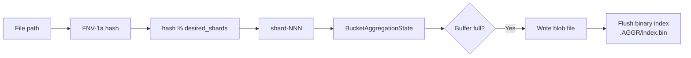
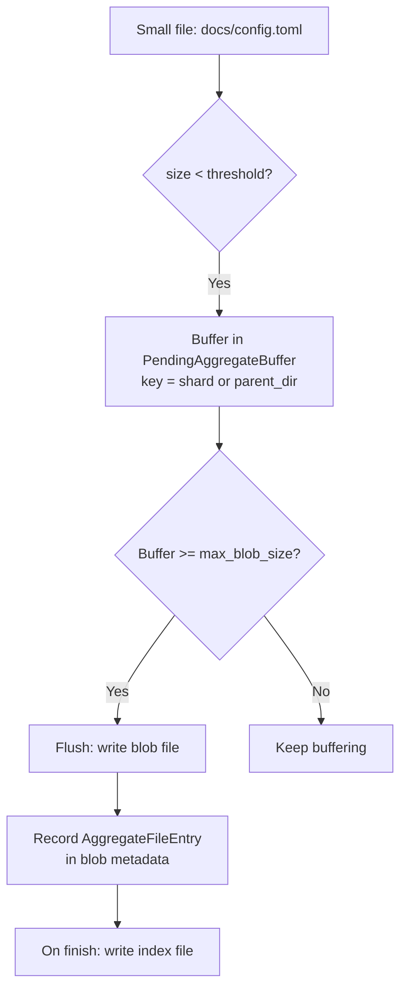

# Aggregation

Many filesystems contain millions of small files (configuration files, source code, log fragments). Storing each as a separate file in the backup repository creates enormous metadata overhead and poor I/O patterns. **Aggregation** solves this by packing small files into large **blob** files, with an index that maps original paths to `(blob, offset, size)` triples.

## When Aggregation Happens

Aggregation is controlled by `AggregateConfig` (`src/backup/aggregate/mod.rs`):

```rust
// src/backup/aggregate/mod.rs
#[derive(Debug, Clone, Copy)]
pub struct AggregateConfig {
    pub enabled: bool,           // master switch
    pub layout: AggregateLayout, // DirLevel or Shard
    pub max_blob_size: u64,      // default: 64 MB
    pub file_threshold: u64,     // default: 1 MB
    pub shard_count: u16,        // default: 16
}

impl Default for AggregateConfig {
    fn default() -> Self {
        Self {
            enabled: false,
            layout: AggregateLayout::Shard,
            max_blob_size: 64 * 1024 * 1024,   // 64 MB
            file_threshold: 1024 * 1024,        // 1 MB
            shard_count: 16,
        }
    }
}
```

Builder example:

```rust
let config = AggregateConfig::enabled()
    .layout(AggregateLayout::Shard)
    .file_threshold(1024 * 1024)     // 1 MB
    .max_blob_size(64 * 1024 * 1024) // 64 MB
    .shard_count(16);
```

A file is aggregated when (`src/backup/aggregate/mod.rs`):

```rust
// src/backup/aggregate/mod.rs
pub fn should_aggregate(file_size: u64, config: &AggregateConfig) -> bool {
    config.enabled && file_size > 0 && file_size < config.file_threshold
}
```

Symlinks are never aggregated.

## Two Layouts

fpt-rs supports two aggregation layouts (`src/backup/aggregate/mod.rs`):

```rust
// src/backup/aggregate/mod.rs
#[derive(Debug, Clone, Copy, PartialEq, Eq, Serialize, Deserialize, Default)]
pub enum AggregateLayout {
    DirLevel,  // Legacy per-directory layout
    #[default]
    Shard,     // Shared shard-based layout
}
```

### DIR_LEVEL Layout

In DIR_LEVEL layout, aggregation is **per-directory**. Each directory that contains aggregated files gets its own `.AGGR_DIR/` subdirectory with blob files and a SQLite index.

```
backup_root/
  docs/
    .AGGR_DIR/
      index.db          <-- SQLite index for docs/
      <snowflake>.blob  <-- blob files for docs/
    readme.md
    large-file.bin
  src/
    .AGGR_DIR/
      index.db
      <snowflake>.blob
    main.rs
```

The SQLite index maps `relative_path -> (blob_path, offset, size)` for fast lookup during restore.

### SHARD Layout

In SHARD layout, all aggregated files are stored in a **shared** `.AGGR/` directory at the repository root, partitioned into numbered shards. The index is a single binary file.

```
backup_root/
  .AGGR/
    index.bin           <-- Binary index for all aggregated files
    shard-000/
      <snowflake>.blob
    shard-001/
      <snowflake>.blob
    ...
    shard-007/
      <snowflake>.blob
```

Files are assigned to shards by hashing their relative path (FNV-1a):



The `desired_shards` value grows dynamically based on `bytes_seen / max_blob_size`, capped at `shard_count`. This ensures that early in a backup (when little data has been seen), fewer shards are used, reducing blob file fragmentation.

## Blob File Metadata

Each blob's metadata is captured in `AggregateBlobMeta` (`src/backup/aggregate/mod.rs`):

```rust
// src/backup/aggregate/mod.rs
#[derive(Debug, Clone, Serialize, Deserialize)]
pub struct AggregateBlobMeta {
    pub blob_path: String,            // e.g. ".AGGR/shard-000/....blob"
    pub blob_size: u64,
    pub file_count: u32,
    pub files: Vec<AggregateFileEntry>,
    pub shard_id: u16,
}

#[derive(Debug, Clone, Serialize, Deserialize)]
pub struct AggregateFileEntry {
    pub relative_path: String,  // original file path relative to repo root
    pub offset: u64,            // offset within the blob file
    pub size: u64,              // file size in bytes
    pub ctime: u64,
    pub mtime: u64,
    pub mode: u32,
    pub xattrs: Option<String>,
    pub acl: Option<String>,
}
```

A blob file is a simple concatenation of file contents:

```
+------------------+
| file_1 data      |  offset 0, size S1
+------------------+
| file_2 data      |  offset S1, size S2
+------------------+
| file_3 data      |  offset S1+S2, size S3
+------------------+
```

## In-Memory Buffering

During backup, files are buffered in `PendingAggregateBuffer` (`src/backup/aggregate/mod.rs`) before being flushed as blobs:

```rust
// src/backup/aggregate/mod.rs
pub struct PendingAggregateBuffer {
    pub key: String,                    // e.g. "shard-000", "a/b"
    pub pending_files: Vec<PendingFile>,
    pub current_size: u64,
    pub max_size: u64,                  // triggers flush when reached
}

impl PendingAggregateBuffer {
    pub fn add_file(&mut self, file: PendingFile) -> bool {
        self.current_size += file.data.len() as u64;
        self.pending_files.push(file);
        self.current_size >= self.max_size  // returns true when buffer is full
    }

    pub fn flush(&mut self) -> Vec<PendingFile> {
        let files = std::mem::take(&mut self.pending_files);
        self.current_size = 0;
        files
    }
}
```



## Blob Filename Generation

Blob filenames use a Snowflake-like ID generator (`src/backup/aggregate/mod.rs`) to ensure uniqueness across processes:

```rust
// src/backup/aggregate/mod.rs
pub struct SnowflakeIdGenerator {
    last_timestamp: u64,
    sequence: u16,       // 12 bits
    process_id: u16,     // 10 bits
    epoch: u64,
}

impl SnowflakeIdGenerator {
    // ID structure (64 bits):
    // | 41 bits timestamp | 10 bits process | 12 bits sequence | 1 bit reserved |
    pub fn next_id(&mut self) -> u64 {
        // ... timestamp + process_id + sequence composition
        (timestamp << 23) | ((self.process_id as u64) << 12) | (self.sequence as u64)
    }

    pub fn generate_blob_name(&mut self) -> String {
        format!("{:016x}.fpt.blob", self.next_id())
    }
}
```

The `ThreadSafeSnowflake` wrapper provides thread-safe access:

```rust
// src/backup/aggregate/mod.rs
pub struct ThreadSafeSnowflake {
    inner: std::sync::Mutex<SnowflakeIdGenerator>,
}

impl ThreadSafeSnowflake {
    pub fn generate_blob_name(&self) -> String {
        let mut generator = self.inner.lock().unwrap();
        generator.generate_blob_name()
    }
}
```

## Index Formats

### SQLite Index (DIR_LEVEL)

Each `.AGGR_DIR/index.db` contains a single table mapping file names to blob locations. The restore pipeline queries this index per-directory.

### Binary Index (SHARD)

The `.AGGR/index.bin` file is a compact binary index (`AggregateIndex`) that maps relative file paths to `(blob_path, offset, size)` triples. It supports `query_file(path)` for O(1) lookup during restore.

## AggregateStats

```rust
// src/backup/aggregate/mod.rs
#[derive(Debug, Default, Clone)]
pub struct AggregateStats {
    pub blobs_created: u64,
    pub files_aggregated: u64,
    pub files_normal: u64,       // non-aggregated files
    pub blob_bytes: u64,
    pub original_bytes: u64,
    pub active_shards: u64,
}
```

## Integration with the Backup Pipeline

The `AggregatingTarget<T>` wraps any `TargetWriter` and intercepts `write_block` calls:

1. If the block should be aggregated (small, complete, not a symlink), it is buffered in a per-bucket state
2. When a bucket reaches `max_blob_size`, the accumulated files are flushed as a blob
3. On `finish()`, all remaining buffers are flushed and the index files are written
4. Large files and symlinks pass through to the inner `TargetWriter` unchanged

During restore, `LocalRepoRestoreSource` queries the appropriate index (SQLite for DIR_LEVEL, binary for SHARD) to locate each file's data within its blob.
