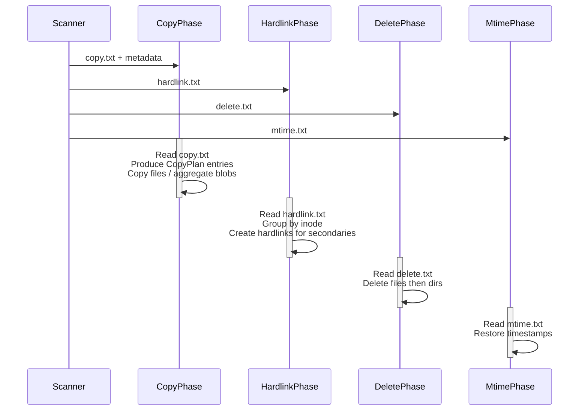
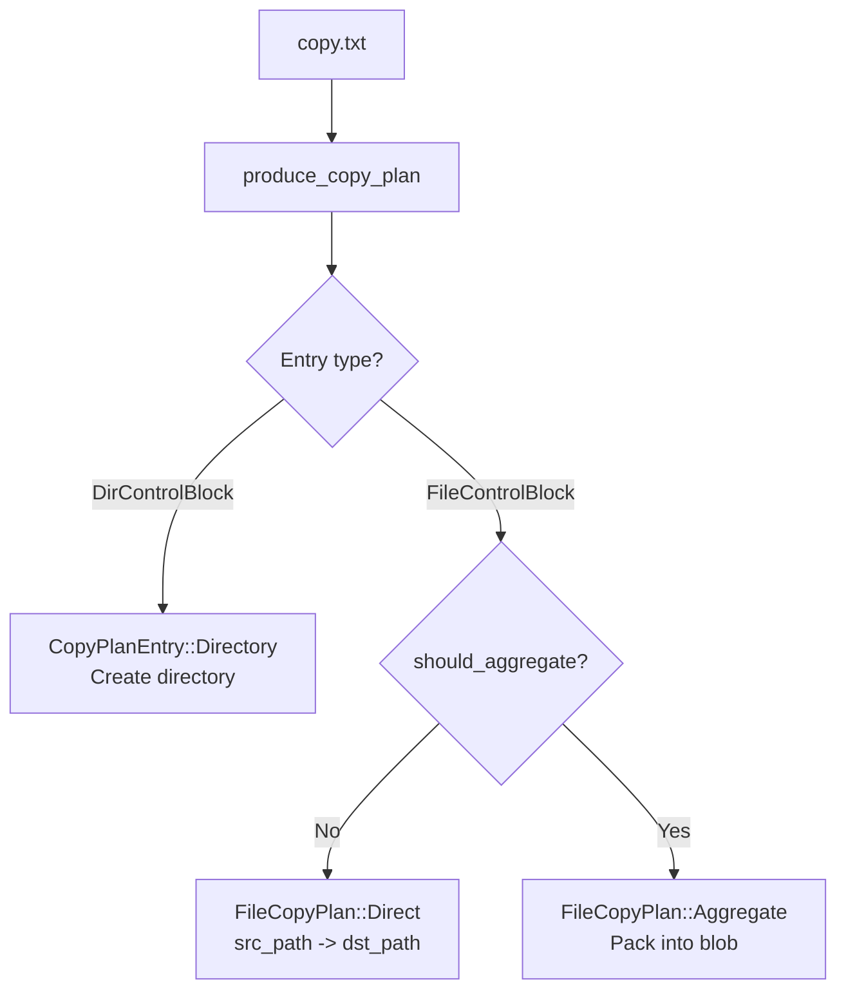

# Backup Pipeline

After the scanner produces control files and metadata, the **backup pipeline** transfers data from the source to the destination repository. The pipeline has four sequential phases: **copy**, **hardlink**, **delete**, and **mtime**. Each phase reads its own control file and operates independently.

## Phase Overview



## Phase 1: Copy

The copy phase is the heaviest. It reads `copy.txt`, loads the corresponding `FileMeta` / `DirMeta` from the metadata repository, and produces `CopyPlanEntry` items.

### CopyPlan Entries

The `produce_copy_plan()` function (`src/backup/copy_plan.rs`) reads the control file and metadata, building a stream of `CopyPlanEntry` items:



```rust
// src/backup/copy_plan.rs
pub(crate) enum CopyPlanEntry {
    Directory { meta: DirMeta, dst_path: PathBuf },
    File(FileCopyPlan),
}

pub(crate) enum FileCopyPlan {
    Direct {
        meta: FileMeta,
        src_path: PathBuf,
        dst_path: PathBuf,
    },
    Aggregate {
        meta: FileMeta,
        src_path: PathBuf,
    },
}
```

The `FileCopyPlan::from_fcb()` method decides whether a file should be aggregated or copied directly:

```rust
// src/backup/copy_plan.rs
impl FileCopyPlan {
    pub fn from_fcb(
        fcb: FileControlBlock,
        should_aggregate: impl FnOnce(&FileMeta) -> bool,
    ) -> Self {
        let meta = *fcb.meta;
        if should_aggregate(&meta) {
            Self::Aggregate { meta, src_path: fcb.src_path }
        } else {
            Self::Direct { meta, src_path: fcb.src_path, dst_path: fcb.dst_path }
        }
    }
}
```

### File Control Block (FCB)

The `FileControlBlock` (`src/backup/fcb.rs`) is the central state machine for a single file's backup or restore. It is **moved by value** between threads:

```rust
// src/backup/fcb.rs
pub(crate) const MAX_FILE_BUFFER_SIZE: usize = 4 * 1024 * 1024; // 4 MiB

pub enum SourceHandleState { Inited, Read, PartialRead }
pub enum TargetHandleState { Inited, PartialWritten, Written }

pub struct FileControlBlock {
    pub meta: Box<FileMeta>,
    pub buffer: Vec<u8>,         // lazy allocation, up to 4 MiB
    pub buffer_len: usize,
    pub src_state: SourceHandleState,
    pub dst_state: TargetHandleState,
    pub src_path: PathBuf,
    pub dst_path: PathBuf,
    pub src_offset: u64,
    pub dst_offset: u64,
}
```

Buffer memory is allocated lazily when a read operation starts. This avoids reserving up to 4 MiB for every queued FCB, which would otherwise explode memory usage on large file sets.

### CopyBlock -- The Transfer Unit

Large files are transferred in `CopyBlock` units (`src/backup/copy_block.rs`):

```rust
// src/backup/copy_block.rs
#[derive(Debug, Clone)]
pub struct CopyBlock {
    pub meta: Arc<FileMeta>,
    pub src_path: PathBuf,
    pub dst_path: PathBuf,
    pub src_offset: u64,
    pub dst_offset: u64,
    pub file_size: u64,
    pub data: Vec<u8>,
    pub is_last: bool,
}
```

| Field | Description |
|---|---|
| `meta` | `Arc<FileMeta>` for the file |
| `src_path` / `dst_path` | Source and destination paths |
| `src_offset` / `dst_offset` | Byte offsets for resumable chunked I/O |
| `file_size` | Total logical file size |
| `data` | Bounded payload buffer |
| `is_last` | Whether this block completes the file (`src_offset >= file_size`) |

`CopyBlock` can be converted to and from `FileControlBlock`:

```rust
// src/backup/copy_block.rs
impl CopyBlock {
    pub fn from_fcb(fcb: FileControlBlock) -> Self { ... }
    pub fn into_fcb(self) -> FileControlBlock { ... }
    pub fn data_len(&self) -> usize { self.data.len() }
    pub fn clear_data(&mut self) { self.data.clear(); }
    pub fn read_complete(&self) -> bool { self.src_offset >= self.file_size }
    pub fn write_complete(&self) -> bool { self.dst_offset >= self.file_size }
}
```

The block-based design enables backpressure: the pipeline can limit outstanding blocks by count or total bytes.

### Aggregation

If aggregation is enabled, files smaller than `file_threshold` (default 1 MB) are not written individually. Instead, they are buffered in an `AggregatingTarget<T>` wrapper that packs multiple small files into blob files up to `max_blob_size` (default 64 MB). See [Aggregation](./aggregation.md) for details.

## Phase 2: Hardlink

The hardlink phase reads `hardlink.txt`, which contains interleaved `Inode` and `File` records. For each inode group:

1. The **first file** in the group was already copied during phase 1 (the "primary").
2. All **subsequent files** in the group are created as hardlinks pointing to the primary.

This preserves the original filesystem's hardlink structure on the destination.

See [Hardlinks](./hardlinks.md) for the full mechanism.

## Phase 3: Delete

The delete phase reads `delete.txt` and removes files and directories that no longer exist in the source. Entries are typed as either `Dir` or `File`. Files are deleted first, then directories, to avoid removing non-empty directories.

## Phase 4: Mtime

The mtime phase reads `mtime.txt` and restores directory timestamps (`atime`, `mtime`) and ownership (`uid`, `gid`, `mode`). This must run last because earlier phases may modify directory timestamps during file creation.

Each `MtimeDirEntry` contains:

| Field | Description |
|---|---|
| `path` | Directory path |
| `mode` | Permission bits |
| `uid` / `gid` | Owner and group |
| `atime` / `mtime` | Access and modification times (seconds since epoch) |

## Configuration -- BackupOption

The backup pipeline is configured via `BackupOption` (`src/backup.rs`), which uses a builder pattern:

```rust
// src/backup.rs
pub struct BackupOption {
    source: DataLocation,
    target: DataLocation,
    meta_dir: PathBuf,
    ctrl_dir: PathBuf,
    control_file: PathBuf,
    worker_count: usize,         // default: 8
    copy_buffer_size: usize,     // default: 1 MB, clamped to 256KB-4MB
    retry_policy: RetryPolicy,
    failure_log: Option<FailureLogConfig>,
    phase_flags: PhaseFlags,     // hardlink, delete, mtime toggles
    aggregate_config: AggregateConfig,
    target_prefix: Option<String>,
}
```

`PhaseFlags` controls which post-copy phases run:

```rust
// src/backup.rs
#[derive(Debug, Clone, Copy, Default)]
pub struct PhaseFlags {
    pub hardlink: bool,
    pub delete: bool,
    pub mtime: bool,
}
```

Builder example:

```rust
let option = BackupOption::new(source, target, meta_dir, ctrl_dir, control_file)
    .enable_hardlink_phase(true)
    .enable_delete_phase(true)
    .enable_mtime_phase(true)
    .copy_buffer_size(2 * 1024 * 1024)   // 2 MB
    .aggregate_config(AggregateConfig::enabled().shard_count(16))
    .retry_policy(RetryPolicy::new(5, Duration::from_secs(2)));
```

## Backup Execution

`BackupTask::start()` (`src/backup.rs`) dispatches to either the async orchestrator (for remote sources/targets) or the native local pipeline:

```rust
// src/backup.rs
impl BackupTask {
    pub fn start(self) -> Result<RunningBackup, BackupError> {
        if !self.option.source.is_local() || !self.option.target.is_local() {
            // Use async AIO orchestrator for NFS/SMB
            crate::backup::aio::orchestrator::spawn_backup(...);
        } else {
            // Use native local pipeline
            crate::native::backup::spawn_local_backup_pipeline(...);
        }
    }
}
```

The `RunningBackup` handle provides real-time statistics:

```rust
// src/backup.rs
impl RunningBackup {
    pub fn stats(&self) -> BackupStatsSnapshot { ... }
    pub fn hardlink_stats(&self) -> Option<&HardlinkStatsSnapshot> { ... }
    pub fn delete_stats(&self) -> Option<&DeleteStatsSnapshot> { ... }
    pub fn mtime_stats(&self) -> Option<&MtimeStatsSnapshot> { ... }
    pub fn complete(&self) -> bool { ... }
    pub fn wait(self) -> Result<(), BackupError> { ... }
}
```

### BackupStats

All counters use `AtomicU64` for concurrent updates (`src/backup/stats.rs`):

```rust
// src/backup/stats.rs
pub struct BackupStats {
    pub bytes_copied: AtomicU64,
    pub src_opened: AtomicU64,
    pub src_closed: AtomicU64,
    pub dst_opened: AtomicU64,
    pub dst_closed: AtomicU64,
    pub files_copied: AtomicU64,
    pub files_deleted: AtomicU64,
    pub dirs_created: AtomicU64,
    pub dirs_deleted: AtomicU64,
    pub files_failed: AtomicU64,
    pub dirs_failed: AtomicU64,
}
```

## Transport Abstraction

The copy phase uses two core traits:

- **`SourceReader`** -- Reads `CopyBlock` data from the source (local filesystem, aggregate blob, or remote)
- **`TargetWriter`** -- Writes `CopyBlock` data to the destination (local filesystem, NFS, SMB, or aggregating wrapper)

Post-copy phases use the **`PostCopyPhases`** trait with default no-op implementations. Each transport (local, NFS, SMB) overrides only the phases it supports.


