# Control Files

Control files are the communication channel between the scanner and the backup/restore pipeline. They describe **what to copy**, **what to hardlink**, **what to delete**, and **what timestamps to restore**. All control files share a common binary format: a fixed 4 KB ASCII header followed by a sequence of length-prefixed binary records.

## Common Structure

Every control file begins with a 4 KB header block written as human-readable ASCII key-value pairs, padded with null bytes to exactly 4096 bytes. Immediately after the header, records begin at byte offset 4096.

```mermaid
block-beta
    columns 1
    block:header["Header Block (4096 bytes)"]
        A["#FPT_COPY_CTRL_FILE  (magic identifier)"]
        B["version=3"]
        C["header_size=4096"]
        D["file_count=1234"]
        E["dir_count=56"]
        F["inode_count=0"]
        G["record_count=1290"]
        H["time=1718000000"]
        I["source_kind=local"]
        J["source_root=/data"]
        K["... padded to 4096 bytes with null bytes"]
    end
    block:records["Record Stream"]
        L["[Record 1] len_u32 | payload"]
        M["[Record 2] len_u32 | payload"]
        N["[Record 3] len_u32 | payload"]
        O["..."]
    end
```



## ControlFileHeader

The header is defined in `src/scanner/metadata/control_codec.rs`:

```rust
// src/scanner/metadata/control_codec.rs
pub const CONTROL_HEADER_SIZE: usize = 4096;
pub const CONTROL_VERSION_V3: u32 = 3;

#[derive(Debug, Clone, PartialEq)]
pub struct ControlFileHeader {
    pub version: u32,           // format version (currently 3)
    pub file_count: u64,        // number of file records
    pub dir_count: u64,         // number of directory records
    pub inode_count: u64,       // number of inode group records
    pub record_count: u64,      // total record count
    pub time: u64,              // creation time (seconds since Unix epoch)
    pub source_kind: String,    // "local", "nfs", or "smb"
    pub source_root: String,    // root path of the scan source
    pub header_size: u32,       // always 4096
}
```

### Header Writing

The header is written as ASCII key-value pairs (`src/scanner/metadata/control_codec.rs`):

```rust
// src/scanner/metadata/control_codec.rs
fn write_header_block(file: &mut File, magic: &str, header: &ControlFileHeader) -> io::Result<()> {
    let mut text = String::new();
    text.push_str(magic);
    text.push(' ');
    text.push('V');
    text.push_str(&header.version.to_string());
    text.push('\n');
    text.push_str(&format!("HEADER_SIZE={}\n", header.header_size));
    text.push_str(&format!("FILE_COUNT={}\n", header.file_count));
    text.push_str(&format!("DIR_COUNT={}\n", header.dir_count));
    text.push_str(&format!("INODE_COUNT={}\n", header.inode_count));
    text.push_str(&format!("RECORD_COUNT={}\n", header.record_count));
    text.push_str(&format!("TIME={}\n", header.time));
    text.push_str(&format!("SOURCE_KIND={}\n", encode_text_field(&header.source_kind)?));
    text.push_str(&format!("SOURCE_ROOT={}\n", encode_text_field(&header.source_root)?));
    text.push_str("END\n");

    let bytes = text.as_bytes();
    let mut block = vec![0u8; CONTROL_HEADER_SIZE];
    block[..bytes.len()].copy_from_slice(bytes);
    file.write_all(&block)
}
```

The header is written at file creation (with zero counts) and **rewritten** at finalization (`finish()`) with the final counts. This two-pass approach allows streaming record writes without knowing the total count upfront.

### Header Reading

```rust
// src/scanner/metadata/control_codec.rs
pub(crate) fn open_record_reader<P: AsRef<Path>>(
    path: P,
    expected_magic: &str,
) -> io::Result<(BufReader<File>, ControlFileHeader)> {
    let mut file = File::open(path)?;
    let header = read_header_block(&mut file, expected_magic)?;
    file.seek(SeekFrom::Start(header.header_size as u64))?;
    Ok((BufReader::new(file), header))
}
```

## Record Format

Each record is length-prefixed (`src/scanner/metadata/control_codec.rs`):

```rust
// src/scanner/metadata/control_codec.rs
pub(crate) fn write_record(writer: &mut BufWriter<File>, payload: &[u8]) -> io::Result<()> {
    let len = u32::try_from(payload.len())?;
    writer.write_all(&len.to_le_bytes())?;  // 4-byte LE length
    writer.write_all(payload)               // N-byte payload
}

pub(crate) fn read_record(reader: &mut BufReader<File>) -> io::Result<Option<Vec<u8>>> {
    let mut len_buf = [0u8; 4];
    // ... read exactly 4 bytes for length ...
    let len = u32::from_le_bytes(len_buf) as usize;
    let mut payload = vec![0u8; len];
    reader.read_exact(&mut payload)?;
    Ok(Some(payload))
}
```

```
+--------+------------------+
| u32 LE | payload (N bytes)|   length = N
+--------+------------------+
```

The 4-byte little-endian length prefix includes only the payload size, not the prefix itself.

## Binary Field Helpers

The codec provides little-endian field serialization helpers (`src/scanner/metadata/control_codec.rs`):

```rust
// src/scanner/metadata/control_codec.rs
pub(crate) fn put_u8(buf: &mut Vec<u8>, value: u8) { buf.push(value); }
pub(crate) fn put_u16(buf: &mut Vec<u8>, value: u16) { buf.extend_from_slice(&value.to_le_bytes()); }
pub(crate) fn put_u32(buf: &mut Vec<u8>, value: u32) { buf.extend_from_slice(&value.to_le_bytes()); }
pub(crate) fn put_u64(buf: &mut Vec<u8>, value: u64) { buf.extend_from_slice(&value.to_le_bytes()); }
pub(crate) fn put_bytes(buf: &mut Vec<u8>, value: &[u8]) { buf.extend_from_slice(value); }

pub(crate) fn take_u8(buf: &[u8], cursor: &mut usize) -> io::Result<u8> { ... }
pub(crate) fn take_u16(buf: &[u8], cursor: &mut usize) -> io::Result<u16> { ... }
pub(crate) fn take_u32(buf: &[u8], cursor: &mut usize) -> io::Result<u32> { ... }
pub(crate) fn take_u64(buf: &[u8], cursor: &mut usize) -> io::Result<u64> { ... }
pub(crate) fn take_bytes<'a>(buf: &'a [u8], cursor: &mut usize, len: usize) -> io::Result<&'a [u8]> { ... }
```

All `take_*` functions advance a cursor and return `UnexpectedEof` if the buffer is too short.

## Control File Types

### copy.txt -- File and Directory Control

Magic: `#FPT_COPY_CTRL_FILE`

Contains two interleaved record types: directory entries and file entries. Each entry references a metadata record via `(meta_fid, meta_offset)`.

**File Record** (`FileControlEntry`):

| Field | Size | Description |
|---|---|---|
| Tag | 1 byte | `0x02` (file record) |
| `diff` | 1 byte | `1`=New, `2`=DataModified, `3`=MetaModified, `4`=Deleted |
| `meta_fid` | 4 bytes | Metadata file ID (u32 LE) |
| `meta_offset` | 4 bytes | Byte offset in metadata file (u32 LE) |
| `name_len` | 4 bytes | Length of name string (u32 LE) |
| `name` | N bytes | UTF-8 file name |

**Directory Record** (`DirControlEntry`):

| Field | Size | Description |
|---|---|---|
| Tag | 1 byte | `0x01` (directory record) |
| `meta_fid` | 4 bytes | Metadata file ID (u32 LE) |
| `meta_offset` | 4 bytes | Byte offset in metadata file (u32 LE) |
| `name_len` | 4 bytes | Length of path string (u32 LE) |
| `name` | N bytes | UTF-8 directory path |

### hardlink.txt -- Hardlink Groups

Magic: `#FPT_HARDLINK_CTRL_FILE`

Contains interleaved `Inode` and `File` records. See [Hardlinks](./hardlinks.md) for the full record layout.

### delete.txt -- Deletion Entries

Magic: `#FPT_DELETE_CTRL_FILE`

Contains entries for files and directories that should be removed from the target.

**Delete Record** (`DeleteEntry`):

| Field | Size | Description |
|---|---|---|
| `entry_type` | 1 byte | `1`=Dir, `2`=File |
| Reserved | 3 bytes | Padding (zero) |
| `path_len` | 4 bytes | Length of path (u32 LE) |
| `path` | N bytes | UTF-8 path |

### mtime.txt -- Timestamp Restoration

Magic: `#FPT_MTIME_CTRL_FILE`

Contains directory metadata for restoring timestamps after the copy and hardlink phases.

**Mtime Record** (`MtimeDirEntry`):

| Field | Size | Description |
|---|---|---|
| `mode` | 4 bytes | Permission bits (u32 LE) |
| `uid` | 4 bytes | Owner user ID (u32 LE) |
| `gid` | 4 bytes | Owner group ID (u32 LE) |
| `path_len` | 4 bytes | Length of path (u32 LE) |
| `atime` | 8 bytes | Access time, seconds since epoch (u64 LE) |
| `mtime` | 8 bytes | Modification time, seconds since epoch (u64 LE) |
| `path` | N bytes | UTF-8 directory path |

## Sharding

When the scanner uses multiple writer threads, control files can be **sharded** -- each writer thread produces its own control file with a shard suffix (e.g., `copy.txt.0`, `copy.txt.1`, ...). The backup engine reads all shards during the copy phase, or a single **primary** control file is selected via `find_primary_control_file()`. Sharding allows parallel writes without contention.

## Implementation

The control file codec is implemented in `src/scanner/metadata/control_codec.rs` with shared helpers:

| Function | Description |
|---|---|
| `create_record_writer()` | Creates file, writes header, seeks to byte 4096 |
| `write_record()` | Writes a length-prefixed record |
| `finish_record_writer()` | Seeks to byte 0, rewrites header with final counts |
| `open_record_reader()` | Opens file, validates magic, seeks to byte 4096 |
| `read_record()` | Reads one length-prefixed record |
| `put_u8/u16/u32/u64()` | Little-endian field serialization |
| `take_u8/u16/u32/u64()` | Little-endian field deserialization with cursor |
