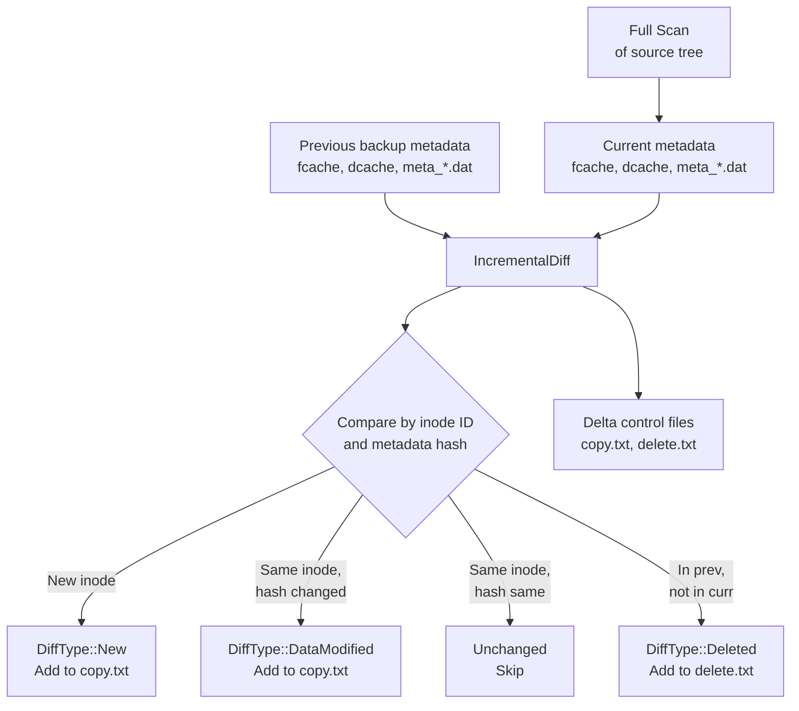
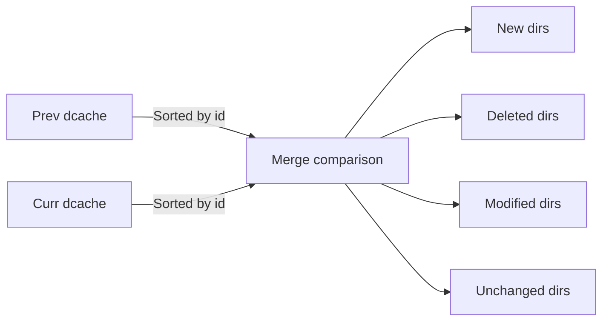
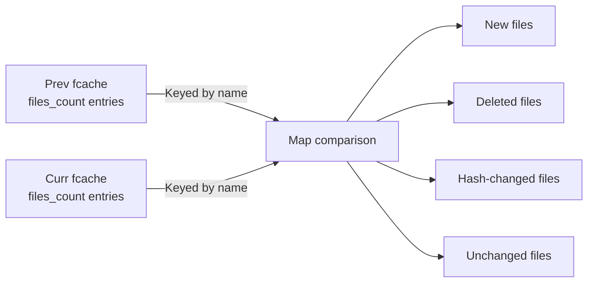

# Incremental Backup

Incremental backup avoids re-copying unchanged files by comparing the current filesystem state against the metadata from a previous backup. The scanner always performs a **full scan** of the source tree -- there is no partial or tree-walk diff. The savings come from the diff stage, which produces a reduced `copy.txt` containing only new, modified, or deleted entries.

## How It Works



## Diff Types

The diff engine (`src/scanner/metadata/diff.rs`) classifies every entry into one of five categories:

```rust
// src/scanner/metadata/diff.rs
#[derive(Debug, Clone, Copy, PartialEq)]
pub enum DiffType {
    New,            // Entry exists in current but not in previous
    DataModified,   // Entry exists in both, content hash differs
    MetaModified,   // Entry exists in both, metadata hash differs but content same
    BothModified,   // Both data and metadata changed
    Deleted,        // Entry exists in previous but not in current
}
```

| DiffType | Meaning | Action |
|---|---|---|
| `New` | Entry exists in current but not in previous backup | Copy to repository |
| `DataModified` | Entry exists in both, but content hash differs | Copy to repository |
| `MetaModified` | Entry exists in both, metadata hash differs but content is same | Copy metadata only |
| `BothModified` | Both data and metadata changed | Copy to repository |
| `Deleted` | Entry exists in previous but not in current | Add to delete.txt |

## Cache Entries -- The Diff Index

The diff engine does not load full `FileMeta` / `DirMeta` for every entry. Instead, it works with compact, fixed-size **cache entries** stored in sorted binary files (`src/scanner/metadata/filecache.rs`):

```rust
// src/scanner/metadata/filecache.rs
#[derive(Default, Debug, Clone, serde::Serialize, serde::Deserialize)]
pub struct FileCacheEntry {
    pub id: u64,                // inode / file index
    pub hash: u32,              // first 4 bytes of SHA-256 of serialized FileMeta
    pub meta_loc: MetaEntryLocator, // (meta_fid, offset) in metadata repo
}

#[derive(Default, Debug, Clone, serde::Serialize, serde::Deserialize)]
pub struct DirCacheEntry {
    pub id: u64,                // inode / file index
    pub hash: u32,              // first 4 bytes of SHA-256 of serialized DirMeta
    pub meta_loc: MetaEntryLocator,
    pub files_count: u32,       // number of files in this directory
    pub fcache_fid: u32,        // which fcache file contains this dir's files
    pub fcache_offset: u32,     // byte offset within that fcache file
}
```

| Entry Type | Size | Key Fields |
|---|---|---|
| `FileCacheEntry` | 20 bytes | `id` (inode), `hash` (32-bit SHA-256 prefix), `meta_loc` |
| `DirCacheEntry` | 32 bytes | `id` (inode), `hash`, `meta_loc`, `files_count`, `fcache_fid`, `fcache_offset` |

Both implement the `FixedSize` trait for direct positional access:

```rust
// src/scanner/metadata/filecache.rs
pub trait FixedSize {
    const SIZE: usize;
}

impl FixedSize for FileCacheEntry { const SIZE: usize = 20; }
impl FixedSize for DirCacheEntry  { const SIZE: usize = 32; }
```

### Hash Computation

Each cache entry's `hash` is computed by serializing the full metadata with `bincode`, hashing with SHA-256, and taking the first 4 bytes:

```rust
// src/scanner/metadata/filecache.rs
impl From<FileMeta> for FileCacheEntry {
    fn from(fmeta: FileMeta) -> Self {
        let bytes = bincode::serialize(&fmeta).expect("Failed to serialize FileMeta");
        let mut hasher = Sha256::new();
        hasher.update(&bytes);
        let result = hasher.finalize();
        let hash = u32::from_le_bytes(result[..4].try_into().unwrap());

        Self {
            id: fmeta.common.id,
            hash,
            meta_loc: (0, 0), // set later when metadata is written
        }
    }
}
```

A hash mismatch is a strong signal that the entry changed. Two entries with the same hash are considered unchanged -- a false positive (hash collision) would only cause a missed update, not data corruption, since the next backup would pick it up.

## The IncrementalDiff Algorithm

The `IncrementalDiff` struct (`src/scanner/metadata/diff.rs`) performs the diff in two passes:

```rust
// src/scanner/metadata/diff.rs
pub struct IncrementalDiff {
    prev_dcache: BTreeMap<u64, DirCacheEntry>,  // inode -> entry
    curr_dcache: BTreeMap<u64, DirCacheEntry>,
    curr_meta_dir: PathBuf,
    prev_meta_dir: Option<PathBuf>,
}
```

### 1. Directory Diff -- Heap-Based Merge

Both the previous and current `dcache` files are loaded into `BTreeMap`s (sorted by inode `id`) and compared using a heap-based merge:

```rust
// src/scanner/metadata/diff.rs
fn heap_diff<T, K: Ord + Copy>(
    left: &[T],
    right: &[T],
    key_fn: impl Fn(&T) -> K,
) -> Vec<DiffItem<T>> {
    let mut result = Vec::new();
    let mut i = 0;
    let mut j = 0;
    while i < left.len() && j < right.len() {
        match key_fn(&left[i]).cmp(&key_fn(&right[j])) {
            Ordering::Less => {       // only in left -> deleted
                result.push(DiffItem::LeftOnly(left[i].clone()));
                i += 1;
            }
            Ordering::Greater => {    // only in right -> new
                result.push(DiffItem::RightOnly(right[j].clone()));
                j += 1;
            }
            Ordering::Equal => {      // in both -> may be modified
                result.push(DiffItem::Both(left[i].clone(), right[j].clone()));
                i += 1;
                j += 1;
            }
        }
    }
    // Remaining items: left = deleted, right = new
    while i < left.len() { result.push(DiffItem::LeftOnly(left[i].clone())); i += 1; }
    while j < right.len() { result.push(DiffItem::RightOnly(right[j].clone())); j += 1; }
    result
}
```



- **New directories**: All files are written to `copy.txt` as `FileDiff::New`
- **Deleted directories**: All files are written to `delete.txt`
- **Modified directories**: Proceed to file-level diff
- **Unchanged directories**: Skipped entirely

### 2. File Diff (per modified directory)

For each modified directory, the file lists are loaded from `fcache` using `DirCacheEntry.fcache_fid` and `fcache_offset` pointers, keyed by file name:

```rust
// src/scanner/metadata/diff.rs -- abbreviated
fn diff_directory_files(&self, prev_dir, curr_dir, dir_path, ...) -> io::Result<DirectoryFileDiff> {
    let prev_files: BTreeMap<String, FileCacheEntry> = self.load_directory_files(prev_dir, true);
    let curr_files: BTreeMap<String, FileCacheEntry> = self.load_directory_files(curr_dir, false);

    let mut diff = DirectoryFileDiff::default();
    for (file_name, prev_entry) in &prev_files {
        match curr_files.get(file_name) {
            Some(curr_entry) if prev_entry.hash != curr_entry.hash => {
                diff.modified_files += 1;
                diff.file_entries.push(FileControlEntry { diff: FileDiff::DataModified, ... });
            }
            None => {
                diff.deleted_files += 1;
                diff.delete_entries.push(DeleteEntry { path: join_logical(dir_path, file_name), ... });
            }
            _ => {} // unchanged
        }
    }
    for (file_name, curr_entry) in &curr_files {
        if !prev_files.contains_key(file_name) {
            diff.new_files += 1;
            diff.file_entries.push(FileControlEntry { diff: FileDiff::New, ... });
        }
    }
    Ok(diff)
}
```



File names are resolved by loading the full `FileMeta` from the metadata repository (via `meta_loc`) to get `common.name`.

## Incremental Control Files

The `generate_control_files()` method produces two delta control files:

```rust
// src/scanner/metadata/diff.rs
pub fn generate_control_files(
    &self,
    copy_file_path: &Path,
    delete_file_path: &Path,
    source_kind: &str,
    source_root: &str,
) -> io::Result<DiffStats> {
    let mut copy_writer = ControlFileWriter::new_with_header(...);
    let mut delete_writer = DeleteControlFileWriter::new_with_source(...);

    for dir_diff in dir_diffs {
        match dir_diff {
            DiffItem::LeftOnly(prev) => {
                // Deleted directory -> delete.txt
                delete_writer.write_entry(&DeleteEntry { path: dmeta.path, ... });
            }
            DiffItem::RightOnly(curr) => {
                // New directory -> copy.txt with all files
                copy_writer.write_dir(&DirControlEntry { diff: DirDiff::New, ... });
                self.write_all_directory_files(curr, &mut copy_writer, ...)?;
            }
            DiffItem::Both(prev, curr) => {
                // Modified directory -> diff files, write changes
                let file_diff = self.diff_directory_files(prev, curr, ...);
                if dir_meta_changed || file_diff.has_changes() {
                    copy_writer.write_dir(&DirControlEntry { diff: DirDiff::MetaModified, ... });
                    for entry in file_diff.file_entries { copy_writer.write_file(&entry)?; }
                    for entry in file_diff.delete_entries { delete_writer.write_entry(&entry)?; }
                }
            }
        }
    }
    copy_writer.finish()?;
    delete_writer.finish()?;
    Ok(stats)
}
```

1. **`copy.txt`** -- Contains `FileControlEntry` records with `diff` set to `New`, `DataModified`, or `MetaModified`
2. **`delete.txt`** -- Contains `DeleteEntry` records for files and directories that no longer exist

These are the same binary format as full backup control files, so the backup pipeline processes them identically -- it does not need to know whether the run is incremental or full.

## DiffStats

```rust
// src/scanner/metadata/diff.rs
pub struct DiffStats {
    pub new_dirs: u64,
    pub modified_dirs: u64,
    pub deleted_dirs: u64,
    pub new_files: u64,
    pub modified_files: u64,
    pub deleted_files: u64,
}
```

## Entry Point

The main entry point for incremental backup is `generate_incremental_control_files()`:

```rust
// src/scanner/metadata/diff.rs
pub fn generate_incremental_control_files(
    prev_meta_dir: Option<&Path>,
    curr_meta_dir: &Path,
    ctrl_dir: &Path,
    source_kind: &str,
    source_root: &str,
) -> io::Result<DiffStats> {
    std::fs::create_dir_all(ctrl_dir)?;
    let copy_file_path = primary_control_file_path(ctrl_dir, "copy");
    let delete_file_path = primary_control_file_path(ctrl_dir, "delete");
    let diff = IncrementalDiff::from_dirs(prev_meta_dir, curr_meta_dir)?;
    diff.generate_control_files(&copy_file_path, &delete_file_path, source_kind, source_root)
}
```

## Limitations

- **Full scan required**: The scanner always walks the entire source tree. Incremental savings come from reduced data transfer, not reduced scan time.
- **Hash-based detection**: Very small metadata-only changes that do not change the `bincode` serialization may not be detected if the hash happens to collide. This is extremely unlikely with SHA-256 truncated to 32 bits.
- **Sorted layout required**: The diff algorithm assumes `fcache` and `dcache` entries are sorted by inode `id`. The scanner ensures this during the write phase.
