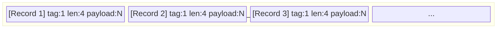
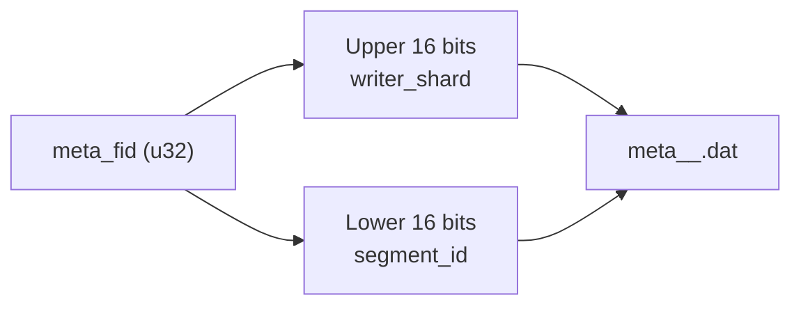
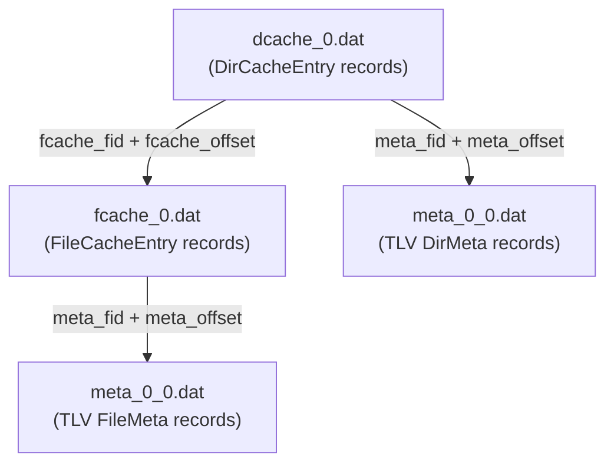

# Metadata Format

The metadata repository (M_REPO) stores full filesystem metadata for every scanned file and directory. Unlike control files (which describe *actions*), metadata files describe *state* -- the complete attributes of each entry at scan time. The format uses **Tag-Length-Value (TLV)** encoding for variable-length records and **fixed-size binary** for cache index entries.

## Core Data Structures

### MetaCommon

Shared metadata for both files and directories (`src/scanner/metadata/filemeta.rs`):

```rust
// src/scanner/metadata/filemeta.rs
#[derive(serde::Deserialize, serde::Serialize, Debug, Clone, Default)]
pub struct MetaCommon {
    pub id: u64,                              // inode (Unix) or file index (Windows)
    pub mode: u32,                            // file type and permission bits
    pub attr: u32,                            // Windows FILE_ATTRIBUTE_* flags
    pub atime: u32,                           // access time (seconds since epoch)
    pub ctime: u32,                           // creation/change time (seconds since epoch)
    pub mtime: u32,                           // modification time (seconds since epoch)
    pub devno: u64,                           // device number (mount boundary detection)
    pub name: String,                         // base name (no parent path)
    pub security_descriptor: Option<String>,  // Windows SDDL string
    pub posix_access_acl: Option<String>,     // POSIX access ACL text
    pub posix_default_acl: Option<String>,    // POSIX default ACL text
    pub symlink_target_path: Option<String>,  // symlink target (if symlink)
    pub xattributes: Option<String>,          // extended attributes
}
```

| Field | Type | Description |
|---|---|---|
| `id` | u64 | Unique ID: inode (Unix) or file index (Windows) |
| `mode` | u32 | File type and permission bits (`mode_t` on Unix) |
| `attr` | u32 | Windows `FILE_ATTRIBUTE_*` flags |
| `atime` | u32 | Access time (seconds since epoch) |
| `ctime` | u32 | Creation/change time (seconds since epoch) |
| `mtime` | u32 | Modification time (seconds since epoch) |
| `devno` | u64 | Device number (for mount boundary detection) |
| `name` | String | Base name (no parent path) |
| `security_descriptor` | Option\<String\> | Windows SDDL string |
| `posix_access_acl` | Option\<String\> | POSIX access ACL text |
| `posix_default_acl` | Option\<String\> | POSIX default ACL text |
| `symlink_target_path` | Option\<String\> | Symlink target (if symlink) |
| `xattributes` | Option\<String\> | Extended attributes |

### FileMeta

Extends `MetaCommon` with file-specific fields (`src/scanner/metadata/filemeta.rs`):

```rust
// src/scanner/metadata/filemeta.rs
#[derive(serde::Deserialize, serde::Serialize, Debug, Clone, Default)]
pub struct FileMeta {
    pub common: MetaCommon,
    pub size: u64,                           // logical file size in bytes
    pub links: u64,                          // hard link count
    pub sparse_range: Option<Vec<(u64, u64)>>, // sparse regions as (offset, length)
}
```

| Field | Type | Description |
|---|---|---|
| `common` | MetaCommon | Shared metadata |
| `size` | u64 | Logical file size in bytes (`stat.st_size`) |
| `links` | u64 | Hard link count |
| `sparse_range` | Option\<Vec\<(u64, u64)\>\> | Sparse regions as (offset, length) pairs |

### DirMeta

Extends `MetaCommon` with directory-specific fields (`src/scanner/metadata/filemeta.rs`):

```rust
// src/scanner/metadata/filemeta.rs
#[derive(serde::Deserialize, serde::Serialize, Debug, Clone, Default)]
pub struct DirMeta {
    pub common: MetaCommon,
    pub path: String,  // full absolute path
}
```

| Field | Type | Description |
|---|---|---|
| `common` | MetaCommon | Shared metadata |
| `path` | String | Full absolute path |

## TLV Metadata Files

Metadata is stored in `.dat` files using a Tag-Length-Value encoding (`src/scanner/metadata/meta_storage.rs`):

```rust
// src/scanner/metadata/meta_storage.rs
const TAG_DIR: u8 = 1;   // DirMeta record
const TAG_FILE: u8 = 2;  // FileMeta record
const MAX_FILE_SIZE: u32 = 2 * 1024 * 1024 * 1024; // 2 GB
```

Each record:



| Field | Size | Description |
|---|---|---|
| Tag | 1 byte | `0x01` = DirMeta, `0x02` = FileMeta |
| Length | 4 bytes | Payload size in bytes (u32 LE) |
| Payload | N bytes | `bincode`-serialized `DirMeta` or `FileMeta` |

### MetaFileWriter

The `MetaFileWriter` (`src/scanner/metadata/meta_storage.rs`) tracks the current byte `offset` after each write. This offset is returned to the caller and stored in cache entries as `meta_offset`, enabling O(1) random access via `MetaRepoReader`.

```rust
// src/scanner/metadata/meta_storage.rs
pub struct MetaFileWriter {
    path: PathBuf,
    fwriter: BufWriter<File>,
    offset: u32,  // current write offset in bytes
}

impl MetaFileWriter {
    pub fn write_dirmeta(&mut self, dir: &DirMeta) -> io::Result<u32> {
        let payload = serialize(dir)?;
        let offset = self.offset;
        self.write_entry(TAG_DIR, &payload)?;
        Ok(offset)
    }

    pub fn write_filemeta(&mut self, file: &FileMeta) -> io::Result<u32> {
        let payload = serialize(file)?;
        let offset = self.offset;
        self.write_entry(TAG_FILE, &payload)?;
        Ok(offset)
    }

    fn write_entry(&mut self, tag: u8, payload: &[u8]) -> io::Result<()> {
        self.fwriter.write_all(&[tag])?;
        self.fwriter.write_all(&(payload.len() as u32).to_le_bytes())?;
        self.fwriter.write_all(payload)?;
        self.offset += (1 + 4 + payload.len()) as u32;
        Ok(())
    }
}
```

### MetaRepoWriter

The `MetaRepoWriter` manages multiple metadata files with automatic rollover (`src/scanner/metadata/meta_storage.rs`):

```rust
// src/scanner/metadata/meta_storage.rs
pub struct MetaRepoWriter {
    base_dir: PathBuf,
    writer_shard: u16,
    max_size: Option<u32>,           // default: MAX_FILE_SIZE (2 GB)
    current_writer: MetaFileWriter,
    current_segment_id: u16,
}

impl MetaRepoWriter {
    pub fn write_dirmeta(&mut self, dirmeta: &DirMeta) -> io::Result<MetaEntryLocator> {
        let needed = 1 + 4 + bincode::serialized_size(dirmeta)? as u32;
        self.check_room(needed)?;  // rollover if needed
        let offset = self.current_writer.write_dirmeta(dirmeta)?;
        Ok((self.current_file_id(), offset))
    }

    fn check_room(&mut self, needed: u32) -> io::Result<()> {
        let max_size = self.max_size.unwrap_or(MAX_FILE_SIZE);
        if self.current_writer.size() + needed > max_size {
            self.current_writer.flush()?;
            self.current_segment_id += 1;
            let new_path = self.current_file_path();
            self.current_writer = MetaFileWriter::open(new_path)?;
        }
        Ok(())
    }
}
```

## MetaFid -- Metadata File Identification

Each metadata file is identified by a 32-bit `meta_fid` (metadata file ID). The fid encodes two pieces of information (`src/scanner/metadata/meta_storage.rs`):

```rust
// src/scanner/metadata/meta_storage.rs
const META_SHARD_BITS: u32 = 16;
const META_SEGMENT_MASK: u32 = (1 << META_SHARD_BITS) - 1;

pub fn encode_meta_file_id(writer_shard: u16, segment_id: u16) -> u32 {
    ((writer_shard as u32) << META_SHARD_BITS) | segment_id as u32
}

pub fn decode_meta_file_id(file_id: u32) -> (u16, u16) {
    ((file_id >> META_SHARD_BITS) as u16, (file_id & META_SEGMENT_MASK) as u16)
}

pub fn meta_file_path(base_dir: &Path, file_id: u32) -> PathBuf {
    let (writer_shard, segment_id) = decode_meta_file_id(file_id);
    base_dir.join(format!("meta_{writer_shard}_{segment_id}.dat"))
}
```



| Component | Bits | Description |
|---|---|---|
| `writer_shard` | 16 (upper) | Writer thread ID (0-65535) |
| `segment_id` | 16 (lower) | Sequential segment within the shard |

Encoding: `meta_fid = (writer_shard << 16) | segment_id`

This design allows multiple writer threads to write to separate files without coordination. Each writer increments its own `segment_id` when a file grows too large.

### MetaEntryLocator

A `MetaEntryLocator` is a `(u32, u32)` tuple of `(meta_fid, offset)` that uniquely identifies a metadata record on disk. Cache entries store locators so the diff engine and backup pipeline can load full metadata on demand.

```rust
// src/scanner/metadata/meta_storage.rs
pub type MetaEntryLocator = (u32, u32);  // (file_id, byte_offset)
```

## MetaRepoReader

The `MetaRepoReader` (`src/scanner/metadata/meta_storage.rs`) provides random access to metadata records by `MetaEntryLocator`. It caches open file handles to avoid repeated `open()` syscalls:

```rust
// src/scanner/metadata/meta_storage.rs
pub struct MetaRepoReader {
    base_dir: PathBuf,
    file_handle_map: RefCell<HashMap<u32, MetaFileReader>>,
}

impl MetaRepoReader {
    pub fn get_fmeta(&self, meta_loc: MetaEntryLocator) -> io::Result<FileMeta> {
        match self.get_meta(meta_loc)? {
            MetaVariant::File(f) => Ok(f),
            _ => Err(io::Error::new(InvalidData, "Locator does not point to a FileMeta")),
        }
    }

    pub fn get_dmeta(&self, meta_loc: MetaEntryLocator) -> io::Result<DirMeta> {
        match self.get_meta(meta_loc)? {
            MetaVariant::Dir(d) => Ok(d),
            _ => Err(io::Error::new(InvalidData, "Locator does not point to a DirMeta")),
        }
    }

    fn get_meta(&self, meta_loc: MetaEntryLocator) -> io::Result<MetaVariant> {
        let (file_id, offset) = meta_loc;
        let mut cache = self.file_handle_map.borrow_mut();
        let reader = cache.entry(file_id).or_insert_with(|| {
            let path = meta_file_path(&self.base_dir, file_id);
            MetaFileReader::new(path).expect("Failed to open metadata file")
        });
        reader.get_meta(offset)
    }
}
```

The `MetaFileReader` reads TLV records at arbitrary offsets:

```rust
// src/scanner/metadata/meta_storage.rs
impl MetaFileReader {
    pub fn get_meta(&mut self, offset: u32) -> io::Result<MetaVariant> {
        self.file.seek(SeekFrom::Start(offset as u64))?;
        let mut tag = [0u8; 1];
        self.file.read_exact(&mut tag)?;
        let mut len_bytes = [0u8; 4];
        self.file.read_exact(&mut len_bytes)?;
        let payload_len = u32::from_le_bytes(len_bytes) as usize;
        let mut payload = vec![0u8; payload_len];
        self.file.read_exact(&mut payload)?;

        match tag[0] {
            TAG_DIR => Ok(MetaVariant::Dir(deserialize(&payload)?)),
            TAG_FILE => Ok(MetaVariant::File(deserialize(&payload)?)),
            _ => Err(io::Error::new(InvalidData, format!("Invalid tag {}", tag[0]))),
        }
    }
}
```

## Cache Index Files

For incremental diff performance, the scanner also writes compact **cache index** files alongside the full metadata.

### File Cache (`fcache_<fid>.dat`)

Contains `FileCacheEntry` records, sorted by `id` (inode):

```rust
// src/scanner/metadata/filecache.rs
#[derive(Default, Debug, Clone, serde::Serialize, serde::Deserialize)]
pub struct FileCacheEntry {
    pub id: u64,                       // inode / file index
    pub hash: u32,                     // first 4 bytes of SHA-256 of serialized FileMeta
    pub meta_loc: MetaEntryLocator,    // (meta_fid, meta_offset)
}
```

| Field | Size | Description |
|---|---|---|
| `id` | 8 bytes | Inode / file index (u64) |
| `hash` | 4 bytes | First 4 bytes of SHA-256 of serialized FileMeta |
| `meta_fid` | 4 bytes | Metadata file ID |
| `meta_offset` | 4 bytes | Byte offset in metadata file |

Total: **20 bytes** per entry (`FixedSize::SIZE = 20`). Entries are stored sequentially with no padding.

### Directory Cache (`dcache_<fid>.dat`)

Contains `DirCacheEntry` records, sorted by `id`:

```rust
// src/scanner/metadata/filecache.rs
#[derive(Default, Debug, Clone, serde::Serialize, serde::Deserialize)]
pub struct DirCacheEntry {
    pub id: u64,            // inode / file index
    pub hash: u32,          // first 4 bytes of SHA-256 of serialized DirMeta
    pub meta_loc: MetaEntryLocator,
    pub files_count: u32,   // number of files in this directory
    pub fcache_fid: u32,    // fcache file containing this dir's files
    pub fcache_offset: u32, // byte offset within that fcache file
}
```

| Field | Size | Description |
|---|---|---|
| `id` | 8 bytes | Inode / file index (u64) |
| `hash` | 4 bytes | First 4 bytes of SHA-256 of serialized DirMeta |
| `meta_fid` | 4 bytes | Metadata file ID |
| `meta_offset` | 4 bytes | Byte offset in metadata file |
| `files_count` | 4 bytes | Number of files in this directory |
| `fcache_fid` | 4 bytes | File ID of the fcache file containing this directory's files |
| `fcache_offset` | 4 bytes | Byte offset within the fcache file |

Total: **32 bytes** per entry (`FixedSize::SIZE = 32`).



The `DirCacheEntry` acts as an index into the file cache: its `fcache_fid` and `fcache_offset` fields point to the first `FileCacheEntry` for that directory, and `files_count` tells how many consecutive entries to read.

## Repository Layout

A typical M_REPO directory:

```
meta/
  meta_0_0.dat          <-- TLV metadata (writer shard 0, segment 0)
  meta_0_1.dat          <-- TLV metadata (writer shard 0, segment 1)
  meta_1_0.dat          <-- TLV metadata (writer shard 1, segment 0)
  fcache_0.dat          <-- File cache entries (writer shard 0)
  fcache_1.dat          <-- File cache entries (writer shard 1)
  dcache_0.dat          <-- Directory cache entries (writer shard 0)
  dcache_1.dat          <-- Directory cache entries (writer shard 1)
```

## Serialisation

All metadata structures use `bincode` for binary serialisation. Cache entries also use `bincode` but are fixed-size (`FixedSize` trait) to enable direct positional access without deserialising the entire file. The hash field in cache entries is computed as `SHA-256(bincode::serialize(meta))[0..4]` -- the first 4 bytes of the SHA-256 digest.
