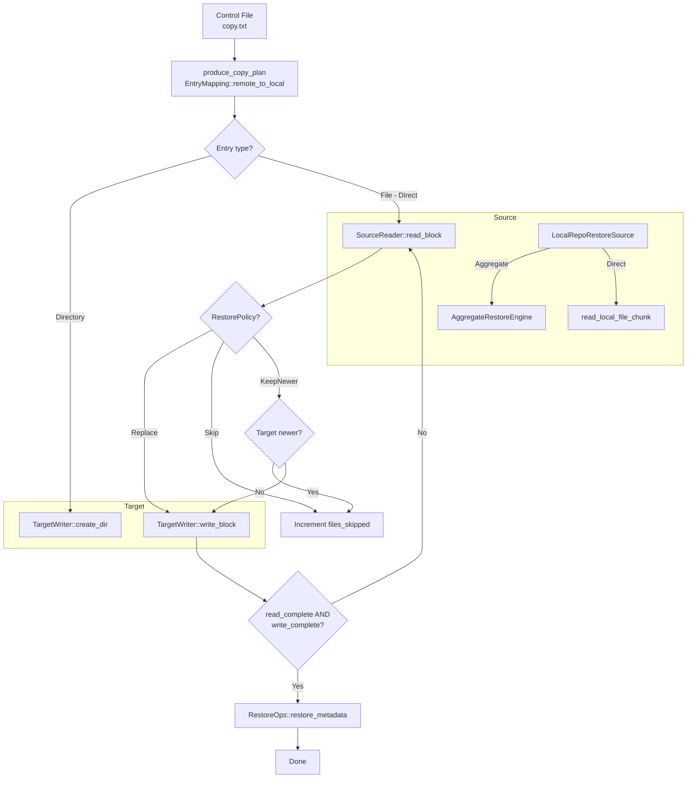

# Restore Pipeline

The restore pipeline reads data from the backup repository (D_REPO) and writes it to a target location -- local directory, NFS share, or SMB share. Unlike backup, restore always reads from the repository and writes to the destination, using the same control files and metadata that were produced during the scan.

## High-Level Flow



## RestoreOption

The restore pipeline is configured via `RestoreOption` (`src/backup.rs`):

```rust
// src/backup.rs
pub struct RestoreOption {
    pub source_dir_base: PathBuf,       // backup repository location
    pub original_source_base: PathBuf,  // original source path from manifest
    pub target: DataLocation,           // restore destination (local/NFS/SMB)
    pub target_dir_base: PathBuf,       // derived from target
    pub meta_dir: PathBuf,              // metadata directory
    pub ctrl_dir: PathBuf,              // control file directory
    pub control_file: PathBuf,          // specific control file for this task
    pub policy: RestorePolicy,          // how to handle existing files
    pub aggregate_config: AggregateConfig,
    pub worker_count: usize,            // default: 8
    pub restore_hardlinks: bool,        // default: false
    pub restore_mtime: bool,            // default: true
}
```

Builder example:

```rust
let option = RestoreOption::new(source_dir, original_source, target, meta_dir, ctrl_dir, control_file)
    .policy(RestorePolicy::KeepNewer)
    .worker_count(16)
    .restore_hardlinks(true)
    .restore_mtime(true)
    .aggregate_config(AggregateConfig::enabled().layout(AggregateLayout::Shard));
```

## RestorePolicy

When the restore target is a local directory, `RestorePolicy` (`src/backup.rs`) controls how existing files are handled:

```rust
// src/backup.rs
#[derive(Debug, Clone, Copy, PartialEq)]
pub enum RestorePolicy {
    Replace,    // Always overwrite (default)
    Skip,       // Skip if target exists
    KeepNewer,  // Only restore if backup version is newer
}

impl RestorePolicy {
    pub fn should_restore(
        &self,
        source_mtime: Option<SystemTime>,
        target_exists: bool,
        target_mtime: Option<SystemTime>,
    ) -> bool {
        match self {
            RestorePolicy::Replace => true,
            RestorePolicy::Skip => !target_exists,
            RestorePolicy::KeepNewer => {
                if !target_exists { return true; }
                match (source_mtime, target_mtime) {
                    (Some(src), Some(tgt)) => src > tgt,
                    (Some(_), None) => true,
                    (None, Some(_)) => false,
                    (None, None) => true,
                }
            }
        }
    }
}
```

The policy is enforced by `should_skip_restore()` (`src/backup/restore_pipeline.rs`), which compares the source mtime (from `FileMeta`) with the target file's modification time via `std::fs::metadata`. For non-local targets, `Replace` semantics are always used and a warning is logged if a different policy was requested.

## RestoreSource

The `LocalRepoRestoreSource` (`src/backup/restore_pipeline.rs`) implements the `SourceReader` trait and handles two cases:

1. **Aggregated files** -- Queries the aggregate index (binary or SQLite depending on layout), reads the file's data from the correct blob at the recorded offset and size
2. **Regular files** -- Reads the file directly from the D_REPO path

```rust
// src/backup/restore_pipeline.rs
pub struct LocalRepoRestoreSource {
    pub d_repo_base: PathBuf,
    layout: AggregateLayout,
    aggregate: Arc<AggregateRestoreEngine>,
    index_cache: Arc<Mutex<HashMap<PathBuf, Arc<AggregateIndex>>>>,
}
```

The index lookup is layout-aware:

| Layout | Index Location | Index Type |
|---|---|---|
| `DirLevel` | `<dir>/.AGGR_DIR/index.db` | SQLite |
| `Shard` | `.AGGR/index.bin` | Binary (`AggregateIndex`) |

An internal `index_cache` avoids re-opening index files for every file lookup.

The `read_block()` implementation dispatches based on layout:

```rust
// src/backup/restore_pipeline.rs -- abbreviated
impl SourceReader for LocalRepoRestoreSource {
    fn read_block(&self, mut block: CopyBlock) -> BoxFuture<'static, Result<CopyBlock, ...>> {
        Box::pin(async move {
            let aggregate_info = match this.layout {
                AggregateLayout::Shard => {
                    let index_path = this.d_repo_base.join(AGGREGATE_ROOT_DIR).join(BINARY_INDEX_FILE_NAME);
                    this.get_or_open_index(&index_path)?.query_file(&rel_path_string)
                }
                AggregateLayout::DirLevel => {
                    // Query per-directory SQLite index
                    read_dir_index(&index_path, file_name, &blob_dir)
                }
            };

            let data = match aggregate_info {
                Ok(Some(info)) => this.aggregate.read_from_blob(&info.blob_path, info.offset, info.size),
                Ok(None) => {
                    // Regular file: read directly from D_REPO
                    let full_path = this.d_repo_base.join(&rel_path);
                    read_local_file_chunk(&full_path, offset, expected_size, buffer_size)
                }
                Err(e) => Err(format!("lookup aggregated: {e}")),
            };

            block.src_offset += buf.len() as u64;
            block.is_last = block.src_offset >= block.file_size;
            block.data = buf;
            Ok(block)
        })
    }
}
```

## Concurrency Model

The restore pipeline uses a semaphore-bounded concurrent task model (`src/backup/restore_pipeline.rs`):

```rust
// src/backup/restore_pipeline.rs -- abbreviated
pub async fn run_restore_copy_pipeline<T: TargetWriter, R: RestoreOps>(
    control_file: PathBuf,
    meta_dir: PathBuf,
    source: LocalRepoRestoreSource,
    target: T,
    restore_ops: R,
    policy: RestorePolicy,
    stats: Arc<Mutex<RestoreStats>>,
    max_concurrent_tasks: usize,
) {
    let task_sem = Arc::new(Semaphore::new(max_concurrent_tasks.max(1)));
    let (entry_tx, mut entry_rx) = mpsc::channel::<CopyPlanEntry>(256);

    // Producer: reads control file, sends entries via channel
    tokio::task::spawn_blocking(move || {
        produce_copy_plan(control_file, meta_dir, mapping, ...,
            |entry| entry_tx.blocking_send(entry).is_ok(),
        );
    });

    // Consumers: process entries concurrently
    while let Some(item) = entry_rx.recv().await {
        match item {
            CopyPlanEntry::Directory { dst_path, .. } => {
                let _permit = task_sem.acquire_owned().await.unwrap();
                target.create_dir(path).await;
            }
            CopyPlanEntry::File(FileCopyPlan::Direct { meta, src_path, dst_path }) => {
                let _permit = task_sem.acquire_owned().await.unwrap();
                // Check policy
                if should_skip_restore(&meta, &dst_path, ...).await {
                    stats.lock().unwrap().files_skipped += 1;
                    return;
                }
                // Read-write loop
                loop {
                    block = source.read_block(block).await?;
                    block = target.write_block(block).await?;
                    if block.read_complete() && block.write_complete() {
                        restore_ops.restore_metadata(&path, &block.meta.common);
                        break;
                    }
                    block.clear_data();
                }
            }
            CopyPlanEntry::File(FileCopyPlan::Aggregate { .. }) => {
                // Should not happen during restore
            }
        }
    }

    source.finish().await;
    target.finish().await;
}
```

## Symlink Handling

During restore, symlinks are detected via `meta.common.symlink_target_path`. When present, the pipeline calls `restore_ops.create_symlink()` instead of copying file content, then restores metadata on the link itself.

## RestoreStats

```rust
// src/backup.rs
#[derive(Debug, Default, Clone)]
pub struct RestoreStats {
    pub files_restored: u64,
    pub bytes_restored: u64,
    pub files_skipped: u64,   // skipped due to RestorePolicy
    pub bytes_skipped: u64,
    pub files_failed: u64,
    pub dirs_created: u64,
}
```

## Error Handling

Failed files increment `files_failed` in the `RestoreStats`. The pipeline continues processing remaining entries even when individual files fail. Errors are logged with the logical path and error detail.

The restore task is dispatched by `run_restore_task()` (`src/backup.rs`) which classifies the control file name and routes to the appropriate phase:

```rust
// src/backup.rs -- abbreviated
fn run_restore_task(option: RestoreOption, stats: Arc<Mutex<RestoreStats>>) -> Result<(), RestoreError> {
    let control_name = option.control_file.file_name()...;
    match classify_control_file_name(&control_name) {
        Some("hardlink") => run_restore_hardlink_phase(&option),
        Some("delete") => run_restore_delete_phase(&option),
        Some("mtime") => run_restore_mtime_phase(&option),
        _ => run_restore_copy_phase(&option, stats),  // copy.txt
    }
}
```

Each phase dispatches to the appropriate transport (local, NFS, SMB) based on the target `DataLocation`.
