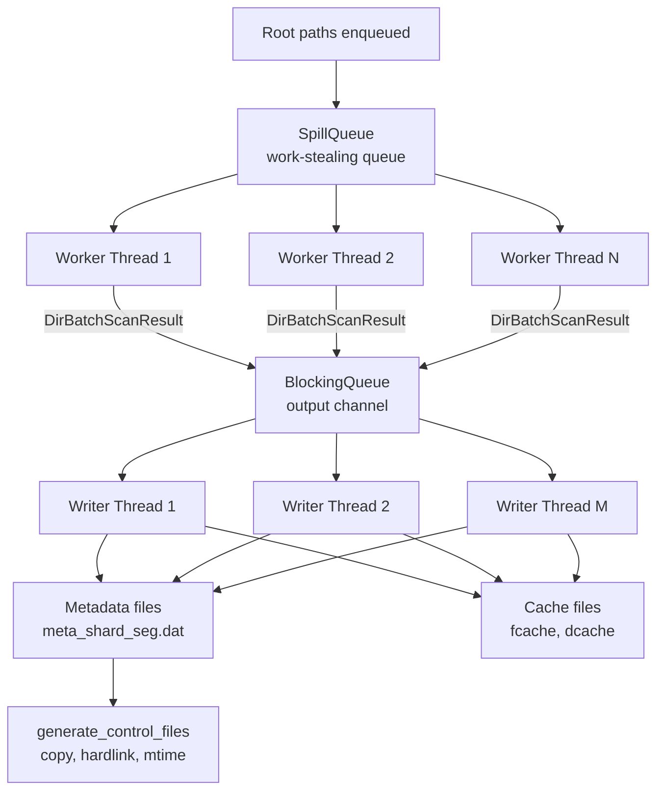
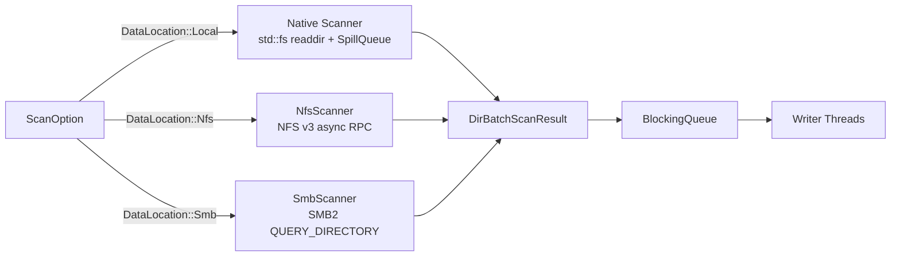

# Scan Engine

The scanner is the first stage of every backup operation. It walks a source directory tree -- local, NFS, or SMB -- collects file and directory metadata, detects hardlinks, and writes binary **control files** and **metadata** to the repository. The design prioritises throughput on trees with millions of entries through parallel traversal, spill-to-disk work queues, and sharded writer threads.

## High-Level Flow



## Key Components

### SpillQueue -- Work-Stealing Directory Queue

The `SpillQueue<T>` (`src/utility/spill_queue.rs`) is a thread-safe FIFO queue that transparently spills overflow entries to disk when the in-memory buffer exceeds a configurable upper bound. This prevents unbounded memory growth when scanning trees that contain millions of directories.

```rust
// src/utility/spill_queue.rs
pub struct SpillQueue<T> {
    inner: Arc<Mutex<SpillQueueInner<T>>>,
}

struct SpillQueueInner<T> {
    memory_queue: VecDeque<T>,       // front = oldest, back = newest
    unspilled_count: usize,          // items added since last spill
    cache_dir: PathBuf,              // directory for .qcache.bin files
    in_disk_batch_count: usize,      // batches currently on disk
    front_cache_id: u64,             // oldest cache file ID
    next_cache_id: u64,              // next cache file ID
    memory_upper_bound: usize,       // spill threshold
    memory_lower_bound: usize,       // reload threshold
    spill_load_batch_size: usize,    // items per disk batch
    item_count: usize,               // total items (memory + disk)
}
```

| Parameter | Purpose |
|---|---|
| `memory_upper_bound` | Maximum items kept in the in-memory `VecDeque` before spilling |
| `memory_lower_bound` | Target size after a spill-then-reload cycle (must be less than upper) |
| `spill_load_batch_size` | Number of items reloaded per disk read |
| `cache_dir` | Temporary directory for `.qcache.bin` spill files |

The queue guarantees FIFO ordering across memory and disk segments. Worker threads push discovered sub-directories into the `SpillQueue` and pop entries to process, achieving natural work-stealing without explicit steal logic.

```rust
// src/utility/spill_queue.rs -- push triggers spill when memory overflows
pub fn push(&self, item: T) -> Result<(), SpillQueueError> {
    let mut inner = self.inner.lock().unwrap();
    inner.memory_queue.push_back(item);
    inner.item_count += 1;
    if inner.in_disk_batch_count > 0 {
        inner.unspilled_count += 1;
    }
    if inner.memory_queue.len() > inner.memory_upper_bound {
        inner.spill_to_disk()?;
    }
    Ok(())
}

// src/utility/spill_queue.rs -- pop triggers reload when memory drops low
pub fn pop(&self) -> Result<Option<T>, SpillQueueError> {
    let mut inner = self.inner.lock().unwrap();
    if inner.item_count == 0 {
        return Ok(None);
    }
    if inner.memory_queue.is_empty() && inner.in_disk_batch_count > 0 {
        inner.load_from_disk()?;
    }
    let item = inner.memory_queue.pop_front();
    inner.item_count -= 1;
    if inner.memory_queue.len() < inner.memory_lower_bound
        && inner.in_disk_batch_count > 0
    {
        inner.load_from_disk()?;
    }
    Ok(item)
}
```

Configuration is set via `QueueOption` (`src/scanner/options.rs`):

```rust
// src/scanner/options.rs
pub struct QueueOption {
    pub temp_dir: PathBuf,
    pub memory_upper_bound: usize,    // default: 100,000
    pub memory_lower_bound: usize,    // default: 50,000
    pub spill_load_batch_size: usize, // default: 20,000
}
```

### DirBatchScanResult

Each worker thread scans one directory at a time and produces a `DirBatchScanResult` (`src/scanner/models.rs`):

```rust
// src/scanner/models.rs
#[derive(Deserialize, Serialize, Debug, Clone, Default)]
pub struct DirBatchScanResult {
    pub dir: DirMeta,           // metadata of the scanned directory
    pub files: Vec<FileMeta>,   // file entries found in this batch
    pub partial: bool,          // true if scan was interrupted (incomplete)
    pub complete: bool,         // true if this is the final batch for the directory
}
```

The `DirScanEntry` struct tracks pending directories in the work queue:

```rust
// src/scanner/models.rs
#[derive(Deserialize, Serialize, Debug, Clone)]
pub struct DirScanEntry {
    pub path: PathBuf,  // absolute path of the directory to scan
    pub depth: usize,   // current recursion depth (root = 0)
}
```

### ScanStatistics

All counters use `AtomicU64` for lock-free concurrent updates from multiple worker and writer threads (`src/scanner/models.rs`):

```rust
// src/scanner/models.rs
pub struct ScanStatistics {
    tot_size: AtomicU64,      // total logical size of all scanned files
    tot_files: AtomicU64,     // total files scanned
    tot_dirs: AtomicU64,      // total directories scanned
    failed_files: AtomicU64,  // files that failed to stat
    failed_dirs: AtomicU64,   // directories that failed to open/stat
}
```

### Writer Threads

Writer threads are started by `start_meta_writers()` (`src/scanner/engine.rs`). Each writer thread owns its own `MetaRepoWriter`, `DirCacheWriter`, and `FileCacheWriter`, identified by a `writer_shard` ID:

```rust
// src/scanner/engine.rs
let handle = std::thread::spawn(move || {
    let writer_shard = i as u32;
    let mut meta_writer = MetaRepoWriter::new(meta_dir, writer_shard as u16)
        .expect("failed to create meta writer");
    let mut dcache_writer = DirCacheWriter::new(dcache_dir, writer_shard)
        .expect("failed to create dir cache writer");
    let mut fcache_writer = FileCacheWriter::new(fcache_dir, writer_shard)
        .expect("failed to create file cache writer");

    loop {
        if let Some(dir_scan_result) = output_queue.pop() {
            process_scan_result(
                dir_scan_result,
                &mut meta_writer,
                &mut dcache_writer,
                &mut fcache_writer,
                writer_shard,
                hardlink_index.as_ref(),
                scan_hardlinks,
            );
        } else {
            break; // queue closed, exit
        }
    }
});
```

The `process_scan_result` function (`src/scanner/engine.rs`) writes each batch:

1. Writes `DirMeta` to the metadata repository, getting back a `MetaEntryLocator`
2. For each file: writes `FileMeta`, tracks hardlinks if `links > 1`, builds `FileCacheEntry`
3. Sorts file cache entries by inode `id` for efficient diff later
4. Writes sorted `FileCacheEntry` records and a `DirCacheEntry` with pointers to the fcache range

```rust
// src/scanner/engine.rs -- abbreviated
fn process_scan_result(
    dir_scan_result: DirBatchScanResult,
    meta_writer: &mut MetaRepoWriter,
    dcache_writer: &mut DirCacheWriter,
    fcache_writer: &mut FileCacheWriter,
    writer_shard: u32,
    hardlink_index: Option<&Arc<Mutex<HardlinkIndex>>>,
    scan_hardlinks: bool,
) {
    let dmeta_loc = meta_writer.write_dirmeta(&dir_scan_result.dir).unwrap();
    let (_, fcache_offset) = fcache_writer.current();
    let fcache_fid = writer_shard;

    let mut sorted_fcaches = vec![];
    for fmeta in dir_scan_result.files {
        let fmeta_loc = meta_writer.write_filemeta(&fmeta).unwrap();
        // Track hardlinks if enabled and link count > 1
        if scan_hardlinks && fmeta.links > 1 {
            if let Some(index) = hardlink_index {
                if let Ok(mut idx) = index.lock() {
                    let full_path = join_logical(&dir_scan_result.dir.path, &fmeta.common.name);
                    idx.add_file(fmeta.common.id, fmeta.common.devno,
                                 fmeta.links as u32, fmeta_loc.0, fmeta_loc.1, full_path);
                }
            }
        }
        let mut fcache: FileCacheEntry = fmeta.into();
        fcache.meta_loc = fmeta_loc;
        sorted_fcaches.push(fcache);
    }
    sorted_fcaches.sort_by_key(|v| v.id);
    for fcache in sorted_fcaches {
        fcache_writer.write(&fcache).unwrap();
    }

    let mut dcache: DirCacheEntry = dir_scan_result.dir.into();
    dcache.meta_loc = dmeta_loc;
    dcache.files_count = files_count as u32;
    (dcache.fcache_fid, dcache.fcache_offset) = (fcache_fid, fcache_offset);
    dcache_writer.write(&dcache).unwrap();
}
```

Multiple writer threads operate in parallel because metadata files are sharded by `writer_shard` (encoded in the upper 16 bits of the `meta_file_id`).

### Control File Generation

After all writer threads finish, `generate_control_files()` (`src/scanner/engine.rs`) reads back the cache files and produces control files:

- **Full backup**: Iterates all `dcache` files, writes every directory and file to `copy.txt` with `DirDiff::New` / `FileDiff::New`
- **Incremental backup**: Calls `generate_incremental_control_files()` which diffs previous and current metadata, producing delta `copy.txt` and `delete.txt`

A `mtime.txt` control file is always generated with directory timestamps for the mtime restore phase.

### Async Scanner (NFS/SMB)

For remote transports, `run_aio_scan()` (`src/scanner/engine/aio.rs`) provides the shared scaffolding:

```rust
// src/scanner/engine/aio.rs -- abbreviated
pub async fn run_aio_scan<S: AsyncDirScanner>(
    scanner: S,
    scan_option: ScanOption,
) -> Result<AioScanResult, String> {
    let output_queue = Arc::new(BlockingQueue::<DirBatchScanResult>::new(...));
    let context = ScanWorkerContext { output_queue: ..., stats: ..., ... };

    // Start metadata writers (drain output_queue synchronously)
    let writer_handles = start_meta_writers(&context, writer_count, None);

    // Spawn async scanner, bridge tokio mpsc -> BlockingQueue
    let (tx, mut rx) = tokio::sync::mpsc::channel::<DirBatchScanResult>(256);
    tokio::spawn(async move { scanner.scan(scan_option, tx).await });

    while let Some(batch) = rx.recv().await {
        output_queue.push(batch);
    }

    output_queue.close();
    for h in writer_handles { h.join(); }
    engine::generate_control_files(&scan_option)?;
}
```

### Scanner Path Filters

Before descending into a directory or emitting a file, the scanner consults `ScanPathFilterSet` which supports four filter dimensions:

| Filter | Method | Behaviour |
|---|---|---|
| Include dir patterns | `should_descend_dir()` | Only descend directories matching a glob |
| Include file patterns | `should_emit_file()` | Only emit files matching a glob |
| Exclude dir patterns | `should_descend_dir()` | Skip directories matching a glob |
| Exclude file patterns | `should_emit_file()` | Skip files matching a glob |

Patterns are compiled once at scan start. Exclusion takes precedence over inclusion for the same path.

## Transport-Specific Scanners

The scanner adapts to different source transports through a common `AsyncDirScanner` trait (`src/scanner/engine/aio.rs`):



```rust
// src/scanner/engine/aio.rs
pub trait AsyncDirScanner: Send + 'static {
    type Error: std::fmt::Display + Send + 'static;
    fn scan(
        self,
        scan_option: Arc<ScanOption>,
        tx: tokio::sync::mpsc::Sender<DirBatchScanResult>,
    ) -> Pin<Box<dyn Future<Output = Result<(), Self::Error>> + Send>>;
}
```

All transport scanners emit the same `DirBatchScanResult` batches, so the writer pipeline is fully transport-agnostic.

## Configuration

The scanner is configured via `ScanOption` (`src/scanner/options.rs`):

```rust
// src/scanner/options.rs
pub struct ScanOption {
    pub max_depth: Option<usize>,       // None = unlimited
    pub worker_count: usize,            // default: 8
    pub writer_count: usize,            // default: 4
    pub target_dir: TargetDirOption,    // ctrl_dir, meta_dir, prev_meta_dir
    pub meta_option: MetaScanOption,    // ACLs, xattrs, hardlinks, symlinks, filters
    pub queue_option: QueueOption,      // spill queue thresholds
    pub shard_option: ShardOption,      // control file sharding
    pub control_path: ControlPathOption,// source_kind, source_root, physical_base
    pub stats_only: bool,               // skip disk output
    pub failure_log: Option<FailureLogConfig>,
    pub retry_policy: RetryPolicy,
}
```

| Option | Default | Description |
|---|---|---|
| `worker_count` | 8 | Parallel traversal threads |
| `writer_count` | 4 | Parallel metadata writer threads |
| `max_depth` | Unlimited | Maximum directory depth to traverse |
| `stats_only` | false | Collect stats only, skip disk output |
| `retry_policy` | 3 retries, 1s delay | Retry with exponential backoff and jitter |
| `queue_option.memory_upper_bound` | 100,000 | Spill queue upper threshold |
| `queue_option.memory_lower_bound` | 50,000 | Spill queue lower threshold |
| `shard_option.enabled` | false | Enable sharded control files |
| `shard_option.num_shards` | 16 | Number of control file shards |

## Lifecycle

The scanner follows a `TaskLifecycle` pattern: `start()` spawns background threads and returns a `RunningScan` handle, `is_complete()` polls for termination, and `get_stats()` returns a `ScanStatsSnapshot` with counts of files, directories, bytes, and failures.
