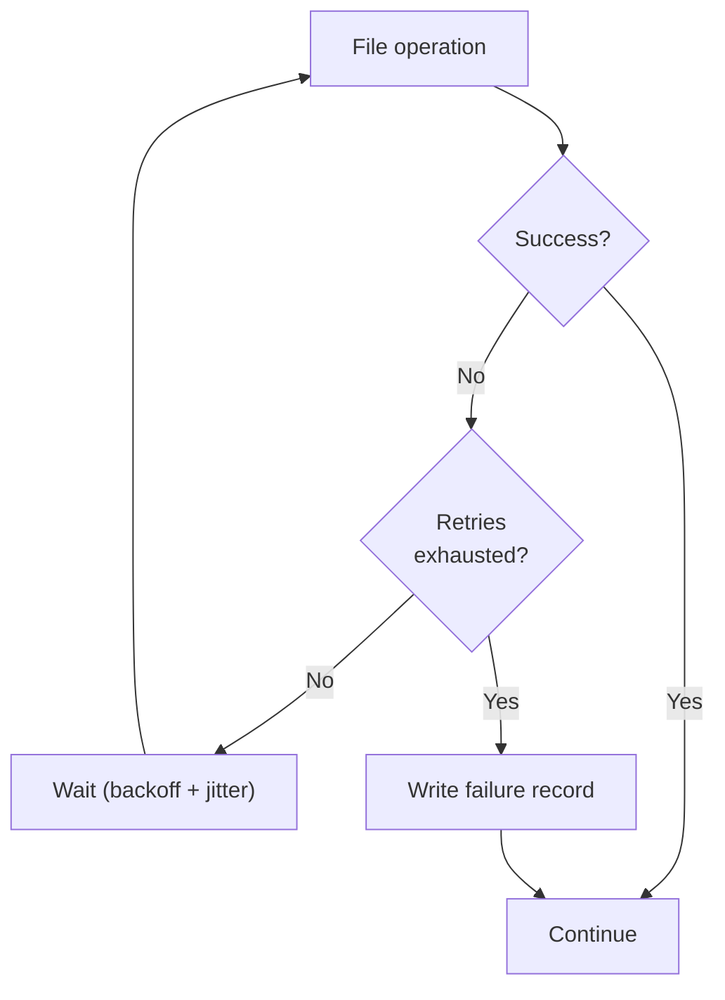
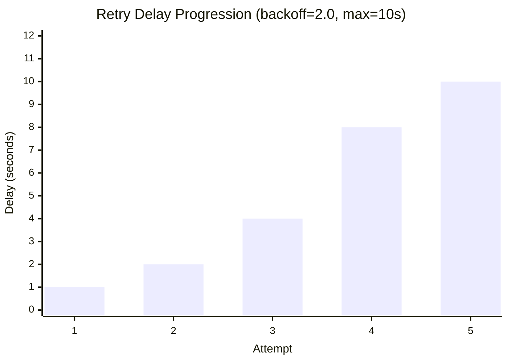

# Failure Handling

fpt-rs provides structured failure logging and configurable retry policies to handle transient I/O errors gracefully. This guide covers the failure log format, retry policy options, and how to use them effectively.

## Overview

When a file operation fails (copy, scan, NFS RPC, SMB read), fpt-rs follows this sequence:

1. **Retry** -- the operation is retried according to the configured retry policy (exponential backoff with optional jitter).
2. **Record** -- if all retries are exhausted, a structured failure record is written to the failure log.
3. **Continue** -- the backup/scan continues processing remaining files. The overall job completes with a non-zero exit code if any failures were recorded.

### Core Data Structures (from `src/failure.rs`)

The `FailureRecord` struct at `src/failure.rs:245` captures what went wrong:

```rust
// src/failure.rs
#[derive(Debug, Clone, Serialize)]
pub struct FailureRecord {
    pub time: String,           // UTC timestamp (RFC 3339)
    pub phase: String,          // "scan", "copy", "hardlink", "delete", "mtime"
    pub operation: String,      // "read", "write", "readdir", "stat", etc.
    pub item_type: FailureItemType, // File, Directory, Symlink, Special, Block, Unknown
    pub path: String,           // logical path of the failed item
    pub code: String,           // classified error code (EACCES, EIO, etc.)
    pub detail: String,         // full OS/runtime error message
    pub attempts: u32,          // total attempts (1 initial + retries)
}
```

The `FailureItemType` enum at `src/failure.rs:219`:

```rust
// src/failure.rs
#[derive(Debug, Clone, Copy, Serialize)]
#[serde(rename_all = "snake_case")]
pub enum FailureItemType {
    File,
    Directory,
    Symlink,
    Special,
    Block,
    Unknown,
}
```

The `FailureRecorder` at `src/failure.rs:318` is a thread-safe writer that
appends records to the failure log file:

```rust
// src/failure.rs
#[derive(Clone)]
pub struct FailureRecorder {
    inner: Arc<Mutex<FailureRecorderInner>>,
}

impl FailureRecorder {
    /// Open a failure log file and write the header (for CSV) or prepare for JSON lines.
    pub fn create(config: &FailureLogConfig) -> io::Result<Self> { /* ... */ }

    /// Append one failure record to the log.
    pub fn record(&self, record: FailureRecord) {
        if let Ok(mut inner) = self.inner.lock() {
            if let Err(e) = inner.write_record(&record) {
                log::warn!("Failed to write failure record: {e}");
            }
        }
    }
}
```

The `FailureLogConfig` at `src/failure.rs:42` configures the output:

```rust
// src/failure.rs
#[derive(Debug, Clone)]
pub struct FailureLogConfig {
    pub path: PathBuf,              // output file path
    pub format: FailureLogFormat,   // Csv, Json, or Xml
}
```

### Record Construction Helpers

`FailureRecord` provides convenience constructors at `src/failure.rs:256`:

```rust
// src/failure.rs
impl FailureRecord {
    /// From an io::Error (auto-classifies the error code)
    pub fn from_io_error(
        phase: impl Into<String>,
        operation: impl Into<String>,
        item_type: FailureItemType,
        path: impl Into<String>,
        err: &io::Error,
        attempts: u32,
    ) -> Self { /* ... */ }

    /// From a detail string (classifies from text patterns)
    pub fn from_detail(
        phase: impl Into<String>,
        operation: impl Into<String>,
        item_type: FailureItemType,
        path: impl Into<String>,
        detail: impl Into<String>,
        attempts: u32,
    ) -> Self { /* ... */ }
}
```



## Failure Log Format

Failure logs contain one record per failed file/directory/symlink. Three output formats are supported:

### CSV

```csv
time,phase,operation,item_type,path,code,detail,attempts
2026-06-07T14:30:05Z,copy,read,file,/data/projects/alpha.txt,EIO,Input/output error (os error 5),4
2026-06-07T14:30:12Z,scan,readdir,directory,/data/media/photos,ETIMEDOUT,Connection timed out,4
```

### JSON (JSON Lines inside array)

```json
[
  {
    "time": "2026-06-07T14:30:05Z",
    "phase": "copy",
    "operation": "read",
    "item_type": "file",
    "path": "/data/projects/alpha.txt",
    "code": "EIO",
    "detail": "Input/output error (os error 5)",
    "attempts": 4
  },
  {
    "time": "2026-06-07T14:30:12Z",
    "phase": "scan",
    "operation": "readdir",
    "item_type": "directory",
    "path": "/data/media/photos",
    "code": "ETIMEDOUT",
    "detail": "Connection timed out",
    "attempts": 4
  }
]
```

### XML

```xml
<failures>
  <failure><time>2026-06-07T14:30:05Z</time><phase>copy</phase><operation>read</operation><item_type>file</item_type><path>/data/projects/alpha.txt</path><code>EIO</code><detail>Input/output error (os error 5)</detail><attempts>4</attempts></failure>
</failures>
```

### Record Fields

| Field | Description |
|---|---|
| `time` | UTC timestamp in RFC 3339 format |
| `phase` | Operation phase: `scan`, `copy`, `hardlink`, `delete`, `mtime` |
| `operation` | Specific operation: `read`, `write`, `readdir`, `stat`, `unlink`, `utime`, `link` |
| `item_type` | Object type: `file`, `directory`, `symlink`, `special`, `block`, `unknown` |
| `path` | Logical path of the failed item |
| `code` | Classified error code (see below) |
| `detail` | Full error message from the OS/runtime |
| `attempts` | Total number of attempts made (1 initial + retries) |

## Error Classification

Errors are automatically classified into standard codes for easy filtering and aggregation. The classification logic is in `src/failure.rs`:

```rust
// src/failure.rs
pub fn classify_io_error(err: &io::Error) -> String {
    if let Some(code) = err.raw_os_error() {
        classify_errno(code)     // match on POSIX errno values
    } else {
        classify_error_detail(&err.to_string()) // text pattern matching
    }
}

pub fn classify_errno(code: i32) -> String {
    match code {
        libc::EPERM => "EPERM",
        libc::EACCES => "EACCES",
        libc::ENOENT => "ENOENT",
        libc::ENOSPC => "ENOSPC",
        libc::EIO => "EIO",
        libc::ETIMEDOUT => "ETIMEDOUT",
        // ... more POSIX codes
        _ => return format!("ERRNO_{code}"),
    }.to_string()
}
```

For protocol-specific errors, `classify_error_detail()` at `src/failure.rs:456`
pattern-matches the error message text:

```rust
// src/failure.rs
pub fn classify_error_detail(detail: &str) -> String {
    let upper = detail.to_ascii_uppercase();
    // Check POSIX tokens first
    for token in ["EPERM", "EACCES", "ENOENT", "ENOSPC", "EIO", ...] {
        if upper.contains(token) { return token.to_string(); }
    }
    // Then check protocol-specific tokens
    for token in [
        "NFS3ERR_JUKEBOX", "NFS3ERR_ACCES", "NFS3ERR_NOENT",
        "OBJECT PATH NOT FOUND", "NETWORK NAME DELETED",
        "ACCESS DENIED", "PERMISSION DENIED",
    ] {
        if upper.contains(token) { return token.replace(' ', "_"); }
    }
    "UNKNOWN".to_string()
}
```

### POSIX/OS Errors

| Code | Meaning | Typical Cause |
|---|---|---|
| `EACCES` | Permission denied | Insufficient file permissions |
| `EPERM` | Operation not permitted | Privileged operation required |
| `ENOENT` | No such file or directory | File deleted during scan/backup |
| `ENOSPC` | No space left on device | Target filesystem full |
| `EIO` | I/O error | Disk or network I/O failure |
| `ETIMEDOUT` | Connection timed out | Network timeout (NFS/SMB) |
| `ECONNRESET` | Connection reset | Network connection dropped |
| `ECONNREFUSED` | Connection refused | Server not listening |
| `EBUSY` | Resource busy | File locked by another process |
| `EROFS` | Read-only filesystem | Cannot write to target |
| `EEXIST` | File exists | Conflict during restore |
| `ENOTDIR` | Not a directory | Path component is a file |
| `EISDIR` | Is a directory | Expected file, found directory |

### Protocol-Specific Errors

| Code | Meaning | Protocol |
|---|---|---|
| `NFS3ERR_JUKEBOX` | Server busy, retry later | NFS |
| `NFS3ERR_ACCES` | NFS access denied | NFS |
| `NFS3ERR_NOENT` | NFS no such file | NFS |
| `NFS3ERR_NOSPC` | NFS no space | NFS |
| `NFS3ERR_IO` | NFS I/O error | NFS |
| `OBJECT_PATH_NOT_FOUND` | Path not found | SMB |
| `NETWORK_NAME_DELETED` | Share disconnected | SMB |
| `ACCESS_DENIED` | SMB access denied | SMB |
| `PERMISSION_DENIED` | SMB permission denied | SMB |

If no known pattern matches, the code is `UNKNOWN`.

## Enabling Failure Logs

### fptcli backup

```bash
./target/release/fptcli backup \
  --data /source \
  --target /backup \
  --failure-log-format json
```

The failure log is written to `C_REPO/logs/FSBACKUP_FAILURE.<ext>` inside the backup copy directory.

### fsscan

```bash
./target/release/fsscan /source/path \
  --failure-log-format csv \
  --failure-log /tmp/scan-failures.csv
```

If `--failure-log` is omitted, the log defaults to `<ctrl-dir>/SCAN_FAILURE.<ext>`.

### fsbackup

```bash
./target/release/fsbackup \
  --source-dir /source \
  --target-dir /backup \
  --meta-dir /tmp/fpt/meta \
  --control-file /tmp/fpt/ctrl/copy_xxx.control.bin \
  --failure-log-format xml
```

The log defaults to `<ctrl-dir>/FSBACKUP_FAILURE.<ext>`.

## Retry Policy Options

The retry policy controls how many times a failed operation is retried and how long to wait between attempts.

### CLI Flags

| Flag | Default | Description |
|---|---|---|
| `--operation-retries` | 3 | Maximum number of retry attempts before recording failure |
| `--retry-delay-ms` | 1000 | Base delay in milliseconds between retries |
| `--retry-backoff` | 1.0 | Exponential backoff multiplier (1.0 = fixed delay) |
| `--retry-max-delay-ms` | 1000 | Upper bound on delay after backoff is applied |
| `--retry-jitter` | 0.0 | Deterministic jitter ratio (0.0-1.0) to avoid thundering herd |

### Examples

**Fixed delay (default):** retry 3 times with 1 second between each attempt.

```bash
./target/release/fptcli backup \
  --data /source \
  --target /backup \
  --operation-retries 3 \
  --retry-delay-ms 1000
```

**Exponential backoff:** retry 5 times with doubling delay, capped at 10 seconds.

```bash
./target/release/fptcli backup \
  --data /source \
  --target /backup \
  --operation-retries 5 \
  --retry-delay-ms 1000 \
  --retry-backoff 2.0 \
  --retry-max-delay-ms 10000
```

Delay progression: 1s, 2s, 4s, 8s, 10s (capped).

**Backoff with jitter:** add randomness to avoid synchronized retries across parallel workers.

```bash
./target/release/fptcli backup \
  --data /source \
  --target /backup \
  --operation-retries 5 \
  --retry-delay-ms 2000 \
  --retry-backoff 2.0 \
  --retry-max-delay-ms 15000 \
  --retry-jitter 0.25
```

With `--retry-jitter 0.25`, each delay is varied by up to +/-25%. The jitter is deterministic per attempt (seeded from the attempt number), so it is reproducible across runs.

### Backoff Visualization



### Retry Policy Internals

The retry engine uses a queue-based approach implemented in `src/failure.rs`:

1. A failed item is enqueued with a scheduled retry time (now + delay).
2. The worker sleeps until the retry time, then re-attempts the operation.
3. If the retry fails again and attempts remain, the item is re-enqueued with a longer delay.
4. If attempts are exhausted, the failure is recorded.

The `RetryPolicy` struct at `src/failure.rs:64` controls the behavior:

```rust
// src/failure.rs
#[derive(Debug, Clone, Copy)]
pub struct RetryPolicy {
    pub max_retries: u32,           // default: 3
    pub retry_delay: Duration,      // default: 1 second
    pub backoff_multiplier: f64,    // default: 1.0 (fixed delay)
    pub max_retry_delay: Duration,  // default: 1 second
    pub jitter_ratio: f64,          // default: 0.0 (no jitter)
}
```

The delay calculation at `src/failure.rs:127` applies exponential backoff and
deterministic jitter:

```rust
// src/failure.rs
pub fn delay_for_attempt(self, failed_attempt: u32) -> Duration {
    let exponent = failed_attempt.saturating_sub(1) as i32;
    let factor = self.backoff_multiplier.powi(exponent);
    let base_delay = duration_mul(self.retry_delay, factor).min(self.max_retry_delay);
    apply_deterministic_jitter(base_delay, self.jitter_ratio, failed_attempt)
}
```

The jitter function at `src/failure.rs:142` uses a deterministic seed from the
attempt number (not random), making it reproducible across runs:

```rust
// src/failure.rs
fn apply_deterministic_jitter(delay: Duration, jitter_ratio: f64, attempt: u32) -> Duration {
    let seed = attempt.wrapping_mul(1_103_515_245).wrapping_add(12_345);
    let unit = (seed % 10_000) as f64 / 10_000.0;
    let centered = (unit * 2.0) - 1.0;  // -1.0 to +1.0
    let factor = (1.0 + centered * jitter_ratio).max(0.0);
    duration_mul(delay, factor)
}
```

For NFS and SMB operations, the retry happens at the RPC level. For local file operations, it happens at the I/O syscall level.

The generic retry helpers are:

| Function | Sync/Async | Preserves Item | File |
|---|---|---|---|
| `retry_sync()` | Sync | No | `src/failure.rs:504` |
| `retry_async()` | Async | No | `src/failure.rs:513` |
| `retry_sync_item()` | Sync | Yes (returns item on failure) | `src/failure.rs:536` |
| `retry_async_item()` | Async | Yes (returns item on failure) | `src/failure.rs:559` |

## Post-Backup Triage

After a backup completes, check the failure log:

```bash
# Count failures by error code
cat COPY_*/C_REPO/logs/FSBACKUP_FAILURE.csv | \
  awk -F',' '{print $6}' | sort | uniq -c | sort -rn

# Show only permission errors
grep EACCES COPY_*/C_REPO/logs/FSBACKUP_FAILURE.json

# List all failed files
grep -o '"path":"[^"]*"' COPY_*/C_REPO/logs/FSBACKUP_FAILURE.json
```

### Common Remediation

| Error Pattern | Likely Cause | Remediation |
|---|---|---|
| Many `EACCES` errors | Permission mismatch | Run backup as a user with read access, or adjust source permissions |
| `ENOENT` during scan | Files being deleted | Normal for live filesystems; review if count is high |
| `ETIMEDOUT` on NFS | Network instability | Increase `--retry-backoff` and `--operation-retries` |
| `ENOSPC` on target | Target disk full | Free space on the target or use a different target |
| `EIO` sporadically | Disk/network hardware | Check hardware; consider running `fsck` or replacing cables |
| `NFS3ERR_JUKEBOX` | NFS server overloaded | Reduce `--nfs-connections`; retry with backoff |
