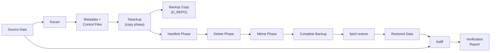

# First Backup Walkthrough

This guide takes you through a complete backup cycle: creating realistic test data, running a backup, inspecting the output layout, restoring, and verifying correctness. We will also cover aggregate backup mode for small-file-heavy workloads.

## 1. Create Test Data

Set up a directory tree that exercises several file types:

```bash
# Create the source tree
mkdir -p /tmp/fpt-walkthrough/source/{project/{src,docs},media,logs}

# Small text files
echo "fn main() { println!(\"hello\"); }" > /tmp/fpt-walkthrough/source/project/src/main.rs
echo "fn lib() -> i32 { 42 }" > /tmp/fpt-walkthrough/source/project/src/lib.rs
echo "# Project README" > /tmp/fpt-walkthrough/source/project/docs/readme.md
echo "License text here" > /tmp/fpt-walkthrough/source/project/docs/license.txt

# Medium binary file
dd if=/dev/urandom of=/tmp/fpt-walkthrough/source/media/photo.jpg bs=1M count=5

# Create a symlink
ln -s photo.jpg /tmp/fpt-walkthrough/source/media/latest.jpg

# Log files
for i in $(seq 1 100); do
  echo "2026-06-07T12:00:${i}Z INFO request handled" \
    >> /tmp/fpt-walkthrough/source/logs/access.log
done

# Create hardlinks (two names pointing to the same inode)
echo "shared configuration data" > /tmp/fpt-walkthrough/source/project/config.ini
ln /tmp/fpt-walkthrough/source/project/config.ini \
   /tmp/fpt-walkthrough/source/project/config.backup.ini
```

Verify the structure:

```bash
find /tmp/fpt-walkthrough/source -type f -o -type l | sort
```

You should see files, a symlink, and the hardlinked pair.

## 2. Run the Backup

```bash
./target/release/fptcli backup \
  --data /tmp/fpt-walkthrough/source \
  --target /tmp/fpt-walkthrough/target \
  --hardlink \
  -v
```

Key flags:
- `--data` -- the source directory to back up.
- `--target` -- where the backup copy will be written.
- `--hardlink` -- enables the hardlink phase so linked files are preserved.
- `-v` -- INFO-level verbosity (use `-vv` for DEBUG, `-vvv` for TRACE).

## 3. Inspect the Backup Layout

After the backup completes, fptcli creates several directories:

```bash
ls /tmp/fpt-walkthrough/target/
```

Typical layout (common format):

```
/tmp/fpt-walkthrough/target/
  COPY_COMMON_FULL_<timestamp>/
    D_REPO/                    # Data: mirrors the source tree
      project/
        src/main.rs
        src/lib.rs
        docs/readme.md
        docs/license.txt
        config.ini
        config.backup.ini
      media/
        photo.jpg
        latest.jpg -> photo.jpg
      logs/
        access.log
    C_REPO/                    # Control and log files
      logs/
        backup.log
        ...
    M_REPO/                    # Metadata (shared across subtasks)
      meta_0_0.dat
      ...
```

The `D_REPO` directory is a faithful mirror of your source. The `C_REPO` directory holds control files, subtask logs, and any failure logs. The `M_REPO` directory stores the metadata produced by the scanner.

## 4. Aggregate Backup Mode

For workloads with many small files (thousands of files under 1 MB), aggregate mode packs them into large blob files, reducing filesystem metadata overhead.

```bash
./target/release/fptcli backup \
  --data /tmp/fpt-walkthrough/source \
  --target /tmp/fpt-walkthrough/target-aggr \
  --aggregate \
  --blob-size 8 \
  --threshold 512 \
  -v
```

Flags:
- `--aggregate` -- enables aggregate mode (shortcut for `--format aggregated`).
- `--blob-size 8` -- maximum blob size in MB (default: 4).
- `--threshold 512` -- files smaller than this (in KB) are packed into blobs (default: 1024).

The aggregate layout differs from the common format:

```
/tmp/fpt-walkthrough/target-aggr/
  COPY_AGGR_FULL_<timestamp>/
    D_REPO/
      blobs/                   # Packed blob files
        blob_000000.dat
        blob_000001.dat
      large/                   # Files above the threshold
        media/photo.jpg
    C_REPO/
      ...
    M_REPO/
      aggregate_index.json     # Maps logical paths to blob offsets
      ...
```

During restore, fptcli reads the aggregate index to unpack individual files from the blobs.

## 5. Incremental Backup

After a full aggregate backup, subsequent backups can use the incremental mode:

```bash
# Modify a file
echo "updated content" >> /tmp/fpt-walkthrough/source/project/src/main.rs

# Run incremental backup, pointing to the previous copy
./target/release/fptcli backup \
  --data /tmp/fpt-walkthrough/source \
  --target /tmp/fpt-walkthrough/target-incr \
  --aggregate \
  --incremental-base /tmp/fpt-walkthrough/target-aggr/COPY_AGGR_FULL_<timestamp> \
  -v
```

The incremental backup only processes files that have changed since the previous snapshot, using metadata comparison (size, mtime, checksum).

## 6. Restore

Restore from the backup to a new directory:

```bash
./target/release/fptcli restore \
  --copy /tmp/fpt-walkthrough/target/COPY_COMMON_FULL_<timestamp> \
  --target /tmp/fpt-walkthrough/restored \
  --hardlinks \
  -v
```

Restore policies control what happens when a file already exists at the target:

| Policy | Behavior |
|---|---|
| `replace` (default) | Overwrite existing files |
| `skip` | Skip files that already exist |
| `keep-newer` | Only overwrite if the backup copy is newer |

```bash
./target/release/fptcli restore \
  --copy /tmp/fpt-walkthrough/target/COPY_COMMON_FULL_<timestamp> \
  --target /tmp/fpt-walkthrough/restored \
  --policy keep-newer \
  -v
```

## 7. Verify

Use `fsdiff` to compare the original source with the restored output:

```bash
./target/release/fsdiff \
  --source /tmp/fpt-walkthrough/source \
  --target /tmp/fpt-walkthrough/restored \
  --verbose
```

A successful restore produces no diff output. If differences exist, `fsdiff` lists them with details (missing files, size mismatches, checksum mismatches, symlink mismatches).

## Full Workflow Diagram



## Cleanup

Remove the test directories when you are done:

```bash
rm -rf /tmp/fpt-walkthrough
```
