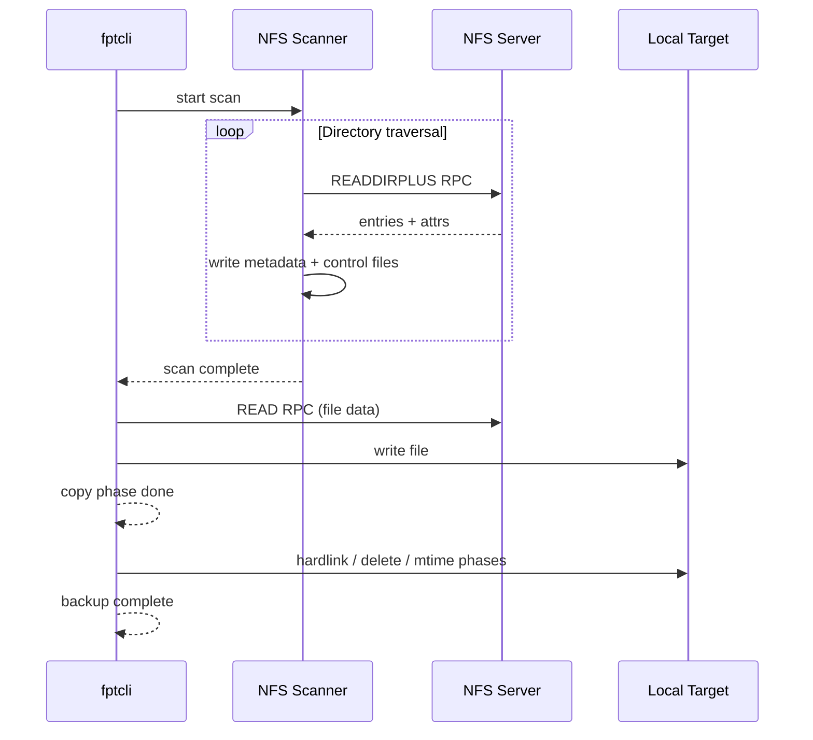

# NFS Setup

This guide covers setting up an NFS server, exporting a share, mounting it locally, and using fptcli to back up and restore data over NFS using the `nfs://` URL scheme.

:::info
NFS support requires building with the `nfs` feature flag: `cargo build --release --features nfs`
:::

## Prerequisites

- An NFS v3 server (Linux `nfs-kernel-server` or any NFS v3-compatible NAS).
- Network connectivity between the fpt-rs host and the NFS server.
- fpt-rs built with `--features nfs`.

## Step 1: Set Up an NFS Server (Linux)

If you do not already have an NFS server, install and configure one on a Linux machine:

```bash
# Install NFS server (Debian/Ubuntu)
sudo apt update
sudo apt install nfs-kernel-server

# Create an export directory
sudo mkdir -p /export/dataset
sudo chown nobody:nogroup /export/dataset
```

### Configure the Export

Edit `/etc/exports` to add the export:

```
/export/dataset  192.168.1.0/24(rw,sync,no_subtree_check,no_root_squash)
```

Replace `192.168.1.0/24` with the subnet of your fpt-rs client machine. Key options:

| Option | Meaning |
|---|---|
| `rw` | Allow read-write access |
| `sync` | Write data to disk before replying (safer) |
| `no_subtree_check` | Disable subtree checking (improves reliability) |
| `no_root_squash` | Allow root on the client to access files as root |

Apply the export:

```bash
sudo exportfs -ra
sudo systemctl restart nfs-kernel-server
```

### Verify the Export

From the client machine, check that the export is visible:

```bash
showmount -e <nfs-server-ip>
```

You should see `/export/dataset` listed.

## Step 2: Create Test Data on the NFS Server

Populate the export with some test data:

```bash
# On the NFS server
sudo mkdir -p /export/dataset/{documents,images}
echo "NFS test file" | sudo tee /export/dataset/documents/report.txt
dd if=/dev/urandom of=/export/dataset/images/picture.bin bs=1M count=3
```

## Step 3: Back Up from an NFS Source

fptcli accepts NFS URLs in the following format:

```
nfs://<host>/<export-path>?sub=<sub-path>&uid=<uid>&gid=<gid>
```

| Component | Description |
|---|---|
| `<host>` | NFS server IP or hostname |
| `<export-path>` | The exported directory (e.g., `/export/dataset`) |
| `sub` (optional) | Subdirectory within the export to use as the scan root |
| `uid` / `gid` (optional) | AUTH_UNIX credentials for the NFS RPC |

Run the backup:

```bash
./target/release/fptcli backup \
  --data "nfs://192.168.1.100/export/dataset" \
  --target /tmp/nfs-backup \
  -w 16 \
  --nfs-connections 32 \
  -v
```

Key NFS-specific flags:
- `--nfs-connections 32` -- number of parallel NFS RPC connections (default: 32).
- `--nfs-uid` / `--nfs-gid` -- override AUTH_UNIX credentials (default: uid/gid from URL or current process).
- `-w 16` -- worker threads per subtask (increase for high-latency networks).

### Backup to an NFS Target

You can also write the backup output to an NFS share:

```bash
./target/release/fptcli backup \
  --data /local/source \
  --target "nfs://192.168.1.100/export/backups" \
  -v
```

## Step 4: Restore from an NFS Backup

Restore data from an NFS-hosted backup copy:

```bash
./target/release/fptcli restore \
  --copy "nfs://192.168.1.100/export/backups/COPY_COMMON_FULL_<timestamp>" \
  --target /tmp/restored \
  -v
```

Or restore to an NFS target:

```bash
./target/release/fptcli restore \
  --copy /tmp/nfs-backup/COPY_COMMON_FULL_<timestamp> \
  --target "nfs://192.168.1.100/export/restore" \
  -v
```

## Scanning Only

To scan an NFS export without running a full backup (useful for estimating time and data volume):

```bash
./target/release/fsscan \
  "nfs://192.168.1.100/export/dataset" \
  --ctrl-dir /tmp/fpt/ctrl \
  --meta-dir /tmp/fpt/meta \
  --nfs-connections 64 \
  -v
```

## NFS URL Examples

```
# Full export
nfs://10.0.0.5/data

# Subdirectory within an export
nfs://10.0.0.5/data?sub=/projects/app1

# With explicit credentials
nfs://10.0.0.5/data?uid=1000&gid=1000

# Subdirectory with credentials
nfs://10.0.0.5/data?sub=/projects/app1&uid=1000&gid=1000
```

## Troubleshooting

**Connection refused** -- Verify the NFS server is running and the export is active (`exportfs -v`). Check firewall rules for port 2049 (NFS) and port 111 (portmapper).

**Permission denied** -- Ensure the `uid`/`gid` in the URL (or the `--nfs-uid`/`--nfs-gid` flags) match a user that has access on the NFS server. Check the export options in `/etc/exports`.

**Stale file handle** -- The NFS server may have restarted or the export path changed. Remount or re-export.

**Slow performance** -- Increase `--nfs-connections` and `-w` (workers). Ensure the network link has sufficient bandwidth. Consider using the aggregate backup format for many small files.

## Architecture: NFS Data Flow


