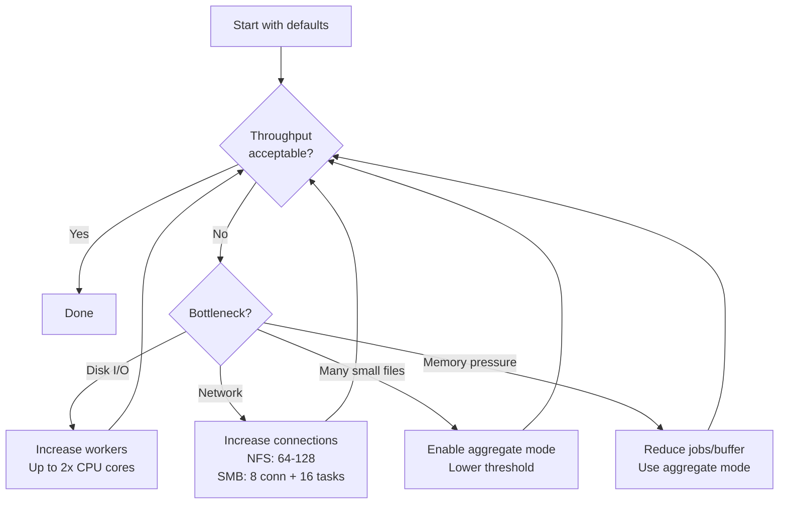

# Performance Tuning

This guide explains how to tune fpt-rs for maximum throughput by adjusting worker counts, buffer sizes, aggregate blob sizes, queue parameters, and estimating memory usage.

## Key Performance Knobs

| Flag | Default | Description |
|---|---|---|
| `-w, --workers` | 8 | Worker threads per subtask (copy I/O) |
| `-j, --jobs` | 4 | Maximum concurrent subtasks |
| `--buffer-size` | 1024 KB | Per-file copy buffer size |
| `--nfs-connections` | 32 | Parallel NFS RPC connections |
| `--smb-connections` | 4 | SMB client connections per endpoint |
| `--smb-copy-tasks` | 0 (auto) | Max concurrent SMB file copy tasks |
| `--blob-size` | 4 MB | Aggregate blob maximum size |
| `--threshold` | 1024 KB | File size threshold for aggregation |

:::info Source of defaults
These defaults come directly from the source code. The scan-level defaults are
defined in `src/scanner/options.rs` and the backup-level defaults in
`src/backup.rs`. See the sections below for exact values.
:::

### Scan-Level Defaults (from `src/scanner/options.rs`)

The `ScanOption::default()` implementation at `src/scanner/options.rs:236`
sets these values:

```rust
// src/scanner/options.rs
impl Default for ScanOption {
    fn default() -> Self {
        Self {
            max_depth: None,            // unlimited depth
            worker_count: 8,            // traversal worker threads
            writer_count: 4,            // metadata writer threads
            target_dir: TargetDirOption {
                ctrl_dir: PathBuf::from("/tmp/fpt/ctrl"),
                meta_dir: PathBuf::from("/tmp/fpt/meta"),
                prev_meta_dir: None,
            },
            queue_option: QueueOption {
                temp_dir: PathBuf::from("/tmp/fpt/cache"),
                memory_upper_bound: 100_000,   // spill threshold
                memory_lower_bound: 50_000,    // reload threshold
                spill_load_batch_size: 20_000, // items per disk batch
            },
            shard_option: ShardOption::default(),
            // ...
        }
    }
}
```

The `MetaScanOption::default()` at `src/scanner/options.rs:218` disables
expensive metadata collection by default:

```rust
// src/scanner/options.rs
impl Default for MetaScanOption {
    fn default() -> Self {
        Self {
            scan_acl: false,             // disabled for performance
            scan_xattrs: false,          // may require elevated privileges
            scan_hardlinks: false,       // disabled by default
            scan_hidden: false,          // skip dot-files
            follow_symlinks: false,      // safe default (avoid loops)
            skip_entries: Vec::new(),    // no entries skipped by default
            path_filters: None,          // no path filters
            skip_block_devices: true,    // safe default
            enable_aggregation: false,   // off by default
            max_aggregate_blob_size: DEFAULT_MAX_AGGREGATE_BLOB_SIZE, // 64 MB
            aggregate_file_threshold: DEFAULT_AGGREGATE_FILE_THRESHOLD, // 1 MB
        }
    }
}
```

The `ShardOption::default()` at `src/scanner/options.rs:206`:

```rust
// src/scanner/options.rs
impl Default for ShardOption {
    fn default() -> Self {
        Self {
            enabled: false,
            num_shards: 16,
            max_entries_copy: 1_000_000,
            max_entries_other: 5_000_000,
            max_size: 100 * 1024 * 1024, // 100 MB
        }
    }
}
```

### Aggregate Defaults (from `src/scanner/options.rs`)

The aggregate-related constants are defined at `src/scanner/options.rs:21`:

```rust
// src/scanner/options.rs
pub const DEFAULT_MAX_AGGREGATE_BLOB_SIZE: u64 = 64 * 1024 * 1024; // 64 MB
pub const DEFAULT_AGGREGATE_FILE_THRESHOLD: u64 = 1024 * 1024;     // 1 MB
pub const DEFAULT_SCAN_QUEUE_CAPACITY: usize = 1000;
pub const DEFAULT_MPSC_CHANNEL_CAPACITY: usize = 256;
```

### Backup-Level Defaults (from `src/backup.rs`)

The `BackupOption` at `src/backup.rs` uses a builder pattern. The copy buffer
size is clamped between 256 KB and 4 MB:

```rust
// src/backup/aio/transport.rs
pub const DEFAULT_COPY_BUFFER_SIZE: usize = 1024 * 1024; // 1 MB

pub fn clamp_copy_buffer_size(size: usize) -> usize {
    size.clamp(256 * 1024, 4 * 1024 * 1024)
}
```

The `RetryPolicy::default()` at `src/failure.rs:78`:

```rust
// src/failure.rs
impl Default for RetryPolicy {
    fn default() -> Self {
        Self {
            max_retries: 3,
            retry_delay: Duration::from_secs(1),
            backoff_multiplier: 1.0,
            max_retry_delay: Duration::from_secs(1),
            jitter_ratio: 0.0,
        }
    }
}
```

## Worker Threads (`-w`)

The worker count controls how many files are copied in parallel within a single subtask. Each worker reads from the source, writes to the target, and verifies the copy.

**Guidelines:**

| Storage Type | Recommended Workers | Rationale |
|---|---|---|
| Local SSD to local SSD | 8-16 | SSDs handle parallel I/O well |
| Local HDD to local HDD | 4-8 | Too many workers cause seek thrashing |
| NFS source or target | 16-32 | Network latency benefits from more concurrency |
| SMB source or target | 8-16 | SMB has per-connection overhead |

```bash
# Example: high-concurrency NFS backup
./target/release/fptcli backup \
  --data "nfs://server/export/data" \
  --target /local/backup \
  -w 32 \
  --nfs-connections 64
```

## Concurrent Subtasks (`-j`)

The scanner splits the file set into multiple control files (subtasks). The `-j` flag controls how many subtasks run in parallel. Each subtask gets its own set of worker threads.

**Effective parallelism** = `jobs x workers`

With the defaults (`-j 4 -w 8`), up to 32 files are copied simultaneously.

```bash
# Run 8 subtasks with 16 workers each = 128 parallel file copies
./target/release/fptcli backup \
  --data /source \
  --target /backup \
  -j 8 -w 16
```

:::caution
Setting `-j` too high increases memory usage (each subtask holds metadata in memory). Start with the default and increase only if throughput is bottlenecked by subtask scheduling.
:::

## Copy Buffer Size (`--buffer-size`)

The copy buffer determines how much data is read and written in a single I/O operation per file.

| Buffer Size | Best For |
|---|---|
| 256 KB | Many small files, memory-constrained systems |
| 1024 KB (default) | General-purpose workloads |
| 4096 KB | Large sequential files on fast storage |

SMB-specific limits:
- SMB source reads are capped at **2048 KiB** regardless of this setting.
- SMB writes are capped at **256 KiB**.

```bash
# Use a larger buffer for big files
./target/release/fptcli backup \
  --data /source \
  --target /backup \
  --buffer-size 4096
```

## Aggregate Blob Size (`--blob-size`)

In aggregate mode, small files are packed into blob files. The blob size controls the maximum size of each blob file.

| Blob Size | Best For |
|---|---|
| 4 MB (default) | Small to medium file sets |
| 8-16 MB | Large file sets on fast storage |
| 32 MB | Maximum throughput on SSDs with many tiny files |

Larger blobs reduce the number of files created on the target but increase the time to restore individual files (the entire blob may need to be read).

## Aggregate Threshold (`--threshold`)

Files smaller than the threshold are packed into blobs; files larger than the threshold are copied individually.

| Threshold | Best For |
|---|---|
| 512 KB | Pack more files into blobs |
| 1024 KB (default) | Balanced approach |
| 4096 KB | Only pack very small files |

```bash
# Aggregate with larger blobs and lower threshold
./target/release/fptcli backup \
  --data /source \
  --target /backup \
  --aggregate \
  --blob-size 16 \
  --threshold 512
```

## NFS Connection Count (`--nfs-connections`)

Controls the number of parallel NFS RPC connections. Each connection is an independent TCP socket to the NFS server.

- **Low latency, high bandwidth** (local network): 32-64 connections.
- **High latency** (WAN): increase to 64-128 to fill the bandwidth-delay product.
- **NFS server under load**: reduce to 16 to avoid overwhelming the server.

## SMB Connection and Task Tuning

- `--smb-connections` (default: 4) -- number of authenticated SMB sessions per endpoint. Each session can multiplex requests.
- `--smb-copy-tasks` (default: 0 = auto) -- max concurrent file copy operations. Auto mode sets this to `2 x connections`, capped at 16.

```bash
# High-throughput SMB backup
./target/release/fptcli backup \
  --data "smb://server/share?username=u&password=p" \
  --target /backup \
  --smb-connections 8 \
  --smb-copy-tasks 16 \
  -w 16
```

## Memory Usage Estimation

Memory usage depends on several factors:

| Component | Approximate Memory |
|---|---|
| Per worker thread | ~2-4 MB (buffer + stack) |
| Per subtask metadata | Proportional to file count |
| Aggregate index | ~200 bytes per packed file |
| NFS connection pool | ~50 KB per connection |
| SMB connection pool | ~100 KB per connection |

**Rough formula:**

```
Memory ≈ (workers x buffer_size) + (jobs x metadata_per_subtask) + transport_overhead
```

**Example calculation:**
- 8 subtasks x 16 workers x 4 MB buffer = 512 MB for I/O buffers
- Plus metadata and transport overhead: ~100-200 MB
- Total: ~600-700 MB

For large file sets, consider reducing `-j` or `--buffer-size` if memory is constrained.

## Tuning Workflow



## Benchmarking with vdbench

fpt-rs includes `vdbench`, a tool that generates synthetic test data for benchmarking:

```bash
# Generate a test dataset: 10 dirs x 10 files x 4KB each at depth 3
./target/release/vdbench \
  --output /tmp/bench-data \
  --depth 3 \
  --dirs 10 \
  --files 10 \
  --size 4096 \
  --threads 8 \
  -y
```

Use this dataset to benchmark different configurations:

```bash
# Baseline
time ./target/release/fptcli backup \
  --data /tmp/bench-data \
  --target /tmp/bench-backup \
  -j 4 -w 8

# High concurrency
time ./target/release/fptcli backup \
  --data /tmp/bench-data \
  --target /tmp/bench-backup-hc \
  -j 8 -w 16

# Aggregate mode
time ./target/release/fptcli backup \
  --data /tmp/bench-data \
  --target /tmp/bench-backup-aggr \
  --aggregate --blob-size 8 --threshold 512 \
  -j 4 -w 8
```
