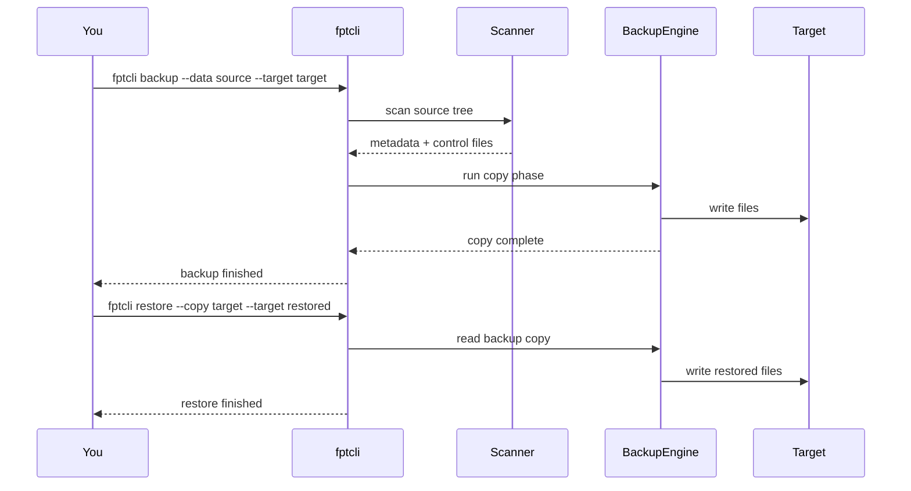

# Quick Start

This guide walks you through installing fpt-rs, running your first backup, verifying the result, and restoring data. By the end you will have a working backup and a verified restore -- all on your local machine.

## Prerequisites

- A Linux or Windows machine with [Rust](https://www.rust-lang.org/tools/install) 1.70+ installed.
- At least a few hundred MB of free disk space for test data and the backup target.

## Step 1: Build from Source

Clone the repository and build the default feature set (local filesystem only):

```bash
git clone https://github.com/XUranus/fpt-rs.git
cd fpt-rs
cargo build --release
```

The compiled binaries appear in `target/release/`:

```bash
ls target/release/fptcli target/release/fsscan target/release/fsdiff
```

If you need NFS or SMB support, see the [Installation guide](./installation.md) for feature flag details.

## Step 2: Create Test Data

Generate a small directory tree to back up:

```bash
mkdir -p /tmp/fpt-demo/source/{documents,images,logs}
echo "Hello, world!" > /tmp/fpt-demo/source/documents/readme.txt
echo "Meeting notes for today" > /tmp/fpt-demo/source/documents/notes.txt
dd if=/dev/urandom of=/tmp/fpt-demo/source/images/photo.bin bs=1M count=2
echo "2026-06-07 startup complete" > /tmp/fpt-demo/source/logs/app.log
```

Verify the structure:

```bash
find /tmp/fpt-demo/source -type f
```

You should see four files across three directories.

## Step 3: Run Your First Backup

Use `fptcli backup` with a local source and local target:

```bash
./target/release/fptcli backup \
  --data /tmp/fpt-demo/source \
  --target /tmp/fpt-demo/target \
  -v
```

What happens:

1. **Scan** -- fptcli walks the source tree and writes metadata and control files to a temporary directory (default `/tmp/fpt`).
2. **Copy** -- files are copied from the source to the target directory.
3. **Summary** -- a completion message is printed with file counts and elapsed time.

The backup output lives under a timestamped subdirectory inside `/tmp/fpt-demo/target`. The layout depends on the backup format (common vs. aggregated); for the default common format, the target mirrors the source directory structure.

## Step 4: Verify with fsdiff

Compare the source and the backup target:

```bash
./target/release/fsdiff \
  --source /tmp/fpt-demo/source \
  --target /tmp/fpt-demo/target/DATA \
  --strip-target-prefix /tmp/fpt-demo/target/DATA
```

If the backup succeeded, `fsdiff` reports no differences (all files are identical). If any files are missing or have mismatched checksums, they will be listed in the output.

## Step 5: Restore from the Backup

Simulate a restore by copying the backup into a fresh directory:

```bash
./target/release/fptcli restore \
  --copy /tmp/fpt-demo/target \
  --target /tmp/fpt-demo/restored \
  -v
```

Verify the restore matches the original:

```bash
diff -r /tmp/fpt-demo/source /tmp/fpt-demo/restored
```

No output means the restore is a perfect match.

## What Just Happened?



## Next Steps

- Learn about [aggregate backup](./first-backup.md#4-aggregate-backup-mode) for handling millions of small files.
- Set up [NFS](./nfs-setup.md) or [SMB](./smb-setup.md) backups for remote data sources.
- Tune performance with the [Performance Tuning guide](./performance-tuning.md).
