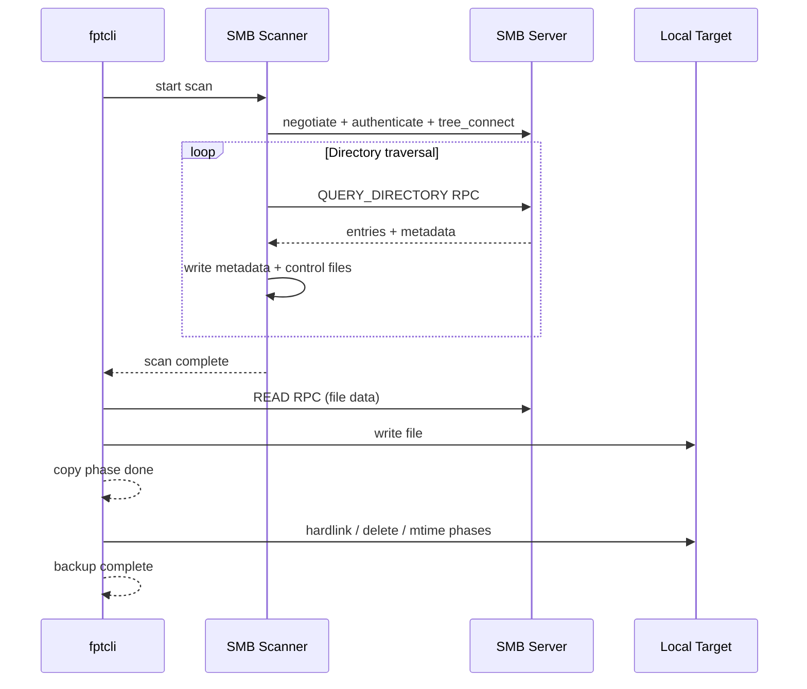

# SMB Setup

This guide covers configuring SMB/CIFS shares, using fptcli to back up and restore data over SMB with the `smb://` URL scheme, and diagnosing connection issues with `smbprobe`.

:::info
SMB support requires building with the `smb` feature flag: `cargo build --release --features smb`
:::

## Prerequisites

- An SMB/CIFS server (Samba on Linux, Windows File Sharing, or a NAS appliance).
- Network connectivity between the fpt-rs host and the SMB server.
- fpt-rs built with `--features smb`.

## Step 1: Set Up an SMB Share (Samba Example)

If you do not already have a share, configure one on a Linux machine running Samba:

```bash
sudo apt update
sudo apt install samba
```

### Create a Shared Directory

```bash
sudo mkdir -p /srv/samba/share
sudo chmod 0777 /srv/samba/share
```

### Configure Samba

Edit `/etc/samba/smb.conf` and add:

```ini
[share]
   path = /srv/samba/share
   browsable = yes
   writable = yes
   guest ok = no
   valid users = backupuser
```

Create a Samba user:

```bash
sudo smbpasswd -a backupuser
```

Restart Samba:

```bash
sudo systemctl restart smbd
```

### Verify the Share

From the client machine, list available shares:

```bash
smbclient -L //<smb-server-ip> -U backupuser
```

## Step 2: Create Test Data on the Share

Populate the share with test data:

```bash
# On the SMB server
mkdir -p /srv/samba/share/{projects,backups}
echo "Project alpha spec" > /srv/samba/share/projects/alpha.txt
dd if=/dev/urandom of=/srv/samba/share/projects/data.bin bs=1M count=4
```

## Step 3: Diagnose with smbprobe

Before running a full backup, verify SMB connectivity using the `smbprobe` diagnostic tool:

```bash
./target/release/smbprobe \
  --target "smb://192.168.1.200/share?username=backupuser&password=secret"
```

`smbprobe` performs the full SMB handshake sequence and reports each step:

```
target=\\192.168.1.200\share
share_unc=\\192.168.1.200\share
root_unc=\\192.168.1.200\share
step=connect
step=connect ok
step=authenticate
step=authenticate ok
step=tree_connect
step=tree_connect ok
```

If any step fails, the error message indicates the cause (wrong credentials, unreachable host, share not found, etc.).

## Step 4: Back Up from an SMB Source

fptcli accepts SMB URLs in the following format:

```
smb://<host>/<share>/<path>?username=<user>&password=<pass>
```

Run the backup:

```bash
./target/release/fptcli backup \
  --data "smb://192.168.1.200/share/projects?username=backupuser&password=secret" \
  --target /tmp/smb-backup \
  --smb-connections 4 \
  -v
```

Key SMB-specific flags:
- `--smb-connections 4` -- number of SMB client connections per endpoint (default: 4).
- `--smb-copy-tasks 0` -- max concurrent file copy tasks; `0` means auto (2 per connection, capped at 16).
- `--buffer-size 1024` -- per-file copy buffer in KB; SMB source reads are capped at 2048 KiB, writes at 256 KiB.

### Backup to an SMB Target

Write backup output to an SMB share:

```bash
./target/release/fptcli backup \
  --data /local/source \
  --target "smb://192.168.1.200/backups?username=backupuser&password=secret" \
  -v
```

## Step 5: Restore from an SMB Backup

Restore data from an SMB-hosted backup copy:

```bash
./target/release/fptcli restore \
  --copy "smb://192.168.1.200/backups/COPY_COMMON_FULL_<timestamp>?username=backupuser&password=secret" \
  --target /tmp/restored \
  -v
```

## SMB URL Examples

```
# Share root
smb://10.0.0.20/share?username=admin&password=pass123

# Subdirectory within a share
smb://10.0.0.20/share/data/projects?username=admin&password=pass123

# With domain (Windows AD)
smb://dc01.corp.example.com/share?username=DOMAIN\\user&password=pass
```

## Security Considerations

:::warning
SMB URLs contain credentials in plain text. Avoid logging them or storing them in shell history.
:::

- Use `--log-file` to capture logs without exposing URLs in terminal output.
- Consider using environment variables for credentials:

```bash
export SMB_USER=backupuser
export SMB_PASS=secret

./target/release/fptcli backup \
  --data "smb://192.168.1.200/share?username=${SMB_USER}&password=${SMB_PASS}" \
  --target /tmp/smb-backup
```

## Scanning Only

Scan an SMB share without running a backup:

```bash
./target/release/fsscan \
  "smb://192.168.1.200/share/projects?username=backupuser&password=secret" \
  --ctrl-dir /tmp/fpt/ctrl \
  --meta-dir /tmp/fpt/meta \
  --smb-query-buffer-mb 16 \
  -v
```

- `--smb-query-buffer-mb` -- query-directory buffer size in MiB (default: 8). Increase for shares with very large directories.

## Troubleshooting

**Authentication failed** -- Verify the username and password. On Windows, include the domain (`DOMAIN\\user`). On Samba, check `smbpasswd` and `smb.conf` settings.

**Share not found** -- Ensure the share name in the URL matches the configured share (case-sensitive on Samba).

**Connection timeout** -- Check firewall rules for ports 445 (SMB over TCP) and 139 (NetBIOS). Ensure the SMB server is reachable.

**Slow scan performance** -- Increase `--smb-query-buffer-mb` and `--smb-connections`. SMB directory enumeration can be slow over high-latency links.

**Access denied on subdirectory** -- The authenticated user may lack permissions for specific subdirectories. Check share and filesystem permissions on the server.

## Architecture: SMB Data Flow


