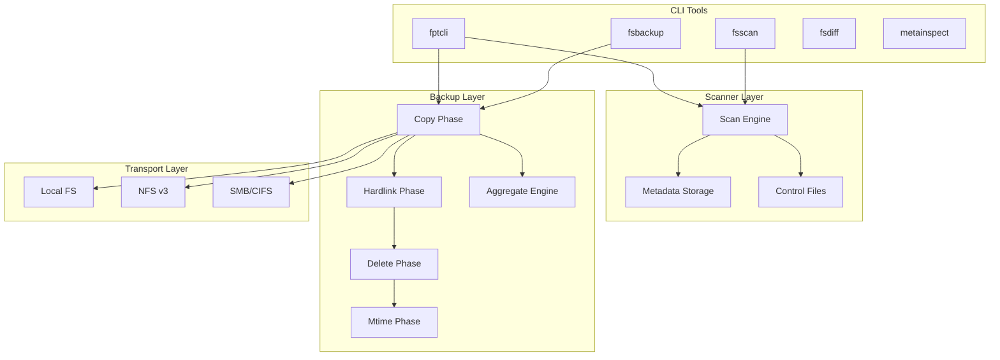

# Welcome to Fpt

**Fpt** (File Protection Tool) is a high-performance backup and restore engine written in Rust. It is designed for fast, reliable data protection across local filesystems, NFS exports, and SMB/CIFS shares.

Whether you are backing up a few gigabytes of documents or millions of small files on a remote NAS, fpt-rs gives you a single command-line interface to scan, copy, verify, and restore your data with confidence.

## Key Features

- **Multi-transport support** -- back up and restore from local disk, NFS v3 exports, and SMB/CIFS shares using a unified URL-based interface.
- **Aggregate backup** -- packs many small files into large blob files, dramatically reducing metadata overhead and improving throughput on HDDs and remote shares.
- **Incremental backup** -- after an initial full backup, subsequent runs only process changed files, saving time and bandwidth.
- **Hardlink preservation** -- detects and recreates hardlinked files at the target, preserving storage efficiency.
- **4-phase backup pipeline** -- copy, hardlink, delete, and mtime phases run independently, enabling fine-grained control and resumability.
- **Structured failure logs** -- every failed file is recorded in CSV, JSON, or XML format with error classification, making post-backup triage straightforward.
- **Configurable retry with backoff** -- transient I/O errors (network timeouts, NFS jukebox errors) are retried with exponential backoff and jitter.
- **Parallel I/O** -- worker thread pools and async task queues saturate available bandwidth on both local and remote endpoints.

## Architecture at a Glance

## CLI Tools

| Tool | Purpose |
|---|---|
| `fptcli` | Unified backup and restore orchestrator -- the primary entry point |
| `fsscan` | Standalone filesystem scanner that produces metadata and control files |
| `fsbackup` | Low-level backup executor that runs a single subtask from a control file |
| `fsdiff` | Directory comparison tool that reports differences between source and target |
| `metainspect` | Metadata inspector -- reads metadata, cache, and control files in JSON/CSV/TSV |

## Where to Go Next

- **[Quick Start](./guides/quick-start.md)** -- install, build, and run your first backup in five minutes.
- **[Installation](./guides/installation.md)** -- build requirements, feature flags, and platform notes.
- **[First Backup Walkthrough](./guides/first-backup.md)** -- a detailed step-by-step guide with example data.
- **[NFS Setup](./guides/nfs-setup.md)** -- configure NFS mounts and back up remote exports.
- **[SMB Setup](./guides/smb-setup.md)** -- configure SMB shares and back up Windows/NAS targets.
- **[Performance Tuning](./guides/performance-tuning.md)** -- workers, buffers, blob sizes, and memory planning.
- **[Logging](./guides/logging.md)** -- log routing, verbosity levels, and the `--log-file` flag.
- **[Failure Handling](./guides/failure-handling.md)** -- structured failure logs and retry policy options.
