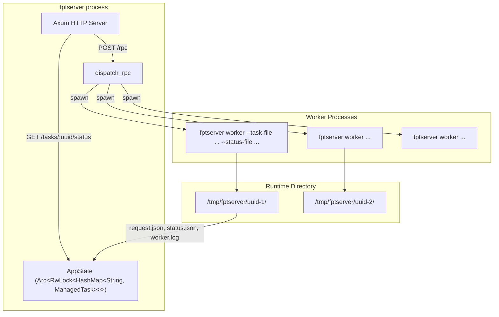
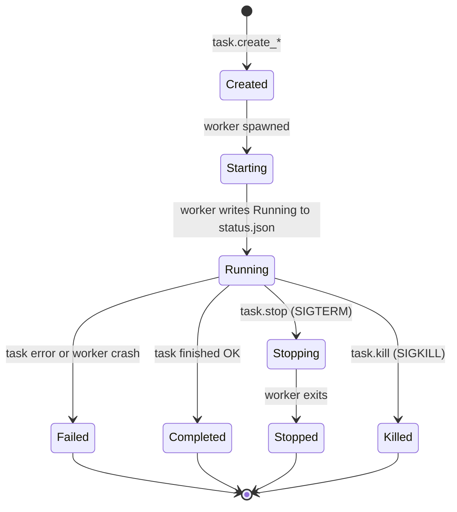

# fptserver Reference

`fptserver` is a long-running HTTP server that exposes backup, restore, and scan
operations as JSON-RPC and REST API endpoints. Clients submit tasks, and the
server spawns worker processes to execute them.

**Source files:** `src/bin/fptserver.rs`, `src/bin/fptserver/cli.rs`, `src/bin/fptserver/api.rs`

## Synopsis

```text
fptserver [OPTIONS]
fptserver worker --task-file <FILE> --status-file <FILE>
```

## CLI Flags

The CLI is defined in `src/bin/fptserver/cli.rs`:

```rust
#[derive(Parser, Debug)]
#[command(author, version, about = "Fpt task RPC server")]
pub(crate) struct Cli {
    #[arg(long, default_value = "127.0.0.1")]
    pub(crate) host: String,

    #[arg(long, default_value_t = 3000)]
    pub(crate) port: u16,

    #[arg(long, default_value = "/tmp/fptserver")]
    pub(crate) runtime_dir: PathBuf,

    #[arg(long, default_value_t = 1)]
    pub(crate) max_scanners_count: usize,

    #[arg(long, default_value_t = 4)]
    pub(crate) max_subtasks_count: usize,

    #[command(subcommand)]
    pub(crate) command: Option<CommandMode>,
}
```

| Flag                       | Default          | Description                                |
|----------------------------|------------------|--------------------------------------------|
| `--host <HOST>`            | `127.0.0.1`     | Bind address                               |
| `--port <PORT>`            | `3000`           | Listen port                                |
| `--runtime-dir <DIR>`      | `/tmp/fptserver` | Directory for task files, logs, status      |
| `--max-scanners-count <N>` | `1`              | Max concurrent scanner tasks               |
| `--max-subtasks-count <N>` | `4`              | Max concurrent subtask processes           |

## Server Architecture



## REST API

Routes are registered in `main()`:

```rust
let app = Router::new()
    .route("/rpc", post(handle_rpc))
    .route("/health", get(get_health))
    .route("/tasks", get(get_tasks))
    .route("/tasks/:uuid", get(get_task))
    .route("/tasks/:uuid/status", get(get_task_status))
    .route("/tasks/:uuid/logs", get(get_task_logs))
    .with_state(state.clone());
```

### Health Check

```http
GET /health
```

**Response:**

```json
{
  "status": "ok",
  "runtime_dir": "/tmp/fptserver",
  "max_scanners_count": 1,
  "max_subtasks_count": 4
}
```

### List All Tasks

```http
GET /tasks
```

**Response:** Array of `TaskStatusSnapshot` objects, sorted by `created_at`.

### Get Task Status

```http
GET /tasks/:uuid
GET /tasks/:uuid/status
```

**Response:** `TaskStatusSnapshot` object. The snapshot is refreshed from the
status file on disk before returning.

### Get Task Logs

```http
GET /tasks/:uuid/logs
```

**Response:** Plain text log output from the worker process.

## JSON-RPC API

All RPC calls go to `POST /rpc` with a JSON-RPC 2.0 request body.

### Request Format

```rust
#[derive(Debug, Serialize, Deserialize)]
struct RpcRequest {
    jsonrpc: Option<String>,   // "2.0"
    id: Option<Value>,
    method: String,
    params: Value,
}
```

```json
{
  "jsonrpc": "2.0",
  "id": 1,
  "method": "task.create_scan",
  "params": { ... }
}
```

### Response Format

```rust
#[derive(Debug, Serialize)]
struct RpcResponse {
    jsonrpc: &'static str,        // "2.0"
    id: Option<Value>,
    result: Option<Value>,
    error: Option<RpcError>,
}

#[derive(Debug, Serialize)]
struct RpcError {
    code: i64,
    message: String,
}
```

```json
{
  "jsonrpc": "2.0",
  "id": 1,
  "result": { ... }
}
```

### RPC Methods

The `dispatch_rpc()` function routes by method name:

```rust
async fn dispatch_rpc(state: AppState, request: &RpcRequest) -> Result<Value, (i64, String)> {
    match request.method.as_str() {
        "task.create_scan"    => { /* parse ScanTaskSpec, spawn_task */ }
        "task.create_backup"  => { /* parse BackupTaskSpec, spawn_task */ }
        "task.create_restore" => { /* parse RestoreTaskSpec, spawn_task */ }
        "task.stop"           => { /* signal SIGTERM */ }
        "task.kill"           => { /* signal SIGKILL */ }
        "task.get"            => { /* read status snapshot */ }
        "task.list" | "task.all" => { /* list all snapshots */ }
        other => Err((-32601, format!("unknown method: {other}"))),
    }
}
```

#### `task.create_scan`

Create a new scan task.

**Params:** `ScanTaskSpec`

```json
{
  "source": "/opt/dataset",
  "ctrl_dir": "/tmp/fpt/ctrl",
  "meta_dir": "/tmp/fpt/meta",
  "temp_dir": "/tmp/fpt/cache",
  "workers": 8,
  "writers": 1,
  "follow_symlinks": false,
  "scan_hidden": false,
  "max_depth": null,
  "scan_acl": false,
  "scan_xattrs": false,
  "scan_hardlinks": false,
  "skip_block_devices": true,
  "skip": [],
  "filters": {
    "include_dir_patterns": [],
    "include_file_patterns": [],
    "exclude_dir_patterns": [],
    "exclude_file_patterns": []
  },
  "prev_meta_dir": null,
  "shard": false,
  "shard_num": 16,
  "stats_only": false,
  "failure_log_format": null,
  "retry": {
    "operation_retries": 3,
    "retry_delay_ms": 1000,
    "retry_backoff": 1.0,
    "retry_max_delay_ms": 1000,
    "retry_jitter": 0.0
  },
  "verbose": 0
}
```

**Result:** `CreateTaskResponse`

#### `task.create_backup`

Create a new backup task.

**Params:** `BackupTaskSpec`

```json
{
  "source": "/opt/dataset",
  "target": "/backup/dataset",
  "format": "common",
  "incremental_base": null,
  "temp_dir": "/tmp/fpt",
  "scan_workers": 8,
  "scan_writers": 1,
  "jobs": 4,
  "aggregate": {
    "enabled": false,
    "layout": "shard",
    "blob_size_mb": 64,
    "threshold_kb": 1024,
    "shard_count": 16
  },
  "hardlink": false,
  "delete": false,
  "mtime": false,
  "scan_filters": { ... },
  "nfs_connections": 32,
  "smb_connections": 4,
  "smb_copy_tasks": 0,
  "buffer_size_kb": 1024,
  "failure_log_format": null,
  "retry": { ... },
  "verbose": 0
}
```

**Result:** `CreateTaskResponse`

#### `task.create_restore`

Create a new restore task.

**Params:** `RestoreTaskSpec`

```json
{
  "copy_source": "/backup/copy1",
  "target": "/restore",
  "policy": "replace",
  "temp_dir": "/tmp/fpt",
  "jobs": 4,
  "paths": [],
  "nfs_connections": 32,
  "verbose": 0
}
```

**Result:** `CreateTaskResponse`

#### `task.stop`

Gracefully stop a running task by sending `SIGTERM` to the worker process.

**Params:** `{ "uuid": "<task-uuid>" }`

**Result:** `TaskStatusSnapshot` with state set to `stopping`.

#### `task.kill`

Force-kill a running task's worker process by sending `SIGKILL`.

**Params:** `{ "uuid": "<task-uuid>" }`

**Result:** `TaskStatusSnapshot` with state set to `killed`.

#### `task.get`

Get the current status of a task.

**Params:** `{ "uuid": "<task-uuid>" }`

**Result:** `TaskStatusSnapshot`

#### `task.list` / `task.all`

List all known tasks.

**Result:** Array of `TaskStatusSnapshot`

## Task Lifecycle



### Task States

```rust
#[derive(Debug, Clone, Copy, Serialize, Deserialize, PartialEq, Eq)]
#[serde(rename_all = "snake_case")]
enum TaskState {
    Created,    // Task registered, worker not yet spawned
    Starting,   // Worker process spawned, initializing
    Running,    // Worker is actively executing
    Stopping,   // Graceful stop requested (SIGTERM sent)
    Stopped,    // Worker exited after stop request
    Completed,  // Task finished successfully
    Failed,     // Task encountered an error
    Killed,     // Worker process was force-killed (SIGKILL)
}
```

### Task Types

```rust
#[derive(Debug, Clone, Copy, Serialize, Deserialize, PartialEq, Eq)]
#[serde(rename_all = "snake_case")]
enum TaskKind {
    Scan,
    Backup,
    Restore,
}
```

### TaskStatusSnapshot

The status snapshot returned by most endpoints:

```rust
#[derive(Debug, Clone, Serialize, Deserialize)]
struct TaskStatusSnapshot {
    uuid: String,
    kind: TaskKind,
    state: TaskState,
    pid: Option<u32>,
    created_at: String,           // RFC 3339
    started_at: Option<String>,
    finished_at: Option<String>,
    message: Option<String>,
    exit_code: Option<i32>,
    stats: TaskStats,
    request: TaskRequest,
}
```

### Task Stats Types

```rust
#[derive(Debug, Clone, Serialize, Deserialize)]
#[serde(tag = "type", rename_all = "snake_case")]
enum TaskStats {
    None,
    Scan {
        total_files: u64,
        total_dirs: u64,
        total_size_bytes: u64,
        failed_files: u64,
        failed_dirs: u64,
    },
    Transfer {
        total_files: u64,
        total_dirs: u64,
        total_bytes: u64,
        failed_files: u64,
        failed_dirs: u64,
        subtasks_ok: usize,
        subtasks_failed: usize,
    },
}
```

## Task Spawning

When `task.create_*` is called, the server:

1. **Enforces limits** -- checks `max_scanners_count` and `max_subtasks_count`
   against currently active tasks:

```rust
async fn enforce_limits(state: &AppState, kind: TaskKind) -> Result<(), String> {
    match kind {
        TaskKind::Scan if running_scanners >= state.config.max_scanners_count =>
            Err(format!("scanner limit reached: {running_scanners}/{}", ...)),
        TaskKind::Backup | TaskKind::Restore if running_subtasks >= state.config.max_subtasks_count =>
            Err(format!("subtask limit reached: {running_subtasks}/{}", ...)),
        _ => Ok(()),
    }
}
```

2. **Creates task directory** -- `{runtime_dir}/{uuid}/`
3. **Writes request.json** -- the full `TaskEnvelope` with uuid and request
4. **Spawns worker process** -- `fptserver worker --task-file ... --status-file ...`
5. **Registers ManagedTask** -- stores in the shared `AppState` HashMap
6. **Spawns reconciliation task** -- waits for worker exit and updates status

```rust
let mut child = Command::new(exe)
    .arg("worker")
    .arg("--task-file").arg(&request_file)
    .arg("--status-file").arg(&status_file)
    .stdout(Stdio::from(stdout))
    .stderr(Stdio::from(stderr))
    .spawn()?;

tokio::spawn(async move {
    let exit = child.wait().await;
    reconcile_task_exit(state, &task_id, exit).await;
});
```

## Worker Process

When `fptserver` is invoked with the `worker` subcommand, it runs a single task:

```rust
fn run_worker(args: WorkerArgs) -> Result<(), Box<dyn std::error::Error>> {
    let envelope: TaskEnvelope = read_json_file(&args.task_file)?;
    let mut snapshot = TaskStatusSnapshot { state: TaskState::Starting, ... };
    write_status_file(&args.status_file, &snapshot)?;

    snapshot.state = TaskState::Running;
    write_status_file(&args.status_file, &snapshot)?;

    let result = match &envelope.request {
        TaskRequest::Scan(spec) => run_scan_task(spec),
        TaskRequest::Backup(spec) => run_backup_task(spec),
        TaskRequest::Restore(spec) => run_restore_task(spec),
    };

    match result {
        Ok(stats) => { snapshot.state = TaskState::Completed; snapshot.stats = stats; }
        Err(err) => { snapshot.state = TaskState::Failed; snapshot.message = Some(err); }
    }
    write_status_file(&args.status_file, &snapshot)?;
}
```

### Scan Task Execution

The `run_scan_task()` function dispatches by `DataLocation` variant:

```rust
fn run_scan_task(spec: &ScanTaskSpec) -> Result<TaskStats, Box<dyn std::error::Error>> {
    let location = parse_data_location(&spec.source, ...)?;
    let scan_option = ScanOption::new(spec.ctrl_dir.clone(), spec.meta_dir.clone())
        .worker_count(spec.workers)
        .writer_count(spec.writers)
        .follow_symlinks(spec.follow_symlinks)
        .scan_hidden(spec.scan_hidden)
        // ... many more options
        ;

    match location {
        DataLocation::Local(path) => {
            let mut scanner = Scanner::new(scan_option);
            scanner.enqueue_path(path)?;
            let running = scanner.start()?;
            while !running.complete() { std::thread::sleep(Duration::from_millis(200)); }
            // collect stats
        }
        #[cfg(feature = "nfs")]
        DataLocation::Nfs(loc) => {
            let rt = tokio::runtime::Builder::new_multi_thread().build()?;
            rt.block_on(fpt::nfs::scanner::run_nfs_scan(&loc, scan_option))?;
        }
        #[cfg(feature = "smb")]
        DataLocation::Smb(loc) => {
            let rt = tokio::runtime::Builder::new_multi_thread().build()?;
            rt.block_on(fpt::smb::scanner::run_smb_scan(&loc, scan_option))?;
        }
    }
}
```

### Backup Task Execution

The `run_backup_task()` function builds a `BackupJobConfig` and runs
`FileBackupJob`:

```rust
fn run_backup_task(spec: &BackupTaskSpec) -> Result<TaskStats, Box<dyn std::error::Error>> {
    let source = parse_data_location(&spec.source, ...)?;
    let target = parse_data_location(&spec.target, ...)?;
    let aggregate_config = if aggregate_enabled {
        AggregateConfig::enabled().layout(...).max_blob_size(...).file_threshold(...)
    } else {
        AggregateConfig::default()
    };
    let config = BackupJobConfig {
        source, target, format_tag, type_tag, temp_config,
        scan_config, aggregate_config,
        enable_hardlink: spec.hardlink && !aggregate_enabled,
        enable_delete: spec.delete && !aggregate_enabled,
        enable_mtime: spec.mtime && !aggregate_enabled,
        max_concurrent_subtasks: spec.jobs,
        copy_buffer_size: (spec.buffer_size_kb * 1024).clamp(256 * 1024, 4 * 1024 * 1024),
        // ...
    };
    let result = FileBackupJob::new(config).run()?;
    Ok(TaskStats::Transfer { total_files, total_dirs, total_bytes, subtasks_ok, ... })
}
```

## Task Runtime Structure

Each task gets a directory under `runtime_dir`:

```text
/tmp/fptserver/<uuid>/
    request.json    # TaskEnvelope (uuid + TaskRequest)
    status.json     # Current TaskStatusSnapshot (updated by worker)
    worker.log      # Worker stdout/stderr (appended)
```

The worker process is spawned as:

```text
fptserver worker --task-file <dir>/request.json --status-file <dir>/status.json
```

## Error Codes

| Code     | Meaning                              |
|----------|--------------------------------------|
| `-32600` | Invalid request                      |
| `-32601` | Method not found                     |
| `-32602` | Invalid params                       |
| `-32603` | Internal JSON error                  |
| `-32000` | I/O error                            |
| `-32001` | Task limit exceeded                  |
| `-32004` | Task not found                       |
| `-32005` | Task has no live pid                 |
| `-32007` | Failed to signal task                |

## Examples

### Start the Server

```bash
fptserver --host 0.0.0.0 --port 8080 --runtime-dir /var/fptserver \
    --max-scanners-count 2 --max-subtasks-count 8
```

### Create a Backup Task (curl)

```bash
curl -X POST http://localhost:8080/rpc \
  -H "Content-Type: application/json" \
  -d '{
    "jsonrpc": "2.0",
    "id": 1,
    "method": "task.create_backup",
    "params": {
      "source": "/opt/data",
      "target": "/backup/data",
      "format": "common",
      "jobs": 4,
      "verbose": 1
    }
  }'
```

### Create an NFS Scan Task

```bash
curl -X POST http://localhost:8080/rpc \
  -H "Content-Type: application/json" \
  -d '{
    "jsonrpc": "2.0",
    "id": 2,
    "method": "task.create_scan",
    "params": {
      "source": "nfs://192.168.1.10/export?sub=/data",
      "ctrl_dir": "/tmp/fpt/ctrl",
      "meta_dir": "/tmp/fpt/meta",
      "nfs_connections": 32,
      "workers": 16,
      "scan_hardlinks": true,
      "verbose": 1
    }
  }'
```

### Poll Task Status

```bash
curl http://localhost:8080/tasks/<uuid>/status
```

### Get Task Logs

```bash
curl http://localhost:8080/tasks/<uuid>/logs
```

### Stop a Task

```bash
curl -X POST http://localhost:8080/rpc \
  -H "Content-Type: application/json" \
  -d '{
    "jsonrpc": "2.0",
    "id": 3,
    "method": "task.stop",
    "params": { "uuid": "<task-uuid>" }
  }'
```
