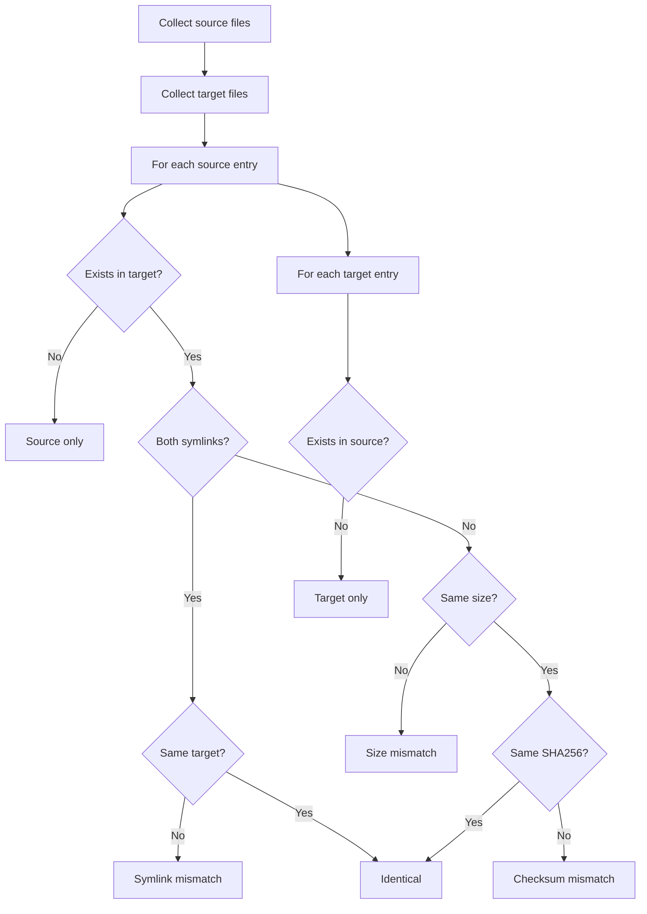

# fsdiff Reference

`fsdiff` compares two directory trees and reports differences. It is useful for
verifying that a backup copy is identical to the source, or for comparing two
versions of a dataset.

## Synopsis

```text
fsdiff --source <DIR> --target <DIR> [OPTIONS]
```

## Required Flags

| Flag                  | Short | Description              |
|-----------------------|-------|--------------------------|
| `--source <DIR>`      | `-s`  | Source directory path    |
| `--target <DIR>`      | `-t`  | Target directory path    |

## Optional Flags

| Flag                        | Default | Description                                    |
|-----------------------------|---------|------------------------------------------------|
| `--strip-source-prefix <PREFIX>` |     | Strip prefix from source paths when comparing |
| `--strip-target-prefix <PREFIX>` |     | Strip prefix from target paths when comparing |
| `--follow-links`            | `false` | Follow symbolic links                          |
| `--compare-acl`             | `false` | Compare Access Control Lists (Linux only)      |
| `--compare-xattrs`          | `false` | Compare extended attributes (Linux only)       |
| `--compare-mtime`           | `false` | Compare directory modification times           |
| `--verbose`                 | `false` | Print each file being compared                 |

## Comparison Logic



### What Gets Compared

| Check         | Files | Dirs | Symlinks | Notes                           |
|---------------|-------|------|----------|---------------------------------|
| Existence     | Yes   | Yes  | Yes      | Source-only / target-only        |
| Size          | Yes   |      |          | Compared before checksum         |
| SHA256        | Yes   |      |          | Only if sizes match              |
| Symlink target|       |      | Yes      | Compared as path strings         |
| ACL           | Opt.  | Opt. | Opt.     | Linux only, requires `--compare-acl` |
| Xattr         | Opt.  | Opt. | Opt.     | Linux only, requires `--compare-xattrs` |
| Mtime         |       | Opt. |          | Requires `--compare-mtime`       |

## Output

### Summary

```text
=== Diff Summary ===
  + 3 files only in source
  - 1 files only in target
  ! 2 files with size mismatch
  ! 1 files with checksum mismatch
  ! 0 files with symlink mismatch
  ! 1 directories with mtime mismatch

Result: DIFFERENCES FOUND
```

Or when identical:

```text
Result: DIRECTORIES ARE IDENTICAL (15000 files checked)
```

### Detailed Output

```text
--- Files only in source ---
  + /data/new_file.txt
  + /data/another.txt

--- Files only in target ---
  - /data/old_file.txt

--- Files with size mismatch ---
  ! /data/changed.txt (1024 vs 2048 bytes)

--- Files with checksum mismatch ---
  ! /data/modified.dat

--- Files with symlink mismatch ---
  ! /data/link
      source -> /data/target_a
      target -> /data/target_b

--- Directories with mtime mismatch ---
  ! /data/subdir (mtime: 1704067200 vs 1704153600)
```

### Exit Code

| Code | Meaning                              |
|------|--------------------------------------|
| 0    | Directories are identical            |
| 1    | Differences found                    |

## Examples

### Basic Comparison

```bash
fsdiff --source /opt/dataset --target /backup/dataset
```

### Compare with Path Prefix Stripping

When backup paths are stored relative to a different root:

```bash
fsdiff \
    --source /opt/dataset \
    --target /backup/copy1/data \
    --strip-target-prefix /data
```

### Compare with ACLs and Xattrs

```bash
fsdiff \
    --source /opt/dataset \
    --target /backup/dataset \
    --compare-acl \
    --compare-xattrs \
    --compare-mtime \
    --verbose
```

### Verify NFS Backup

```bash
# After restoring from NFS backup to local path
fsdiff \
    --source /opt/original \
    --target /restore/restored \
    --compare-mtime \
    -v
```

### CI/CD Verification

```bash
# Exit code 1 if differences found -- useful in pipelines
if fsdiff --source "$SRC" --target "$DST"; then
    echo "Backup verified OK"
else
    echo "Backup verification FAILED"
    exit 1
fi
```
