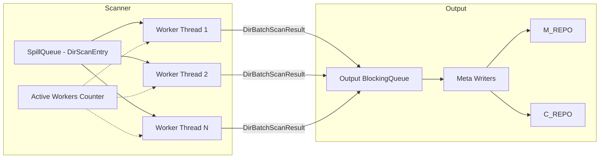

# Native / Local Transport

The native/local transport handles all operations on locally-mounted filesystems.
It is always compiled in (no feature flag required) and uses blocking OS threads
with `std::fs` for all I/O operations.

## Scanner

### BIO Traversal Workers

The local scanner (`src/native/scanner.rs`) uses a pool of OS threads to
traverse directories in parallel. Each worker pops `DirScanEntry` items from
a shared `SpillQueue`, processes the directory, and pushes `DirBatchScanResult`
batches into the output queue.



### Worker Thread Loop

Each worker thread runs in a loop, processing one directory at a time
(`src/native/scanner.rs`):

```rust
pub fn start_workers(
    context: &ScanWorkerContext,
    workers_count: usize,
) -> Vec<thread::JoinHandle<()>> {
    let active_workers = Arc::new(AtomicI32::new(0));

    for i in 0..workers_count {
        let active_workers = Arc::clone(&active_workers);
        let context = context.clone();

        let handle = thread::spawn(move || {
            loop {
                match context.dirent_queue.pop() {
                    Ok(Some(dir_entry)) => {
                        active_workers.fetch_add(1, Ordering::SeqCst);
                        process_dir_entry(dir_entry, &context);
                        active_workers.fetch_sub(1, Ordering::SeqCst);
                    }
                    Ok(None) => {
                        // Queue empty -- wait briefly then check for termination
                        thread::sleep(Duration::from_millis(100));
                        let queue_empty = context.dirent_queue.is_empty();
                        let no_active = active_workers.load(Ordering::SeqCst) == 0;
                        if queue_empty && no_active { break; }
                    }
                    Err(_) => thread::sleep(Duration::from_millis(100)),
                }
            }
        });
        worker_handles.push(handle);
    }
    worker_handles
}
```

Workers terminate when the queue is empty **and** no other workers are active.
This prevents premature exit when subdirectories are still being discovered.

### Directory Processing

`process_dir_entry()` handles a single directory (`src/native/scanner.rs`):

1. **Stat the directory** -- captures dir metadata via `fstat::stat_dir()`
2. **Iterate entries** -- calls `std::fs::read_dir()` with retry logic
3. **Classify each entry** -- dispatches to specialized handlers:

| Entry Type       | Handler                       | Action                              |
|------------------|-------------------------------|-------------------------------------|
| Symlink          | `process_symlink_entry()`     | Stat, optionally follow if dir      |
| Directory        | `process_dir_subentry()`      | Apply filters, enqueue for scan     |
| Regular file     | `process_regular_file_entry()`| Stat, collect metadata              |
| Special (FIFO, socket, etc.) | `process_special_file_entry()` | Stat, collect metadata |

All `stat()` calls use `retry_scan_io()` which retries according to the
configured `RetryPolicy`:

```rust
fn retry_scan_io<T, F>(context: &ScanWorkerContext, mut op: F) -> io::Result<(T, u32)>
where
    F: FnMut() -> io::Result<T>,
{
    let policy = context.scan_option.retry_policy;
    let mut attempts = 0_u32;
    loop {
        attempts += 1;
        match op() {
            Ok(v) => return Ok((v, attempts)),
            Err(e) if policy.should_retry(attempts) => {
                thread::sleep(policy.delay_for_attempt(attempts));
            }
            Err(e) => return Err(e),
        }
    }
}
```

### Filtering

Before processing any entry, the scanner applies filters:

- **Hidden files**: skipped when `scan_hidden` is false (Unix: name starts with
  `.`; Windows: also checks `FILE_ATTRIBUTE_HIDDEN`)
- **Configured skip entries**: names in `skip_entries` set (e.g., `"node_modules"`)
- **Path filters**: compiled `ScanPathFilterSet` with include/exclude patterns
  for both directories and files

```rust
if !scan_option.meta_option.scan_hidden && is_hidden_entry(&entry_name, &entry) {
    continue;
}
if scan_option.meta_option.skip_entries.contains(&entry_name) {
    continue;
}
```

## Backup Pipeline

### LocalSource and LocalTarget

The AIO pipeline traits `SourceReader` and `TargetWriter` are implemented for
local filesystem I/O in `src/backup/aio/transport.rs`:

**LocalSource** reads file data via blocking I/O on a spawned thread:

```rust
#[derive(Clone)]
pub struct LocalSource {
    pub buffer_size: usize,
}

impl SourceReader for LocalSource {
    fn read_block(
        &self,
        mut block: CopyBlock,
    ) -> BoxFuture<'static, Result<CopyBlock, (CopyBlock, String)>> {
        let buffer_size = clamp_copy_buffer_size(self.buffer_size);
        Box::pin(async move {
            let src_path = block.src_path.clone();
            let meta_size = block.file_size;
            let offset = block.src_offset;
            let read_result = task::spawn_blocking(move || {
                read_local_file_chunk(&src_path, offset, meta_size, buffer_size)
            })
            .await
            .unwrap_or_else(|e| Err(format!("blocking task panicked: {e}")));

            match read_result {
                Ok(buf) => {
                    block.src_offset = block.src_offset.saturating_add(buf.len() as u64);
                    block.is_last = block.src_offset >= block.file_size;
                    block.data = buf;
                    Ok(block)
                }
                Err(msg) => Err((block, msg)),
            }
        })
    }
}
```

**LocalTarget** writes file data via blocking I/O, supporting sparse files:

```rust
#[derive(Clone)]
pub struct LocalTarget {
    pub base: PathBuf,
}

impl TargetWriter for LocalTarget {
    fn create_dir(&self, path: PathBuf) -> BoxFuture<'static, Result<(), String>> {
        let full_path = self.base.join(path);
        Box::pin(async move {
            task::spawn_blocking(move || {
                std::fs::create_dir_all(&full_path)
                    .map_err(|e| format!("mkdir {:?}: {e}", full_path))
            })
            .await
            .unwrap_or_else(|e| Err(format!("blocking task panicked: {e}")))
        })
    }

    fn write_block(
        &self,
        mut block: CopyBlock,
    ) -> BoxFuture<'static, Result<CopyBlock, (CopyBlock, String)>> {
        let dst_path = self.base.join(&block.dst_path);
        let buf = block.data.clone();
        let offset = block.dst_offset;
        let mark_sparse = block.meta.sparse_range.is_some();
        Box::pin(async move {
            let result = task::spawn_blocking(move || {
                write_local_file_chunk(&dst_path, offset, &buf, mark_sparse)
            })
            .await
            .unwrap_or_else(|e| Err(format!("blocking task panicked: {e}")));

            match result {
                Ok(()) => {
                    block.dst_offset = block.dst_offset.saturating_add(block.data.len() as u64);
                    Ok(block)
                }
                Err(msg) => Err((block, msg)),
            }
        })
    }
}
```

The copy buffer size is clamped between 256 KB and 4 MB:

```rust
pub const DEFAULT_COPY_BUFFER_SIZE: usize = 1024 * 1024; // 1 MB

pub fn clamp_copy_buffer_size(size: usize) -> usize {
    size.clamp(256 * 1024, 4 * 1024 * 1024)
}
```

### Post-Copy Phases

After all files are copied, the local transport runs three optional phases:


#### Hardlink Phase (`native/backup/hardlink.rs`)

Reads hardlink control files and creates hard links on the target. When multiple
source paths share the same inode, only one copy is written and the rest are
linked to it.

- Input: `hardlink_*.control.bin` files in C_REPO
- Output: hard links created on the target filesystem

#### Delete Phase (`native/backup/delete.rs`)

Removes files and directories that exist on the target but were deleted from the
source since the last backup.

- Input: `delete_*.control.bin` files in C_REPO
- Output: files and directories removed from the target

#### Mtime Phase (`native/backup/mtime.rs`)

Restores directory modification times to match the source. This must run after
all file copies and deletions are complete, since those operations change
directory mtimes.

- Input: `mtime_*.control.bin` files in C_REPO
- Output: directory mtimes restored on the target

### Phase Implementation

All three phases are implemented in `src/native/backup/phases_impl.rs` via the
`PostCopyPhases` trait (`src/backup/aio/phases_trait.rs`):

```rust
pub trait PostCopyPhases: Send + Sync {
    async fn run_hardlink_phase(
        &self, ctrl_dir: &Path, source_dir_base: &Path,
        target_prefix: &str, phase_flags: PhaseFlags,
        retry_policy: RetryPolicy, failure_recorder: Option<&FailureRecorder>,
    ) { /* default: no-op */ }

    async fn run_delete_phase(&self, ...) { /* default: no-op */ }
    async fn run_mtime_phase(&self, ...) { /* default: no-op */ }

    async fn run_all_phases(
        &self, ctrl_dir: &Path, source_dir_base: &Path,
        target_prefix: &str, phase_flags: PhaseFlags,
        retry_policy: RetryPolicy, failure_recorder: Option<&FailureRecorder>,
    ) {
        self.run_hardlink_phase(...).await;
        self.run_delete_phase(...).await;
        self.run_mtime_phase(...).await;
    }
}
```

## Restore Pipeline

### Local Restore

The local restore reads data from the backup copy (D_REPO staging directory)
and writes it to the target path using `std::fs`:

```text
D_REPO (staging) --> read_local_file_chunk() --> write_local_file_chunk() --> target path
```

### RestoreOps Implementation

The `LocalRestoreOps` struct (`src/native/backup/restore_ops.rs`) implements
the `RestoreOps` trait (`src/backup/aio/restore_ops.rs`):

```rust
/// Transport-specific operations needed during restore.
///
/// The default implementations are no-ops, so transports only override
/// what they support.
pub trait RestoreOps: Send + Sync {
    /// Create a symlink at `link_path` pointing to `target`.
    fn create_symlink(&self, _link_path: &Path, _target: &str) -> Result<(), String> {
        Ok(())
    }

    /// Restore common metadata (permissions, timestamps, xattrs, ACLs) on a file.
    fn restore_metadata(&self, _path: &Path, _meta: &MetaCommon) {}
}
```

Only local targets override these methods. Remote targets (NFS, SMB) handle
metadata through their own transport-specific mechanisms during write operations.

## Key Source Files

| File                               | Purpose                                    |
|------------------------------------|--------------------------------------------|
| `src/native/scanner.rs`            | BIO directory traversal with worker pool   |
| `src/backup/aio/transport.rs`      | `SourceReader`/`TargetWriter` traits + `LocalSource`/`LocalTarget` |
| `src/backup/aio/local_fs.rs`       | `read_local_file_chunk()`, `write_local_file_chunk()` |
| `src/backup/aio/phases_trait.rs`   | `PostCopyPhases` trait definition          |
| `src/backup/aio/restore_ops.rs`    | `RestoreOps` trait definition              |
| `src/backup/copy_block.rs`         | `CopyBlock` transfer unit                  |
| `src/native/backup/hardlink.rs`    | Hardlink creation phase                    |
| `src/native/backup/delete.rs`      | Delete phase                               |
| `src/native/backup/mtime.rs`       | Mtime restoration phase                    |
| `src/native/backup/phases_impl.rs` | `PostCopyPhases` trait implementation      |
| `src/native/backup/restore_ops.rs` | `RestoreOps` trait implementation          |
| `src/native/fstat.rs`              | File stat helpers                          |
| `src/native/fwrite_meta.rs`        | Metadata write helpers                     |
