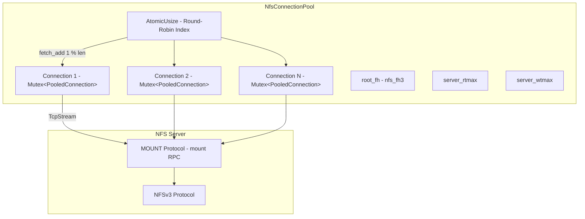
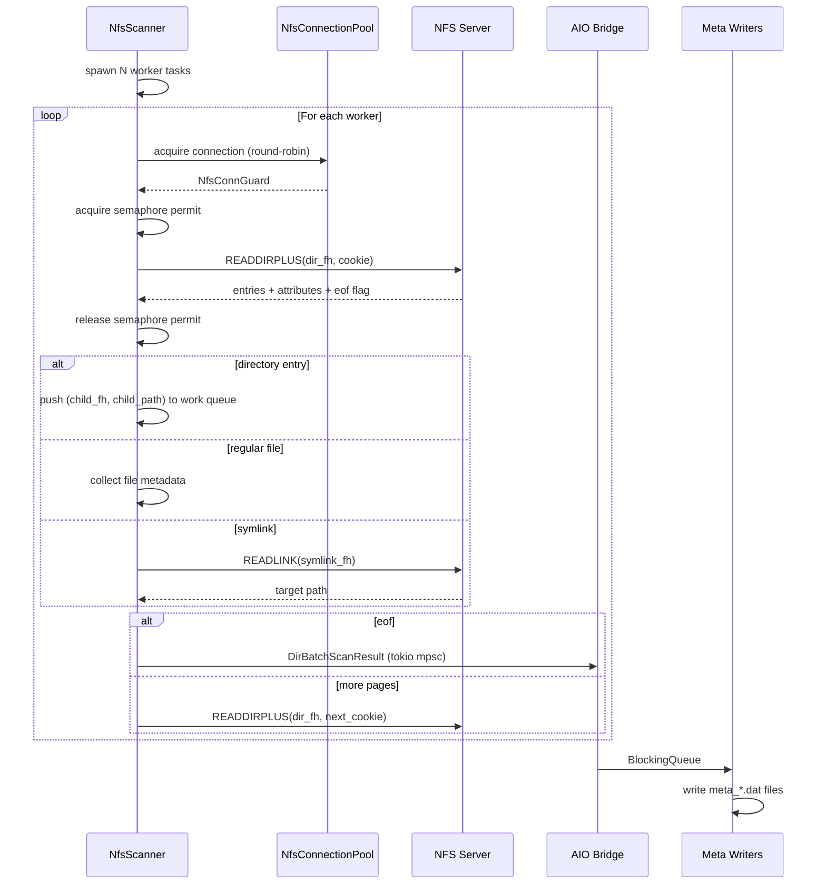

# NFS Transport

The NFS transport enables fpt-rs to read from and write to NFSv3 exports using
direct RPC calls via the `nfs3_client` crate. No kernel NFS mount is required --
fpt-rs communicates with the NFS server entirely in userspace.

:::info Feature Flag
The NFS transport is gated behind the `nfs` Cargo feature. Build with
`--features nfs` to enable it.
:::

## NFS URL Format

NFS locations are specified as URLs with the `nfs://` scheme:

```text
nfs://host[:port]/export[?sub=path][&uid=N][&gid=N]
```

### Components

| Component   | Required | Description                                    |
|-------------|----------|------------------------------------------------|
| `host`      | Yes      | NFS server hostname or IP address              |
| `port`      | No       | NFS port (default: 2049, mountd auto-detected) |
| `export`    | Yes      | NFS export path (e.g. `/data`)                 |
| `sub`       | No       | Sub-path within the export                     |
| `uid`       | No       | AUTH_UNIX uid (default: 0)                     |
| `gid`       | No       | AUTH_UNIX gid (default: 0)                     |

### Examples

```text
nfs://192.168.1.10/export
nfs://nas.local/data?sub=/dataset1
nfs://10.0.0.5/volume1?sub=/backups&uid=1000&gid=1000
nfs://192.168.1.10:2050/export?sub=/ds1
```

## NfsConnectionPool

The `NfsConnectionPool` (`src/nfs/connection.rs`) manages a pool of TCP
connections to the NFS server. Because `Nfs3Connection` requires `&mut self`
for every RPC call, a single connection is inherently sequential. The pool
maintains `connection_count` independent connections to achieve concurrency.



### Pool Structure

```rust
pub type PooledConnection = Nfs3Connection<nfs3_client::tokio::TokioIo<TcpStream>>;

pub struct NfsConnectionPool {
    connections: Vec<Mutex<PooledConnection>>,  // locked connections
    next: AtomicUsize,                           // round-robin index
    root_fh: nfs_fh3,                            // effective root file handle
    pub server_rtmax: u32,                       // server max read transfer size
    pub server_wtmax: u32,                       // server max write transfer size
}
```

### Pool Initialization

When `NfsConnectionPool::new(location)` is called:

1. **Connect** -- Establishes `connection_count` TCP connections to the NFS
   server via the MOUNT protocol, obtaining the export root file handle.
2. **AUTH_UNIX** -- If uid/gid are configured, wraps each connection with
   `auth_unix` credentials so the server sees the correct identity:

```rust
if location.uid != 0 || location.gid != 0 {
    let auth = auth_unix {
        stamp: 0,
        machinename: Opaque::borrowed(b"fpt"),
        uid: location.uid,
        gid: location.gid,
        gids: vec![],
    };
    builder = builder.credential(opaque_auth::auth_unix(&auth));
}
```

3. **FSINFO** -- Queries the server for maximum read/write transfer sizes:

```rust
guard.fsinfo(&FSINFO3args { fsroot: root_fh }).await;
// server_rtmax = ok.rtmax.min(location.read_chunk_size)
// server_wtmax = ok.wtmax.min(location.write_chunk_size)
```

4. **Sub-path resolution** -- If `location.sub_path` is non-empty, walks from
   the export root via LOOKUP RPCs to resolve the effective root file handle:

```rust
for component in sub_path.split('/').filter(|s| !s.is_empty()) {
    let mut guard = connections[0].lock().await;
    let res = guard.lookup(&LOOKUP3args {
        what: diropargs3 {
            dir: current_fh.clone(),
            name: filename3::from(component.as_bytes()),
        },
    }).await;
    // current_fh = ok.object;
}
```

### Connection Acquisition

The pool uses round-robin selection with mutex-based backpressure:

```rust
pub async fn acquire(&self) -> NfsConnGuard<'_> {
    let idx = self.next.fetch_add(1, Ordering::Relaxed) % self.connections.len();
    let guard = self.connections[idx].lock().await;
    NfsConnGuard { guard }
}
```

`NfsConnGuard` implements `Deref` and `DerefMut` to `PooledConnection`, so it
can be used directly for NFS RPCs. The mutex is released when the guard is
dropped.

## NfsScanner

The `NfsScanner` (`src/nfs/scanner.rs`) traverses NFS directories using the
**READDIRPLUS** NFSv3 operation, which returns both directory entries and their
attributes in a single RPC.

### Scanner Structure

```rust
pub struct NfsScanner {
    pool: Arc<NfsConnectionPool>,
    sem: Arc<Semaphore>,         // limits concurrent READDIRPLUS RPCs
    retry_policy: RetryPolicy,
    failure_recorder: Option<FailureRecorder>,
}

const MAX_CONCURRENT_SCAN_RPCS: usize = 16;
const READDIRPLUS_MAXCOUNT: u32 = 128 * 1024; // 128 KiB per call
```

### Scanning Sequence



### Concurrency Model

- A shared `async_channel` work queue holds `(nfs_fh3, String)` pairs.
- `pool.worker_count()` tokio tasks consume directories from the queue.
- A `tokio::sync::Semaphore` caps concurrent READDIRPLUS RPCs to 16.
- An `AtomicUsize` in-flight counter detects when all workers are idle.
- Workers terminate when the queue is empty **and** no other task is working.

The core worker loop:

```rust
async fn scan_worker(runtime: NfsWorkerRuntime) -> Result<(), NfsError> {
    loop {
        let (dir_fh, dir_path) = match channels.work_rx.try_recv() {
            Ok(item) => item,
            Err(async_channel::TryRecvError::Empty) => {
                if channels.in_flight.load(Ordering::SeqCst) == 0 { break; }
                tokio::task::yield_now().await;
                continue;
            }
            Err(async_channel::TryRecvError::Closed) => break,
        };

        channels.in_flight.fetch_add(1, Ordering::SeqCst);
        let result = scan_one_dir(NfsDirScan { pool, sem, dir_fh, dir_path, ... }).await;
        channels.in_flight.fetch_sub(1, Ordering::SeqCst);
    }
    Ok(())
}
```

### Directory Scanning

`scan_one_dir()` reads one directory completely with cookie pagination:

```rust
loop {
    let res = retry_async(shared.retry_policy, || async {
        let _permit = sem.acquire().await?;
        let mut conn = pool.acquire().await;
        conn.readdirplus(&READDIRPLUS3args {
            dir: dir_fh.clone(),
            cookie,
            cookieverf,
            dircount: READDIRPLUS_MAXCOUNT,
            maxcount: READDIRPLUS_MAXCOUNT,
        }).await
    }).await?;

    // Process entries: dirs -> work queue, files -> batch, symlinks -> readlink
    for entry in &entries {
        match attrs.type_ {
            ftype3::NF3DIR => work_tx.send((fh, child_path)).await,
            ftype3::NF3REG => files.push(nfs_fattr3_to_file_meta(&attrs, ...)),
            ftype3::NF3LNK => files.push(nfs_fattr3_to_file_meta(&attrs, ..., target)),
            _ => { /* skip special files */ }
        }
    }

    if eof { break; }
    cookie = entries.last().map(|e| e.cookie);
}
```

### NfsScanAdapter

The `NfsScanAdapter` wraps `NfsScanner` and implements the `AsyncDirScanner`
trait, bridging scanner-specific parameters into the generic async scan interface:

```rust
pub(crate) struct NfsScanAdapter {
    pub scanner: NfsScanner,
    pub root_fh: nfs_fh3,
    pub root_path: String,
}

impl AsyncDirScanner for NfsScanAdapter {
    type Error = NfsError;

    fn scan(
        self,
        scan_option: Arc<ScanOption>,
        tx: tokio::sync::mpsc::Sender<DirBatchScanResult>,
    ) -> Pin<Box<dyn Future<Output = Result<(), Self::Error>> + Send>> {
        Box::pin(async move {
            self.scanner.scan(self.root_fh, self.root_path, &scan_option, tx).await
        })
    }
}
```

The top-level `run_nfs_scan()` function wires everything together:

```rust
pub async fn run_nfs_scan(
    location: &NfsLocation,
    scan_option: ScanOption,
) -> Result<(u64, u64, u64, u64, u64), String> {
    let pool = NfsConnectionPool::new(location).await?;
    let root_fh = pool.root_fh();
    let root_path = format!("{}/{}", location.export, location.sub_path);
    let nfs_scanner = NfsScanner::new(location, retry_policy, failure_recorder).await?;
    let adapter = NfsScanAdapter { scanner: nfs_scanner, root_fh, root_path };
    let result = run_aio_scan(adapter, scan_option).await?;
    Ok((result.total_files, result.total_dirs, result.total_size, ...))
}
```

## Backup Pipeline

### NfsSource (SourceReader)

`NfsSource` (`src/nfs/backup/transport.rs`) implements `SourceReader` for reading
data from NFS:

```rust
#[derive(Clone)]
pub struct NfsSource {
    pub pool: Arc<NfsConnectionPool>,
    pub dir_cache: FileHandleCache,  // path -> file handle cache
    pub root_fh: nfs_fh3,
    pub read_chunk: u32,             // max bytes per READ RPC
    pub buffer_size: usize,
}

impl SourceReader for NfsSource {
    fn read_block(&self, block: CopyBlock) -> BoxFuture<'static, Result<CopyBlock, ...>> {
        let this = self.clone();
        Box::pin(async move {
            let fcb = block.into_fcb();
            match nfs_read_task(fcb, Arc::clone(&this.pool), Arc::clone(&this.dir_cache),
                this.root_fh.clone(), this.read_chunk.min(clamp_copy_buffer_size(this.buffer_size) as u32),
                clamp_copy_buffer_size(this.buffer_size),
            ).await {
                NfsReaderResult::Read(fcb) => Ok(CopyBlock::from_fcb(fcb)),
                NfsReaderResult::Failed(fcb, msg) => Err((CopyBlock::from_fcb(fcb), msg)),
            }
        })
    }
}
```

- Acquires a connection from the pool for each read.
- Uses a `FileHandleCache` to avoid repeated LOOKUP RPCs for the same file.
- Reads in chunks up to `min(read_chunk, server_rtmax, buffer_size)`.

### NfsTarget (TargetWriter)

`NfsTarget` implements `TargetWriter` for writing data to NFS:

```rust
#[derive(Clone)]
pub struct NfsTarget {
    pub pool: Arc<NfsConnectionPool>,
    pub dir_cache: DirHandleCache,  // path -> dir handle cache
    pub root_fh: nfs_fh3,
    pub write_chunk: u32,           // max bytes per WRITE RPC
    pub buffer_size: usize,
}

impl TargetWriter for NfsTarget {
    fn create_dir(&self, path: PathBuf) -> BoxFuture<'static, Result<(), String>> {
        let this = self.clone();
        Box::pin(async move {
            get_or_create_dir(&this.pool, &this.dir_cache,
                &path.to_string_lossy(), &this.root_fh)
            .await.map(|_| ()).map_err(|e| e.to_string())
        })
    }

    fn write_block(&self, block: CopyBlock) -> BoxFuture<'static, Result<CopyBlock, ...>> {
        let this = self.clone();
        Box::pin(async move {
            let fcb = block.into_fcb();
            match nfs_write_task(fcb, Arc::clone(&this.pool), Arc::clone(&this.dir_cache),
                this.root_fh.clone(),
                this.write_chunk.min(clamp_copy_buffer_size(this.buffer_size) as u32),
            ).await {
                NfsWriterResult::Written(fcb) => Ok(CopyBlock::from_fcb(fcb)),
                NfsWriterResult::Failed(fcb, msg) => Err((CopyBlock::from_fcb(fcb), msg)),
            }
        })
    }
}
```

- `create_dir()` -- uses `get_or_create_dir()` which caches directory handles
  and creates directories via MKDIR RPCs as needed.
- `write_block()` -- writes data in chunks up to `min(write_chunk, server_wtmax)`.
  Creates files via CREATE RPCs on first write, then uses WRITE RPCs.

### Post-Copy Phases

The `NfsPostCopyPhases` struct implements all three post-copy phases using NFS
RPCs:

| Phase     | NFS Operations Used              |
|-----------|----------------------------------|
| Hardlink  | LOOKUP + LINK RPCs               |
| Delete    | LOOKUP + REMOVE / RMDIR RPCs     |
| Mtime     | LOOKUP + SETATTR RPCs            |

All phases share the same `NfsConnectionPool`, `FileHandleCache`, and
`DirHandleCache` for efficient handle reuse.

## Key Source Files

| File                           | Purpose                                    |
|--------------------------------|--------------------------------------------|
| `src/nfs/connection.rs`        | `NfsConnectionPool`, `NfsConnGuard`, pool init |
| `src/nfs/scanner.rs`           | `NfsScanner`, worker loop, `NfsScanAdapter`, `run_nfs_scan()` |
| `src/nfs/backup/transport.rs`  | `NfsSource` (SourceReader) / `NfsTarget` (TargetWriter) |
| `src/nfs/backup/reader.rs`     | NFS READ RPC helpers + `FileHandleCache`   |
| `src/nfs/backup/writer.rs`     | NFS WRITE/MKDIR helpers + `DirHandleCache` |
| `src/nfs/backup/hardlink.rs`   | NFS hardlink phase (LINK RPCs)             |
| `src/nfs/backup/delete.rs`     | NFS delete phase (REMOVE/RMDIR RPCs)       |
| `src/nfs/backup/mtime.rs`      | NFS mtime phase (SETATTR RPCs)             |
| `src/nfs/backup/phases_impl.rs`| `PostCopyPhases` trait implementation      |
| `src/nfs/error.rs`             | `NfsError` error type                      |
