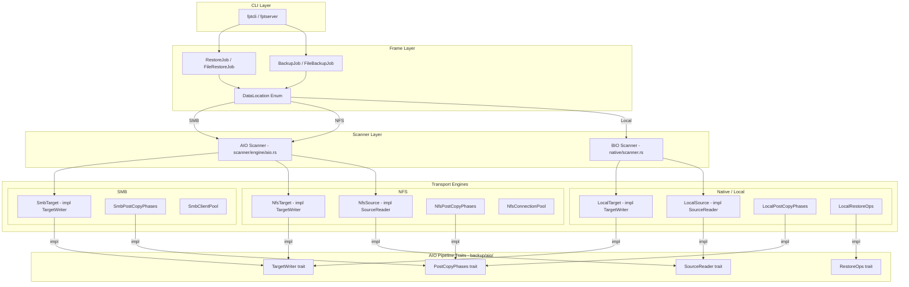

# Transport Engine Overview

fpt-rs supports three **transport engines** -- Native/Local, NFS, and SMB -- that
abstract away the differences between storage systems. Each engine implements a
common set of traits so the backup and restore pipelines work identically
regardless of where the source or target data lives.

## The `DataLocation` Enum

All source and target paths in fpt-rs are represented by the `DataLocation` enum,
defined in `src/frame/location.rs`:

```rust
/// Where the user's data lives — local path, NFS export, or SMB share.
///
/// Used for both source and target sides of a backup or restore job.
#[derive(Debug, Clone)]
pub enum DataLocation {
    /// Standard local filesystem path.
    Local(PathBuf),

    /// NFSv3 export accessed via direct RPC (no kernel mount required).
    #[cfg(feature = "nfs")]
    Nfs(crate::nfs::NfsLocation),

    /// SMB share accessed via an async SMB client.
    #[cfg(feature = "smb")]
    Smb(crate::smb::SmbLocation),
}
```

Each variant carries the information needed to connect and operate on its
respective storage system:

| Variant    | Payload        | Connection model                          |
|------------|----------------|-------------------------------------------|
| `Local`    | `PathBuf`      | Direct `std::fs` / `libc` syscalls        |
| `Nfs`      | `NfsLocation`  | NFSv3 RPC via `nfs3_client` (no kernel mount) |
| `Smb`      | `SmbLocation`  | SMB2/3 async client via `smb_client`      |

### Constructors and Parsers

`DataLocation` provides convenience constructors and URL parsers:

```rust
// Local path
DataLocation::local("/opt/data")

// NFS URL (requires `nfs` feature)
DataLocation::from_nfs_url("nfs://192.168.1.10/export?sub=/ds1")?

// SMB URL (requires `smb` feature)
DataLocation::from_smb_url("smb://server/share?username=u&password=p")?
```

The `from_nfs_url()` and `from_smb_url()` methods return a clear error when the
corresponding Cargo feature is not compiled in:

```rust
pub fn from_nfs_url(url: &str) -> Result<Self, String> {
    #[cfg(feature = "nfs")]
    {
        let loc = crate::nfs::NfsLocation::from_url(url)?;
        Ok(DataLocation::Nfs(loc))
    }
    #[cfg(not(feature = "nfs"))]
    {
        let _ = url;
        Err("NFS support is not compiled in — rebuild with `--features nfs`".to_string())
    }
}
```

### Query and Display Methods

The enum provides introspection and display helpers:

```rust
pub fn is_local(&self) -> bool   // true for Local variant
pub fn is_nfs(&self) -> bool     // true for Nfs variant (false if feature off)
pub fn is_smb(&self) -> bool     // true for Smb variant (false if feature off)

pub fn local_path(&self) -> Option<&PathBuf>           // inner path for Local
pub fn nfs_location(&self) -> Option<&NfsLocation>     // inner for Nfs
pub fn smb_location(&self) -> Option<&SmbLocation>     // inner for Smb

pub fn display_string(&self) -> String  // human-readable (used in logs/manifests)
pub fn base_path(&self) -> PathBuf      // effective root for path-stripping
pub fn kind_name(&self) -> &'static str // "local", "nfs", or "smb"
```

The `base_path()` method returns the path used for control-file path stripping:

- **Local**: the `PathBuf` itself
- **NFS**: `{export}/{sub_path}` -- the absolute NFS path
- **SMB**: `SmbLocation::synthetic_root()` -- a synthetic UNC-derived path

The `kind_name()` method returns a stable string (`"local"`, `"nfs"`, `"smb"`)
used in control-file headers to identify the source transport type.

## Architecture Diagram



## Pluggable Engine Design

Each transport is organized as a self-contained module with two submodules:

```text
src/
  frame/
    location.rs         # DataLocation enum definition
    traits.rs           # FileScanner, FileBackup, FileRestore, BackupRestoreJob
    backup_impls.rs     # 9 FileBackup implementations (all source/target combos)
    restore_impls.rs    # 3 FileRestore implementations
    backup_job.rs       # FileBackupJob orchestrator
    restore_job.rs      # FileRestoreJob orchestrator

  backup/
    aio/
      transport.rs      # SourceReader, TargetWriter traits + LocalSource, LocalTarget
      phases_trait.rs   # PostCopyPhases trait (hardlink, delete, mtime)
      restore_ops.rs    # RestoreOps trait (symlink, metadata)
      local_fs.rs       # read_local_file_chunk, write_local_file_chunk
    copy_block.rs       # CopyBlock transfer unit
    fcb.rs              # FileControlBlock

  scanner/
    engine/
      aio.rs            # AsyncDirScanner trait + run_aio_scan() bridge

  native/
    scanner.rs          # BIO blocking directory traversal workers
    backup/
      hardlink.rs       # Hardlink creation
      delete.rs         # File/dir deletion
      mtime.rs          # Mtime restoration
      phases_impl.rs    # PostCopyPhases impl
      restore_ops.rs    # RestoreOps impl

  nfs/
    connection.rs       # NfsConnectionPool (TCP + AUTH_UNIX)
    scanner.rs          # Async readdirplus scanner + NfsScanAdapter
    backup/
      transport.rs      # NfsSource (SourceReader) / NfsTarget (TargetWriter)
      reader.rs         # NFS READ RPCs + FileHandleCache
      writer.rs         # NFS WRITE RPCs + DirHandleCache
      hardlink.rs       # NFS LINK RPCs
      delete.rs         # NFS REMOVE/RMDIR RPCs
      mtime.rs          # NFS SETATTR RPCs
      phases_impl.rs    # PostCopyPhases impl

  smb/
    connection.rs       # SmbClientPool + DirCache
    scanner.rs          # Async FileIdBothDirectoryInformation scanner
    backup/
      transport.rs      # SmbTarget (TargetWriter)
      writer.rs         # SMB write + mkdir
      executor.rs       # SMB streaming copy orchestrator
      hardlink.rs       # SMB hardlink operations
      delete.rs         # SMB delete operations
      mtime.rs          # SMB mtime restoration
      phases_impl.rs    # PostCopyPhases impl
```

## Source/Target Matrix

Any transport can serve as source, target, or both:

| Source \ Target | Local | NFS | SMB |
|-----------------|-------|-----|-----|
| **Local**       | Yes   | Yes | Yes |
| **NFS**         | Yes   | Yes | Yes |
| **SMB**         | Yes   | Yes | Yes |

The frame layer selects the correct `FileBackup` / `FileRestore` implementation
based on the `DataLocation` variants for source and target. For example:

- `LocalFileBackup` -- local source, local target (BIO pipeline)
- `NfsSourceTargetFileBackup` -- NFS source, NFS target (AIO pipeline)
- `NfsSourceSmbTargetFileBackup` -- NFS source, SMB target (AIO pipeline)
- `SmbSourceNfsTargetFileBackup` -- SMB source, NFS target (AIO pipeline)

## The CopyBlock Transfer Unit

All data movement goes through `CopyBlock` (`src/backup/copy_block.rs`), the
common transfer unit shared by all transports:

```rust
#[derive(Debug, Clone)]
pub struct CopyBlock {
    pub meta: Arc<FileMeta>,   // file metadata (permissions, timestamps, etc.)
    pub src_path: PathBuf,      // source file path
    pub dst_path: PathBuf,      // destination file path
    pub src_offset: u64,        // current read offset in source
    pub dst_offset: u64,        // current write offset in destination
    pub file_size: u64,         // total file size
    pub data: Vec<u8>,          // payload bytes
    pub is_last: bool,          // true when src_offset >= file_size
}
```

`CopyBlock` converts to/from `FileControlBlock` (FCB) for integration with the
control-file-driven pipeline. The `is_last` flag signals end-of-file to the
pipeline without requiring a separate EOF message.

## Feature Flags

NFS and SMB transports are gated behind Cargo feature flags:

```toml
[features]
default = []
nfs = ["nfs3_client"]
smb = ["smb_client"]
```

When a feature is not enabled, the corresponding `DataLocation` variant and all
associated code are compiled out. CLI tools return a clear error message if a
URL is provided but the feature is not compiled in.

## Scanning: Bio vs Aio

The scanner engine has two modes:

- **BIO (Blocking I/O)** -- used by the native/local transport. Spawns OS
  threads that call `std::fs` to traverse directories. Results flow through a
  `BlockingQueue` to metadata writer threads.

- **AIO (Async I/O)** -- used by NFS and SMB transports. An `AsyncDirScanner`
  implementation runs inside a Tokio runtime, pushing `DirBatchScanResult`
  batches into a tokio mpsc channel. A bridge task forwards these into the
  shared `BlockingQueue` for metadata writing.

Both paths converge on the same metadata writer and control-file generation
logic, so the output format is transport-independent.

### The `AsyncDirScanner` Trait

The AIO scanner engine (`src/scanner/engine/aio.rs`) defines the trait that
NFS and SMB scanners implement:

```rust
pub trait AsyncDirScanner: Send + 'static {
    type Error: std::fmt::Display + Send + 'static;

    fn scan(
        self,
        scan_option: Arc<ScanOption>,
        tx: tokio::sync::mpsc::Sender<DirBatchScanResult>,
    ) -> Pin<Box<dyn Future<Output = Result<(), Self::Error>> + Send>>;
}
```

The shared `run_aio_scan()` function handles the scaffolding:

1. Create output `BlockingQueue` and `ScanStatistics`
2. Start metadata writer threads (or stats-only consumers)
3. Spawn the async scanner task on a tokio runtime
4. Bridge results from `tokio::sync::mpsc` to `BlockingQueue`
5. Wait for scanner completion
6. Close queue, join writers, generate control files

```rust
pub async fn run_aio_scan<S: AsyncDirScanner>(
    scanner: S,
    scan_option: ScanOption,
) -> Result<AioScanResult, String>
```
