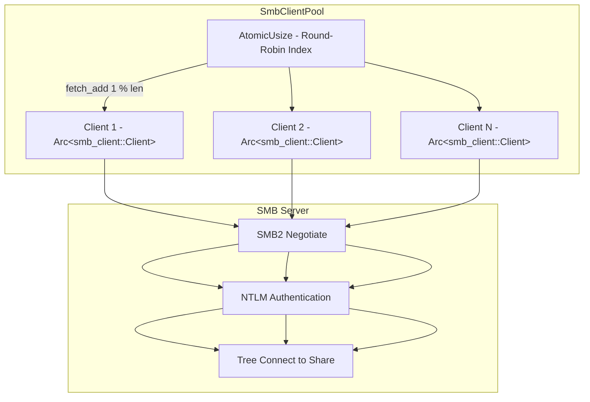
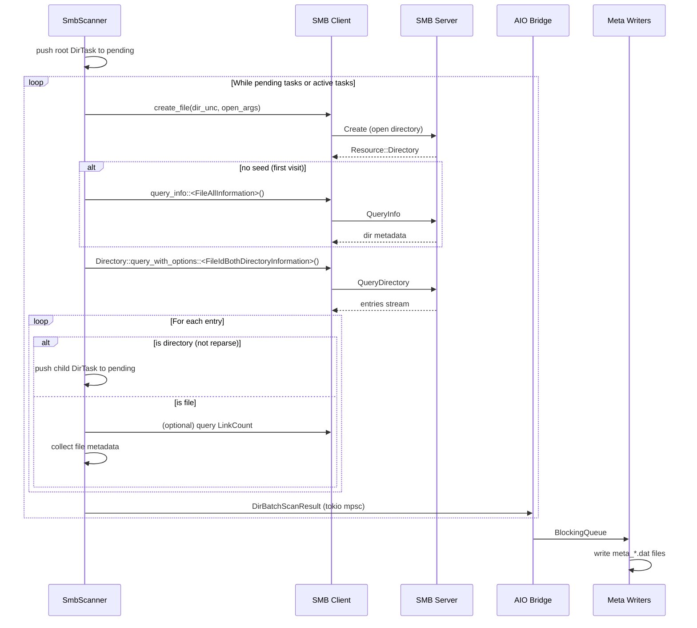
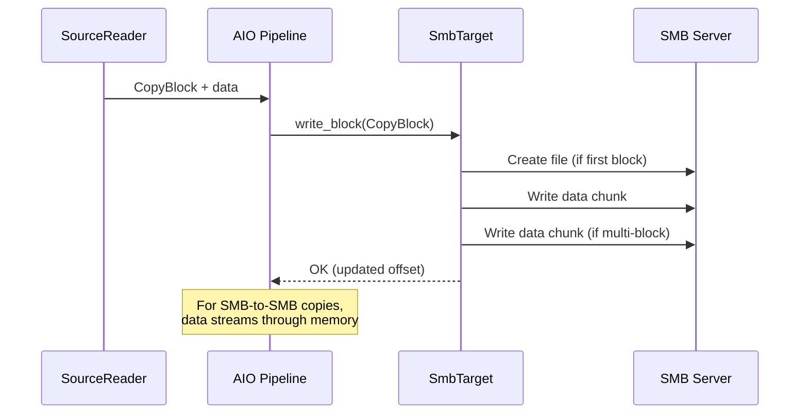

# SMB Transport

The SMB transport enables fpt-rs to read from and write to SMB/CIFS file shares
using an async SMB2/3 client. It supports Windows shares, Samba, and any
SMB2-compatible server.

:::info Feature Flag
The SMB transport is gated behind the `smb` Cargo feature. Build with
`--features smb` to enable it.
:::

## SMB URL Format

SMB locations are specified as URLs with the `smb://` or `smb:\\` scheme:

```text
smb://host[:port]/share[/sub-path][?username=u&password=p]
smb:\\host\share[\sub-path][?username=u&password=p]
```

### Components

| Component   | Required | Description                                      |
|-------------|----------|--------------------------------------------------|
| `host`      | Yes      | SMB server hostname or IP address                |
| `port`      | No       | SMB port (default: 445)                          |
| `share`     | Yes      | SMB share name (e.g. `backups`)                  |
| `sub-path`  | No       | Sub-path within the share                        |
| `username`  | No       | Authentication username                          |
| `password`  | No       | Authentication password                          |

### Examples

```text
smb://192.168.1.10/backups
smb://nas.local/data/root?username=admin&password=secret
smb://10.0.0.5/share/dataset1?username=backup&password=pass
smb:\\server\share\path?username=u&password=p
```

### Display Form

The `display_string()` method redacts the password for safe logging:

```text
smb://192.168.1.10/backups?username=admin
```

## SmbClientPool

The `SmbClientPool` (`src/smb/connection.rs`) manages a pool of authenticated
SMB client connections using round-robin selection:



### Pool Structure

```rust
pub struct SmbClientPool {
    clients: Vec<Arc<smb_client::Client>>,
    next: AtomicUsize,
}
```

### Pool Initialization

`SmbClientPool::connect(location, size)` performs for each client:

```rust
pub async fn connect(location: &SmbLocation, size: usize) -> Result<Arc<Self>, String> {
    let pool_size = size.max(1);
    let mut clients = Vec::with_capacity(pool_size);
    for _ in 0..pool_size {
        clients.push(connect_client(location).await?);
    }
    Ok(Arc::new(Self { clients, next: AtomicUsize::new(0) }))
}
```

Each `connect_client()` call performs:

1. **Connect** -- TCP connection to `host:port`.
2. **Negotiate** -- SMB2 protocol negotiation (SMB2-only mode, NTLM auth).
3. **Authenticate** -- NTLM authentication with the provided username/password.
4. **Tree Connect** -- Connect to the share (`\\host\share`).

### Client Acquisition

Round-robin selection with no locking needed (Arc is clone-safe):

```rust
pub fn client(&self) -> Arc<smb_client::Client> {
    let idx = self.next.fetch_add(1, Ordering::Relaxed) % self.clients.len();
    Arc::clone(&self.clients[idx])
}
```

### Directory Cache

The `DirCache` (`smb::connection::DirCache`) is a shared `HashSet<String>` that
tracks directories known to exist, avoiding redundant MKDIR RPCs during backup:

```rust
pub type DirCache = Arc<Mutex<HashSet<String>>>;

pub fn new_dir_cache() -> DirCache {
    Arc::new(Mutex::new(HashSet::new()))
}
```

### Share Comparison

A utility function checks if two SMB locations point to the same share:

```rust
pub fn same_share(source: &SmbLocation, target: &SmbLocation) -> bool {
    source.host.eq_ignore_ascii_case(&target.host)
        && source.share.eq_ignore_ascii_case(&target.share)
        && source.port == target.port
        && source.username == target.username
        && source.password == target.password
}
```

## SmbScanner

The `SmbScanner` (`src/smb/scanner.rs`) traverses SMB shares using the
**QueryDirectory** SMB2 operation with `FileIdBothDirectoryInformation`
information class.

### Scanner Structure

```rust
#[derive(Clone)]
pub struct SmbScanner {
    client: Arc<smb_client::Client>,
    location: SmbLocation,
    devno: u64,                      // deterministic device number
    metrics: Arc<SmbScanMetrics>,    // timing metrics
    retry_policy: RetryPolicy,
    failure_recorder: Option<FailureRecorder>,
}
```

The scanner tracks detailed timing metrics for performance analysis:

```rust
struct SmbScanMetrics {
    dir_open_calls: AtomicU64,       dir_open_ns: AtomicU64,
    dir_query_info_calls: AtomicU64, dir_query_info_ns: AtomicU64,
    dir_query_calls: AtomicU64,      dir_query_ns: AtomicU64,
    link_count_calls: AtomicU64,     link_count_ns: AtomicU64,
    close_calls: AtomicU64,          close_ns: AtomicU64,
}
```

### Scanning Sequence



### Concurrency Model

Unlike NFS (which uses a shared work queue), SMB scanning uses `JoinSet` for
structured concurrency:

```rust
pub async fn scan(&self, scan_option: &ScanOption, tx: mpsc::Sender<...>) -> Result<(), String> {
    let mut pending = vec![DirTask { unc: root_unc, path: root_path, depth: 0, seed: None }];
    let max_concurrent = scan_option.worker_count.max(1);
    let mut active = tokio::task::JoinSet::<DirScanOutput>::new();

    while !pending.is_empty() || !active.is_empty() {
        // Spawn tasks up to max_concurrent
        while active.len() < max_concurrent && !pending.is_empty() {
            let task = pending.pop().expect("pending non-empty");
            let scanner = self.clone();
            active.spawn(async move { scanner.scan_one_dir(task, &scan_option).await });
        }
        // Collect results
        match active.join_next().await {
            Some(Ok(output)) => {
                if let Some(batch) = output.batch { let _ = tx.send(batch).await; }
                pending.extend(output.children);
            }
            Some(Err(e)) => return Err(format!("SMB scan task panicked: {e}")),
            None => break,
        }
    }
    Ok(())
}
```

Each directory scan task returns a `DirScanOutput` containing the batch and
child directories to process:

```rust
struct DirTask {
    unc: UncPath,
    path: String,
    depth: usize,
    seed: Option<SmbDirSeed>,  // pre-resolved dir metadata from parent's query
}

struct DirScanOutput {
    batch: Option<DirBatchScanResult>,
    children: Vec<DirTask>,
}
```

### Seed Optimization

When a directory is discovered as a child entry during its parent's
QueryDirectory, the scanner saves the entry metadata as a `SmbDirSeed`. This
avoids a redundant `query_info()` RPC when the child directory is later opened
for enumeration:

```rust
// In the parent scan:
children.push(DirTask {
    unc: child_unc,
    path: child_path,
    depth: task.depth + 1,
    seed: Some(smb_dir_seed_from_entry(&entry)),  // save metadata from parent query
});

// In the child scan:
let batch_dir = if let Some(seed) = &task.seed {
    smb_seed_to_dir_meta(seed, &task.path, self.devno)  // use saved metadata
} else {
    dir.query_info::<FileAllInformation>()  // fallback: query the server
};
```

### Hardlink Detection

When `scan_hardlinks` is enabled, the scanner queries `FileStandardInformation`
for each file to get the link count:

```rust
async fn query_link_count(&self, path: &UncPath) -> Result<u64, String> {
    let resource = self.client.create_file(path, &open_args).await?;
    let standard = match &resource {
        Resource::File(file) => file.query_info::<FileStandardInformation>().await?,
        Resource::Directory(dir) => dir.query_info::<FileStandardInformation>().await?,
        Resource::Pipe(_) => return Ok(1),
    };
    Ok(u64::from(standard.number_of_links))
}
```

### SmbScanAdapter

The `SmbScanAdapter` wraps `SmbScanner` and implements `AsyncDirScanner`:

```rust
pub(crate) struct SmbScanAdapter {
    pub scanner: SmbScanner,
}

impl AsyncDirScanner for SmbScanAdapter {
    type Error = String;

    fn scan(
        self,
        scan_option: Arc<ScanOption>,
        tx: tokio::sync::mpsc::Sender<DirBatchScanResult>,
    ) -> Pin<Box<dyn Future<Output = Result<(), Self::Error>> + Send>> {
        Box::pin(async move { self.scanner.scan(&scan_option, tx).await })
    }
}
```

## Backup Pipeline

### SmbTarget (TargetWriter)

`SmbTarget` (`src/smb/backup/transport.rs`) implements `TargetWriter` for writing
data to SMB shares:

```rust
#[derive(Clone)]
pub struct SmbTarget {
    pub location: SmbLocation,
    pub pool: Arc<SmbClientPool>,
    pub dir_cache: DirCache,
    pub buffer_size: usize,
}

impl TargetWriter for SmbTarget {
    fn create_dir(&self, path: PathBuf) -> BoxFuture<'static, Result<(), String>> {
        let this = self.clone();
        Box::pin(async move {
            let client = this.pool.client();
            ensure_relative_directory(&client, &this.location, &this.dir_cache,
                &path.to_string_lossy().replace('\\', "/"))
            .await
        })
    }

    fn write_block(&self, mut block: CopyBlock) -> BoxFuture<'static, Result<CopyBlock, ...>> {
        let this = self.clone();
        Box::pin(async move {
            let rel_path = block.dst_path.to_string_lossy().replace('\\', "/");
            let client = this.pool.client();
            match write_relative_file_chunk(
                &client, &this.location, &this.dir_cache, &rel_path,
                &block.data, block.dst_offset,
                clamp_copy_buffer_size(this.buffer_size),
            ).await {
                Ok(()) => {
                    block.dst_offset = block.dst_offset.saturating_add(block.data.len() as u64);
                    Ok(block)
                }
                Err(msg) => Err((block, msg)),
            }
        })
    }

    fn finish(&self) -> BoxFuture<'static, Result<(), String>> {
        let this = self.clone();
        Box::pin(async move { this.pool.close().await })
    }
}
```

- **`create_dir()`** -- uses `ensure_relative_directory()` which checks the
  `DirCache` before issuing MKDIR RPCs.
- **`write_block()`** -- opens or creates the target file, writes data in chunks,
  then closes the file handle. Paths use forward slashes.
- **`finish()`** -- closes all connections in the pool.

### Streaming Copy

The SMB backup pipeline uses a streaming copy model where data flows through
memory without intermediate staging:



The copy buffer size is clamped between 256 KB and 4 MB. SMB source reads are
capped at 2048 KiB; SMB writes stay capped at 256 KiB per operation.

### SMB Post-Copy Phases

The `SmbPostCopyPhases` struct implements post-copy phases using SMB operations:

| Phase     | SMB Operations Used                           |
|-----------|-----------------------------------------------|
| Hardlink  | SMB2 IOCTL (FSCTL_SET_SPARSE + hardlink)      |
| Delete    | SMB2 SetInfo (disposition delete) + Close      |
| Mtime     | SMB2 SetInfo (basic information) + Close       |

### SmbClient Configuration

The SMB client is configured with these defaults (from `smb::client_config()`):

| Setting                       | Value   |
|-------------------------------|---------|
| DFS                           | Disabled |
| Kerberos                      | Disabled |
| NTLM                          | Enabled  |
| Compression                   | Disabled |
| Notifications                 | Disabled |
| SMB2-only negotiate           | Enabled  |
| Unsigned guest access         | Enabled  |

## Key Source Files

| File                           | Purpose                                       |
|--------------------------------|-----------------------------------------------|
| `src/smb/connection.rs`        | `SmbClientPool`, `DirCache`, `connect_client()` |
| `src/smb/scanner.rs`           | `SmbScanner`, `SmbScanAdapter`, `run_smb_scan()`, `SmbScanMetrics` |
| `src/smb/backup/transport.rs`  | `SmbTarget` (TargetWriter implementation)     |
| `src/smb/backup/writer.rs`     | SMB write/mkdir helpers                       |
| `src/smb/backup/executor.rs`   | SMB streaming copy orchestrator               |
| `src/smb/backup/hardlink.rs`   | SMB hardlink phase                            |
| `src/smb/backup/delete.rs`     | SMB delete phase                              |
| `src/smb/backup/mtime.rs`      | SMB mtime phase                               |
| `src/smb/backup/phases_impl.rs`| `PostCopyPhases` trait implementation         |
| `src/smb/fstat.rs`             | SMB file stat helpers                         |
