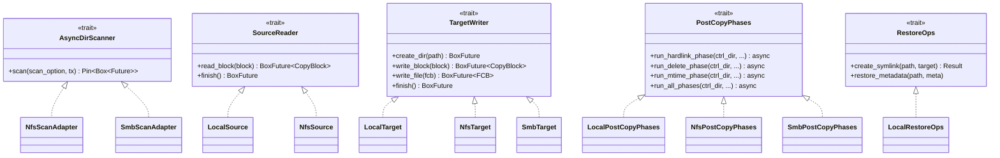
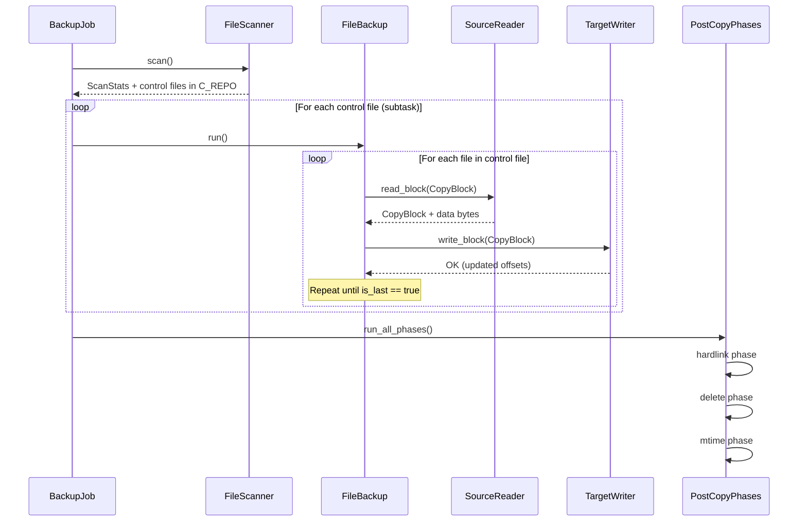
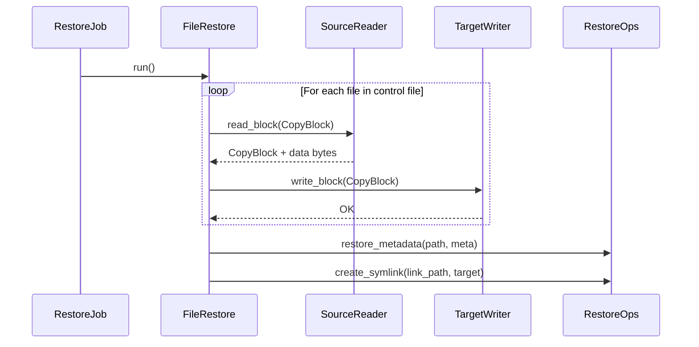

# Trait System

fpt-rs uses a trait-based architecture to decouple the backup/restore pipeline
from specific transport implementations. This page documents each trait, its
purpose, and how the three transports implement it.

## Trait Hierarchy



## AIO Pipeline Traits

These traits are defined in `src/backup/aio/` and power the async copy pipeline
used by all transports (local uses blocking threads wrapped in async; NFS and
SMB use native async I/O).

### `SourceReader`

**File:** `src/backup/aio/transport.rs`

Reads data blocks from a source location. Each `read_block()` call returns a
`CopyBlock` containing the data bytes and updated offset. The `is_last` flag
signals when the entire file has been read.

```rust
pub trait SourceReader: Clone + Send + Sync + 'static {
    fn read_block(
        &self,
        block: CopyBlock,
    ) -> BoxFuture<'static, Result<CopyBlock, (CopyBlock, String)>>;

    fn finish(&self) -> BoxFuture<'static, Result<(), String>> {
        Box::pin(async { Ok(()) })
    }
}
```

**Key design points:**

- Requires `Clone + Send + Sync + 'static` so each pipeline task can own a copy.
- Returns `BoxFuture` for async dispatch -- local transport wraps blocking I/O
  in `task::spawn_blocking()`, NFS uses native async RPCs.
- On error, returns the `CopyBlock` back so the caller can retry or record the failure.
- `finish()` has a default no-op implementation for transports that need cleanup.

**Implementations:**

| Struct       | Transport | Read Mechanism                              | File                        |
|--------------|-----------|---------------------------------------------|-----------------------------|
| `LocalSource`| Local     | `task::spawn_blocking(read_local_file_chunk)` | `src/backup/aio/transport.rs` |
| `NfsSource`  | NFS       | NFS READ RPCs via `nfs_read_task()`         | `src/nfs/backup/transport.rs` |

**LocalSource** reads file data via blocking I/O on a spawned thread:

```rust
#[derive(Clone)]
pub struct LocalSource {
    pub buffer_size: usize,
}
```

**NfsSource** uses the NFS connection pool and file handle cache:

```rust
#[derive(Clone)]
pub struct NfsSource {
    pub pool: Arc<NfsConnectionPool>,
    pub dir_cache: FileHandleCache,
    pub root_fh: nfs_fh3,
    pub read_chunk: u32,
    pub buffer_size: usize,
}
```

### `TargetWriter`

**File:** `src/backup/aio/transport.rs`

Writes data blocks to a target location. `create_dir()` ensures a directory
exists. `write_block()` writes one chunk of data. `write_file()` is a convenience
method that converts an FCB to a CopyBlock and delegates to `write_block()`.

```rust
pub trait TargetWriter: Clone + Send + Sync + 'static {
    fn create_dir(&self, path: PathBuf) -> BoxFuture<'static, Result<(), String>>;

    fn write_block(
        &self,
        block: CopyBlock,
    ) -> BoxFuture<'static, Result<CopyBlock, (CopyBlock, String)>>;

    fn write_file(
        &self,
        fcb: FileControlBlock,
    ) -> BoxFuture<'static, Result<FileControlBlock, (FileControlBlock, String)>> {
        let this = self.clone();
        Box::pin(async move {
            let block = CopyBlock::from_fcb(fcb);
            match this.write_block(block).await {
                Ok(block) => Ok(block.into_fcb()),
                Err((block, msg)) => Err((block.into_fcb(), msg)),
            }
        })
    }

    fn finish(&self) -> BoxFuture<'static, Result<(), String>> {
        Box::pin(async { Ok(()) })
    }
}
```

**Key design points:**

- `write_file()` has a default implementation that converts FCB to CopyBlock
  and delegates to `write_block()`.
- `finish()` has a default no-op; SMB overrides it to close pool connections.
- On error, returns the `CopyBlock` back for retry/failure recording.

**Implementations:**

| Struct       | Transport | Write Mechanism                              | File                        |
|--------------|-----------|----------------------------------------------|-----------------------------|
| `LocalTarget`| Local     | `task::spawn_blocking(write_local_file_chunk)` | `src/backup/aio/transport.rs` |
| `NfsTarget`  | NFS       | NFS WRITE RPCs via `nfs_write_task()`        | `src/nfs/backup/transport.rs` |
| `SmbTarget`  | SMB       | SMB WRITE ops via `write_relative_file_chunk()` | `src/smb/backup/transport.rs` |

**LocalTarget** writes to a base directory on the local filesystem:

```rust
#[derive(Clone)]
pub struct LocalTarget {
    pub base: PathBuf,
}
```

**NfsTarget** uses the NFS connection pool and directory handle cache:

```rust
#[derive(Clone)]
pub struct NfsTarget {
    pub pool: Arc<NfsConnectionPool>,
    pub dir_cache: DirHandleCache,
    pub root_fh: nfs_fh3,
    pub write_chunk: u32,
    pub buffer_size: usize,
}
```

**SmbTarget** uses the SMB client pool and directory existence cache:

```rust
#[derive(Clone)]
pub struct SmbTarget {
    pub location: SmbLocation,
    pub pool: Arc<SmbClientPool>,
    pub dir_cache: DirCache,
    pub buffer_size: usize,
}
```

### `AsyncDirScanner`

**File:** `src/scanner/engine/aio.rs`

Abstracts over protocol-specific async directory scanners. Both NFS and SMB
scanners implement this trait (via adapter structs) so the shared
`run_aio_scan()` function can drive either one.

```rust
pub trait AsyncDirScanner: Send + 'static {
    type Error: std::fmt::Display + Send + 'static;

    fn scan(
        self,
        scan_option: Arc<ScanOption>,
        tx: tokio::sync::mpsc::Sender<DirBatchScanResult>,
    ) -> Pin<Box<dyn Future<Output = Result<(), Self::Error>> + Send>>;
}
```

**Implementations:**

| Adapter           | Wraps          | Module               |
|-------------------|----------------|----------------------|
| `NfsScanAdapter`  | `NfsScanner`   | `src/nfs/scanner.rs` |
| `SmbScanAdapter`  | `SmbScanner`   | `src/smb/scanner.rs` |

The shared `run_aio_scan()` function handles the scaffolding:

```rust
pub async fn run_aio_scan<S: AsyncDirScanner>(
    scanner: S,
    scan_option: ScanOption,
) -> Result<AioScanResult, String>
```

Steps:
1. Create output `BlockingQueue` and `ScanStatistics`
2. Start metadata writer threads (or stats-only consumers)
3. Spawn the async scanner task
4. Bridge results from `tokio::sync::mpsc` to `BlockingQueue` (incrementing stats)
5. Wait for scanner completion
6. Close queue, join writers, generate control files

### `PostCopyPhases`

**File:** `src/backup/aio/phases_trait.rs`

Runs post-copy phases (hardlink, delete, mtime) on the target filesystem.
Default implementations are no-ops, so transports only override what they
support. `run_all_phases()` calls all three in order.

```rust
pub trait PostCopyPhases: Send + Sync {
    async fn run_hardlink_phase(
        &self,
        _ctrl_dir: &Path,
        _source_dir_base: &Path,
        _target_prefix: &str,
        _phase_flags: PhaseFlags,
        _retry_policy: RetryPolicy,
        _failure_recorder: Option<&FailureRecorder>,
    ) { /* default: no-op */ }

    async fn run_delete_phase(&self, ...) { /* default: no-op */ }
    async fn run_mtime_phase(&self, ...) { /* default: no-op */ }

    async fn run_all_phases(
        &self,
        ctrl_dir: &Path,
        source_dir_base: &Path,
        target_prefix: &str,
        phase_flags: PhaseFlags,
        retry_policy: RetryPolicy,
        failure_recorder: Option<&FailureRecorder>,
    ) {
        self.run_hardlink_phase(ctrl_dir, source_dir_base, target_prefix,
            phase_flags, retry_policy, failure_recorder).await;
        self.run_delete_phase(ctrl_dir, source_dir_base, target_prefix,
            phase_flags, retry_policy, failure_recorder).await;
        self.run_mtime_phase(ctrl_dir, source_dir_base, target_prefix,
            phase_flags, retry_policy, failure_recorder).await;
    }
}
```

**Implementations:**

| Struct               | Transport | Module                           |
|----------------------|-----------|----------------------------------|
| `LocalPostCopyPhases`| Local     | `src/native/backup/phases_impl.rs` |
| `NfsPostCopyPhases`  | NFS       | `src/nfs/backup/phases_impl.rs`  |
| `SmbPostCopyPhases`  | SMB       | `src/smb/backup/phases_impl.rs`  |

### `RestoreOps`

**File:** `src/backup/aio/restore_ops.rs`

Transport-specific operations needed during restore. Default implementations are
no-ops. Only local targets override these -- remote targets handle metadata
through their own transport-specific mechanisms during write operations.

```rust
pub trait RestoreOps: Send + Sync {
    /// Create a symlink at `link_path` pointing to `target`.
    fn create_symlink(&self, _link_path: &Path, _target: &str) -> Result<(), String> {
        Ok(())
    }

    /// Restore common metadata (permissions, timestamps, xattrs, ACLs) on a file.
    fn restore_metadata(&self, _path: &Path, _meta: &MetaCommon) {}
}
```

**Implementations:**

| Struct            | Transport | Module                            |
|-------------------|-----------|-----------------------------------|
| `LocalRestoreOps` | Local     | `src/native/backup/restore_ops.rs` |

## Frame-Level Traits

These traits are defined in `src/frame/traits.rs` and provide the high-level
job orchestration interface. They are not directly transport-specific -- the
frame layer selects the correct implementation based on `DataLocation` variants.

### `BackupRestoreJob`

```rust
pub trait BackupRestoreJob {
    type Error: std::error::Error + Send + 'static;
    fn run(self) -> Result<JobResult, Self::Error>;
}
```

Drives the complete four-phase pipeline (prerequisite, scan, subtasks, post-job)
in a single blocking call.

**Implementations:**

| Struct            | Direction | Module                        |
|-------------------|-----------|-------------------------------|
| `FileBackupJob`   | Backup    | `src/frame/backup_job.rs`     |
| `FileRestoreJob`  | Restore   | `src/frame/restore_job.rs`    |

## Data Flow: Backup Pipeline



## Data Flow: Restore Pipeline



## CopyBlock: The Transfer Unit

All data movement goes through `CopyBlock` (`src/backup/copy_block.rs`):

```rust
#[derive(Debug, Clone)]
pub struct CopyBlock {
    pub meta: Arc<FileMeta>,   // file metadata (permissions, timestamps, etc.)
    pub src_path: PathBuf,      // source file path
    pub dst_path: PathBuf,      // destination file path
    pub src_offset: u64,        // current read offset in source
    pub dst_offset: u64,        // current write offset in destination
    pub file_size: u64,         // total file size
    pub data: Vec<u8>,          // payload bytes
    pub is_last: bool,          // true when src_offset >= file_size
}
```

CopyBlock converts to/from `FileControlBlock` (FCB):

```rust
impl CopyBlock {
    pub fn from_fcb(fcb: FileControlBlock) -> Self { ... }
    pub fn into_fcb(self) -> FileControlBlock { ... }
}
```

The buffer size is clamped between 256 KB and 4 MB:

```rust
pub const DEFAULT_COPY_BUFFER_SIZE: usize = 1024 * 1024; // 1 MB

pub fn clamp_copy_buffer_size(size: usize) -> usize {
    size.clamp(256 * 1024, 4 * 1024 * 1024)
}
```
