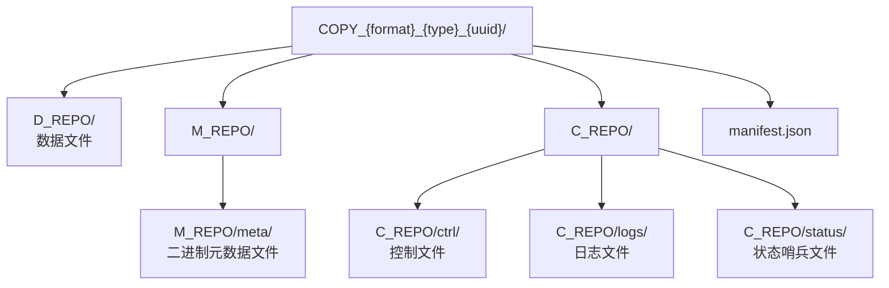
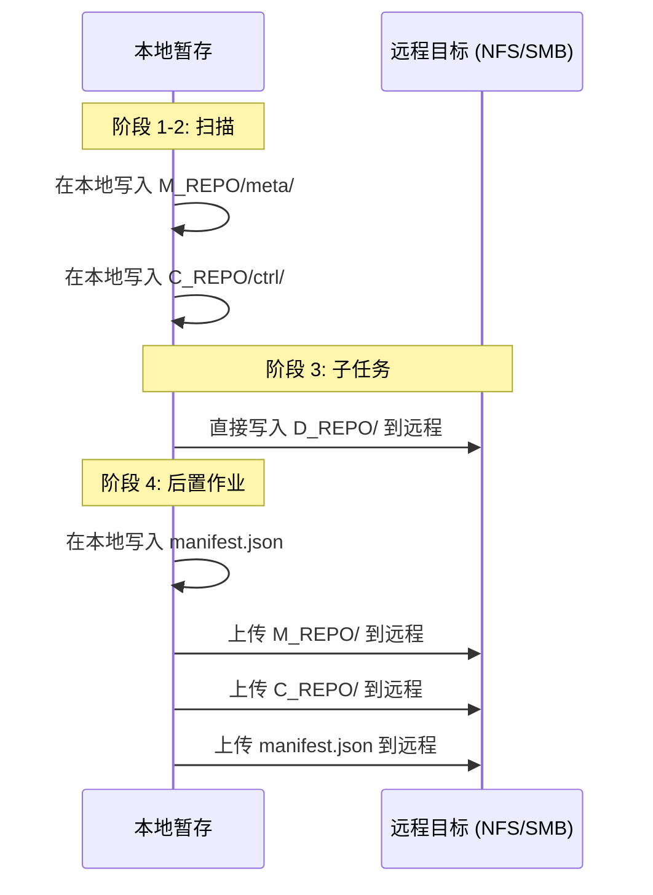

# 副本布局

每次 fpt-rs 备份都会产生一个**副本目录**，包含所有数据、元数据、控制文件、日志和清单。本文档描述了目录结构、文件命名约定、二进制格式以及管理它们的实际代码。

## 副本目录命名

每次备份作业创建一个目录，命名模式由 `RepoLayout::new()` 在 `src/frame/repo.rs:61` 生成：

```rust
pub fn new(base_dir: &Path, format_tag: &str, type_tag: &str) -> Self {
    let uuid = Uuid::new_v4().to_string();
    let folder = format!("COPY_{format_tag}_{type_tag}_{uuid}");
    let copy_root = base_dir.join(folder);
    Self::from_root(copy_root, uuid)
}
```

| 组件 | 值 | 描述 |
|-----------|--------|-------------|
| `format` | `COMMON`、`AGGREGATED` | 是否启用聚合 |
| `type` | `FULL`、`INCREMENTAL` | 全量或增量备份 |
| `uuid` | UUIDv4 字符串 | 此副本的唯一标识符 |

## 目录结构



```text
COPY_{format}_{type}_{uuid}/
├── manifest.json                    # 作业元数据和子任务记录
├── D_REPO/                          # 数据文件（实际文件内容）
│   ├── <relative/path/to/file1>
│   └── ...
├── M_REPO/
│   └── meta/                        # 二进制元数据文件
│       ├── meta_00000000.dat
│       ├── fcache_00000000.dat      # 文件缓存（硬链接信息）
│       └── dcache_00000000.dat      # 目录缓存记录
└── C_REPO/
    ├── ctrl/                        # 二进制控制文件
    │   ├── copy_{hash}.control.bin
    │   ├── hardlink_{hash}.control.bin
    │   ├── delete_{hash}.control.bin
    │   └── mtime_{hash}.control.bin
    ├── logs/                        # 执行日志
    │   ├── scan.log
    │   ├── frame.log
    │   └── {subtask-uuid}.log
    └── status/                      # 状态哨兵文件
        ├── SCAN_{uuid}.DONE
        ├── SUBTASK_{uuid}.RUNNING
        └── SUBTASK_{uuid}.DONE
```

## 三个仓库

### D_REPO -- 数据仓库

D_REPO 持有**实际文件内容** -- 每个备份文件的字节，保留原始目录结构。

- 对于**本地目标**：D_REPO 直接写入副本根目录下。
- 对于**远程目标**（NFS/SMB）：D_REPO 由 AIO 流水线直接写入远程文件系统 -- 不会在本地暂存。
- 当启用**聚合**时，小文件被打包到 `A_REPO/` 目录中的聚合 blob 中。

### M_REPO -- 元数据仓库

M_REPO 持有扫描器产生的**二进制元数据文件**。这些文件使用固定大小的二进制格式以实现高效随机访问。

M_REPO 在作业期间**始终本地写入**，即使源或目标是远程的。对于远程目标，`PostJob` 在所有子任务完成后上传 M_REPO。

### C_REPO -- 控制仓库

C_REPO 持有**控制文件**（复制/删除/硬链接/修改时间）、**日志**和**状态哨兵**。

与 M_REPO 一样，C_REPO 始终本地写入，并由 `PostJob` 上传到远程目标。

## manifest.json

`manifest.json` 文件在后置作业阶段写入副本根目录。`BackupManifest` 结构体定义在 `src/frame/postjob.rs:95`：

```rust
#[derive(Debug, serde::Serialize, serde::Deserialize)]
pub struct BackupManifest {
    pub version: String,
    pub copy_uuid: String,
    pub copy_type: String,      // "full" | "incremental"
    pub format: String,         // "common" | "aggregated"
    pub source: String,
    pub target: String,
    pub created_at: String,
    pub base_copy: Option<String>,
    pub aggregation: Option<AggregationManifest>,
    pub subtasks: Vec<SubtaskRecord>,
}
```

## 远程目标行为

当目标是远程（NFS 或 SMB）时，`BackupPostJob` 处理上传：



此设计最小化本地磁盘使用：只有元数据和控制文件在本地暂存，而大量数据（D_REPO）直接流向远程目标。
