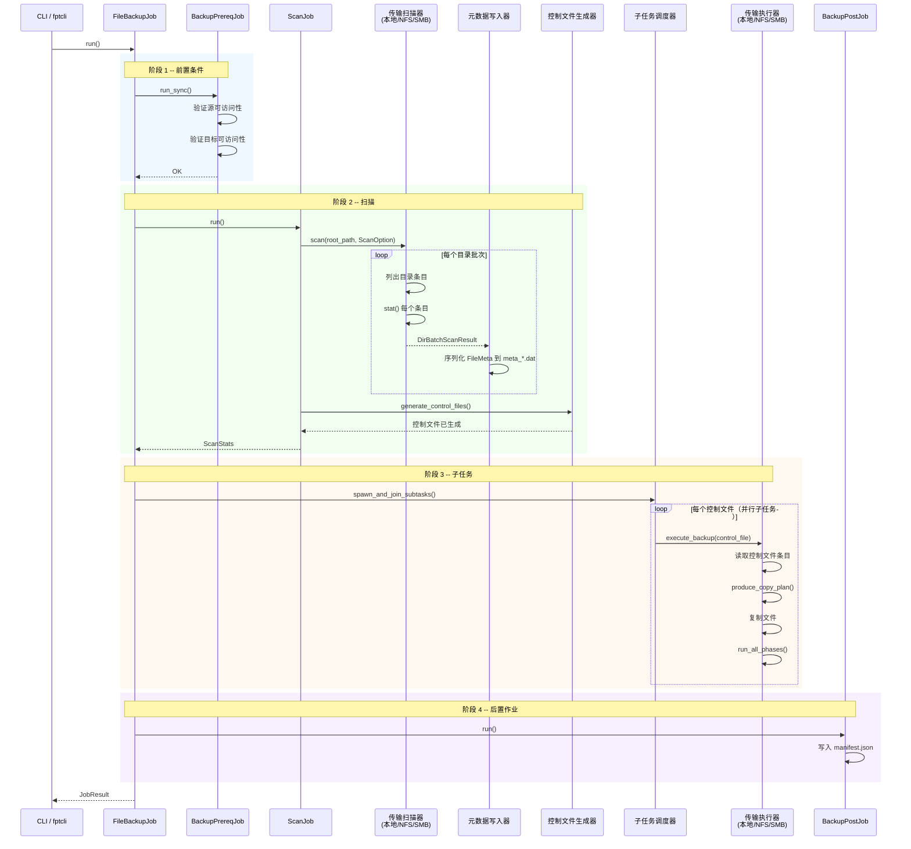
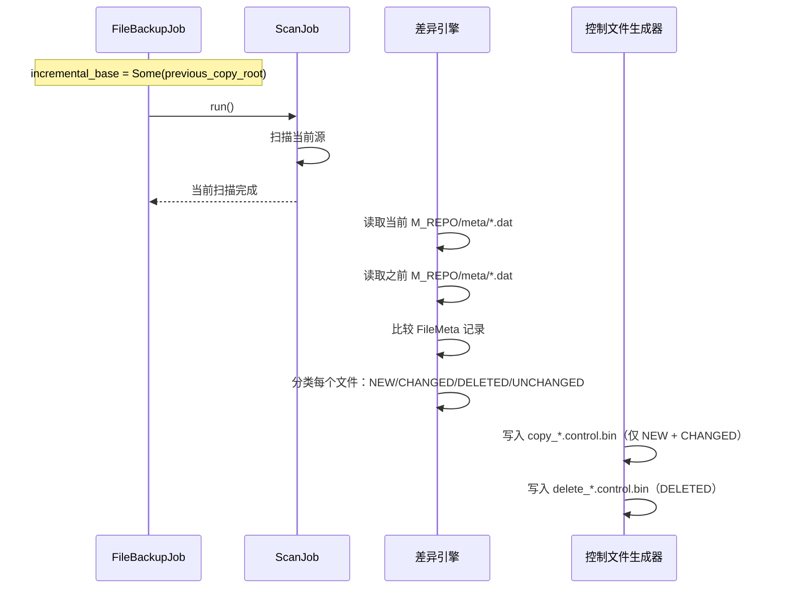

# 数据流

本文档追踪 fpt-rs 中三种主要操作的端到端数据流：**备份**、**恢复**和**增量备份**。序列图展示了 `DirBatchScanResult`、`FileControlBlock` 和 `CopyBlock` 如何在流水线中移动。

## 核心数据结构

### DirBatchScanResult

定义在 `src/scanner/models.rs:30`，这是基本的扫描输出单元：

```rust
#[derive(Deserialize, Serialize, Debug, Clone, Default)]
pub struct DirBatchScanResult {
    pub dir: DirMeta,
    pub files: Vec<FileMeta>,
    pub partial: bool,
    pub complete: bool,
}
```

### FileControlBlock

定义在 `src/backup/fcb.rs:53`，FCB 是每个文件操作的核心状态机：

```rust
pub struct FileControlBlock {
    pub meta: Box<FileMeta>,
    pub buffer: Vec<u8>,
    pub buffer_len: usize,
    pub src_state: SourceHandleState,
    pub dst_state: TargetHandleState,
    pub src_path: PathBuf,
    pub dst_path: PathBuf,
    pub src_offset: u64,
    pub dst_offset: u64,
}
```

### CopyBlock

定义在 `src/backup/copy_block.rs:14`，这是在 `SourceReader` 和 `TargetWriter` 之间流动的传输单元：

```rust
#[derive(Debug, Clone)]
pub struct CopyBlock {
    pub meta: Arc<FileMeta>,
    pub src_path: PathBuf,
    pub dst_path: PathBuf,
    pub src_offset: u64,
    pub dst_offset: u64,
    pub file_size: u64,
    pub data: Vec<u8>,
    pub is_last: bool,
}
```

## 备份流程

备份流程有四个阶段，由 `FileBackupJob::run()` 编排。



### 入口点：BackupTask::start()

备份入口在 `src/backup.rs:301`。它检查源和目标来选择流水线：

```rust
pub fn start(self) -> Result<RunningBackup, BackupError> {
    if !self.option.source.is_local() || !self.option.target.is_local() {
        // AIO 路径：用于任何涉及远程的组合
        let params = BackupPipelineParams { /* ... */ };
        let terminate_handle = spawn_backup(
            self.option.source.clone(), self.option.target.clone(),
            params, Arc::clone(&terminate_indicator),
        );
        return Ok(Self::running_backup(...));
    }
    // BIO 路径：本地到本地使用阻塞线程
    let terminate_handle = spawn_local_backup_pipeline(/* ... */);
    Ok(Self::running_backup(...))
}
```

## 恢复流程

恢复流程从备份副本读取数据并写入恢复目标。通用恢复流水线签名在 `src/backup/restore_pipeline.rs:155`：

```rust
pub async fn run_restore_copy_pipeline<T, R>(
    control_file: PathBuf,
    meta_dir: PathBuf,
    source: LocalRepoRestoreSource,
    target: T,
    restore_ops: R,
    policy: RestorePolicy,
    stats: Arc<Mutex<RestoreStats>>,
    max_concurrent_tasks: usize,
) where
    T: TargetWriter,
    R: RestoreOps + Clone + Send + Sync + 'static,
```

`RestorePolicy` 枚举（`src/backup.rs:446`）控制如何处理现有文件：

```rust
pub enum RestorePolicy {
    Replace,    // 始终覆盖
    Skip,       // 如果目标存在则跳过
    KeepNewer,  // 仅在源更新时恢复
}
```

## 增量备份流程

增量备份复用与全量备份相同的流水线，在阶段 2 有一个关键差异：差异引擎比较当前和之前的元数据，仅产生包含新/更改/删除条目的增量控制文件。


