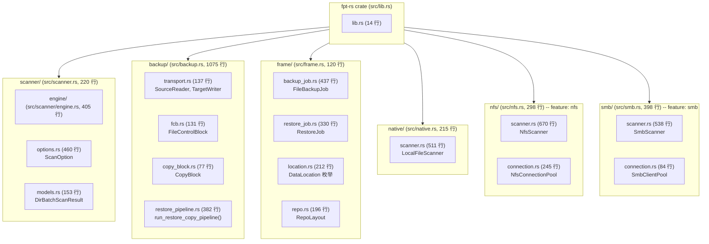

# 模块结构

本文档描述了 fpt-rs 的模块树，解释了每个模块的角色以及三个传输模块（native、NFS、SMB）如何形成对称的可插拔架构。所有行数来自实际源码。

## Crate 根 (`src/lib.rs`)

Crate 根 `src/lib.rs:1` 声明了顶层模块：

```rust
pub mod backup;
pub mod failure;
pub mod frame;
pub mod logging;
pub mod native;
pub use utility::path_util;
pub mod scanner;
pub mod utility;

#[cfg(feature = "nfs")]
pub mod nfs;

#[cfg(feature = "smb")]
pub mod smb;
```

总代码库约 **32,588 行** Rust 代码。

## 模块树



## 模块职责

### `scanner/` -- 扫描引擎

扫描模块负责**遍历文件系统**并产生元数据和控制文件。它在核心上是传输无关的：它定义了数据结构和处理流水线，而实际的目录列表被委派给传输特定的实现。

| 子模块 | 职责 |
|-----------|---------------|
| `engine/bio.rs` | 本地文件系统的阻塞 I/O 扫描引擎。生成工作线程通过 `std::fs` 读取目录。 |
| `engine/aio.rs` | 远程传输的异步扫描引擎。定义 `AsyncDirScanner` trait 和 `run_aio_scan()` 脚手架。 |
| `metadata/meta_storage.rs` | 将 `FileMeta` 和 `DirMeta` 写入 `M_REPO/meta/` 中的二进制 `.dat` 文件。 |
| `metadata/control_codec.rs` | 编码/解码控制文件条目（复制、硬链接、删除、修改时间）。 |
| `metadata/control_plan.rs` | 通过比较当前和之前的扫描来生成控制文件。 |
| `metadata/diff.rs` | 增量差异逻辑：比较 `FileMeta` 记录以检测更改。 |
| `filter.rs` | `ScanPathFilterSet` -- 遍历期间应用的包含/排除路径过滤器。 |
| `options.rs` | `ScanOption` -- 扫描器的所有配置选项。 |

### `backup/` -- 备份引擎

备份引擎读取控制文件和元数据，然后通过传输 traits 编排数据传输。

| 子模块 | 职责 |
|-----------|---------------|
| `aio/transport.rs` | 定义 `SourceReader` 和 `TargetWriter` traits。提供 `LocalSource` 和 `LocalTarget` 实现。 |
| `aio/orchestrator.rs` | `spawn_backup()` -- 组合源+目标传输的顶层编排器。 |
| `fcb.rs` | `FileControlBlock`（FCB）-- 单个文件备份/恢复操作的状态机。 |
| `copy_block.rs` | `CopyBlock` -- 异步流水线中的数据传输单元。 |
| `restore_pipeline.rs` | `run_restore_copy_pipeline()` -- 由 `T: TargetWriter` 和 `R: RestoreOps` 参数化的通用恢复流水线。 |

### `frame/` -- 编排层

框架层管理**完整的作业生命周期**并将任务调度到正确的传输。

| 子模块 | 职责 |
|-----------|---------------|
| `backup_job.rs` | `FileBackupJob` -- 顶层备份作业。运行 4 个阶段：前置条件、扫描、子任务、后置作业。 |
| `restore_job.rs` | `RestoreJob` -- 顶层恢复作业。读取清单，调度恢复子任务。 |
| `location.rs` | `DataLocation` 枚举 -- `Local(PathBuf)`、`Nfs(NfsLocation)`、`Smb(SmbLocation)`。 |
| `repo.rs` | `RepoLayout` -- 描述 `COPY_{format}_{type}_{uuid}/` 目录结构。 |

### 传输模块

三个传输模块（`native/`、`nfs/`、`smb/`）在结构上是**对称的**。每个都提供：

- 相同的 `scanner/` + `backup/` 内部布局。
- 相同的 trait 实现。
- 相同的集成点：框架层通过 `DataLocation` 匹配进行调度。

| 传输 | 扫描器 | SourceReader | TargetWriter | PostCopyPhases | RestoreOps |
|-----------|---------|-------------|-------------|----------------|------------|
| `native/` | `LocalFileScanner` | `LocalSource` | `LocalTarget` | `LocalPostCopyPhases` | `LocalRestoreOps` |
| `nfs/` | `NfsScanner` | `NfsSource` | `NfsTarget` | `NfsPostCopyPhases` | 无（默认空操作） |
| `smb/` | `SmbScanner` | 无（从本地读取） | `SmbTarget` | `SmbPostCopyPhases` | 无（默认空操作） |

### `utility/` -- 共享工具

| 模块 | 职责 |
|--------|-------|
| `blocking_queue.rs` | `BlockingQueue<T>` -- 有界、线程安全的队列，用于扫描器工作线程和元数据写入器之间。 |
| `spill_queue.rs` | `SpillQueue<T>` -- 内存有界队列，当内存压力高时溢出到磁盘。 |
| `path_util.rs` | 用于控制文件中逻辑路径的路径规范化函数。 |

### `bin/` -- CLI 二进制文件

| 二进制文件 | 行数 | 用途 |
|--------|-------|---------|
| `fptcli` | 844 | 主 CLI 入口 -- 扫描、备份、恢复、差异的统一接口。 |
| `fsscan` | 501 | 独立扫描工具。 |
| `fsbackup` | 427 | 独立备份工具。 |
| `fsdiff` | 550 | 差异工具 -- 比较两个扫描或扫描与实时文件系统。 |
| `metainspect` | 712 | 二进制元数据和控制文件的检查器。 |
| `fptserver` | 1359 | 远程管理的服务器守护进程模式。 |
