# 架构概览

fpt-rs 是一款用 Rust 编写的高性能、可插拔备份引擎。它被组织为**四个独立的层**，每层都有明确的职责。各层通过定义良好的数据结构和 trait 边界进行通信，允许每种传输方式（本地、NFS、SMB）在不修改核心逻辑的情况下被插入。

## 层级图

```mermaid
graph TD
    subgraph CLI["CLI 二进制文件 (src/bin/)"]
        FPTCLI["fptcli (844 行)<br/>主统一 CLI"]
        FSBACKUP["fsbackup (427 行)<br/>独立备份"]
        FSSCAN["fsscan (501 行)<br/>独立扫描"]
        FSDIFF["fsdiff (550 行)<br/>差异工具"]
        METAINSPECT["metainspect (712 行)<br/>元数据检查器"]
        FPTSERVER["fptserver (1359 行)<br/>服务器守护进程"]
    end

    subgraph Frame["第 4 层 -- 框架层 (src/frame/)"]
        BACKUPJOB["FileBackupJob<br/>四阶段编排器"]
        RESTOREJOB["FileRestoreJob<br/>恢复编排器"]
        SCANJOB["ScanJob<br/>传输调度"]
        SUBTASK["run_backup_subtask()<br/>子任务调度器"]
        POSTJOB["BackupPostJob<br/>清单 + 上传"]
        PREREQ["BackupPrereqJob<br/>验证"]
        DATALOC["DataLocation 枚举<br/>调度键"]
        REPO["RepoLayout<br/>复制目录路径"]
        TRAITS["BackupRestoreJob trait<br/>统一生命周期"]
    end

    subgraph Backup["第 3 层 -- 备份引擎 (src/backup/)"]
        ORCHESTRATOR["spawn_backup()<br/>通用编排器"]
        PIPELINE["run_restore_copy_pipeline()<br/>通用恢复"]
        COPYPLAN["produce_copy_plan()<br/>条目迭代器"]
        FCB["FileControlBlock<br/>文件状态机"]
        COPYBLOCK["CopyBlock<br/>传输单元"]
        SRCTGT["BackupSource / BackupTarget<br/>传输枚举"]
        TRANS_TRAITS["SourceReader + TargetWriter<br/>传输 traits"]
        PHASES_TRAIT["PostCopyPhases trait<br/>RestoreOps trait"]
        STATS["BackupStats / RestoreStats<br/>指标"]
    end

    subgraph Scanner["第 2 层 -- 扫描引擎 (src/scanner/)"]
        SC_ENGINE["scanner::engine<br/>共享脚手架"]
        SC_AIO["AsyncDirScanner trait<br/>NFS/SMB 的 AIO"]
        SC_BIO["engine::bio<br/>本地阻塞扫描"]
        SC_META_W["MetaRepoWriter<br/>二进制元数据"]
        SC_CTRL["ControlPlanGenerator<br/>控制文件生成"]
        SC_DIFF["diff.rs<br/>增量差异"]
        SC_MODELS["DirBatchScanResult<br/>批次单元"]
        SC_FILTER["ScanPathFilterSet<br/>路径过滤器"]
    end

    subgraph Transport["第 1 层 -- 传输层"]
        NATIVE["native/ (511 行扫描器)<br/>本地文件系统: std::fs"]
        NFS["nfs/ (670 行扫描器)<br/>NFSv3 直接 RPC"]
        SMB["smb/ (538 行扫描器)<br/>SMB2/3 异步客户端"]
    end

    CLI --> Frame
    Frame --> Scanner
    Frame --> Backup
    Scanner --> Transport
    Backup --> Transport
```



## 四层架构

### 第 1 层 -- 传输层

传输层是栈的底层。它为每种支持的协议提供**原始文件系统操作**：

| 模块 | 协议 | 扫描器行数 | 描述 |
|--------|----------|---------------|-------------|
| `native/` | 本地文件系统 | 511 | 通过 `std::fs` 的直接 POSIX/Win32 系统调用 |
| `nfs/` | NFSv3 | 670 | 直接 RPC 到 NFS 服务器，无需内核挂载 |
| `smb/` | SMB2/3 | 538 | 用于 Windows 共享和 Samba 的异步 SMB 客户端 |

每个传输模块都是自包含的，并且在结构上对称，提供 `scanner/` 子模块和 `backup/` 子模块。传输层实现了核心 traits（`SourceReader`、`TargetWriter`、`AsyncDirScanner`、`PostCopyPhases`、`RestoreOps`），上层依赖这些 traits。

### 第 2 层 -- 扫描引擎

扫描引擎（`src/scanner/`）遍历源文件系统并产生：

- **元数据文件**（`M_REPO/meta/`）：二进制编码的 `FileMeta` 和 `DirMeta` 记录，描述每个文件和目录。
- **控制文件**（`C_REPO/ctrl/`）：二进制编码的指令文件，列出需要复制、硬链接、删除或时间修正的内容。

扫描器有两种执行模式：

- **BIO（阻塞 I/O）**：用于本地文件系统扫描。工作线程通过 `std::fs` 直接读取目录。
- **AIO（异步 I/O）**：用于远程传输（NFS、SMB）。`AsyncDirScanner` trait 抽象了协议特定的异步遍历。

两种模式产生相同的 `DirBatchScanResult` 数据结构，该结构通过 `BlockingQueue` 流转到元数据写入线程。

核心扫描输出单元定义在 `src/scanner/models.rs:30`：

```rust
#[derive(Deserialize, Serialize, Debug, Clone, Default)]
pub struct DirBatchScanResult {
    pub dir: DirMeta,
    pub files: Vec<FileMeta>,
    pub partial: bool,
    pub complete: bool,
}
```

### 第 3 层 -- 备份引擎

备份引擎（`src/backup/`）读取控制文件和元数据，然后编排实际的数据复制：

- **复制计划**：读取控制文件并产生 `CopyPlanEntry` 项（目录或文件）。
- **AIO 流水线**：对于远程目标，使用 `SourceReader` + `TargetWriter` traits 以 `CopyBlock` 单元传输数据。
- **聚合**：小文件可以被打包到聚合 blob 中以提高效率。
- **复制后阶段**：复制文件数据后，运行硬链接、删除和修改时间阶段。
- **恢复流水线**：从备份副本读取数据并写入恢复目标。

### 第 4 层 -- 框架层（编排）

框架层（`src/frame/`）是顶层编排器。它通过 `BackupRestoreJob` trait 管理备份和恢复作业的**完整生命周期**。

四个阶段是：

1. **前置条件**（`src/frame/prereq.rs`）：验证源/目标可访问性。
2. **扫描**（`src/frame/scan.rs`）：根据源 `DataLocation` 委派给适当的扫描器。
3. **子任务**（`src/frame/subtask.rs`）：将控制文件拆分为并行子任务，每个由传输特定的备份执行器处理。
4. **后置作业**（`src/frame/postjob.rs`）：写入 `manifest.json`，将元数据和控制仓库上传到远程目标。

## 关键设计原则

### 对称可插拔传输

每种传输（native、NFS、SMB）实现相同的 trait 集。框架层基于 `DataLocation` 进行调度，备份/扫描层对这些 traits 是泛型的。添加新传输意味着实现 traits 并添加新的 `DataLocation` 变体 -- 无需更改核心流水线。

### 元数据始终本地化

M_REPO 和 C_REPO 在作业期间始终写入本地文件系统，即使源或目标是远程的。这确保了扫描器和控制文件生成逻辑与传输无关。对于远程目标，`PostJob` 在所有子任务完成后上传这些仓库。

### 数据直接写入目标

当目标是远程（NFS 或 SMB）时，D_REPO 数据文件由 AIO 流水线直接写入目标 -- 它们不会先在本地暂存。只有元数据和控制文件使用本地暂存然后上传的路径。

### 消息传递架构

系统尽可能避免共享可变状态。`FileControlBlock` 和 `CopyBlock` 被设计为在线程之间**按值移动**。扫描器工作线程、元数据写入器和备份执行器之间的通信使用通道（`BlockingQueue`、`mpsc::channel`）。
