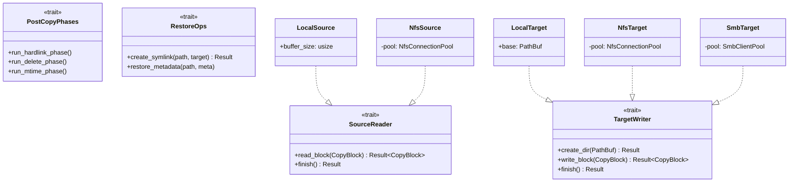

# 传输层

传输层是 fpt-rs 可插拔架构的基础。它定义了一组 traits 来抽象文件系统操作，允许扫描器和备份引擎在本地、NFS 和 SMB 传输之间以相同方式工作。

## DataLocation

`DataLocation` 是描述**用户数据所在位置**的枚举。定义在 `src/frame/location.rs:17`：

```rust
#[derive(Debug, Clone)]
pub enum DataLocation {
    Local(PathBuf),
    #[cfg(feature = "nfs")]
    Nfs(crate::nfs::NfsLocation),
    #[cfg(feature = "smb")]
    Smb(crate::smb::SmbLocation),
}
```

`DataLocation` 在整个框架层中用作**调度键**。`ScanJob::run()` 方法在其上进行匹配以选择正确的传输：

```rust
pub fn run(&self) -> Result<ScanStats, ScanError> {
    match self.source {
        DataLocation::Local(_) => self.run_local(),
        DataLocation::Nfs(_) => self.run_nfs(),
        DataLocation::Smb(_) => self.run_smb(),
    }
}
```

## 核心 Traits

### AsyncDirScanner

定义在 `src/scanner/engine/aio.rs:27`，此 trait 抽象了协议特定的异步目录扫描器。

```rust
pub trait AsyncDirScanner: Send + 'static {
    type Error: std::fmt::Display + Send + 'static;
    fn scan(
        self,
        scan_option: Arc<ScanOption>,
        tx: tokio::sync::mpsc::Sender<DirBatchScanResult>,
    ) -> Pin<Box<dyn Future<Output = Result<(), Self::Error>> + Send>>;
}
```

### SourceReader

定义在 `src/backup/aio/transport.rs:22`，此 trait 从源文件系统读取数据。

```rust
pub trait SourceReader: Clone + Send + Sync + 'static {
    fn read_block(
        &self, block: CopyBlock,
    ) -> BoxFuture<'static, Result<CopyBlock, (CopyBlock, String)>>;

    fn finish(&self) -> BoxFuture<'static, Result<(), String>> {
        Box::pin(async { Ok(()) })
    }
}
```

### TargetWriter

定义在 `src/backup/aio/transport.rs:33`，此 trait 向目标文件系统写入数据。

```rust
pub trait TargetWriter: Clone + Send + Sync + 'static {
    fn create_dir(&self, path: PathBuf) -> BoxFuture<'static, Result<(), String>>;
    fn write_block(
        &self, block: CopyBlock,
    ) -> BoxFuture<'static, Result<CopyBlock, (CopyBlock, String)>>;
    fn finish(&self) -> BoxFuture<'static, Result<(), String>> {
        Box::pin(async { Ok(()) })
    }
}
```

### PostCopyPhases

定义在 `src/backup/aio/phases_trait.rs:17`，此 trait 在目标上运行复制后阶段（硬链接、删除、修改时间）。所有方法都有默认的空操作实现。

```rust
pub trait PostCopyPhases: Send + Sync {
    async fn run_hardlink_phase(&self, ...) { /* 默认：空操作 */ }
    async fn run_delete_phase(&self, ...) { /* 默认：空操作 */ }
    async fn run_mtime_phase(&self, ...) { /* 默认：空操作 */ }
    async fn run_all_phases(&self, ...) {
        self.run_hardlink_phase(...).await;
        self.run_delete_phase(...).await;
        self.run_mtime_phase(...).await;
    }
}
```

### RestoreOps

定义在 `src/backup/aio/restore_ops.rs:16`，此 trait 提供恢复特定的操作。

```rust
pub trait RestoreOps: Send + Sync {
    fn create_symlink(&self, _link_path: &Path, _target: &str) -> Result<(), String> {
        Ok(())
    }
    fn restore_metadata(&self, _path: &Path, _meta: &MetaCommon) {}
}
```

只有本地传输实现了有意义的 `create_symlink()` 和 `restore_metadata()` -- 远程传输使用默认值（空操作）。

## Trait 实现映射



## CopyBlock：传输单元

`CopyBlock`（`src/backup/copy_block.rs:14`）是在 `SourceReader` 和 `TargetWriter` 之间流动的通用数据单元：

```rust
pub struct CopyBlock {
    pub meta: Arc<FileMeta>,
    pub src_path: PathBuf,
    pub dst_path: PathBuf,
    pub src_offset: u64,
    pub dst_offset: u64,
    pub file_size: u64,
    pub data: Vec<u8>,
    pub is_last: bool,
}
```

该块专为大文件的**分块传输**而设计：

1. `FileControlBlock` 通过 `CopyBlock::from_fcb()` 转换为 `CopyBlock`。
2. `SourceReader::read_block()` 填充 `data` 并推进 `src_offset`。
3. `TargetWriter::write_block()` 写入 `data` 并推进 `dst_offset`。
4. 循环继续直到 `read_complete() && write_complete()`。
5. 在迭代之间调用 `clear_data()` 以限制内存使用。
