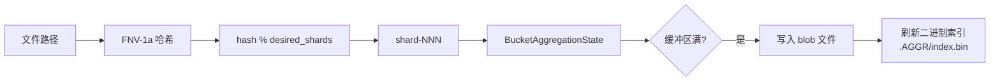

# 聚合

许多文件系统包含数百万个小文件（配置文件、源代码、日志片段）。将每个文件作为单独的文件存储在备份仓库中会产生巨大的元数据开销和不良的 I/O 模式。**聚合**通过将小文件打包到大型 **blob** 文件中来解决此问题，并使用索引将原始路径映射到 `(blob, offset, size)` 三元组。

## 聚合时机

聚合由 `AggregateConfig`（`src/backup/aggregate/mod.rs`）控制：

```rust
#[derive(Debug, Clone, Copy)]
pub struct AggregateConfig {
    pub enabled: bool,           // 主开关
    pub layout: AggregateLayout, // DirLevel 或 Shard
    pub max_blob_size: u64,      // 默认：64 MB
    pub file_threshold: u64,     // 默认：1 MB
    pub shard_count: u16,        // 默认：16
}
```

当文件满足以下条件时会被聚合：

```rust
pub fn should_aggregate(file_size: u64, config: &AggregateConfig) -> bool {
    config.enabled && file_size > 0 && file_size < config.file_threshold
}
```

符号链接永远不会被聚合。

## 两种布局

### DIR_LEVEL 布局

在 DIR_LEVEL 布局中，聚合是**按目录**的。每个包含聚合文件的目录都有自己的 `.AGGR_DIR/` 子目录，其中包含 blob 文件和 SQLite 索引。

### SHARD 布局

在 SHARD 布局中，所有聚合文件存储在仓库根目录的**共享** `.AGGR/` 目录中，分成编号的分片。索引是单个二进制文件。

文件通过 FNV-1a 哈希其相对路径分配到分片：



## Blob 文件元数据

每个 blob 的元数据在 `AggregateBlobMeta` 中捕获：

```rust
#[derive(Debug, Clone, Serialize, Deserialize)]
pub struct AggregateBlobMeta {
    pub blob_path: String,            // 例如 ".AGGR/shard-000/....blob"
    pub blob_size: u64,
    pub file_count: u32,
    pub files: Vec<AggregateFileEntry>,
    pub shard_id: u16,
}
```

Blob 文件是文件内容的简单连接：

```
+------------------+
| file_1 数据      |  偏移 0，大小 S1
+------------------+
| file_2 数据      |  偏移 S1，大小 S2
+------------------+
| file_3 数据      |  偏移 S1+S2，大小 S3
+------------------+
```

## 与备份流水线的集成

`AggregatingTarget<T>` 包装任何 `TargetWriter` 并拦截 `write_block` 调用：

1. 如果块应该被聚合（小的、完整的、不是符号链接），它被缓冲在每个桶的状态中
2. 当桶达到 `max_blob_size` 时，累积的文件被刷新为 blob
3. 在 `finish()` 时，所有剩余的缓冲区被刷新，索引文件被写入
4. 大文件和符号链接不变地传递到内部 `TargetWriter`
