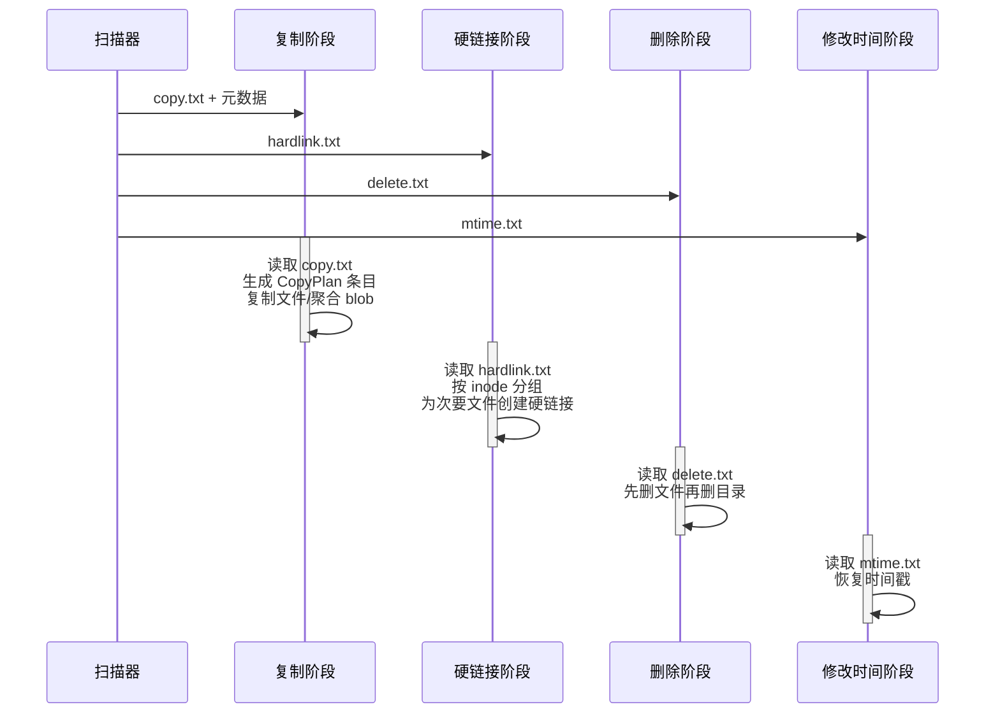

# 备份流水线

在扫描器产生控制文件和元数据之后，**备份流水线**将数据从源传输到目标仓库。流水线有四个顺序阶段：**复制**、**硬链接**、**删除**和**修改时间**。每个阶段读取自己的控制文件并独立运行。

## 阶段概览



## 阶段 1：复制

复制阶段是最重的。它读取 `copy.txt`，从元数据仓库加载对应的 `FileMeta`/`DirMeta`，并产生 `CopyPlanEntry` 项。

### CopyPlan 条目

```rust
pub(crate) enum CopyPlanEntry {
    Directory { meta: DirMeta, dst_path: PathBuf },
    File(FileCopyPlan),
}

pub(crate) enum FileCopyPlan {
    Direct { meta: FileMeta, src_path: PathBuf, dst_path: PathBuf },
    Aggregate { meta: FileMeta, src_path: PathBuf },
}
```

### FileControlBlock（FCB）

`FileControlBlock`（`src/backup/fcb.rs`）是单个文件备份或恢复的核心状态机。它在线程之间**按值移动**：

```rust
pub struct FileControlBlock {
    pub meta: Box<FileMeta>,
    pub buffer: Vec<u8>,         // 延迟分配，最大 4 MiB
    pub buffer_len: usize,
    pub src_state: SourceHandleState,
    pub dst_state: TargetHandleState,
    pub src_path: PathBuf,
    pub dst_path: PathBuf,
    pub src_offset: u64,
    pub dst_offset: u64,
}
```

## 阶段 2：硬链接

硬链接阶段读取 `hardlink.txt`，其中包含交错的 `Inode` 和 `File` 记录。对于每个 inode 组：

1. 组中的**第一个文件**在阶段 1 中已被复制（"主文件"）。
2. 组中的所有**后续文件**被创建为指向主文件的硬链接。

## 阶段 3：删除

删除阶段读取 `delete.txt` 并删除源中不再存在的文件和目录。先删除文件，再删除目录，以避免删除非空目录。

## 阶段 4：修改时间

修改时间阶段读取 `mtime.txt` 并恢复目录时间戳（`atime`、`mtime`）和所有权（`uid`、`gid`、`mode`）。这必须最后运行，因为早期阶段在文件创建期间可能会修改目录时间戳。

## 配置 -- BackupOption

备份流水线通过 `BackupOption`（`src/backup.rs`）配置，使用构建器模式：

```rust
pub struct BackupOption {
    source: DataLocation,
    target: DataLocation,
    meta_dir: PathBuf,
    ctrl_dir: PathBuf,
    control_file: PathBuf,
    worker_count: usize,         // 默认：8
    copy_buffer_size: usize,     // 默认：1 MB，限制在 256KB-4MB
    retry_policy: RetryPolicy,
    failure_log: Option<FailureLogConfig>,
    phase_flags: PhaseFlags,     // 硬链接、删除、修改时间开关
    aggregate_config: AggregateConfig,
}
```

## 传输抽象

复制阶段使用两个核心 traits：

- **`SourceReader`** -- 从源读取 `CopyBlock` 数据
- **`TargetWriter`** -- 将 `CopyBlock` 数据写入目标

复制后阶段使用 **`PostCopyPhases`** trait，默认为空操作实现。每种传输仅覆盖它支持的阶段。
