# 控制文件

控制文件是扫描器和备份/恢复流水线之间的通信通道。它们描述**要复制什么**、**要硬链接什么**、**要删除什么**以及**要恢复什么时间戳**。所有控制文件共享通用的二进制格式：固定的 4 KB ASCII 头部，后跟一系列长度前缀的二进制记录。

## 通用结构

每个控制文件以 4 KB 头部块开始，写为人类可读的 ASCII 键值对，用空字节填充到恰好 4096 字节。头部之后，记录从字节偏移 4096 开始。

```mermaid
block-beta
    columns 1
    block:header["头部块 (4096 字节)"]
        A["#FPT_COPY_CTRL_FILE  (魔术标识符)"]
        B["version=3"]
        C["header_size=4096"]
        D["file_count=1234"]
        E["dir_count=56"]
        F["record_count=1290"]
        G["source_kind=local"]
        H["source_root=/data"]
        I["... 用空字节填充到 4096 字节"]
    end
    block:records["记录流"]
        J["[记录 1] len_u32 | 载荷"]
        K["[记录 2] len_u32 | 载荷"]
        L["..."]
    end
```



## 记录格式

每个记录都是长度前缀的（`src/scanner/metadata/control_codec.rs`）：

```
+--------+------------------+
| u32 LE | 载荷 (N 字节)    |   长度 = N
+--------+------------------+
```

4 字节小端长度前缀仅包含载荷大小，不包括前缀本身。

## 控制文件类型

### copy.txt -- 文件和目录控制

魔术标识符：`#FPT_COPY_CTRL_FILE`

包含两种交错的记录类型：目录条目和文件条目。

### hardlink.txt -- 硬链接组

魔术标识符：`#FPT_HARDLINK_CTRL_FILE`

包含交错的 `Inode` 和 `File` 记录。

### delete.txt -- 删除条目

魔术标识符：`#FPT_DELETE_CTRL_FILE`

包含应从目标中删除的文件和目录的条目。

### mtime.txt -- 时间戳恢复

魔术标识符：`#FPT_MTIME_CTRL_FILE`

包含目录元数据，用于在复制和硬链接阶段之后恢复时间戳。

## 分片

当扫描器使用多个写入线程时，控制文件可以被**分片** -- 每个写入线程产生自己的控制文件。分片允许并行写入而无竞争。
