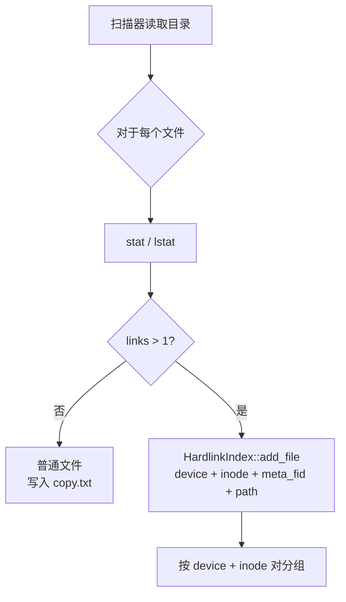
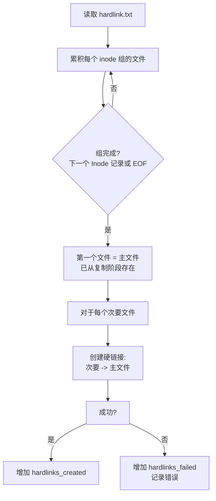

# 硬链接

硬链接是共享相同 inode（因此也共享相同数据）的目录条目。在典型的 Linux 文件系统上，许多文件可能共享一个 inode -- 例如，包管理器、构建系统和去重工具广泛创建硬链接。fpt-rs 在扫描阶段检测硬链接，并在备份期间保留它们，使目标具有相同的结构。

## 扫描期间的检测

扫描器通过检查每个文件的链接计数（Unix 上的 `nlink`，Windows 上的 `GetFileInformationByHandle`）来检测硬链接。`nlink > 1` 的文件是潜在的硬链接候选。

在扫描期间，扫描器维护一个内存中的 `HardlinkIndex`（`src/scanner/metadata/hardlink.rs`），按 `(device, inode)` 对文件进行分组：

```rust
#[derive(Debug, Default)]
pub struct HardlinkIndex {
    inode_map: HashMap<(u64, u64), usize>,  // (device, inode) -> 组索引
    groups: Vec<HardlinkGroup>,
}

#[derive(Debug, Default)]
pub struct HardlinkGroup {
    pub inode: u64,
    pub device: u64,
    pub link_count: u32,
    pub files: Vec<(u32, u32, String)>,  // (meta_fid, meta_offset, path)
}
```



## 备份阶段 -- 创建硬链接

在备份的硬链接阶段，引擎读取 `hardlink.txt` 并处理每个 inode 组：



关键规则：**每组中只有第一个文件在复制阶段被复制**。所有后续文件被创建为指向第一个文件目标路径的硬链接。

## 传输特定的实现

| 传输 | 机制 |
|---|---|
| 本地 | `std::fs::hard_link(primary, secondary)` |
| NFS v3 | `LINK3` RPC |
| SMB | SMB2 `SET_INFO` with `FileLinkInformation` |
