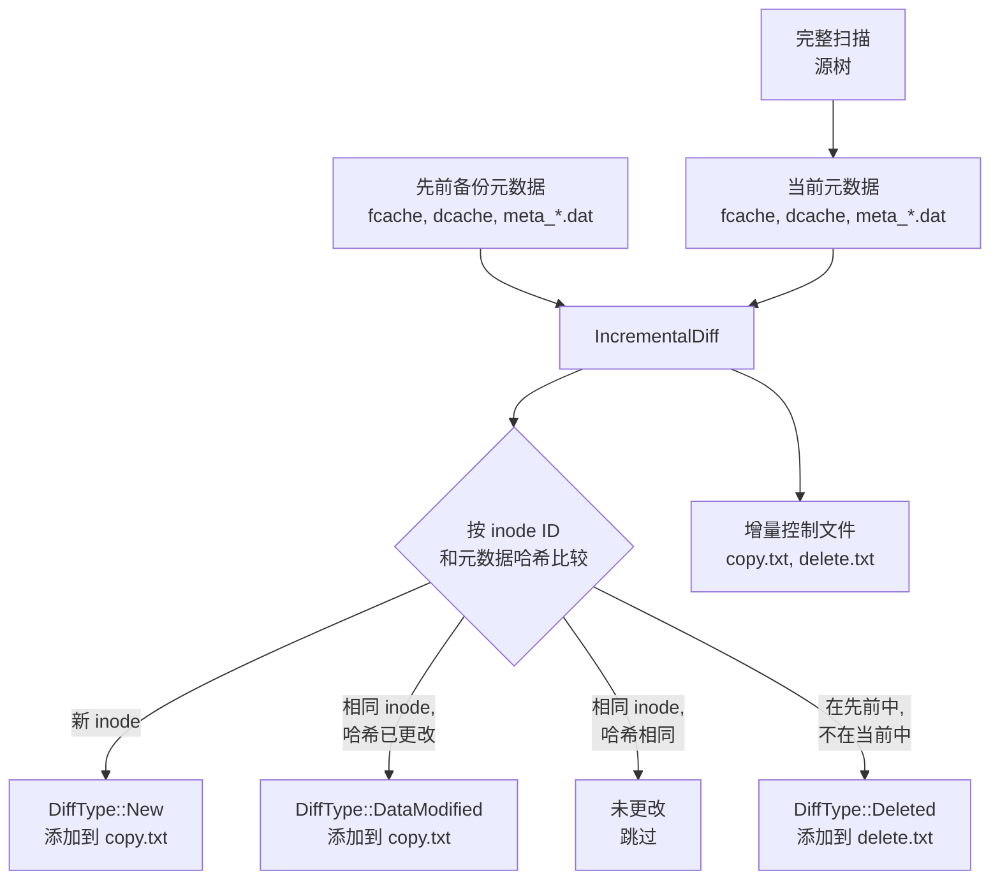

# 增量备份

增量备份通过将当前文件系统状态与先前备份的元数据进行比较来避免重新复制未更改的文件。扫描器始终执行源树的**完整扫描** -- 没有部分或树遍历差异。节省来自差异阶段，它产生一个减少的 `copy.txt`，仅包含新的、修改的或删除的条目。

## 工作原理



## 差异类型

差异引擎（`src/scanner/metadata/diff.rs`）将每个条目分类为五个类别之一：

```rust
#[derive(Debug, Clone, Copy, PartialEq)]
pub enum DiffType {
    New,            // 条目存在于当前但不在先前中
    DataModified,   // 条目存在于两者中，内容哈希不同
    MetaModified,   // 条目存在于两者中，元数据哈希不同但内容相同
    BothModified,   // 数据和元数据都已更改
    Deleted,        // 条目存在于先前但不在当前中
}
```

| DiffType | 含义 | 操作 |
|---|---|---|
| `New` | 条目存在于当前但不在先前备份中 | 复制到仓库 |
| `DataModified` | 条目存在于两者中，但内容哈希不同 | 复制到仓库 |
| `MetaModified` | 条目存在于两者中，元数据哈希不同但内容相同 | 仅复制元数据 |
| `BothModified` | 数据和元数据都已更改 | 复制到仓库 |
| `Deleted` | 条目存在于先前但不在当前中 | 添加到 delete.txt |

## 缓存条目 -- 差异索引

差异引擎不加载每个条目的完整 `FileMeta`/`DirMeta`。相反，它使用紧凑的、固定大小的**缓存条目**，存储在排序的二进制文件中：

```rust
#[derive(Default, Debug, Clone, serde::Serialize, serde::Deserialize)]
pub struct FileCacheEntry {
    pub id: u64,                // inode / 文件索引
    pub hash: u32,              // 序列化 FileMeta 的 SHA-256 的前 4 字节
    pub meta_loc: MetaEntryLocator, // 元数据仓库中的 (meta_fid, offset)
}
```

| 条目类型 | 大小 | 关键字段 |
|---|---|---|
| `FileCacheEntry` | 20 字节 | `id`（inode）、`hash`（32 位 SHA-256 前缀）、`meta_loc` |
| `DirCacheEntry` | 32 字节 | `id`（inode）、`hash`、`meta_loc`、`files_count`、`fcache_fid`、`fcache_offset` |

## 局限性

- **需要完整扫描**：扫描器始终遍历整个源树。增量节省来自减少的数据传输，而不是减少的扫描时间。
- **基于哈希的检测**：如果哈希恰好发生碰撞，不改变 `bincode` 序列化的非常小的仅元数据更改可能不会被检测到。使用 SHA-256 截断到 32 位时，这极不可能发生。
- **需要排序布局**：差异算法假设 `fcache` 和 `dcache` 条目按 inode `id` 排序。扫描器在写入阶段确保这一点。
