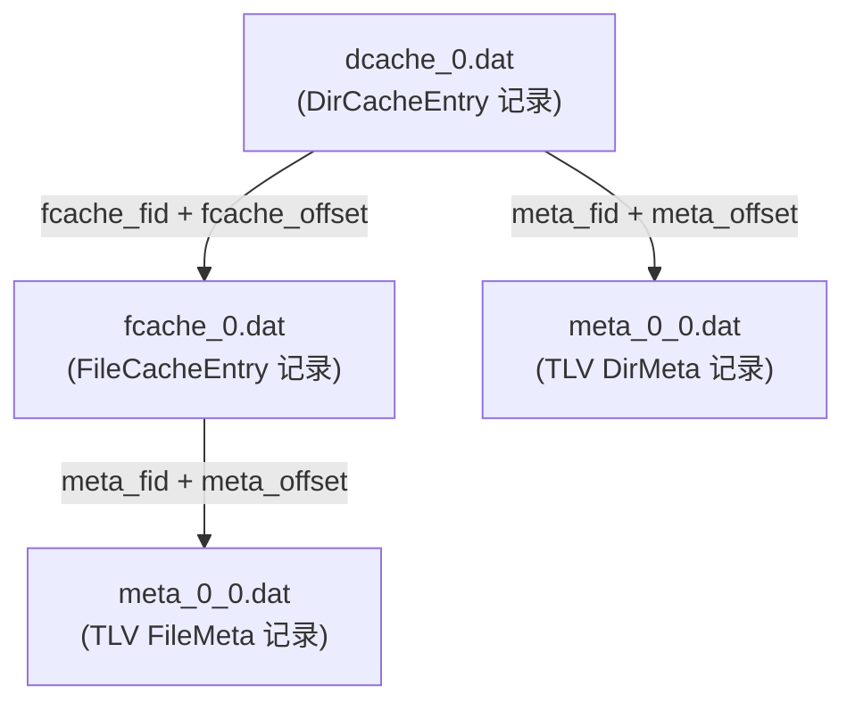

# 元数据格式

元数据仓库（M_REPO）存储每个扫描文件和目录的完整文件系统元数据。与控制文件（描述*操作*）不同，元数据文件描述*状态* -- 扫描时每个条目的完整属性。该格式使用 **Tag-Length-Value（TLV）**编码处理可变长度记录，使用**固定大小二进制**处理缓存索引条目。

## 核心数据结构

### MetaCommon

文件和目录共享的元数据（`src/scanner/metadata/filemeta.rs`）：

```rust
#[derive(serde::Deserialize, serde::Serialize, Debug, Clone, Default)]
pub struct MetaCommon {
    pub id: u64,                              // inode（Unix）或文件索引（Windows）
    pub mode: u32,                            // 文件类型和权限位
    pub attr: u32,                            // Windows FILE_ATTRIBUTE_* 标志
    pub atime: u32,                           // 访问时间（自纪元以来的秒数）
    pub ctime: u32,                           // 创建/更改时间
    pub mtime: u32,                           // 修改时间
    pub devno: u64,                           // 设备号
    pub name: String,                         // 基本名称（无父路径）
    pub security_descriptor: Option<String>,  // Windows SDDL 字符串
    pub posix_access_acl: Option<String>,     // POSIX 访问 ACL 文本
    pub posix_default_acl: Option<String>,    // POSIX 默认 ACL 文本
    pub symlink_target_path: Option<String>,  // 符号链接目标
    pub xattributes: Option<String>,          // 扩展属性
}
```

### FileMeta

扩展 `MetaCommon`，添加文件特定字段：

```rust
#[derive(serde::Deserialize, serde::Serialize, Debug, Clone, Default)]
pub struct FileMeta {
    pub common: MetaCommon,
    pub size: u64,                           // 逻辑文件大小（字节）
    pub links: u64,                          // 硬链接计数
    pub sparse_range: Option<Vec<(u64, u64)>>, // 稀疏区域
}
```

### DirMeta

扩展 `MetaCommon`，添加目录特定字段：

```rust
#[derive(serde::Deserialize, serde::Serialize, Debug, Clone, Default)]
pub struct DirMeta {
    pub common: MetaCommon,
    pub path: String,  // 完整绝对路径
}
```

## TLV 元数据文件

元数据存储在 `.dat` 文件中，使用 Tag-Length-Value 编码（`src/scanner/metadata/meta_storage.rs`）：

```rust
const TAG_DIR: u8 = 1;   // DirMeta 记录
const TAG_FILE: u8 = 2;  // FileMeta 记录
```

每个记录：

| 字段 | 大小 | 描述 |
|---|---|---|
| Tag | 1 字节 | `0x01` = DirMeta，`0x02` = FileMeta |
| Length | 4 字节 | 载荷大小（字节）（u32 LE） |
| Payload | N 字节 | `bincode` 序列化的 `DirMeta` 或 `FileMeta` |

## MetaFid -- 元数据文件标识

每个元数据文件由 32 位 `meta_fid`（元数据文件 ID）标识。fid 编码了两条信息：

| 组件 | 位 | 描述 |
|---|---|---|
| `writer_shard` | 16（高位） | 写入线程 ID（0-65535） |
| `segment_id` | 16（低位） | 分片内的顺序段 |

编码：`meta_fid = (writer_shard << 16) | segment_id`

此设计允许多个写入线程无需协调地写入单独的文件。

## 缓存索引文件

### 文件缓存（`fcache_<fid>.dat`）

包含 `FileCacheEntry` 记录，按 `id`（inode）排序，每个条目 **20 字节**。

### 目录缓存（`dcache_<fid>.dat`）

包含 `DirCacheEntry` 记录，按 `id` 排序，每个条目 **32 字节**。



`DirCacheEntry` 充当文件缓存的索引：其 `fcache_fid` 和 `fcache_offset` 字段指向该目录的第一个 `FileCacheEntry`，`files_count` 告知要读取多少个连续条目。
