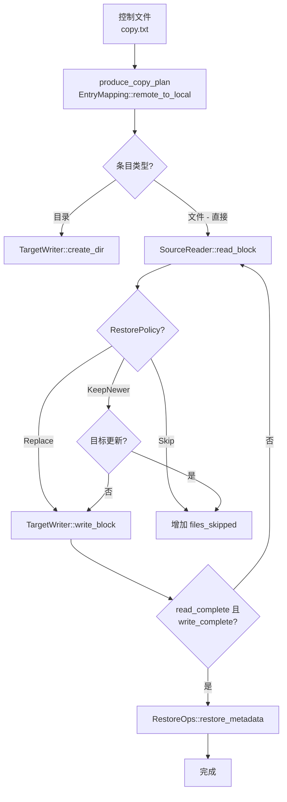

# 恢复流水线

恢复流水线从备份仓库（D_REPO）读取数据并将其写入目标位置 -- 本地目录、NFS 共享或 SMB 共享。与备份不同，恢复始终从仓库读取并写入目标，使用扫描期间产生的相同控制文件和元数据。

## 高层流程



## RestorePolicy

当恢复目标是本地目录时，`RestorePolicy`（`src/backup.rs`）控制如何处理现有文件：

```rust
#[derive(Debug, Clone, Copy, PartialEq)]
pub enum RestorePolicy {
    Replace,    // 始终覆盖（默认）
    Skip,       // 如果目标存在则跳过
    KeepNewer,  // 仅在备份版本更新时恢复
}
```

## 恢复源

`LocalRepoRestoreSource`（`src/backup/restore_pipeline.rs`）实现 `SourceReader` trait 并处理两种情况：

1. **聚合文件** -- 查询聚合索引，从正确的 blob 中读取文件数据
2. **常规文件** -- 直接从 D_REPO 路径读取文件

## 并发模型

恢复流水线使用信号量限制的并发任务模型：

```rust
pub async fn run_restore_copy_pipeline<T: TargetWriter, R: RestoreOps>(
    control_file: PathBuf,
    meta_dir: PathBuf,
    source: LocalRepoRestoreSource,
    target: T,
    restore_ops: R,
    policy: RestorePolicy,
    stats: Arc<Mutex<RestoreStats>>,
    max_concurrent_tasks: usize,
) {
    let task_sem = Arc::new(Semaphore::new(max_concurrent_tasks.max(1)));
    // 生产者：读取控制文件，通过通道发送条目
    // 消费者：并发处理条目
}
```

## RestoreStats

```rust
#[derive(Debug, Default, Clone)]
pub struct RestoreStats {
    pub files_restored: u64,
    pub bytes_restored: u64,
    pub files_skipped: u64,   // 因 RestorePolicy 跳过
    pub bytes_skipped: u64,
    pub files_failed: u64,
    pub dirs_created: u64,
}
```
