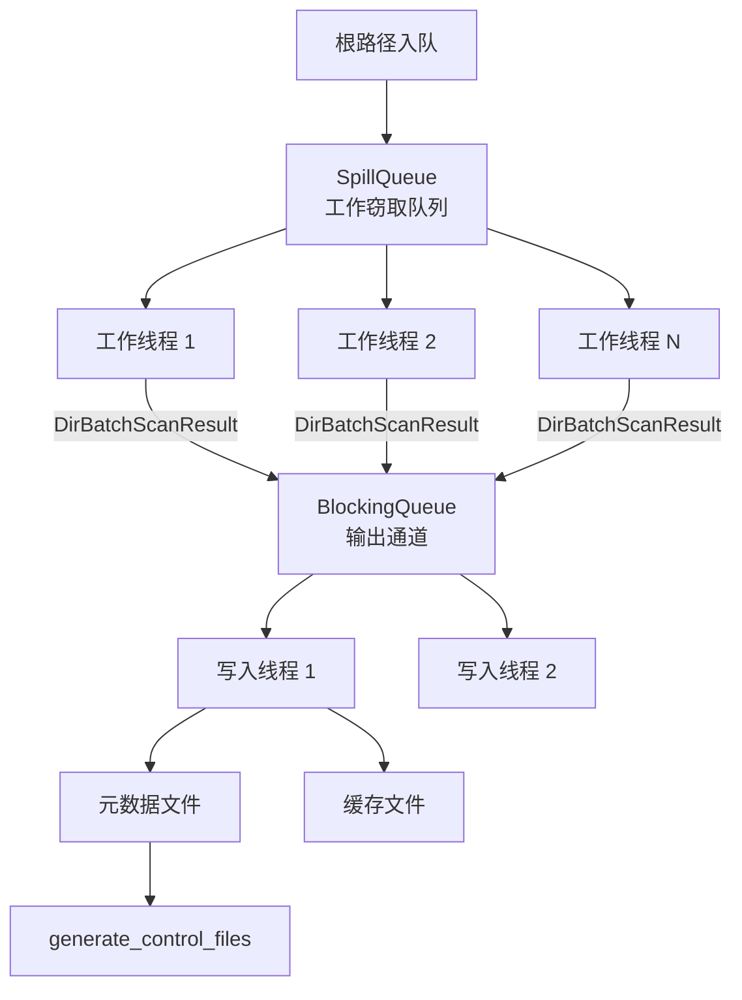
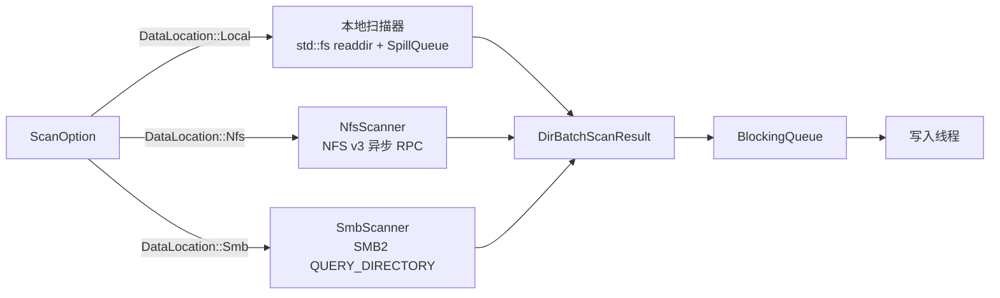

# 扫描引擎

扫描器是每次备份操作的第一阶段。它遍历源目录树（本地、NFS 或 SMB），收集文件和目录元数据，检测硬链接，并将二进制**控制文件**和**元数据**写入仓库。该设计通过并行遍历、溢出到磁盘的工作队列和分片写入线程来优先考虑具有数百万条目的树的吞吐量。

## 高层流程



## 关键组件

### SpillQueue -- 工作窃取目录队列

`SpillQueue<T>`（`src/utility/spill_queue.rs`）是一个线程安全的 FIFO 队列，当内存缓冲区超过可配置的上限时，会透明地将溢出条目溢出到磁盘。这防止了扫描包含数百万个目录的树时的无限制内存增长。

### DirBatchScanResult

每个工作线程一次扫描一个目录并产生 `DirBatchScanResult`（`src/scanner/models.rs`）：

```rust
#[derive(Deserialize, Serialize, Debug, Clone, Default)]
pub struct DirBatchScanResult {
    pub dir: DirMeta,           // 被扫描目录的元数据
    pub files: Vec<FileMeta>,   // 此批次中找到的文件条目
    pub partial: bool,          // 如果扫描被中断（不完整）则为 true
    pub complete: bool,         // 如果这是目录的最后一批则为 true
}
```

### 扫描统计

所有计数器使用 `AtomicU64` 进行无锁并发更新（`src/scanner/models.rs`）：

```rust
pub struct ScanStatistics {
    tot_size: AtomicU64,      // 所有扫描文件的总逻辑大小
    tot_files: AtomicU64,     // 扫描的总文件数
    tot_dirs: AtomicU64,      // 扫描的总目录数
    failed_files: AtomicU64,  // stat 失败的文件
    failed_dirs: AtomicU64,   // 打开/stat 失败的目录
}
```

## 传输特定的扫描器

扫描器通过通用的 `AsyncDirScanner` trait 适配不同的源传输：



所有传输扫描器发出相同的 `DirBatchScanResult` 批次，因此写入流水线完全与传输无关。

## 配置

扫描器通过 `ScanOption`（`src/scanner/options.rs`）进行配置：

| 选项 | 默认值 | 描述 |
|---|---|---|
| `worker_count` | 8 | 并行遍历线程 |
| `writer_count` | 4 | 并行元数据写入线程 |
| `max_depth` | 无限 | 遍历的最大目录深度 |
| `stats_only` | false | 仅收集统计信息，跳过磁盘输出 |
| `retry_policy` | 3 次重试，1 秒延迟 | 指数退避和抖动重试 |
| `queue_option.memory_upper_bound` | 100,000 | 溢出队列上限阈值 |
| `queue_option.memory_lower_bound` | 50,000 | 溢出队列下限阈值 |
| `shard_option.enabled` | false | 启用分片控制文件 |
| `shard_option.num_shards` | 16 | 控制文件分片数 |
