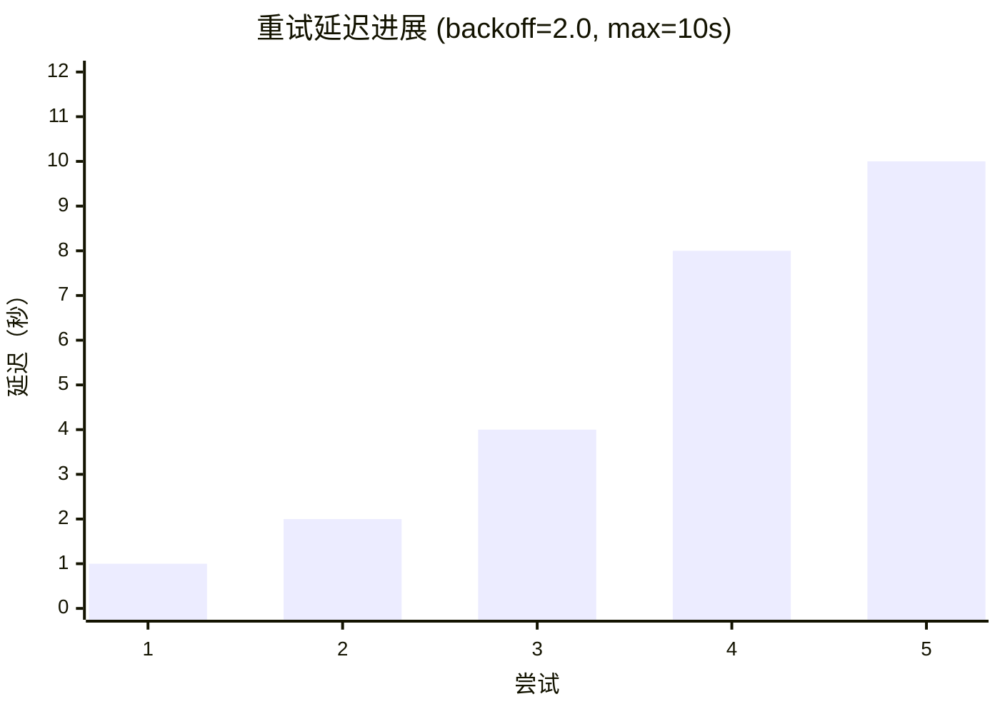

# 失败处理

fpt-rs 提供结构化失败日志和可配置的重试策略来优雅地处理瞬态 I/O 错误。

## 概述

当文件操作失败时，fpt-rs 遵循以下序列：

1. **重试** -- 根据配置的重试策略重试操作（指数退避和可选抖动）。
2. **记录** -- 如果所有重试都耗尽，结构化失败记录被写入失败日志。
3. **继续** -- 备份/扫描继续处理剩余文件。

### 核心数据结构（来自 `src/failure.rs`）

```rust
// src/failure.rs
#[derive(Debug, Clone, Serialize)]
pub struct FailureRecord {
    pub time: String,           // UTC 时间戳（RFC 3339）
    pub phase: String,          // "scan"、"copy"、"hardlink"、"delete"、"mtime"
    pub operation: String,      // "read"、"write"、"readdir"、"stat" 等
    pub item_type: FailureItemType, // File、Directory、Symlink 等
    pub path: String,           // 失败项的逻辑路径
    pub code: String,           // 分类的错误代码
    pub detail: String,         // 完整的 OS/运行时错误消息
    pub attempts: u32,          // 总尝试次数（1 次初始 + 重试）
}
```

`FailureRecorder`（`src/failure.rs:318`）是线程安全的写入器：

```rust
#[derive(Clone)]
pub struct FailureRecorder {
    inner: Arc<Mutex<FailureRecorderInner>>,
}
```

## 失败日志格式

支持三种输出格式：CSV、JSON 和 XML。

### CSV

```csv
time,phase,operation,item_type,path,code,detail,attempts
2026-06-07T14:30:05Z,copy,read,file,/data/projects/alpha.txt,EIO,Input/output error,4
```

### JSON

```json
[{
  "time": "2026-06-07T14:30:05Z",
  "phase": "copy",
  "operation": "read",
  "item_type": "file",
  "path": "/data/projects/alpha.txt",
  "code": "EIO",
  "detail": "Input/output error (os error 5)",
  "attempts": 4
}]
```

## 错误分类

错误自动分类为标准代码。分类逻辑在 `src/failure.rs` 中：

| 代码 | 含义 | 典型原因 |
|---|---|---|
| `EACCES` | 权限被拒绝 | 文件权限不足 |
| `ENOENT` | 没有此文件或目录 | 扫描/备份期间文件被删除 |
| `ENOSPC` | 设备上没有空间 | 目标文件系统已满 |
| `EIO` | I/O 错误 | 磁盘或网络 I/O 故障 |
| `ETIMEDOUT` | 连接超时 | 网络超时（NFS/SMB） |

## 重试策略选项

| 标志 | 默认值 | 描述 |
|---|---|---|
| `--operation-retries` | 3 | 记录失败前的最大重试次数 |
| `--retry-delay-ms` | 1000 | 重试之间的基础延迟（毫秒） |
| `--retry-backoff` | 1.0 | 指数退避乘数（1.0 = 固定延迟） |
| `--retry-max-delay-ms` | 1000 | 退避后的延迟上限 |
| `--retry-jitter` | 0.0 | 抖动比率（0.0-1.0） |

`RetryPolicy` 默认值来自 `src/failure.rs:78`：

```rust
impl Default for RetryPolicy {
    fn default() -> Self {
        Self {
            max_retries: 3,
            retry_delay: Duration::from_secs(1),
            backoff_multiplier: 1.0,
            max_retry_delay: Duration::from_secs(1),
            jitter_ratio: 0.0,
        }
    }
}
```

### 退避可视化


