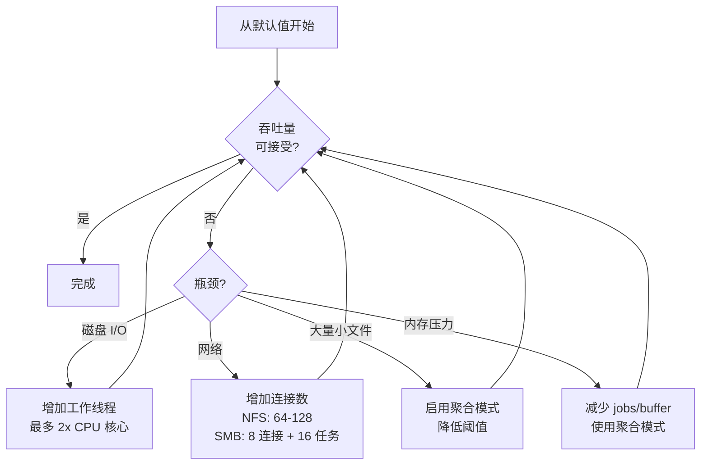

# 性能调优

本指南解释如何通过调整工作线程数、缓冲区大小、聚合 blob 大小、队列参数和估算内存使用来调优 fpt-rs 以获得最大吞吐量。

## 关键性能参数

| 标志 | 默认值 | 描述 |
|---|---|---|
| `-w, --workers` | 8 | 每个子任务的工作线程（复制 I/O） |
| `-j, --jobs` | 4 | 最大并发子任务数 |
| `--buffer-size` | 1024 KB | 每文件复制缓冲区大小 |
| `--nfs-connections` | 32 | 并行 NFS RPC 连接数 |
| `--smb-connections` | 4 | 每端点的 SMB 客户端连接数 |
| `--blob-size` | 4 MB | 聚合 blob 最大大小 |
| `--threshold` | 1024 KB | 聚合的文件大小阈值 |

:::info 默认值来源
这些默认值直接来自源代码。扫描级默认值定义在 `src/scanner/options.rs`，备份级默认值在 `src/backup.rs`。
:::

## 工作线程（`-w`）

工作线程数控制单个子任务内并行复制的文件数。

| 存储类型 | 推荐工作线程 | 原因 |
|---|---|---|
| 本地 SSD 到本地 SSD | 8-16 | SSD 处理并行 I/O 良好 |
| 本地 HDD 到本地 HDD | 4-8 | 过多工作线程导致寻道抖动 |
| NFS 源或目标 | 16-32 | 网络延迟受益于更多并发 |
| SMB 源或目标 | 8-16 | SMB 有每连接开销 |

## 并发子任务（`-j`）

**有效并行度** = `jobs x workers`

使用默认值（`-j 4 -w 8`），最多 32 个文件同时被复制。

## 聚合 Blob 大小（`--blob-size`）

| Blob 大小 | 适用场景 |
|---|---|
| 4 MB（默认） | 小到中等文件集 |
| 8-16 MB | 快速存储上的大文件集 |
| 32 MB | SSD 上大量微小文件的最大吞吐量 |

## 内存使用估算

```
内存 ≈ (workers x buffer_size) + (jobs x metadata_per_subtask) + 传输开销
```

**示例计算：**
- 8 子任务 x 16 工作线程 x 4 MB 缓冲区 = 512 MB I/O 缓冲区
- 加上元数据和传输开销：约 100-200 MB
- 总计：约 600-700 MB

## 调优流程


