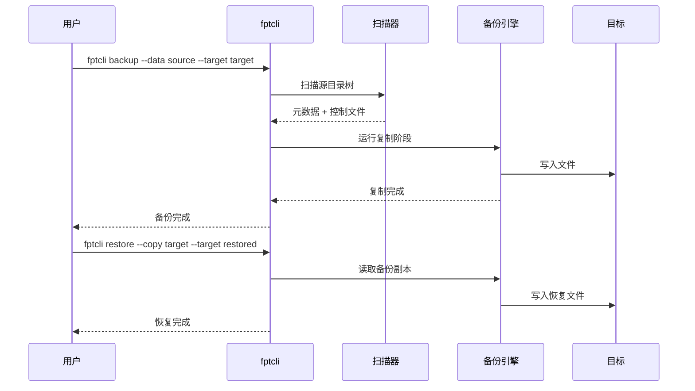

# 快速开始

本指南将引导您安装 fpt-rs、运行第一次备份、验证结果以及恢复数据。完成后，您将拥有一个可用的备份和经过验证的恢复 -- 全部在本地机器上完成。

## 前提条件

- 一台安装了 [Rust](https://www.rust-lang.org/tools/install) 1.70+ 的 Linux 或 Windows 机器。
- 至少几百 MB 的可用磁盘空间用于测试数据和备份目标。

## 第一步：从源码构建

克隆仓库并构建默认功能集（仅本地文件系统）：

```bash
git clone https://github.com/XUranus/fpt-rs.git
cd fpt-rs
cargo build --release
```

编译后的二进制文件位于 `target/release/` 目录下：

```bash
ls target/release/fptcli target/release/fsscan target/release/fsdiff
```

如果需要 NFS 或 SMB 支持，请参阅[安装指南](./installation.md)了解功能标志详情。

## 第二步：创建测试数据

生成一个小型目录树用于备份：

```bash
mkdir -p /tmp/fpt-demo/source/{documents,images,logs}
echo "Hello, world!" > /tmp/fpt-demo/source/documents/readme.txt
echo "Meeting notes for today" > /tmp/fpt-demo/source/documents/notes.txt
dd if=/dev/urandom of=/tmp/fpt-demo/source/images/photo.bin bs=1M count=2
echo "2026-06-07 startup complete" > /tmp/fpt-demo/source/logs/app.log
```

验证目录结构：

```bash
find /tmp/fpt-demo/source -type f
```

您应该看到三个目录中的四个文件。

## 第三步：运行第一次备份

使用 `fptcli backup` 指定本地源和本地目标：

```bash
./target/release/fptcli backup \
  --data /tmp/fpt-demo/source \
  --target /tmp/fpt-demo/target \
  -v
```

执行过程：

1. **扫描** -- fptcli 遍历源目录树并将元数据和控制文件写入临时目录（默认为 `/tmp/fpt`）。
2. **复制** -- 文件从源目录复制到目标目录。
3. **摘要** -- 打印完成消息，包含文件计数和耗时。

备份输出位于 `/tmp/fpt-demo/target` 内的一个带时间戳的子目录中。布局取决于备份格式（普通格式或聚合格式）；对于默认的普通格式，目标目录会镜像源目录结构。

## 第四步：使用 fsdiff 验证

比较源目录和备份目标：

```bash
./target/release/fsdiff \
  --source /tmp/fpt-demo/source \
  --target /tmp/fpt-demo/target/DATA \
  --strip-target-prefix /tmp/fpt-demo/target/DATA
```

如果备份成功，`fsdiff` 不会报告任何差异（所有文件完全相同）。如果有文件缺失或校验和不匹配，它们将列在输出中。

## 第五步：从备份恢复

通过将备份复制到一个新目录来模拟恢复：

```bash
./target/release/fptcli restore \
  --copy /tmp/fpt-demo/target \
  --target /tmp/fpt-demo/restored \
  -v
```

验证恢复结果与原始数据一致：

```bash
diff -r /tmp/fpt-demo/source /tmp/fpt-demo/restored
```

没有输出表示恢复完全匹配。

## 发生了什么？



## 后续步骤

- 了解[聚合备份](./first-backup.md#4-aggregate-backup-mode)以处理数百万个小文件。
- 设置 [NFS](./nfs-setup.md) 或 [SMB](./smb-setup.md) 备份以支持远程数据源。
- 使用[性能调优指南](./performance-tuning.md)优化性能。
