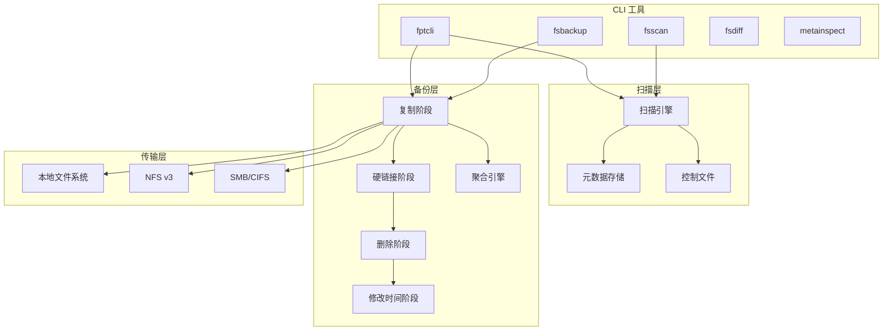

# 欢迎使用 Fpt

**Fpt**（File Protection Tool，文件保护工具）是一个用 Rust 编写的高性能备份与恢复引擎。它旨在为本地文件系统、NFS 导出和 SMB/CIFS 共享提供快速、可靠的数据保护。

无论您要备份几 GB 的文档，还是远程 NAS 上数百万个小文件，fpt-rs 都能为您提供统一的命令行界面来扫描、复制、验证和恢复数据。

## 核心特性

- **多传输协议支持** -- 使用统一的 URL 接口从本地磁盘、NFS v3 导出和 SMB/CIFS 共享进行备份和恢复。
- **聚合备份** -- 将大量小文件打包成大型 blob 文件，大幅减少元数据开销并提升 HDD 和远程共享的吞吐量。
- **增量备份** -- 在初始全量备份之后，后续运行仅处理已更改的文件，节省时间和带宽。
- **硬链接保留** -- 检测并在目标端重新创建硬链接文件，保持存储效率。
- **四阶段备份流水线** -- 复制、硬链接、删除和修改时间阶段独立运行，支持细粒度控制和断点续传。
- **结构化失败日志** -- 每个失败的文件都以 CSV、JSON 或 XML 格式记录，并附带错误分类，便于备份后排查。
- **可配置的指数退避重试** -- 瞬态 I/O 错误（网络超时、NFS jukebox 错误）会以指数退避和抖动进行重试。
- **并行 I/O** -- 工作线程池和异步任务队列充分利用本地和远程端点的可用带宽。

## 架构概览

## CLI 工具

| 工具 | 用途 |
|---|---|
| `fptcli` | 统一的备份和恢复编排器 -- 主要入口点 |
| `fsscan` | 独立的文件系统扫描器，生成元数据和控制文件 |
| `fsbackup` | 低级备份执行器，从控制文件运行单个子任务 |
| `fsdiff` | 目录比较工具，报告源目录和目标目录之间的差异 |
| `metainspect` | 元数据检查器 -- 以 JSON/CSV/TSV 格式读取元数据、缓存和控制文件 |

## 接下来做什么

- **[快速开始](./guides/quick-start.md)** -- 安装、构建并在五分钟内运行您的第一次备份。
- **[安装指南](./guides/installation.md)** -- 构建要求、功能标志和平台注意事项。
- **[首次备份演练](./guides/first-backup.md)** -- 包含示例数据的详细分步指南。
- **[NFS 设置](./guides/nfs-setup.md)** -- 配置 NFS 挂载并备份远程导出。
- **[SMB 设置](./guides/smb-setup.md)** -- 配置 SMB 共享并备份 Windows/NAS 目标。
- **[性能调优](./guides/performance-tuning.md)** -- 工作线程、缓冲区、blob 大小和内存规划。
- **[日志记录](./guides/logging.md)** -- 日志路由、详细级别和 `--log-file` 参数。
- **[故障处理](./guides/failure-handling.md)** -- 结构化故障日志和重试策略选项。
