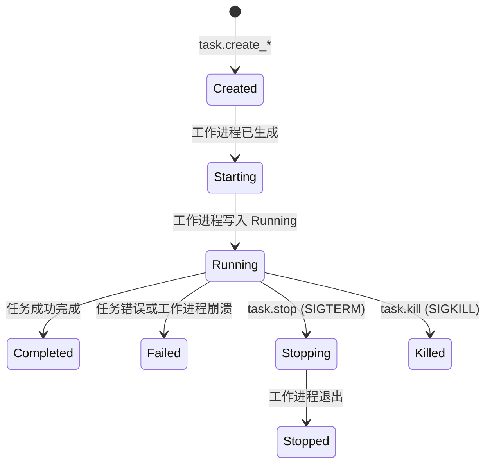

# fptserver 参考

`fptserver` 是一个长时间运行的 HTTP 服务器，将备份、恢复和扫描操作暴露为 JSON-RPC 和 REST API 端点。客户端提交任务，服务器生成工作进程来执行它们。

**源文件：** `src/bin/fptserver.rs`

## CLI 标志

| 标志 | 默认值 | 描述 |
|---|---|---|
| `--host <HOST>` | `127.0.0.1` | 绑定地址 |
| `--port <PORT>` | `3000` | 监听端口 |
| `--runtime-dir <DIR>` | `/tmp/fptserver` | 任务文件、日志、状态的目录 |
| `--max-scanners-count <N>` | `1` | 最大并发扫描器任务 |
| `--max-subtasks-count <N>` | `4` | 最大并发子任务进程 |

## REST API

| 端点 | 方法 | 描述 |
|---|---|---|
| `/health` | GET | 健康检查 |
| `/tasks` | GET | 列出所有任务 |
| `/tasks/:uuid` | GET | 获取任务状态 |
| `/tasks/:uuid/status` | GET | 获取任务状态 |
| `/tasks/:uuid/logs` | GET | 获取任务日志 |
| `/rpc` | POST | JSON-RPC 2.0 端点 |

## JSON-RPC 方法

| 方法 | 描述 |
|---|---|
| `task.create_scan` | 创建新的扫描任务 |
| `task.create_backup` | 创建新的备份任务 |
| `task.create_restore` | 创建新的恢复任务 |
| `task.stop` | 优雅停止任务（SIGTERM） |
| `task.kill` | 强制终止任务（SIGKILL） |
| `task.get` | 获取任务状态 |
| `task.list` | 列出所有任务 |

## 任务生命周期



## 示例

### 启动服务器

```bash
fptserver --host 0.0.0.0 --port 8080 --runtime-dir /var/fptserver \
    --max-scanners-count 2 --max-subtasks-count 8
```

### 创建备份任务

```bash
curl -X POST http://localhost:8080/rpc \
  -H "Content-Type: application/json" \
  -d '{
    "jsonrpc": "2.0",
    "id": 1,
    "method": "task.create_backup",
    "params": {
      "source": "/opt/data",
      "target": "/backup/data",
      "format": "common",
      "jobs": 4,
      "verbose": 1
    }
  }'
```
