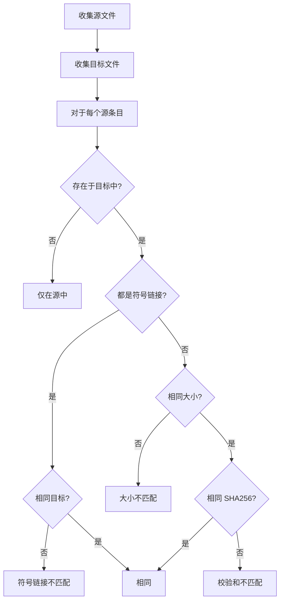

# fsdiff 参考

`fsdiff` 比较两个目录树并报告差异。它用于验证备份副本与源是否相同，或比较数据集的两个版本。

## 概要

```text
fsdiff --source <DIR> --target <DIR> [OPTIONS]
```

## 必需标志

| 标志 | 短标志 | 描述 |
|---|---|---|
| `--source <DIR>` | `-s` | 源目录路径 |
| `--target <DIR>` | `-t` | 目标目录路径 |

## 可选标志

| 标志 | 默认值 | 描述 |
|---|---|---|
| `--strip-source-prefix <PREFIX>` | | 比较时去除源路径前缀 |
| `--strip-target-prefix <PREFIX>` | | 比较时去除目标路径前缀 |
| `--follow-links` | `false` | 跟随符号链接 |
| `--compare-acl` | `false` | 比较 ACL（仅 Linux） |
| `--compare-xattrs` | `false` | 比较扩展属性（仅 Linux） |
| `--compare-mtime` | `false` | 比较目录修改时间 |
| `--verbose` | `false` | 打印每个正在比较的文件 |

## 比较逻辑



## 退出代码

| 代码 | 含义 |
|---|---|
| 0 | 目录相同 |
| 1 | 发现差异 |

## 示例

### 基本比较

```bash
fsdiff --source /opt/dataset --target /backup/dataset
```

### 带路径前缀去除的比较

```bash
fsdiff --source /opt/dataset --target /backup/copy1/data --strip-target-prefix /data
```

### CI/CD 验证

```bash
if fsdiff --source "$SRC" --target "$DST"; then
    echo "备份验证成功"
else
    echo "备份验证失败"
    exit 1
fi
```
