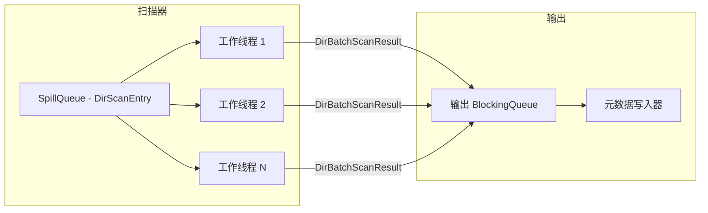

# 本地传输

本地传输处理本地挂载文件系统上的所有操作。它始终被编译（无需特性标志），并使用阻塞 OS 线程和 `std::fs` 进行所有 I/O 操作。

## 扫描器

### BIO 遍历工作线程

本地扫描器（`src/native/scanner.rs`）使用 OS 线程池并行遍历目录。每个工作线程从共享的 `SpillQueue` 中弹出 `DirScanEntry` 项，处理目录，并将 `DirBatchScanResult` 批次推入输出队列。



当队列为空**且**没有其他工作线程处于活动状态时，工作线程终止。这防止了在子目录仍在被发现时过早退出。

## 备份流水线

### LocalSource 和 LocalTarget

AIO 流水线 traits `SourceReader` 和 `TargetWriter` 在 `src/backup/aio/transport.rs` 中为本地文件系统 I/O 实现。

**LocalSource** 通过在生成的线程上进行阻塞 I/O 读取文件数据。

**LocalTarget** 通过阻塞 I/O 写入文件数据，支持稀疏文件。

复制缓冲区大小限制在 256 KB 和 4 MB 之间：

```rust
pub const DEFAULT_COPY_BUFFER_SIZE: usize = 1024 * 1024; // 1 MB

pub fn clamp_copy_buffer_size(size: usize) -> usize {
    size.clamp(256 * 1024, 4 * 1024 * 1024)
}
```

### 复制后阶段

所有文件复制完成后，本地传输运行三个可选阶段：


## 恢复流水线

本地恢复从备份副本（D_REPO 暂存目录）读取数据并使用 `std::fs` 写入目标路径。

`LocalRestoreOps` 结构体实现 `RestoreOps` trait，创建符号链接并恢复权限、扩展属性和 ACL。
