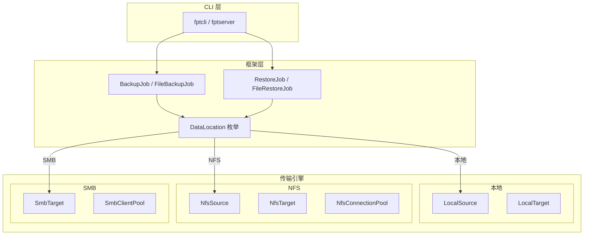

# 传输引擎概览

fpt-rs 支持三种**传输引擎** -- Native/本地、NFS 和 SMB -- 它们抽象了存储系统之间的差异。每个引擎实现一组通用 traits，因此备份和恢复流水线无论源或目标数据在哪里都能以相同方式工作。

## `DataLocation` 枚举

fpt-rs 中所有源和目标路径都由 `DataLocation` 枚举表示，定义在 `src/frame/location.rs`：

```rust
#[derive(Debug, Clone)]
pub enum DataLocation {
    Local(PathBuf),
    #[cfg(feature = "nfs")]
    Nfs(crate::nfs::NfsLocation),
    #[cfg(feature = "smb")]
    Smb(crate::smb::SmbLocation),
}
```

| 变体 | 载荷 | 连接模型 |
|------------|----------------|-------------------------------------------|
| `Local` | `PathBuf` | 直接 `std::fs` / `libc` 系统调用 |
| `Nfs` | `NfsLocation` | 通过 `nfs3_client` 的 NFSv3 RPC（无需内核挂载） |
| `Smb` | `SmbLocation` | 通过 `smb_client` 的 SMB2/3 异步客户端 |

## 架构图



## 源/目标矩阵

任何传输都可以作为源、目标或两者：

| 源 \ 目标 | 本地 | NFS | SMB |
|-----------------|-------|-----|-----|
| **本地** | 是 | 是 | 是 |
| **NFS** | 是 | 是 | 是 |
| **SMB** | 是 | 是 | 是 |

## 特性标志

NFS 和 SMB 传输受 Cargo 特性标志控制：

```toml
[features]
default = []
nfs = ["nfs3_client"]
smb = ["smb_client"]
```

当特性未启用时，相应的 `DataLocation` 变体和所有相关代码被编译排除。
