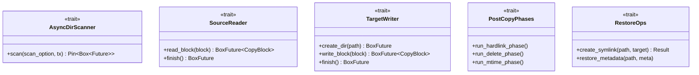

# Trait 系统

fpt-rs 使用基于 trait 的架构将备份/恢复流水线与特定传输实现解耦。本页记录了每个 trait、其用途以及三种传输如何实现它。

## Trait 层次结构



## AIO 流水线 Traits

### `SourceReader`

**文件：** `src/backup/aio/transport.rs`

从源位置读取数据块。每次 `read_block()` 调用返回一个包含数据字节和更新偏移量的 `CopyBlock`。`is_last` 标志表示整个文件已被读取。

```rust
pub trait SourceReader: Clone + Send + Sync + 'static {
    fn read_block(
        &self, block: CopyBlock,
    ) -> BoxFuture<'static, Result<CopyBlock, (CopyBlock, String)>>;
    fn finish(&self) -> BoxFuture<'static, Result<(), String>> {
        Box::pin(async { Ok(()) })
    }
}
```

| 结构体 | 传输 | 读取机制 |
|--------------|-----------|---------------------------------------------|
| `LocalSource`| 本地 | `task::spawn_blocking(read_local_file_chunk)` |
| `NfsSource`  | NFS | 通过 `nfs_read_task()` 的 NFS READ RPC |

### `TargetWriter`

**文件：** `src/backup/aio/transport.rs`

向目标位置写入数据块。

```rust
pub trait TargetWriter: Clone + Send + Sync + 'static {
    fn create_dir(&self, path: PathBuf) -> BoxFuture<'static, Result<(), String>>;
    fn write_block(
        &self, block: CopyBlock,
    ) -> BoxFuture<'static, Result<CopyBlock, (CopyBlock, String)>>;
    fn finish(&self) -> BoxFuture<'static, Result<(), String>> {
        Box::pin(async { Ok(()) })
    }
}
```

| 结构体 | 传输 | 写入机制 |
|--------------|-----------|----------------------------------------------|
| `LocalTarget`| 本地 | `task::spawn_blocking(write_local_file_chunk)` |
| `NfsTarget`  | NFS | 通过 `nfs_write_task()` 的 NFS WRITE RPC |
| `SmbTarget`  | SMB | 通过 `write_relative_file_chunk()` 的 SMB WRITE |

### `PostCopyPhases`

**文件：** `src/backup/aio/phases_trait.rs`

在目标文件系统上运行复制后阶段（硬链接、删除、修改时间）。默认实现为空操作。

### `RestoreOps`

**文件：** `src/backup/aio/restore_ops.rs`

恢复期间需要的传输特定操作。只有本地目标覆盖这些方法。
