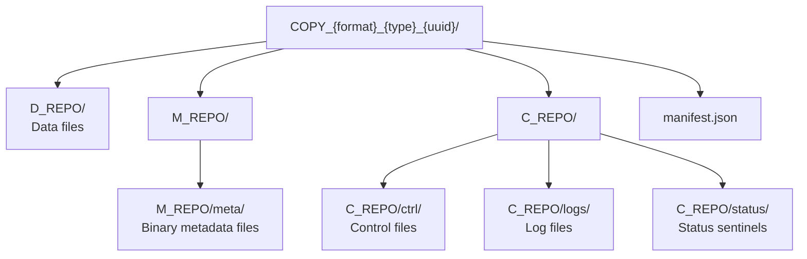
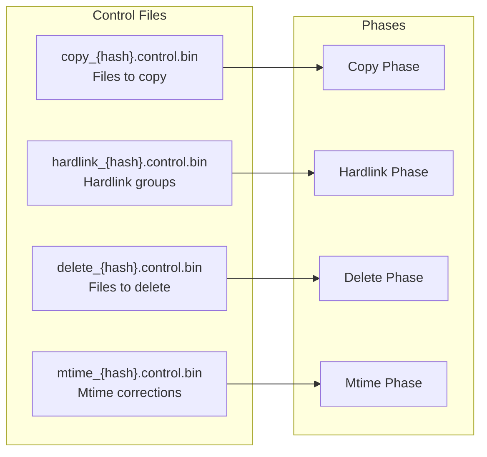
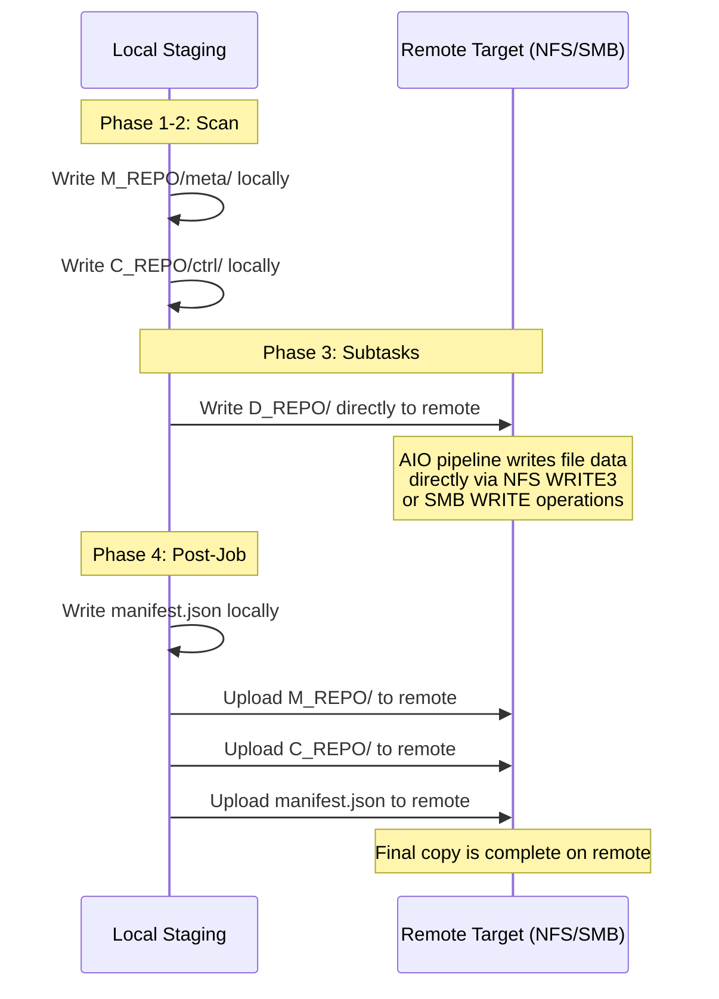

# Copy Layout

Every fpt-rs backup produces a **copy directory** that contains all data, metadata, control files, logs, and a manifest. This document describes the directory structure, file naming conventions, and binary formats.

## Copy Directory Naming

Each backup job creates a directory with the naming pattern:

```
COPY_{format}_{type}_{uuid}
```

| Component | Values | Description |
|-----------|--------|-------------|
| `format` | `COMMON`, `AGGREGATED` | Whether aggregation is enabled |
| `type` | `FULL`, `INCREMENTAL` | Full or incremental backup |
| `uuid` | UUIDv4 string | Unique identifier for this copy |

Examples:
```
COPY_COMMON_FULL_a1b2c3d4-e5f6-7890-abcd-ef1234567890/
COPY_AGGREGATED_INCREMENTAL_fedcba98-7654-3210-abcd-123456789abc/
```

## Directory Structure



```text
COPY_{format}_{type}_{uuid}/
├── manifest.json                    # Job metadata and subtask records
├── D_REPO/                          # Data files (actual file content)
│   ├── <relative/path/to/file1>
│   ├── <relative/path/to/file2>
│   └── ...
├── M_REPO/
│   └── meta/                        # Binary metadata files
│       ├── meta_00000000.dat        # File metadata records
│       ├── meta_00000001.dat
│       ├── fcache_00000000.dat      # File cache (hardlink info)
│       ├── dcache_00000000.dat      # Directory cache records
│       └── ...
└── C_REPO/
    ├── ctrl/                        # Binary control files
    │   ├── copy_{hash}.control.bin  # Copy instructions
    │   ├── hardlink_{hash}.control.bin
    │   ├── delete_{hash}.control.bin
    │   └── mtime_{hash}.control.bin
    ├── logs/                        # Execution logs
    │   ├── scan.log
    │   ├── frame.log
    │   └── {subtask-uuid}.log
    └── status/                      # Status sentinel files
        ├── SCAN_{uuid}.DONE
        ├── SUBTASK_{uuid}.RUNNING
        ├── SUBTASK_{uuid}.DONE
        └── SUBTASK_{uuid}.FAILED
```

## The Three Repos

### D_REPO -- Data Repository

D_REPO holds the **actual file content** -- the bytes of every backed-up file, preserving the original directory structure.

```text
D_REPO/
├── etc/
│   ├── fstab
│   └── nginx/
│       └── nginx.conf
├── home/
│   └── user/
│       ├── documents/
│       │   └── report.pdf
│       └── .bashrc
└── var/
    └── log/
        └── syslog
```

**Key behaviors:**
- For **local targets**: D_REPO is written directly under the copy root.
- For **remote targets** (NFS/SMB): D_REPO is written directly to the remote filesystem by the AIO pipeline -- it is NOT staged locally first.
- When **aggregation** is enabled, small files are packed into aggregate blobs in an `A_REPO/` directory instead of D_REPO.

### M_REPO -- Metadata Repository

M_REPO holds **binary metadata files** produced by the scanner. These files use a fixed-size binary format for efficient random access.

```text
M_REPO/
└── meta/
    ├── meta_00000000.dat      # FileMeta records
    ├── meta_00000001.dat
    ├── fcache_00000000.dat    # File cache (inode -> file index mapping)
    ├── dcache_00000000.dat    # DirCacheEntry records
    └── ...
```

M_REPO is **always written locally** during a job, even when the source or target is remote. For remote targets, the `PostJob` uploads M_REPO after all subtasks complete.

### C_REPO -- Control Repository

C_REPO holds **control files** (what to copy/delete/hardlink/mtime), **logs**, and **status sentinels**.

```text
C_REPO/
├── ctrl/          # Control files
├── logs/          # Log files
└── status/        # Status sentinel files
```

Like M_REPO, C_REPO is always written locally and uploaded to remote targets by `PostJob`.

## Binary Metadata Formats

### FileMeta Records (`meta_*.dat`)

Each `meta_*.dat` file is a sequential binary file containing fixed-size `FileMeta` records. The file layout is:

```text
[FileMeta_0][FileMeta_1][FileMeta_2]...[FileMeta_N]
```

Each `FileMeta` record contains:

```text
┌─────────────────────────────────────────────────────────────┐
│ MetaCommon (shared by FileMeta and DirMeta)                  │
├─────────────────────────────────────────────────────────────┤
│ id:           u64   (inode on Unix, file index on Windows)  │
│ mode:         u32   (file type + permission bits)           │
│ attr:         u32   (FILE_ATTRIBUTE_* on Windows)           │
│ atime:        u32   (last access time, Unix epoch seconds)  │
│ ctime:        u32   (creation/status-change time)           │
│ mtime:        u32   (last modification time)                │
│ devno:        u64   (device number)                         │
│ name:         String (base name, variable-length)           │
│ security_descriptor: Option<String> (Windows SDDL)          │
│ posix_access_acl:   Option<String> (POSIX ACL text)         │
│ posix_default_acl:  Option<String> (POSIX default ACL)      │
│ symlink_target_path: Option<String> (symlink target)        │
│ xattributes:  Option<String> (extended attributes)          │
├─────────────────────────────────────────────────────────────┤
│ FileMeta-specific fields:                                    │
│ size:         u64   (logical file size in bytes)            │
│ links:        u64   (hard link count)                       │
│ sparse_range: Option<Vec<(u64, u64)>> (sparse holes)       │
└─────────────────────────────────────────────────────────────┘
```

Records are serialized with a fixed-size constraint (`FixedSize` trait) so that the `BinObjectSeqWriter` can compute exact byte offsets for random access.

### DirCacheEntry Records (`dcache_*.dat`)

Directory cache entries store directory metadata for efficient lookup:

```text
┌──────────────────────────────────────────┐
│ DirCacheEntry                             │
├──────────────────────────────────────────┤
│ Logical path, timestamps, permissions     │
│ (fixed-size binary encoding)              │
└──────────────────────────────────────────┘
```

### File Cache (`fcache_*.dat`)

File cache entries map inode numbers to file record indices, enabling hardlink detection:

```text
┌──────────────────────────────────────────┐
│ FileCacheEntry                            │
├──────────────────────────────────────────┤
│ inode:    u64                             │
│ file_id:  u32  (index in meta_*.dat)     │
│ (fixed-size binary encoding)              │
└──────────────────────────────────────────┘
```

## Control Files

Control files are binary instruction files that tell the backup executor what to do. They are stored in `C_REPO/ctrl/` with the naming convention:

```
{phrase}_{sha256_hash}.control.bin
```

Where `{phrase}` is one of: `copy`, `hardlink`, `delete`, `mtime`.



### Control File Entry Types

Each control file contains a sequence of entries in a binary format:

**Copy Control** (`copy_*.control.bin`):
```text
┌──────────────────────────────────────────┐
│ ControlFileEntry (copy)                   │
├──────────────────────────────────────────┤
│ logical_path:  String (relative path)     │
│ meta_file_id:  u32 (index into meta_*.dat)│
│ meta_record_id: u32 (record within file)  │
│ source_kind:   String ("local"/"nfs"/"smb")│
│ ...                                       │
└──────────────────────────────────────────┘
```

**Hardlink Control** (`hardlink_*.control.bin`):
```text
┌──────────────────────────────────────────┐
│ ControlFileEntry (hardlink)               │
├──────────────────────────────────────────┤
│ group_id:      u32                        │
│ target_path:   String                     │
│ link_paths:    Vec<String>                │
│ ...                                       │
└──────────────────────────────────────────┘
```

**Delete Control** (`delete_*.control.bin`):
```text
┌──────────────────────────────────────────┐
│ ControlFileEntry (delete)                 │
├──────────────────────────────────────────┤
│ logical_path:  String                     │
│ is_directory:  bool                       │
│ ...                                       │
└──────────────────────────────────────────┘
```

**Mtime Control** (`mtime_*.control.bin`):
```text
┌──────────────────────────────────────────┐
│ ControlFileEntry (mtime)                  │
├──────────────────────────────────────────┤
│ logical_path:  String                     │
│ mtime:         u32 (Unix epoch seconds)   │
│ atime:         u32                        │
│ ...                                       │
└──────────────────────────────────────────┘
```

### Sharded Control Files

For large backups, copy control files may be **sharded** across multiple files:

```
copy_{hash_shard0_file0}.control.bin
copy_{hash_shard0_file1}.control.bin
copy_{hash_shard1_file0}.control.bin
...
```

Sharding is configured via `ShardOption` in `ScanOption`. Each shard contains a subset of the copy entries, allowing parallel processing by subtask workers.

## manifest.json

The `manifest.json` file is written at the copy root during the post-job phase. It provides a machine-readable summary of the backup:

```json
{
  "version": "1.0",
  "copy_uuid": "a1b2c3d4-e5f6-7890-abcd-ef1234567890",
  "copy_type": "full",
  "format": "common",
  "source": "/data/production",
  "target": "nfs://10.0.0.1/backups",
  "created_at": "2026-01-15T10:30:00+00:00",
  "base_copy": null,
  "aggregation": null,
  "subtasks": [
    {
      "subtask_id": "subtask-uuid-1",
      "control_file": "copy_a1b2c3d4.control.bin",
      "status": "completed",
      "files_copied": 15234,
      "bytes_copied": 1073741824
    },
    {
      "subtask_id": "subtask-uuid-2",
      "control_file": "copy_f5e6d7c8.control.bin",
      "status": "completed",
      "files_copied": 8901,
      "bytes_copied": 536870912
    }
  ]
}
```

### Manifest Fields

| Field | Type | Description |
|-------|------|-------------|
| `version` | String | Manifest format version |
| `copy_uuid` | String | UUIDv4 identifying this copy |
| `copy_type` | String | `"full"` or `"incremental"` |
| `format` | String | `"common"` or `"aggregated"` |
| `source` | String | Source `DataLocation` display string |
| `target` | String | Target `DataLocation` display string |
| `created_at` | String | RFC 3339 timestamp |
| `base_copy` | String? | Path to base copy (incremental only) |
| `aggregation` | Object? | Aggregation settings (if enabled) |
| `subtasks` | Array | List of `SubtaskRecord` entries |

### Aggregation Manifest

When aggregation is enabled, the manifest includes:

```json
{
  "aggregation": {
    "layout": "default",
    "max_blob_size": 67108864,
    "file_threshold": 65536,
    "shard_count": 4
  }
}
```

## Status Sentinel Files

The `C_REPO/status/` directory contains empty sentinel files that track job progress:

| Sentinel | Created When | Removed When |
|----------|-------------|-------------|
| `SCAN_{uuid}.RUNNING` | Scan phase starts | Scan completes |
| `SCAN_{uuid}.DONE` | Scan phase completes | Never |
| `SUBTASK_{uuid}.RUNNING` | Subtask starts | Subtask completes/fails |
| `SUBTASK_{uuid}.DONE` | Subtask completes successfully | Never |
| `SUBTASK_{uuid}.FAILED` | Subtask fails | Never |

These sentinels enable crash recovery: a partially completed copy can be inspected to determine which phases completed.

## RepoLayout in Code

The `RepoLayout` struct in `src/frame/repo.rs` encapsulates all paths:

```rust
pub struct RepoLayout {
    pub copy_root: PathBuf,        // COPY_{format}_{type}_{uuid}/
    pub copy_uuid: String,         // UUID
    pub d_repo: PathBuf,           // D_REPO/
    pub meta_dir: PathBuf,         // M_REPO/meta/
    pub ctrl_dir: PathBuf,         // C_REPO/ctrl/
    pub logs_dir: PathBuf,         // C_REPO/logs/
    pub status_dir: PathBuf,       // C_REPO/status/
}
```

It is constructed with `RepoLayout::new(base_dir, format_tag, type_tag)` for new jobs or `RepoLayout::from_existing(copy_root)` for opening an existing copy (e.g., for restore).

## Remote Target Behavior

When the target is remote (NFS or SMB), the copy directory lifecycle differs:



This design minimizes local disk usage: only metadata and control files are staged locally, while the bulk data (D_REPO) flows directly to the remote target.
