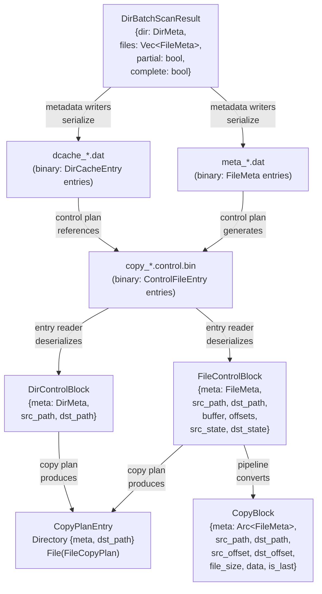
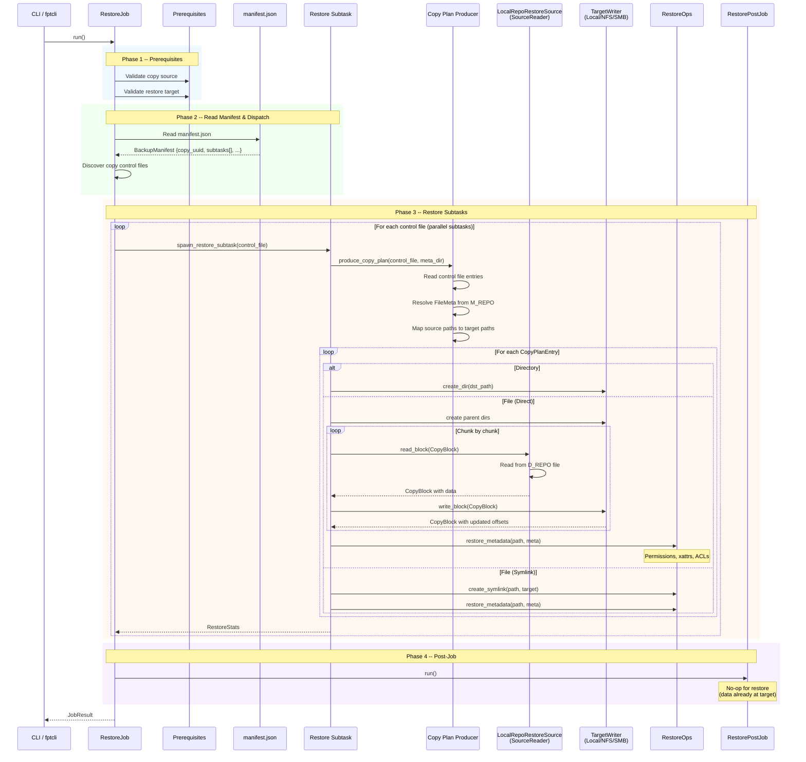
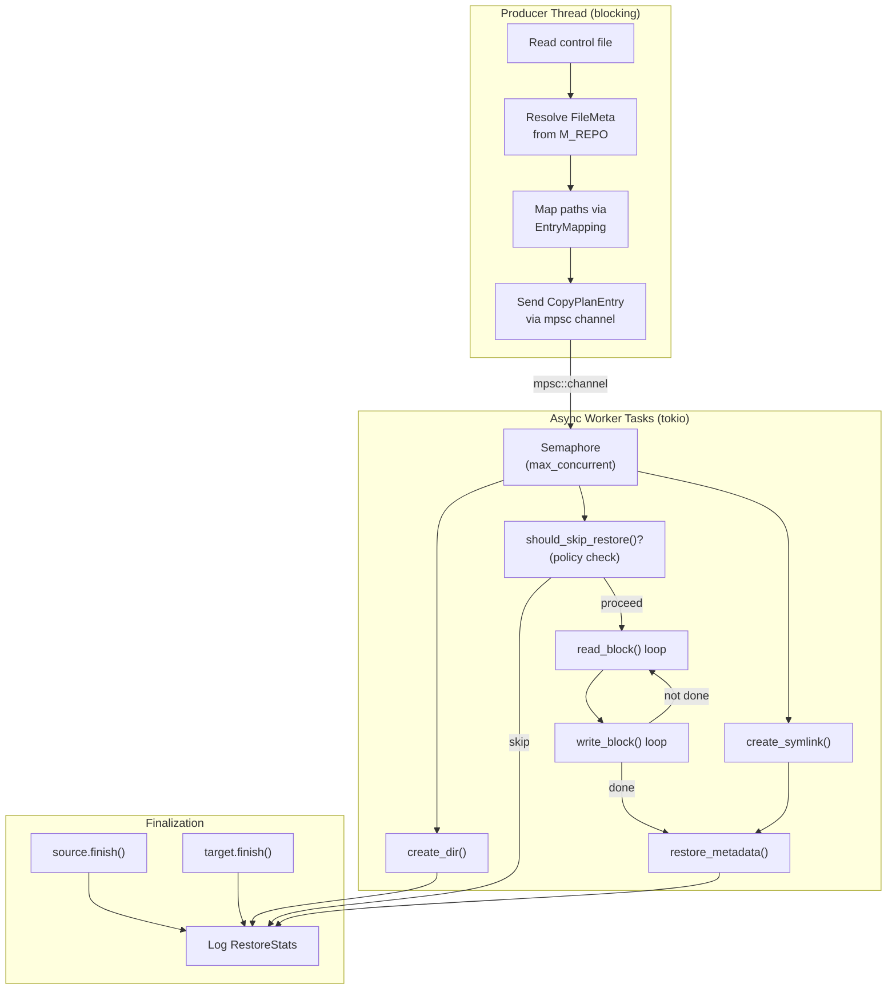
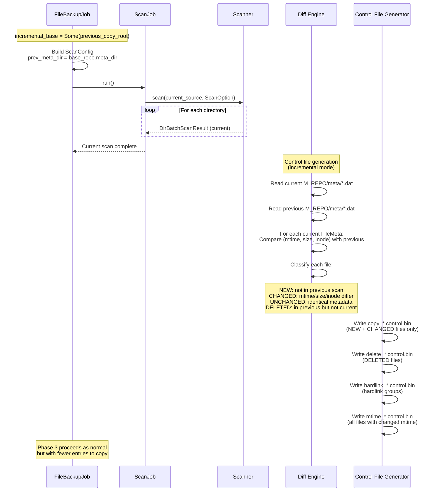
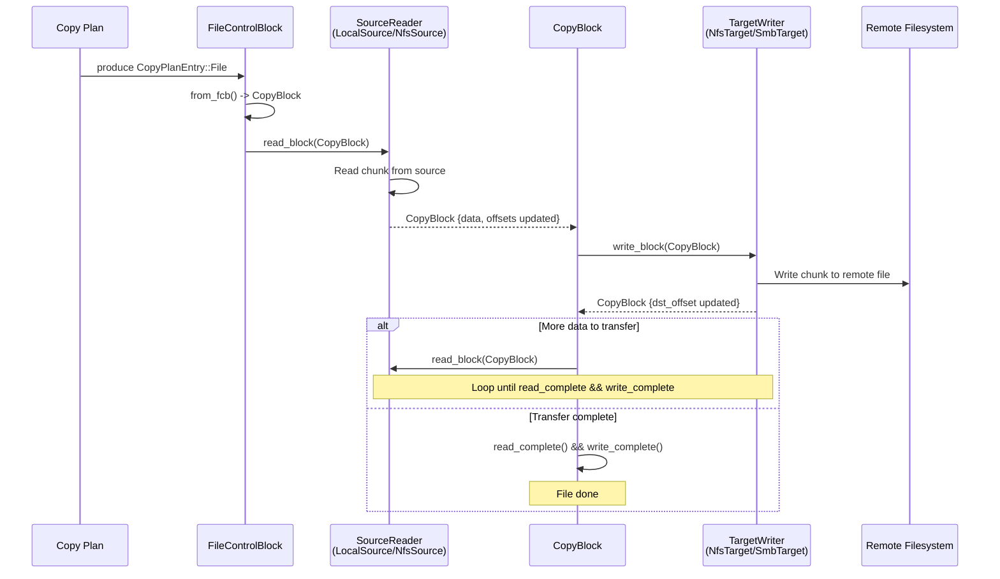
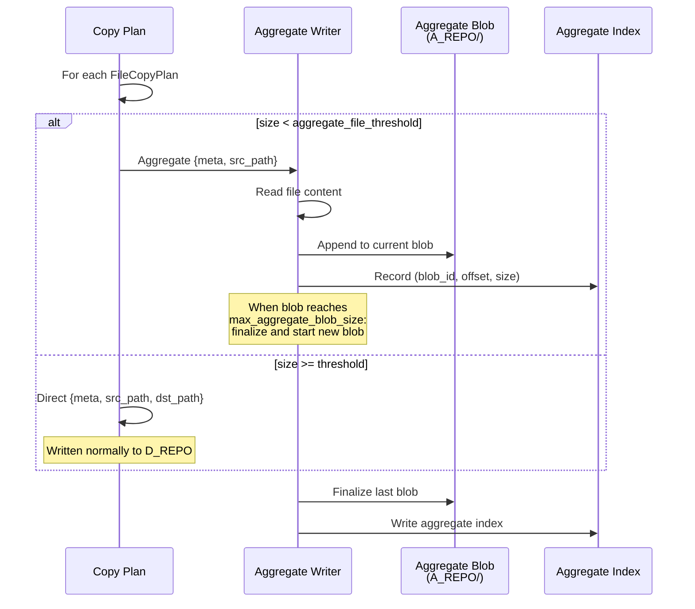

# Data Flow

This document traces the end-to-end data flow through fpt-rs for the three primary operations: **backup**, **restore**, and **incremental backup**. Sequence diagrams show how `DirBatchScanResult`, `FileControlBlock`, and `CopyBlock` move through the pipeline.

## Core Data Structures

Before examining the flows, here is how the key data structures relate:



## Backup Flow

The backup flow has four phases, orchestrated by `FileBackupJob::run()`:

### Sequence Diagram

```mermaid
sequenceDiagram
    participant CLI as CLI / fptcli
    participant JOB as FileBackupJob
    participant PREREQ as BackupPrereqJob
    participant SCAN as ScanJob
    participant SCANNER as Transport Scanner<br/>(Local/NFS/SMB)
    participant META_W as Metadata Writers
    participant CTRL as Control File Generator
    participant SUBTASK as Subtask Dispatcher
    participant EXECUTOR as Transport Executor<br/>(Local/NFS/SMB)
    participant POST as BackupPostJob

    CLI->>JOB: run()

    rect rgb(240, 248, 255)
        Note over JOB,PREREQ: Phase 1 -- Prerequisites
        JOB->>PREREQ: run_sync()
        PREREQ->>PREREQ: Validate source accessibility
        PREREQ->>PREREQ: Validate target accessibility
        PREREQ-->>JOB: OK
    end

    rect rgb(240, 255, 240)
        Note over JOB,CTRL: Phase 2 -- Scan
        JOB->>JOB: Build ScanConfig<br/>(incremental: prev_meta_dir?)
        JOB->>SCAN: run()
        SCAN->>SCANNER: scan(root_path, ScanOption)
        loop For each directory batch
            SCANNER->>SCANNER: List directory entries
            SCANNER->>SCANNER: stat() each entry
            SCANNER-->>META_W: DirBatchScanResult<br/>{dir: DirMeta, files: Vec&lt;FileMeta&gt;}
            META_W->>META_W: Serialize FileMeta to meta_*.dat
            META_W->>META_W: Serialize DirCacheEntry to dcache_*.dat
        end
        SCANNER-->>SCAN: Scan complete
        SCAN->>CTRL: generate_control_files()
        CTRL->>CTRL: Read meta_*.dat (current + previous)
        CTRL->>CTRL: Diff: new/changed/deleted files
        CTRL->>CTRL: Write copy_*.control.bin
        CTRL->>CTRL: Write hardlink_*.control.bin
        CTRL->>CTRL: Write delete_*.control.bin
        CTRL->>CTRL: Write mtime_*.control.bin
        CTRL-->>SCAN: Control files generated
        SCAN-->>JOB: ScanStats
    end

    rect rgb(255, 248, 240)
        Note over JOB,EXECUTOR: Phase 3 -- Subtasks
        JOB->>JOB: Discover control files in C_REPO/ctrl/
        JOB->>SUBTASK: spawn_and_join_subtasks()
        loop For each control file (parallel subtasks)
            SUBTASK->>EXECUTOR: execute_backup(control_file)
            EXECUTOR->>EXECUTOR: Read control file entries
            EXECUTOR->>EXECUTOR: produce_copy_plan()
            loop For each CopyPlanEntry
                alt Directory entry
                    EXECUTOR->>EXECUTOR: create_dir(dst_path)
                    EXECUTOR->>EXECUTOR: restore_metadata()
                else File entry
                    EXECUTOR->>EXECUTOR: Open source file
                    loop Chunk by chunk
                        EXECUTOR->>EXECUTOR: Read CopyBlock from source
                        EXECUTOR->>EXECUTOR: Write CopyBlock to target
                    end
                    EXECUTOR->>EXECUTOR: Close handles, restore metadata
                end
            end
            EXECUTOR->>EXECUTOR: PostCopyPhases::run_all_phases()
            Note over EXECUTOR: hardlink, delete, mtime
            EXECUTOR-->>SUBTASK: SubtaskResult
        end
        SUBTASK-->>JOB: All subtasks complete
    end

    rect rgb(248, 240, 255)
        Note over JOB,POST: Phase 4 -- Post-Job
        JOB->>JOB: Build BackupManifest
        JOB->>POST: run()
        POST->>POST: Write manifest.json locally
        alt Remote target (NFS/SMB)
            POST->>POST: Upload M_REPO/ to target
            POST->>POST: Upload C_REPO/ to target
            POST->>POST: Upload manifest.json to target
        end
        POST-->>JOB: OK
    end

    JOB-->>CLI: JobResult {copy_uuid, stats}
```

### DirBatchScanResult Flow

The `DirBatchScanResult` is the fundamental unit of scan output. Here is how it flows through the system:

```mermaid
sequenceDiagram
    participant WORKER as Scan Worker Thread
    participant QUEUE as BlockingQueue<br/>&lt;DirBatchScanResult&gt;
    participant WRITER as Metadata Writer Thread
    participant DISK_META as M_REPO/meta/<br/>(.dat files)
    participant DISK_CTRL as C_REPO/ctrl/<br/>(.control.bin files)
    participant GEN as Control File<br/>Generator

    WORKER->>WORKER: readdir() + stat()
    WORKER->>WORKER: Build DirBatchScanResult<br/>{dir: DirMeta, files: [FileMeta...]}
    WORKER->>QUEUE: push(batch)
    QUEUE->>WRITER: pop(batch)
    WRITER->>DISK_META: write FileMeta entries<br/>to meta_*.dat (fixed-size binary)
    WRITER->>DISK_META: write DirCacheEntry<br/>to dcache_*.dat

    Note over GEN: After all batches processed
    GEN->>DISK_META: Read current meta_*.dat
    GEN->>DISK_META: Read previous meta_*.dat<br/>(if incremental)
    GEN->>GEN: Diff: compare FileMeta records<br/>(mtime, size, inode)
    GEN->>DISK_CTRL: Write changed/new files<br/>to copy_*.control.bin
    GEN->>DISK_CTRL: Write deleted files<br/>to delete_*.control.bin
    GEN->>DISK_CTRL: Write hardlink groups<br/>to hardlink_*.control.bin
    GEN->>DISK_CTRL: Write mtime entries<br/>to mtime_*.control.bin
```

## Restore Flow

The restore flow reads from a backup copy and writes to a restore target:



### Restore Pipeline Detail

The `run_restore_copy_pipeline()` function is generic over `T: TargetWriter` and `R: RestoreOps`:



## Incremental Backup Flow

Incremental backup reuses the same pipeline as full backup, with one key difference in Phase 2:



## AIO Pipeline Data Flow (Remote Targets)

When the target is remote (NFS or SMB), the backup uses the AIO async pipeline:



## Aggregation Flow

When aggregation is enabled, small files are packed into aggregate blobs instead of being written individually:


