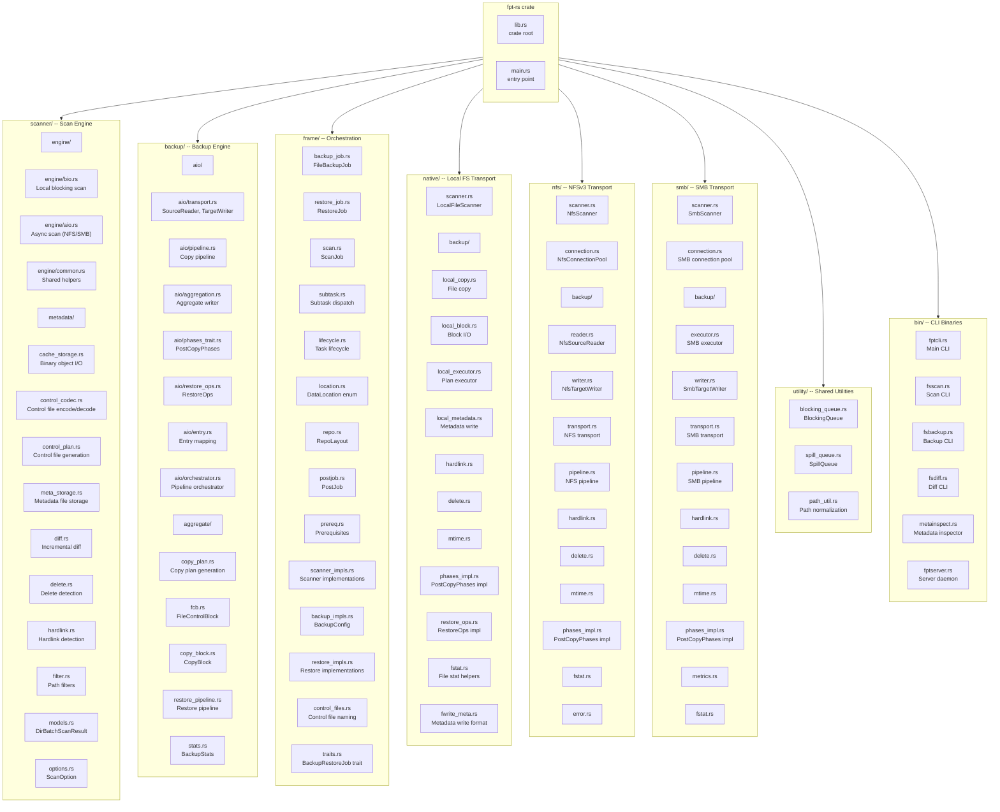
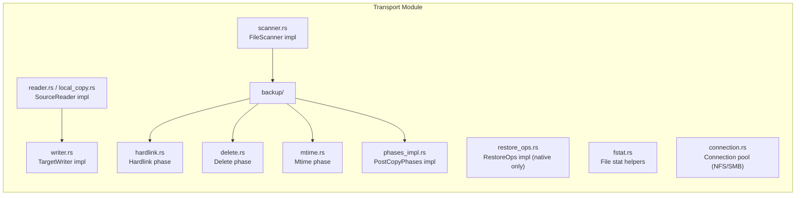
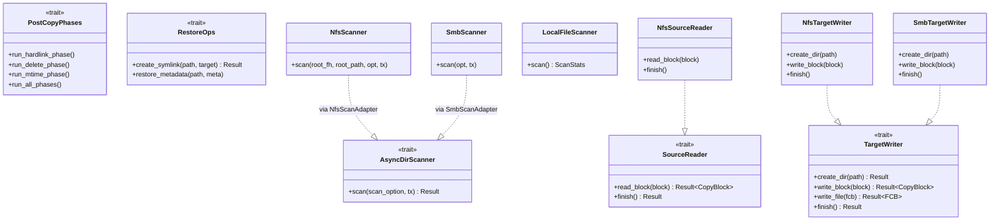

# Module Structure

This document describes the module tree of fpt-rs, explaining each module's role and how the three transport modules (native, NFS, SMB) form a symmetric, pluggable architecture.

## Module Tree

## Module Responsibilities

### `scanner/` -- Scan Engine

The scanner module is responsible for **traversing a filesystem** and producing metadata and control files. It is transport-agnostic at the core: it defines the data structures and processing pipeline, while the actual directory listing is delegated to transport-specific implementations.

| Submodule | Responsibility |
|-----------|---------------|
| `engine/bio.rs` | Blocking I/O scan engine for local filesystems. Spawns worker threads that read directories via `std::fs`. |
| `engine/aio.rs` | Async scan engine for remote transports. Defines the `AsyncDirScanner` trait and `run_aio_scan()` scaffolding. |
| `engine/common.rs` | Shared helpers such as `retry_async()` used by both BIO and AIO engines. |
| `metadata/meta_storage.rs` | Writes `FileMeta` and `DirMeta` to binary `.dat` files in `M_REPO/meta/`. |
| `metadata/cache_storage.rs` | `BinObjectSeqWriter<T>` -- generic fixed-size binary object serializer. |
| `metadata/control_codec.rs` | Encodes/decodes control file entries (copy, hardlink, delete, mtime). |
| `metadata/control_plan.rs` | Generates control files from metadata by comparing current and previous scans. |
| `metadata/diff.rs` | Incremental diff logic: compares `FileMeta` records to detect changes. |
| `metadata/delete.rs` | Detects files/dirs present in the previous scan but absent in the current scan. |
| `metadata/hardlink.rs` | Detects hardlinked files by matching inode numbers across the scan. |
| `filter.rs` | `ScanPathFilterSet` -- include/exclude path filters applied during traversal. |
| `models.rs` | Core data structures: `DirBatchScanResult`, `DirScanEntry`, `ScanStatistics`. |
| `options.rs` | `ScanOption` -- all configuration knobs for the scanner. |

### `backup/` -- Backup Engine

The backup engine reads control files and metadata, then orchestrates data transfer through the transport traits.

| Submodule | Responsibility |
|-----------|---------------|
| `aio/transport.rs` | Defines `SourceReader` and `TargetWriter` traits. Provides `LocalSource` and `LocalTarget` implementations. |
| `aio/pipeline.rs` | Generic async copy pipeline that reads from a `SourceReader` and writes to a `TargetWriter`. |
| `aio/orchestrator.rs` | Top-level orchestrator that coordinates the copy pipeline with post-copy phases. |
| `aio/aggregation.rs` | Packs small files into aggregate blobs for efficient storage. |
| `aio/phases_trait.rs` | `PostCopyPhases` trait -- hardlink, delete, mtime phases after copy. |
| `aio/restore_ops.rs` | `RestoreOps` trait -- symlink creation and metadata restoration during restore. |
| `aio/entry.rs` | `EntryMapping` -- translates source paths to target paths for control file entries. |
| `copy_plan.rs` | `CopyPlanEntry` and `FileCopyPlan` -- what to copy and how (direct vs. aggregate). |
| `fcb.rs` | `FileControlBlock` (FCB) -- state machine for a single file's backup/restore operation. |
| `copy_block.rs` | `CopyBlock` -- the unit of data transfer in the async pipeline. |
| `restore_pipeline.rs` | `run_restore_copy_pipeline()` -- generic restore pipeline parameterized by `TargetWriter` and `RestoreOps`. |
| `aggregate/` | Aggregate blob management: engine, indexing, local operations, restore. |

### `frame/` -- Orchestration Layer

The frame layer manages the **full job lifecycle** and dispatches to the correct transport.

| Submodule | Responsibility |
|-----------|---------------|
| `backup_job.rs` | `FileBackupJob` -- the top-level backup job. Runs 4 phases: prereq, scan, subtasks, post-job. |
| `restore_job.rs` | `RestoreJob` -- the top-level restore job. Reads manifest, dispatches restore subtasks. |
| `scan.rs` | `ScanJob` -- dispatches scanning to the correct transport based on `DataLocation`. |
| `subtask.rs` | Splits control files into parallel subtasks and spawns transport-specific backup executors. |
| `location.rs` | `DataLocation` enum -- `Local(PathBuf)`, `Nfs(NfsLocation)`, `Smb(SmbLocation)`. |
| `repo.rs` | `RepoLayout` -- describes the `COPY_{format}_{type}_{uuid}/` directory structure. |
| `postjob.rs` | `BackupPostJob` -- writes `manifest.json` and uploads repos to remote targets. |
| `prereq.rs` | `BackupPrereqJob` -- validates source/target accessibility before starting. |
| `scanner_impls.rs` | `ScannerConfig`, `LocalFileScanner`, `NfsFileScanner`, `SmbFileScanner`. |
| `backup_impls.rs` | `BackupConfig` -- shared configuration for all backup implementations. |
| `restore_impls.rs` | Restore dispatch: builds the correct `TargetWriter` + `RestoreOps` for the target `DataLocation`. |
| `control_files.rs` | Control file naming conventions: `copy_*.control.bin`, `hardlink_*.control.bin`, etc. |
| `lifecycle.rs` | `TaskLifecycleError` -- common lifecycle error types. |
| `traits.rs` | `BackupRestoreJob` trait -- the common interface for backup and restore jobs. |

### Transport Modules

The three transport modules (`native/`, `nfs/`, `smb/`) are **symmetric** in structure. Each provides:

| Transport | Scanner | SourceReader | TargetWriter | PostCopyPhases | RestoreOps | Connection |
|-----------|---------|-------------|-------------|----------------|------------|------------|
| `native/` | `LocalFileScanner` (BIO) | `LocalSource` (shared) | `LocalTarget` (shared) | `LocalPhases` | `LocalRestoreOps` | N/A (direct syscalls) |
| `nfs/` | `NfsScanner` (AIO) | `NfsSourceReader` | `NfsTargetWriter` | `NfsPhases` | N/A (default no-op) | `NfsConnectionPool` |
| `smb/` | `SmbScanner` (AIO) | N/A (reads from local) | `SmbTargetWriter` | `SmbPhases` | N/A (default no-op) | `SMB connection pool` |

### `utility/` -- Shared Utilities

| Module | Responsibility |
|--------|---------------|
| `blocking_queue.rs` | `BlockingQueue<T>` -- bounded, thread-safe queue used between scanner workers and metadata writers. |
| `spill_queue.rs` | `SpillQueue<T>` -- memory-bounded queue that spills to disk when memory pressure is high. |
| `path_util.rs` | Path normalization functions for logical paths used in control files. |

### `bin/` -- CLI Binaries

| Binary | Purpose |
|--------|---------|
| `fptcli` | Main CLI entry point -- unified interface for scan, backup, restore, diff. |
| `fsscan` | Standalone scan tool. |
| `fsbackup` | Standalone backup tool. |
| `fsdiff` | Diff tool -- compares two scans or a scan against a live filesystem. |
| `metainspect` | Inspector for binary metadata and control files. |
| `fptserver` | Server daemon mode for remote management. |
| `smbprobe` | SMB connectivity probe tool. |
| `vdbench` | Performance benchmarking tool. |

## Symmetric Pluggable Engines

The key architectural pattern is that `native/`, `nfs/`, and `smb/` are **symmetric pluggable engines**. They share:

- The same `scanner/` + `backup/` internal layout.
- The same trait implementations (`AsyncDirScanner` for NFS/SMB, `PostCopyPhases` for all, `SourceReader`/`TargetWriter` for all).
- The same integration point: the frame layer dispatches via `DataLocation` matching.

This design makes it straightforward to add new transports: implement the traits, wire them into `DataLocation` dispatch in the frame layer, and the rest of the pipeline works unchanged.
