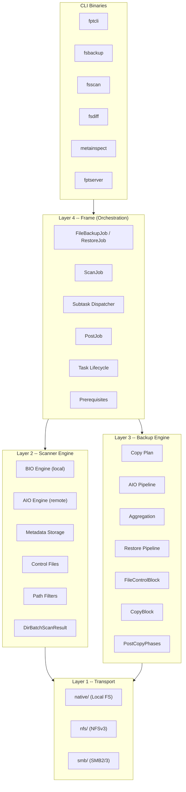
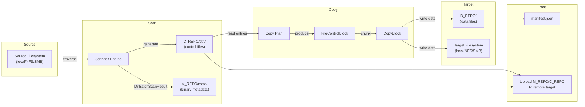

# Architecture Overview

fpt-rs is a high-performance, pluggable backup engine written in Rust. It is organized into **four distinct layers**, each with a clear responsibility. The layers communicate through well-defined data structures and trait boundaries, allowing each transport (local, NFS, SMB) to be plugged in without modifying the core logic.

## Layer Diagram

## The Four Layers

### Layer 1 -- Transport

The transport layer is the bottom of the stack. It provides **raw filesystem operations** for each supported protocol:

| Module | Protocol | Description |
|--------|----------|-------------|
| `native/` | Local FS | Direct POSIX/Win32 syscalls via `std::fs` |
| `nfs/` | NFSv3 | Direct RPC to NFS server, no kernel mount required |
| `smb/` | SMB2/3 | Async SMB client for Windows shares and Samba |

Each transport module is self-contained and symmetric in structure, providing a `scanner/` submodule and a `backup/` submodule. The transport layer implements the core traits (`SourceReader`, `TargetWriter`, `AsyncDirScanner`, `PostCopyPhases`, `RestoreOps`) that the upper layers depend on.

### Layer 2 -- Scanner Engine

The scanner engine (`src/scanner/`) traverses a source filesystem and produces:

- **Metadata files** (`M_REPO/meta/`): Binary-encoded `FileMeta` and `DirMeta` records describing every file and directory.
- **Control files** (`C_REPO/ctrl/`): Binary-encoded instruction files listing what needs to be copied, hardlinked, deleted, or time-corrected.

The scanner has two execution modes:

- **BIO (Blocking I/O)**: Used for local filesystem scanning. Worker threads read directories directly via `std::fs`.
- **AIO (Async I/O)**: Used for remote transports (NFS, SMB). The `AsyncDirScanner` trait abstracts over protocol-specific async traversal.

Both modes produce the same `DirBatchScanResult` data structure, which flows through a `BlockingQueue` to metadata writer threads.

### Layer 3 -- Backup Engine

The backup engine (`src/backup/`) reads control files and metadata, then orchestrates the actual data copy:

- **Copy Plan**: Reads a control file and produces `CopyPlanEntry` items (directories or files).
- **AIO Pipeline**: For remote targets, uses `SourceReader` + `TargetWriter` traits to transfer data as `CopyBlock` units.
- **Aggregation**: Small files can be packed into aggregate blobs for efficiency.
- **Post-Copy Phases**: After copying file data, runs hardlink, delete, and mtime phases.
- **Restore Pipeline**: Reads data from a backup copy and writes it to a restore target.

The `FileControlBlock` (FCB) is the central state machine for each file operation, tracking source/target handles, buffers, and offsets.

### Layer 4 -- Frame (Orchestration)

The frame layer (`src/frame/`) is the top-level orchestrator. It manages the **full lifecycle** of backup and restore jobs:

1. **Prerequisites** (`prereq.rs`): Validates source/target accessibility.
2. **Scan** (`scan.rs`): Delegates to the appropriate scanner for the source `DataLocation`.
3. **Subtasks** (`subtask.rs`): Splits control files into parallel subtasks, each handled by a transport-specific backup executor.
4. **Post-Job** (`postjob.rs`): Writes `manifest.json`, uploads metadata and control repos to remote targets.

The frame layer uses `DataLocation` to dispatch to the correct transport without hardcoding protocol logic.

## End-to-End Data Flow

## Key Design Principles

### Symmetric Pluggable Transports

Every transport (native, NFS, SMB) implements the same set of traits. The frame layer dispatches based on `DataLocation`, and the backup/scanner layers are generic over these traits. Adding a new transport means implementing the traits and adding a new `DataLocation` variant -- no changes to the core pipeline.

### Metadata Always Local

M_REPO and C_REPO are always written to the local filesystem during a job, even when the source or target is remote. This ensures the scanner and control-file generation logic is transport-agnostic. For remote targets, the `PostJob` uploads these repos after all subtasks complete.

### Data Written Directly to Target

When the target is remote (NFS or SMB), D_REPO data files are written directly to the target by the AIO pipeline -- they are not staged locally first. Only metadata and control files use the local-staging-then-upload path.

### Message-Passing Architecture

The system avoids shared mutable state wherever possible. `FileControlBlock` and `CopyBlock` are designed to be **moved by value** between threads. Communication between scanner workers, metadata writers, and backup executors uses channels (`BlockingQueue`, `mpsc::channel`).

### Incremental Backup

The scanner supports incremental mode by comparing current file metadata against a previous scan's `M_REPO/meta/` directory. Only changed files produce control-file entries, dramatically reducing backup time for large filesystems with few changes.
